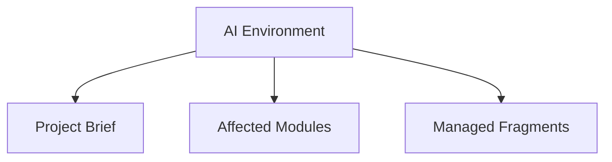

# AI_ENVIRONMENT: Angel's Project Manager

> Managed document. Must comply with template AI_ENVIRONMENT.template.md.

<!-- APM:DATA
{
  "docType": "ai_environment",
  "version": 1,
  "markdown": "# AI Environment: Angel's Project Manager\n\n## 1. Mission\n\n<\u0021--\nAPM-ID: ai-environment-overview-mission-mission\nAPM-LAST-UPDATED: 2026-04-14\n--\u003e\n\nGuide AI agents working on Angel's Project Manager.\n\n## 2. Operating Model\n\n<\u0021--\nAPM-ID: ai-environment-overview-operating-model-operating-model\nAPM-LAST-UPDATED: 2026-04-14\n--\u003e\n\nRead the project context first, update the correct modules, and keep generated artifacts consistent with the database-first workflow.\n\n## 3. Communication Style\n\n<\u0021--\nAPM-ID: ai-environment-overview-communication-style-communication-style\nAPM-LAST-UPDATED: 2026-04-14\n--\u003e\n\nBe concise, explicit about assumptions, and preserve traceability between features, bugs, documents, and fragments.\n\n## 4. APM Term Dictionary\n\n| Term | Definition | Stable ID | Source Refs |\n| --- | --- | --- | --- |\n| APM | Angel's Project Manager, the application that manages project state, modules, generated documents, fragments, and AI operating context. | ai-environment-term-dictionary-apm |  |\n| Project | A managed workspace or folder whose planning, software design, documents, fragments, and AI guidance are tracked by APM. | ai-environment-term-dictionary-project |  |\n| Module | A functional area inside APM, such as PRD, Functional Spec, Domain Models, Database Schema, Architecture, Features, Bugs, or AI Environment. | ai-environment-term-dictionary-module |  |\n| AI Environment | The project-level operating guide that tells AI agents how to read, update, and preserve context for the current project. | ai-environment-term-dictionary-ai-environment |  |\n| Directive Project | The project selected in Application Settings where APM writes application-level AI directives that are specific to APM itself. | ai-environment-term-dictionary-directive-project |  |\n| Fragment | A structured proposal file consumed by a module to add, update, remove, or transform managed project data without editing generated documents directly. | ai-environment-term-dictionary-fragment |  |\n| Managed Document | A markdown document generated from persisted module state and metadata rather than treated as the primary source of truth. | ai-environment-term-dictionary-managed-document |  |\n| Stable ID | A persistent human-readable identifier used by documents, fragments, UI nodes, and cross-module references to target the same concept over time. | ai-environment-term-dictionary-stable-id |  |\n| Work Item Code | A human-readable code such as FEAT-001, BUG-010, or TASK-001 that links document changes to planned work, bugs, or tasks. | ai-environment-term-dictionary-work-item-code |  |\n| Emitted Directive | A directive owned by a module template that is surfaced in the AI Environment index so agents know which module-specific instructions to read. | ai-environment-term-dictionary-emitted-directive |  |\n\n## 5. Custom Instructions\n\n<\u0021--\nAPM-ID: ai-environment-custom-instructions-custom-instructions\nAPM-LAST-UPDATED: 2026-04-14\n--\u003e\n\nProject Scope\n- This AI environment applies only to Angel's Project Manager.\n- In this project, the application is also the managed project, so path instructions must be read carefully.\n- Fragments are an app-specific workflow for this project, not a universal rule for other APM-managed projects.\n\nPath Contract\n- Read human-facing project outputs from `docs/`.\n- Read project operational context from the APM-managed project folder when that path is present.\n- Follow the locked system directive for the current fragments location instead of inventing or assuming a path.\n\nRead Order\n1. Project Brief\n2. Roadmap\n3. The target module state and document\n4. Architecture or Database Schema when the change affects system shape or data\n5. AI Environment when path, workflow, or agent-behavior assumptions may have changed\n\nReview Rule\n- If instructions are vague, contradictory, or path-sensitive, write a review note before making broad updates.\n- Prefer a review-first response when the AI environment appears underspecified.\n\nDirective Generation Rule\n- When improving AI guidance, propose concrete directives that are human-readable, deterministic, and easy to revise after review.\n\n---\n\n### Executive Summary\n\nThis directive migration turns the old standalone hierarchy spec into explicit AI read-order and downstream update rules.\n\n### Mission and Operating Model Updates\n\n- Treat the project hierarchy as the default way to understand context.\n- Read upstream documents before proposing downstream updates.\n\n### Required Behaviors\n\n- Treat `Project Brief` as root context.\n- Read `Roadmap` and `Work Items` before software-specific branches when the change affects planning or delivery flow.\n- Use the defined software hierarchy instead of treating the module list as flat.\n\n### Module Update Rules\n\n- If `PRD` changes, review `Functional Spec`, `UX/UI`, and downstream system-design modules.\n- If `Functional Spec` changes, review `Architecture`, `Test Strategy`, and dependent design modules.\n- If `Architecture` changes, review `Database Schema`, `Technical Design`, and `ADR`.\n\n### Guardrails\n\n- Do not invent a different document order when the application already defines one.\n- Do not treat hierarchy metadata as optional if it affects navigation, templates, fragments, or AI reasoning.\n\n### Open Questions\n\n- How much of this hierarchy should be rendered visibly in module UIs versus remaining in AI guidance?\n\n## 6. Applied Shared Profiles\n\nNo shared AI profiles are currently applied.\n\n## 7. Directive Template References\n\nTemplate-owned AI directives remain authoritative in their source templates. Read these templates when a module-specific directive applies.\n\n- Roadmap: `templates/ROADMAP.template.md`\n- Features: `templates/FEATURES.template.md`\n- Bugs: `templates/BUGS.template.md`\n- Change Log: `templates/CHANGELOG.template.md`\n- Database Schema: `templates/DATABASE_SCHEMA.template.md`\n- Functional Spec: `templates/FUNCTIONAL_SPEC.template.md`\n- Domain Models: `templates/DOMAIN_MODELS.template.md`\n- Architecture: `templates/ARCHITECTURE.template.md`\n- Technical Design: `templates/TECHNICAL_DESIGN.template.md`\n- Experience Design: `templates/EXPERIENCE_DESIGN.template.md`\n- Test Strategy: `templates/TEST_STRATEGY.template.md`\n\n## 8. Locked System Directives\n\n<\u0021--\nAPM-ID: ai-directive-apm-shared-workspace-volatile-files\n--\u003e\n\n### 8.1 Use the project workspace folder for volatile AI work\n\nUse C:\\Users\\croni\\Projects\\Angels-Project-Manager\\.apm\\_WORKSPACE for messy AI work such as TODO lists, draft plans, scratch notes, and temporary working files. Keep the project root and docs folder focused on real project artifacts.\n\n<\u0021--\nAPM-ID: ai-directive-apm-shared-fragments-path\n--\u003e\n\n### 8.2 Use the configured fragments path\n\nFragments generated for this project must be placed in C:\\Users\\croni\\Projects\\data\\Fragments\\1772489365575-mj2xfcm. Shared reusable fragments go in C:\\Users\\croni\\Projects\\data\\Fragments\\shared only when explicitly intended for reuse across projects. The configured fragments root is C:\\Users\\croni\\Projects\\data\\Fragments. Never place fragment files in the project docs folder or a repo-local fallback data folder.\n\n<\u0021--\nAPM-ID: ai-directive-apm-shared-storage-safe-titles\n--\u003e\n\n### 8.3 Keep generated stored titles short and storage-safe\n\nWhen AI generates fragments or any structured data that will be stored, keep titles and other short stored fields as short as the database allows. Prefer concise complete titles over truncated prose, and put longer detail in descriptions or body content.\n\n<\u0021--\nAPM-ID: ai-directive-apm-shared-stable-id-naming\n--\u003e\n\n### 8.4 Create stable human-readable ids for persisted items\n\nDirective ID: apm.shared.stable-id.naming. When AI creates or updates any persisted item that supports an id, stableId, node id, edge id, document item id, or fragment target id, use a short lowercase kebab-case identifier scoped by module or item type. IDs must identify the concept rather than truncate the description, must remain stable across title or wording edits, and must not be regenerated unless the item is intentionally replaced. Keep database primary keys, work item codes, document stable ids, and UI/canvas ids distinct but cross-referenceable.\n\n<\u0021--\nAPM-ID: ai-directive-apm-shared-generated-docs-source-of-truth\n--\u003e\n\n### 8.5 Do not bypass source-of-truth state\n\nDo not overwrite generated markdown, generated DBML, or generated Mermaid directly when the module uses database-first state. Update the module data, consume a valid fragment, or use the module action that regenerates the artifact.\n\n<\u0021--\nAPM-ID: ai-directive-apm-shared-fragment-consumers-version-migrators\n--\u003e\n\n### 8.6 Fragment consumers must migrate older versions\n\nFragment consumers must load older fragment payloads through explicit versioned migrators before detection, listing, or consumption so unconsumed fragments remain usable after template changes.\n\n<\u0021--\nAPM-ID: ai-directive-apm-shared-fragment-discovery-content-aware\n--\u003e\n\n### 8.7 Use content-aware fragment discovery\n\nFragment discovery must check managed metadata and known docType aliases in addition to filename prefixes so older or renamed fragment files can still appear in the UI.\n\n<\u0021--\nAPM-ID: ai-directive-apm-shared-templates-versioning\n--\u003e\n\n### 8.8 Version template changes\n\nWhen changing a document or fragment template, update Template Version and Last Updated metadata, then ensure project-local template copies can be checked and replaced by the application.\n\n<\u0021--\nAPM-ID: ai-directive-apm-shared-database-migrations-required\n--\u003e\n\n### 8.9 Generate migrations for database changes\n\nWhen work changes database structure or persisted state, add an explicit migration file and update the schema reference through the Database Schema workflow.\n\n<\u0021--\nAPM-ID: ai-directive-apm-application-runtime-db-source-of-truth\n--\u003e\n\n### 8.10 Treat the live runtime SQLite database as the source of truth for Angel's Project Manager\n\nFor Angel's Project Manager, the live runtime SQLite database at C:\\Users\\croni\\Projects\\data\\app.db is the source of truth for project and module state. Generated docs, DBML, and fragments are derived artifacts and should be treated as outputs, proposals, or exchange files unless explicitly stated otherwise.\n\n<\u0021--\nAPM-ID: ai-directive-apm-application-directive-project\n--\u003e\n\n### 8.11 Application directives are emitted to the configured Directive Project\n\nAPM application-level directives apply to Angel's Project Manager itself and are written only to the project selected in Application Settings -> Projects -> Directive Project.\n\n<\u0021--\nAPM-ID: ai-directive-apm-application-shutdown-before-build\n--\u003e\n\n### 8.12 Shut down locked running application processes before rebuilds\n\nBefore rebuilding or packaging Angel's Project Manager, check whether a running APM, Electron, or packaged application process is locking build output. If it is, shut the application down gracefully before building; only force termination when the process will not exit and the build is blocked.\n\n## 9. Module Directive Index\n\nModule and template directives are authoritative in their owning module templates. Follow the enabled directive references below, but read the referenced module/template for granular instructions instead of expecting this document to duplicate every module directive body.\n\n### 9.1 Roadmap\n\n- Module Key: roadmap\n- Source Template: templates/ROADMAP.template.md\n\n#### 9.1.1 Use active roadmap and feature context\n\n- Directive ID: apm.module.roadmap.active-feature-context\n- Required: yes\n- Locked: yes\n\n#### 9.1.2 Propose roadmap changes through fragments\n\n- Directive ID: apm.module.roadmap.fragment-first-changes\n- Required: yes\n- Locked: yes\n\n### 9.2 Features\n\n- Module Key: features\n- Source Template: templates/FEATURES.template.md\n\n#### 9.2.1 Implemented features create destination fragments\n\n- Directive ID: apm.module.features.destination-fragments\n- Required: yes\n- Locked: yes\n\n### 9.3 Bugs\n\n- Module Key: bugs\n- Source Template: templates/BUGS.template.md\n\n#### 9.3.1 Preserve bug lifecycle and archive rules\n\n- Directive ID: apm.module.bugs.lifecycle-and-archive\n- Required: yes\n- Locked: yes\n\n#### 9.3.2 Generate regression test follow-up for bugs\n\n- Directive ID: apm.module.bugs.regression-test-followup\n- Required: no\n- Locked: yes\n\n### 9.4 Change Log\n\n- Module Key: changelog\n- Source Template: templates/CHANGELOG.template.md\n\n#### 9.4.1 Record document-impacting changes in the Change Log\n\n- Directive ID: apm.module.changelog.traceability\n- Required: yes\n- Locked: yes\n\n### 9.5 Database Schema\n\n- Module Key: database_schema\n- Source Template: templates/DATABASE_SCHEMA.template.md\n\n#### 9.5.1 Keep schema changes inside schema workflows\n\n- Directive ID: apm.module.database-schema.fragment-boundary\n- Required: yes\n- Locked: yes\n\n#### 9.5.2 Do not treat partial schema fragments as full imports\n\n- Directive ID: apm.module.database-schema.full-import-boundary\n- Required: yes\n- Locked: yes\n\n### 9.6 Functional Spec\n\n- Module Key: functional_spec\n- Source Template: templates/FUNCTIONAL_SPEC.template.md\n\n#### 9.6.1 Functional flows require stable ids\n\n- Directive ID: apm.module.functional-spec.flow-ids\n- Required: yes\n- Locked: yes\n\n#### 9.6.2 Functional Spec actions must be readable\n\n- Directive ID: apm.module.functional-spec.action-vocabulary\n- Required: yes\n- Locked: yes\n\n### 9.7 Domain Models\n\n- Module Key: domain_models\n- Source Template: templates/DOMAIN_MODELS.template.md\n\n#### 9.7.1 Domain models are conceptual first\n\n- Directive ID: apm.module.domain-models.conceptual-first\n- Required: yes\n- Locked: yes\n\n### 9.8 Architecture\n\n- Module Key: architecture\n- Source Template: templates/ARCHITECTURE.template.md\n\n#### 9.8.1 Create ADR records for architectural decisions\n\n- Directive ID: apm.module.architecture.adr-capture\n- Required: no\n- Locked: yes\n\n### 9.9 Technical Design\n\n- Module Key: technical_design\n- Source Template: templates/TECHNICAL_DESIGN.template.md\n\n#### 9.9.1 Technical Design owns implementation detail\n\n- Directive ID: apm.module.technical-design.implementation-details\n- Required: yes\n- Locked: yes\n\n### 9.10 Experience Design\n\n- Module Key: experience_design\n- Source Template: templates/EXPERIENCE_DESIGN.template.md\n\n#### 9.10.1 Experience Design owns user-facing behavior\n\n- Directive ID: apm.module.experience-design.user-behavior\n- Required: yes\n- Locked: yes\n\n### 9.11 Test Strategy\n\n- Module Key: test_strategy\n- Source Template: templates/TEST_STRATEGY.template.md\n\n#### 9.11.1 Test Strategy owns validation guidance\n\n- Directive ID: apm.module.test-strategy.validation-focus\n- Required: yes\n- Locked: yes\n\n## 10. Project-Level Required Behaviors\n\n<\u0021--\nAPM-ID: ai-environment-required-behaviors-read-project-context-first\n--\u003e\n\n### 10.1 Read project context first\n\nReview Project Brief, Roadmap, and module-specific state before proposing or applying changes.\n\n## 11. Project-Level Module Update Rules\n\n<\u0021--\nAPM-ID: ai-environment-module-update-rules-update-adjacent-modules-when-scope-changes\n--\u003e\n\n### 11.1 Update adjacent modules when scope changes\n\nIf feature or bug work affects product, roadmap, schema, or architecture understanding, update the corresponding module state and fragments.\n\n<\u0021--\nAPM-ID: ai-environment-module-update-rules-migrate-implemented-future-enhancement-ideas-downstream\nAPM-REFS: FEAT-003\nAPM-LAST-UPDATED: 2026-04-05\n--\u003e\n\n### 11.2 Migrate implemented future-enhancement ideas downstream\n\nWhen a Future Enhancements item becomes implemented, move its lasting guidance into the correct downstream modules, attach the originating feature or bug codes, and then clean the PRD entry up.\n\n- Version Date: 2026-04-05\n\n## 12. Project-Level Data Structure and Phrasing Rules\n\n<\u0021--\nAPM-ID: ai-environment-data-phrasing-rules-use-structured-deterministic-wording\n--\u003e\n\n### 12.1 Use structured, deterministic wording\n\nPrefer short titles, explicit descriptions, stable identifiers, and schema-safe phrasing that can be consumed by both humans and automation.\n\n## 13. Project-Level Avoid / Guardrails\n\n<\u0021--\nAPM-ID: ai-environment-avoid-rules-do-not-treat-prd-future-enhancements-as-the\nAPM-REFS: FEAT-003\nAPM-LAST-UPDATED: 2026-04-05\n--\u003e\n\n### 13.1 Do not treat PRD Future Enhancements as the feature backlog\n\nKeep PRD Future Enhancements lightweight and product-facing only. Planned and implemented feature tracking belongs in FEATURES.md and related module history.\n\n- Version Date: 2026-04-05\n\n## 14. Handoff Checklist\n\n<\u0021--\nAPM-ID: ai-environment-handoff-checklist-record-affected-modules\n--\u003e\n\n### 14.1 Record affected modules\n\nWhen a bug or feature changes multiple areas, note the affected modules so downstream documents stay aligned.",
  "mermaid": "flowchart TD\n  ai[\"AI Environment\"] --\u003e brief[\"Project Brief\"]\n  ai --\u003e modules[\"Affected Modules\"]\n  ai --\u003e fragments[\"Managed Fragments\"]",
  "editorState": {
    "selectedProfileIds": [],
    "disabledDirectiveIds": [],
    "overview": {
      "mission": "Guide AI agents working on Angel's Project Manager.",
      "operatingModel": "Read the project context first, update the correct modules, and keep generated artifacts consistent with the database-first workflow.",
      "communicationStyle": "Be concise, explicit about assumptions, and preserve traceability between features, bugs, documents, and fragments.",
      "versionDate": "2026-04-14T22:57:44.244Z",
      "itemIds": {
        "mission": "ai-environment-overview-mission-mission",
        "operatingModel": "ai-environment-overview-operating-model-operating-model",
        "communicationStyle": "ai-environment-overview-communication-style-communication-style"
      },
      "itemSourceRefs": {
        "mission": [],
        "operatingModel": [],
        "communicationStyle": []
      }
    },
    "requiredBehaviors": [
      {
        "id": "ai-required-0-26",
        "title": "Read project context first",
        "description": "Review Project Brief, Roadmap, and module-specific state before proposing or applying changes.",
        "versionDate": "",
        "stableId": "ai-environment-required-behaviors-read-project-context-first",
        "sourceRefs": []
      },
      {
        "title": "Create destination fragments after implementation",
        "description": "After implementation work is complete, create fragments for the affected managed modules instead of rewriting canonical docs directly.",
        "stableId": "ai-environment-required-behaviors-create-destination-fragments-after-implementation",
        "versionDate": "2026-04-05T02:19:06.825Z",
        "sourceRefs": [
          "FEAT-002"
        ],
        "id": ""
      },
      {
        "title": "Treat FEATURES as the planning register",
        "description": "Use FEATURES.md as the planning and implementation register for planned and implemented feature work instead of treating PRD Future Enhancements as the backlog.",
        "stableId": "ai-environment-required-behaviors-treat-features-as-the-planning-register",
        "versionDate": "2026-04-05T02:19:06.825Z",
        "sourceRefs": [
          "FEAT-003"
        ],
        "id": ""
      },
      {
        "id": "ai-required-shutdown-locked-app-before-build",
        "stableId": "ai-environment-required-behaviors-shut-down-locked-running-application-processes-before-rebuilds",
        "title": "Shut down locked running application processes before rebuilds",
        "description": "Before rebuilding or packaging Angel's Project Manager, check whether a running APM, Electron, or packaged application process is locking build output. If it is, shut the application down gracefully before building; only force termination when the process will not exit and the build is blocked.",
        "versionDate": "2026-04-11",
        "sourceRefs": []
      },
      {
        "id": "ai-required-behavior-fragment-consumer-migrators",
        "stableId": "ai-environment-required-behaviors-fragment-consumer-migrators",
        "title": "Fragment Consumers Migrate Older Versions",
        "description": "Fragment consumers must load older fragment payloads through explicit versioned migrators before detection, listing, or consumption so unconsumed fragments remain usable after template changes.",
        "versionDate": "2026-04-14",
        "sourceRefs": [
          "TASK-FRAGMENT-MIGRATION-20260414"
        ]
      },
      {
        "id": "ai-required-behavior-version-template-changes",
        "stableId": "ai-environment-required-behaviors-version-template-changes",
        "title": "Version Template Changes",
        "description": "When changing a document or fragment template, update its `Template Version` and `Last Updated` metadata, then ensure project-local template copies can be checked and replaced by the application.",
        "versionDate": "2026-04-14",
        "sourceRefs": [
          "TASK-TEMPLATE-VERSIONING-20260414"
        ]
      }
    ],
    "termDictionary": [
      {
        "title": "APM",
        "description": "Angel's Project Manager, the application that manages project state, modules, generated documents, fragments, and AI operating context.",
        "versionDate": "2026-04-14T19:20:06.352Z",
        "id": "",
        "stableId": "ai-environment-term-dictionary-apm",
        "sourceRefs": []
      },
      {
        "title": "Project",
        "description": "A managed workspace or folder whose planning, software design, documents, fragments, and AI guidance are tracked by APM.",
        "versionDate": "2026-04-14T19:20:06.352Z",
        "id": "",
        "stableId": "ai-environment-term-dictionary-project",
        "sourceRefs": []
      },
      {
        "title": "Module",
        "description": "A functional area inside APM, such as PRD, Functional Spec, Domain Models, Database Schema, Architecture, Features, Bugs, or AI Environment.",
        "versionDate": "2026-04-14T19:20:06.352Z",
        "id": "",
        "stableId": "ai-environment-term-dictionary-module",
        "sourceRefs": []
      },
      {
        "title": "AI Environment",
        "description": "The project-level operating guide that tells AI agents how to read, update, and preserve context for the current project.",
        "versionDate": "2026-04-14T19:20:06.352Z",
        "id": "",
        "stableId": "ai-environment-term-dictionary-ai-environment",
        "sourceRefs": []
      },
      {
        "title": "Directive Project",
        "description": "The project selected in Application Settings where APM writes application-level AI directives that are specific to APM itself.",
        "versionDate": "2026-04-14T19:20:06.352Z",
        "id": "",
        "stableId": "ai-environment-term-dictionary-directive-project",
        "sourceRefs": []
      },
      {
        "title": "Fragment",
        "description": "A structured proposal file consumed by a module to add, update, remove, or transform managed project data without editing generated documents directly.",
        "versionDate": "2026-04-14T19:20:06.352Z",
        "id": "",
        "stableId": "ai-environment-term-dictionary-fragment",
        "sourceRefs": []
      },
      {
        "title": "Managed Document",
        "description": "A markdown document generated from persisted module state and metadata rather than treated as the primary source of truth.",
        "versionDate": "2026-04-14T19:20:06.352Z",
        "id": "",
        "stableId": "ai-environment-term-dictionary-managed-document",
        "sourceRefs": []
      },
      {
        "title": "Stable ID",
        "description": "A persistent human-readable identifier used by documents, fragments, UI nodes, and cross-module references to target the same concept over time.",
        "versionDate": "2026-04-14T19:20:06.352Z",
        "id": "",
        "stableId": "ai-environment-term-dictionary-stable-id",
        "sourceRefs": []
      },
      {
        "title": "Work Item Code",
        "description": "A human-readable code such as FEAT-001, BUG-010, or TASK-001 that links document changes to planned work, bugs, or tasks.",
        "versionDate": "2026-04-14T19:20:06.352Z",
        "id": "",
        "stableId": "ai-environment-term-dictionary-work-item-code",
        "sourceRefs": []
      },
      {
        "title": "Emitted Directive",
        "description": "A directive owned by a module template that is surfaced in the AI Environment index so agents know which module-specific instructions to read.",
        "versionDate": "2026-04-14T19:20:06.352Z",
        "id": "",
        "stableId": "ai-environment-term-dictionary-emitted-directive",
        "sourceRefs": []
      }
    ],
    "moduleUpdateRules": [
      {
        "id": "ai-module-0-42",
        "title": "Update adjacent modules when scope changes",
        "description": "If feature or bug work affects product, roadmap, schema, or architecture understanding, update the corresponding module state and fragments.",
        "versionDate": "",
        "stableId": "ai-environment-module-update-rules-update-adjacent-modules-when-scope-changes",
        "sourceRefs": []
      },
      {
        "title": "Migrate implemented future-enhancement ideas downstream",
        "description": "When a Future Enhancements item becomes implemented, move its lasting guidance into the correct downstream modules, attach the originating feature or bug codes, and then clean the PRD entry up.",
        "stableId": "ai-environment-module-update-rules-migrate-implemented-future-enhancement-ideas-downstream",
        "versionDate": "2026-04-05T02:19:06.825Z",
        "sourceRefs": [
          "FEAT-003"
        ],
        "id": ""
      },
      {
        "title": "Read roadmap and active work-item codes before scope changes",
        "description": "Read ROADMAP.md together with active feature and bug codes before changing implementation scope, and ignore archived work items unless the task is explicitly historical.",
        "stableId": "ai-environment-module-update-rules-read-roadmap-and-active-work-item-codes-before-scope",
        "versionDate": "2026-04-05T02:19:06.825Z",
        "sourceRefs": [
          "FEAT-003"
        ],
        "id": ""
      },
      {
        "id": "ai-module-rule-content-aware-fragment-discovery",
        "stableId": "ai-environment-module-update-rules-content-aware-fragment-discovery",
        "title": "Use Content Aware Fragment Discovery",
        "description": "Fragment discovery should check managed metadata and known docType aliases in addition to filename prefixes so older or renamed fragment files can still appear in the UI.",
        "versionDate": "2026-04-14",
        "sourceRefs": [
          "TASK-FRAGMENT-MIGRATION-20260414"
        ]
      },
      {
        "id": "ai-module-rule-template-registry-migrations",
        "stableId": "ai-environment-module-update-rules-template-registry-migrations",
        "title": "Template Registry Requires Migration",
        "description": "If template synchronization needs new persisted state, add a database migration and update the schema reference rather than relying only on copied files.",
        "versionDate": "2026-04-14",
        "sourceRefs": [
          "TASK-TEMPLATE-VERSIONING-20260414",
          "CHANGELOG_FRAGMENT_20260414_template_registry_and_functional_actions_001"
        ]
      },
      {
        "id": "ai-module-rule-functional-spec-action-vocabulary",
        "stableId": "ai-environment-module-update-rules-functional-spec-action-vocabulary",
        "title": "Functional Spec Actions Must Be Readable",
        "description": "Functional Spec templates and generated documents must expose the available node, connection, canvas, and smart-text actions so both humans and AI agents understand the flowchart vocabulary.",
        "versionDate": "2026-04-14",
        "sourceRefs": [
          "TASK-TEMPLATE-VERSIONING-20260414"
        ]
      }
    ],
    "dataPhrasingRules": [
      {
        "id": "ai-phrasing-0-37",
        "title": "Use structured, deterministic wording",
        "description": "Prefer short titles, explicit descriptions, stable identifiers, and schema-safe phrasing that can be consumed by both humans and automation.",
        "versionDate": "",
        "stableId": "ai-environment-data-phrasing-rules-use-structured-deterministic-wording",
        "sourceRefs": []
      }
    ],
    "avoidRules": [
      {
        "id": "ai-avoid-0-29",
        "title": "Do not bypass source of truth",
        "description": "Do not overwrite generated markdown or DBML directly when the module uses database-first state.",
        "versionDate": "",
        "stableId": "ai-environment-avoid-rules-do-not-bypass-source-of-truth",
        "sourceRefs": []
      },
      {
        "title": "Do not treat PRD Future Enhancements as the feature backlog",
        "description": "Keep PRD Future Enhancements lightweight and product-facing only. Planned and implemented feature tracking belongs in FEATURES.md and related module history.",
        "stableId": "ai-environment-avoid-rules-do-not-treat-prd-future-enhancements-as-the",
        "versionDate": "2026-04-05T02:19:06.825Z",
        "sourceRefs": [
          "FEAT-003"
        ],
        "id": ""
      }
    ],
    "handoffChecklist": [
      {
        "id": "ai-handoff-0-23",
        "title": "Record affected modules",
        "description": "When a bug or feature changes multiple areas, note the affected modules so downstream documents stay aligned.",
        "versionDate": "",
        "stableId": "ai-environment-handoff-checklist-record-affected-modules",
        "sourceRefs": []
      }
    ],
    "customInstructions": "Project Scope\n- This AI environment applies only to Angel's Project Manager.\n- In this project, the application is also the managed project, so path instructions must be read carefully.\n- Fragments are an app-specific workflow for this project, not a universal rule for other APM-managed projects.\n\nPath Contract\n- Read human-facing project outputs from `docs/`.\n- Read project operational context from the APM-managed project folder when that path is present.\n- Follow the locked system directive for the current fragments location instead of inventing or assuming a path.\n\nRead Order\n1. Project Brief\n2. Roadmap\n3. The target module state and document\n4. Architecture or Database Schema when the change affects system shape or data\n5. AI Environment when path, workflow, or agent-behavior assumptions may have changed\n\nReview Rule\n- If instructions are vague, contradictory, or path-sensitive, write a review note before making broad updates.\n- Prefer a review-first response when the AI environment appears underspecified.\n\nDirective Generation Rule\n- When improving AI guidance, propose concrete directives that are human-readable, deterministic, and easy to revise after review.\n\n---\n\n### Executive Summary\n\nThis directive migration turns the old standalone hierarchy spec into explicit AI read-order and downstream update rules.\n\n### Mission and Operating Model Updates\n\n- Treat the project hierarchy as the default way to understand context.\n- Read upstream documents before proposing downstream updates.\n\n### Required Behaviors\n\n- Treat `Project Brief` as root context.\n- Read `Roadmap` and `Work Items` before software-specific branches when the change affects planning or delivery flow.\n- Use the defined software hierarchy instead of treating the module list as flat.\n\n### Module Update Rules\n\n- If `PRD` changes, review `Functional Spec`, `UX/UI`, and downstream system-design modules.\n- If `Functional Spec` changes, review `Architecture`, `Test Strategy`, and dependent design modules.\n- If `Architecture` changes, review `Database Schema`, `Technical Design`, and `ADR`.\n\n### Guardrails\n\n- Do not invent a different document order when the application already defines one.\n- Do not treat hierarchy metadata as optional if it affects navigation, templates, fragments, or AI reasoning.\n\n### Open Questions\n\n- How much of this hierarchy should be rendered visibly in module UIs versus remaining in AI guidance?",
    "fragmentHistory": [],
    "customInstructionsMeta": {
      "stableId": "ai-environment-custom-instructions-custom-instructions",
      "sourceRefs": []
    }
  }
}
-->

# AI Environment: Angel's Project Manager

## 1. Mission

<!--
APM-ID: ai-environment-overview-mission-mission
APM-LAST-UPDATED: 2026-04-14
-->

Guide AI agents working on Angel's Project Manager.

## 2. Operating Model

<!--
APM-ID: ai-environment-overview-operating-model-operating-model
APM-LAST-UPDATED: 2026-04-14
-->

Read the project context first, update the correct modules, and keep generated artifacts consistent with the database-first workflow.

## 3. Communication Style

<!--
APM-ID: ai-environment-overview-communication-style-communication-style
APM-LAST-UPDATED: 2026-04-14
-->

Be concise, explicit about assumptions, and preserve traceability between features, bugs, documents, and fragments.

## 4. APM Term Dictionary

| Term | Definition | Stable ID | Source Refs |
| --- | --- | --- | --- |
| APM | Angel's Project Manager, the application that manages project state, modules, generated documents, fragments, and AI operating context. | ai-environment-term-dictionary-apm |  |
| Project | A managed workspace or folder whose planning, software design, documents, fragments, and AI guidance are tracked by APM. | ai-environment-term-dictionary-project |  |
| Module | A functional area inside APM, such as PRD, Functional Spec, Domain Models, Database Schema, Architecture, Features, Bugs, or AI Environment. | ai-environment-term-dictionary-module |  |
| AI Environment | The project-level operating guide that tells AI agents how to read, update, and preserve context for the current project. | ai-environment-term-dictionary-ai-environment |  |
| Directive Project | The project selected in Application Settings where APM writes application-level AI directives that are specific to APM itself. | ai-environment-term-dictionary-directive-project |  |
| Fragment | A structured proposal file consumed by a module to add, update, remove, or transform managed project data without editing generated documents directly. | ai-environment-term-dictionary-fragment |  |
| Managed Document | A markdown document generated from persisted module state and metadata rather than treated as the primary source of truth. | ai-environment-term-dictionary-managed-document |  |
| Stable ID | A persistent human-readable identifier used by documents, fragments, UI nodes, and cross-module references to target the same concept over time. | ai-environment-term-dictionary-stable-id |  |
| Work Item Code | A human-readable code such as FEAT-001, BUG-010, or TASK-001 that links document changes to planned work, bugs, or tasks. | ai-environment-term-dictionary-work-item-code |  |
| Emitted Directive | A directive owned by a module template that is surfaced in the AI Environment index so agents know which module-specific instructions to read. | ai-environment-term-dictionary-emitted-directive |  |

## 5. Custom Instructions

<!--
APM-ID: ai-environment-custom-instructions-custom-instructions
APM-LAST-UPDATED: 2026-04-14
-->

Project Scope
- This AI environment applies only to Angel's Project Manager.
- In this project, the application is also the managed project, so path instructions must be read carefully.
- Fragments are an app-specific workflow for this project, not a universal rule for other APM-managed projects.

Path Contract
- Read human-facing project outputs from `docs/`.
- Read project operational context from the APM-managed project folder when that path is present.
- Follow the locked system directive for the current fragments location instead of inventing or assuming a path.

Read Order
1. Project Brief
2. Roadmap
3. The target module state and document
4. Architecture or Database Schema when the change affects system shape or data
5. AI Environment when path, workflow, or agent-behavior assumptions may have changed

Review Rule
- If instructions are vague, contradictory, or path-sensitive, write a review note before making broad updates.
- Prefer a review-first response when the AI environment appears underspecified.

Directive Generation Rule
- When improving AI guidance, propose concrete directives that are human-readable, deterministic, and easy to revise after review.

---

### Executive Summary

This directive migration turns the old standalone hierarchy spec into explicit AI read-order and downstream update rules.

### Mission and Operating Model Updates

- Treat the project hierarchy as the default way to understand context.
- Read upstream documents before proposing downstream updates.

### Required Behaviors

- Treat `Project Brief` as root context.
- Read `Roadmap` and `Work Items` before software-specific branches when the change affects planning or delivery flow.
- Use the defined software hierarchy instead of treating the module list as flat.

### Module Update Rules

- If `PRD` changes, review `Functional Spec`, `UX/UI`, and downstream system-design modules.
- If `Functional Spec` changes, review `Architecture`, `Test Strategy`, and dependent design modules.
- If `Architecture` changes, review `Database Schema`, `Technical Design`, and `ADR`.

### Guardrails

- Do not invent a different document order when the application already defines one.
- Do not treat hierarchy metadata as optional if it affects navigation, templates, fragments, or AI reasoning.

### Open Questions

- How much of this hierarchy should be rendered visibly in module UIs versus remaining in AI guidance?

## 6. Applied Shared Profiles

No shared AI profiles are currently applied.

## 7. Directive Template References

Template-owned AI directives remain authoritative in their source templates. Read these templates when a module-specific directive applies.

- Roadmap: `templates/ROADMAP.template.md`
- Features: `templates/FEATURES.template.md`
- Bugs: `templates/BUGS.template.md`
- Change Log: `templates/CHANGELOG.template.md`
- Database Schema: `templates/DATABASE_SCHEMA.template.md`
- Functional Spec: `templates/FUNCTIONAL_SPEC.template.md`
- Domain Models: `templates/DOMAIN_MODELS.template.md`
- Architecture: `templates/ARCHITECTURE.template.md`
- Technical Design: `templates/TECHNICAL_DESIGN.template.md`
- Experience Design: `templates/EXPERIENCE_DESIGN.template.md`
- Test Strategy: `templates/TEST_STRATEGY.template.md`

## 8. Locked System Directives

<!--
APM-ID: ai-directive-apm-shared-workspace-volatile-files
-->

### 8.1 Use the project workspace folder for volatile AI work

Use C:\Users\croni\Projects\Angels-Project-Manager\.apm\_WORKSPACE for messy AI work such as TODO lists, draft plans, scratch notes, and temporary working files. Keep the project root and docs folder focused on real project artifacts.

<!--
APM-ID: ai-directive-apm-shared-fragments-path
-->

### 8.2 Use the configured fragments path

Fragments generated for this project must be placed in C:\Users\croni\Projects\data\Fragments\1772489365575-mj2xfcm. Shared reusable fragments go in C:\Users\croni\Projects\data\Fragments\shared only when explicitly intended for reuse across projects. The configured fragments root is C:\Users\croni\Projects\data\Fragments. Never place fragment files in the project docs folder or a repo-local fallback data folder.

<!--
APM-ID: ai-directive-apm-shared-storage-safe-titles
-->

### 8.3 Keep generated stored titles short and storage-safe

When AI generates fragments or any structured data that will be stored, keep titles and other short stored fields as short as the database allows. Prefer concise complete titles over truncated prose, and put longer detail in descriptions or body content.

<!--
APM-ID: ai-directive-apm-shared-stable-id-naming
-->

### 8.4 Create stable human-readable ids for persisted items

Directive ID: apm.shared.stable-id.naming. When AI creates or updates any persisted item that supports an id, stableId, node id, edge id, document item id, or fragment target id, use a short lowercase kebab-case identifier scoped by module or item type. IDs must identify the concept rather than truncate the description, must remain stable across title or wording edits, and must not be regenerated unless the item is intentionally replaced. Keep database primary keys, work item codes, document stable ids, and UI/canvas ids distinct but cross-referenceable.

<!--
APM-ID: ai-directive-apm-shared-generated-docs-source-of-truth
-->

### 8.5 Do not bypass source-of-truth state

Do not overwrite generated markdown, generated DBML, or generated Mermaid directly when the module uses database-first state. Update the module data, consume a valid fragment, or use the module action that regenerates the artifact.

<!--
APM-ID: ai-directive-apm-shared-fragment-consumers-version-migrators
-->

### 8.6 Fragment consumers must migrate older versions

Fragment consumers must load older fragment payloads through explicit versioned migrators before detection, listing, or consumption so unconsumed fragments remain usable after template changes.

<!--
APM-ID: ai-directive-apm-shared-fragment-discovery-content-aware
-->

### 8.7 Use content-aware fragment discovery

Fragment discovery must check managed metadata and known docType aliases in addition to filename prefixes so older or renamed fragment files can still appear in the UI.

<!--
APM-ID: ai-directive-apm-shared-templates-versioning
-->

### 8.8 Version template changes

When changing a document or fragment template, update Template Version and Last Updated metadata, then ensure project-local template copies can be checked and replaced by the application.

<!--
APM-ID: ai-directive-apm-shared-database-migrations-required
-->

### 8.9 Generate migrations for database changes

When work changes database structure or persisted state, add an explicit migration file and update the schema reference through the Database Schema workflow.

<!--
APM-ID: ai-directive-apm-application-runtime-db-source-of-truth
-->

### 8.10 Treat the live runtime SQLite database as the source of truth for Angel's Project Manager

For Angel's Project Manager, the live runtime SQLite database at C:\Users\croni\Projects\data\app.db is the source of truth for project and module state. Generated docs, DBML, and fragments are derived artifacts and should be treated as outputs, proposals, or exchange files unless explicitly stated otherwise.

<!--
APM-ID: ai-directive-apm-application-directive-project
-->

### 8.11 Application directives are emitted to the configured Directive Project

APM application-level directives apply to Angel's Project Manager itself and are written only to the project selected in Application Settings -> Projects -> Directive Project.

<!--
APM-ID: ai-directive-apm-application-shutdown-before-build
-->

### 8.12 Shut down locked running application processes before rebuilds

Before rebuilding or packaging Angel's Project Manager, check whether a running APM, Electron, or packaged application process is locking build output. If it is, shut the application down gracefully before building; only force termination when the process will not exit and the build is blocked.

## 9. Module Directive Index

Module and template directives are authoritative in their owning module templates. Follow the enabled directive references below, but read the referenced module/template for granular instructions instead of expecting this document to duplicate every module directive body.

### 9.1 Roadmap

- Module Key: roadmap
- Source Template: templates/ROADMAP.template.md

#### 9.1.1 Use active roadmap and feature context

- Directive ID: apm.module.roadmap.active-feature-context
- Required: yes
- Locked: yes

#### 9.1.2 Propose roadmap changes through fragments

- Directive ID: apm.module.roadmap.fragment-first-changes
- Required: yes
- Locked: yes

### 9.2 Features

- Module Key: features
- Source Template: templates/FEATURES.template.md

#### 9.2.1 Implemented features create destination fragments

- Directive ID: apm.module.features.destination-fragments
- Required: yes
- Locked: yes

### 9.3 Bugs

- Module Key: bugs
- Source Template: templates/BUGS.template.md

#### 9.3.1 Preserve bug lifecycle and archive rules

- Directive ID: apm.module.bugs.lifecycle-and-archive
- Required: yes
- Locked: yes

#### 9.3.2 Generate regression test follow-up for bugs

- Directive ID: apm.module.bugs.regression-test-followup
- Required: no
- Locked: yes

### 9.4 Change Log

- Module Key: changelog
- Source Template: templates/CHANGELOG.template.md

#### 9.4.1 Record document-impacting changes in the Change Log

- Directive ID: apm.module.changelog.traceability
- Required: yes
- Locked: yes

### 9.5 Database Schema

- Module Key: database_schema
- Source Template: templates/DATABASE_SCHEMA.template.md

#### 9.5.1 Keep schema changes inside schema workflows

- Directive ID: apm.module.database-schema.fragment-boundary
- Required: yes
- Locked: yes

#### 9.5.2 Do not treat partial schema fragments as full imports

- Directive ID: apm.module.database-schema.full-import-boundary
- Required: yes
- Locked: yes

### 9.6 Functional Spec

- Module Key: functional_spec
- Source Template: templates/FUNCTIONAL_SPEC.template.md

#### 9.6.1 Functional flows require stable ids

- Directive ID: apm.module.functional-spec.flow-ids
- Required: yes
- Locked: yes

#### 9.6.2 Functional Spec actions must be readable

- Directive ID: apm.module.functional-spec.action-vocabulary
- Required: yes
- Locked: yes

### 9.7 Domain Models

- Module Key: domain_models
- Source Template: templates/DOMAIN_MODELS.template.md

#### 9.7.1 Domain models are conceptual first

- Directive ID: apm.module.domain-models.conceptual-first
- Required: yes
- Locked: yes

### 9.8 Architecture

- Module Key: architecture
- Source Template: templates/ARCHITECTURE.template.md

#### 9.8.1 Create ADR records for architectural decisions

- Directive ID: apm.module.architecture.adr-capture
- Required: no
- Locked: yes

### 9.9 Technical Design

- Module Key: technical_design
- Source Template: templates/TECHNICAL_DESIGN.template.md

#### 9.9.1 Technical Design owns implementation detail

- Directive ID: apm.module.technical-design.implementation-details
- Required: yes
- Locked: yes

### 9.10 Experience Design

- Module Key: experience_design
- Source Template: templates/EXPERIENCE_DESIGN.template.md

#### 9.10.1 Experience Design owns user-facing behavior

- Directive ID: apm.module.experience-design.user-behavior
- Required: yes
- Locked: yes

### 9.11 Test Strategy

- Module Key: test_strategy
- Source Template: templates/TEST_STRATEGY.template.md

#### 9.11.1 Test Strategy owns validation guidance

- Directive ID: apm.module.test-strategy.validation-focus
- Required: yes
- Locked: yes

## 10. Project-Level Required Behaviors

<!--
APM-ID: ai-environment-required-behaviors-read-project-context-first
-->

### 10.1 Read project context first

Review Project Brief, Roadmap, and module-specific state before proposing or applying changes.

## 11. Project-Level Module Update Rules

<!--
APM-ID: ai-environment-module-update-rules-update-adjacent-modules-when-scope-changes
-->

### 11.1 Update adjacent modules when scope changes

If feature or bug work affects product, roadmap, schema, or architecture understanding, update the corresponding module state and fragments.

<!--
APM-ID: ai-environment-module-update-rules-migrate-implemented-future-enhancement-ideas-downstream
APM-REFS: FEAT-003
APM-LAST-UPDATED: 2026-04-05
-->

### 11.2 Migrate implemented future-enhancement ideas downstream

When a Future Enhancements item becomes implemented, move its lasting guidance into the correct downstream modules, attach the originating feature or bug codes, and then clean the PRD entry up.

- Version Date: 2026-04-05

## 12. Project-Level Data Structure and Phrasing Rules

<!--
APM-ID: ai-environment-data-phrasing-rules-use-structured-deterministic-wording
-->

### 12.1 Use structured, deterministic wording

Prefer short titles, explicit descriptions, stable identifiers, and schema-safe phrasing that can be consumed by both humans and automation.

## 13. Project-Level Avoid / Guardrails

<!--
APM-ID: ai-environment-avoid-rules-do-not-treat-prd-future-enhancements-as-the
APM-REFS: FEAT-003
APM-LAST-UPDATED: 2026-04-05
-->

### 13.1 Do not treat PRD Future Enhancements as the feature backlog

Keep PRD Future Enhancements lightweight and product-facing only. Planned and implemented feature tracking belongs in FEATURES.md and related module history.

- Version Date: 2026-04-05

## 14. Handoff Checklist

<!--
APM-ID: ai-environment-handoff-checklist-record-affected-modules
-->

### 14.1 Record affected modules

When a bug or feature changes multiple areas, note the affected modules so downstream documents stay aligned.

## Mermaid

