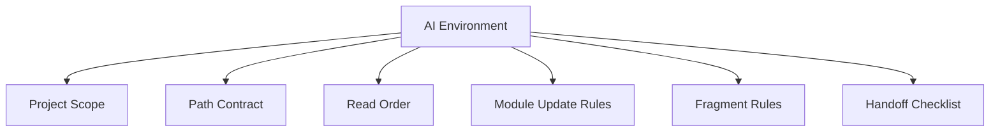
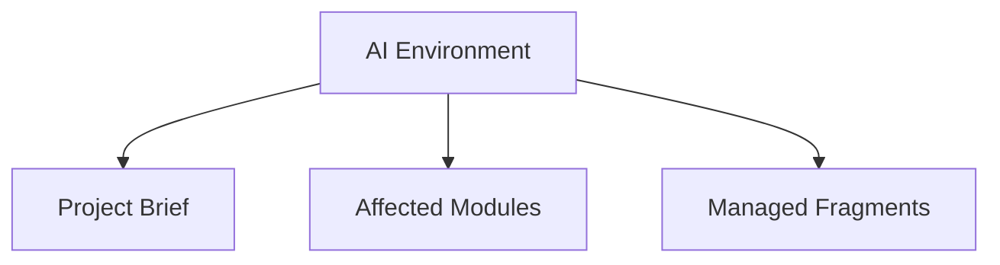

# AI_ENVIRONMENT: Angel's Project Manager

> Managed document. Must comply with template AI_ENVIRONMENT.template.md.

<!-- APM:DATA
{
  "docType": "ai_environment",
  "version": 1,
  "markdown": "# AI Environment: Angel's Project Manager\n\n## 0. Locked System Directives\n\n<\u0021--\nAPM-ID: document-0-use-the-project-workspace-folder-for-volatile-ai\n--\u003e\n\n### 0.1 Use the project workspace folder for volatile AI work\n\nUse C:\\Users\\croni\\Projects\\Angels-Project-Manager\\.apm\\_WORKSPACE for messy AI work such as TODO lists, draft plans, scratch notes, and temporary working files. Keep the project root and docs folder focused on real project artifacts.\n\n<\u0021--\nAPM-ID: document-0-record-document-impacting-changes-in-the-change-log-with\n--\u003e\n\n### 0.2 Record document-impacting changes in the Change Log with stable target references\n\nWhen feature or bug work updates a managed document, create or update a Change Log entry that references the work item code, target document, target section number, stable target item id, and a short human-readable summary of the change.\n\n<\u0021--\nAPM-ID: document-0-keep-generated-stored-titles-short-and-storage-safe\n--\u003e\n\n### 0.3 Keep generated stored titles short and storage-safe\n\nWhen AI generates fragments or any structured data that will be stored, keep titles and other short stored fields as short as the database allows. Prefer concise complete titles over truncated prose, and put longer detail in descriptions or body content.\n\n<\u0021--\nAPM-ID: document-0-fragments-generated-should-use-the-configured-fragments-path\n--\u003e\n\n### 0.4 Fragments generated should use the configured fragments path\n\nFragments generated should be placed in C:\\Users\\croni\\Projects\\data\\Fragments when generated. Never place fragment files in the project docs folder.\n\n<\u0021--\nAPM-ID: document-0-treat-the-live-runtime-sqlite-database-as-the\n--\u003e\n\n### 0.5 Treat the live runtime SQLite database as the source of truth for Angel's Project Manager\n\nFor Angel's Project Manager, the live runtime SQLite database at C:\\Users\\croni\\Projects\\data\\app.db is the source of truth for project and module state. Generated docs, DBML, and fragments are derived artifacts and should be treated as outputs, proposals, or exchange files unless explicitly stated otherwise.\n\n<\u0021--\nAPM-ID: document-0-create-adr-records-when-architectural-decisions-are-made\n--\u003e\n\n### 0.6 Create ADR records when architectural decisions are made\n\nWhen work introduces, changes, or reverses a significant architectural decision, update the Architecture document and create or update an ADR record that captures the decision, rationale, alternatives, and consequences.\n\n## 1. Applied Shared Profiles\n\nNo shared AI profiles are currently applied.\n\n## 2. Mission\n\n<\u0021--\nAPM-ID: ai-environment-overview-mission-mission\nAPM-LAST-UPDATED: 2026-04-05\n--\u003e\n\nGuide AI agents working on Angel's Project Manager.\n\n## 3. Operating Model\n\n<\u0021--\nAPM-ID: ai-environment-overview-operating-model-operating-model\nAPM-LAST-UPDATED: 2026-04-05\n--\u003e\n\nRead the project context first, update the correct modules, and keep generated artifacts consistent with the database-first workflow.\n\n## 4. Communication Style\n\n<\u0021--\nAPM-ID: ai-environment-overview-communication-style-communication-style\nAPM-LAST-UPDATED: 2026-04-05\n--\u003e\n\nBe concise, explicit about assumptions, and preserve traceability between features, bugs, documents, and fragments.\n\n## 5. Required Behaviors\n\n<\u0021--\nAPM-ID: ai-environment-required-behaviors-read-project-context-first\n--\u003e\n\n### 5.1 Read project context first\n\nReview Project Brief, Roadmap, and module-specific state before proposing or applying changes.\n\n<\u0021--\nAPM-ID: ai-environment-required-behaviors-create-destination-fragments-after-implementation\nAPM-REFS: FEAT-002\nAPM-LAST-UPDATED: 2026-04-05\n--\u003e\n\n### 5.2 Create destination fragments after implementation\n\nAfter implementation work is complete, create fragments for the affected managed modules instead of rewriting canonical docs directly.\n\n- Version Date: 2026-04-05\n\n<\u0021--\nAPM-ID: ai-environment-required-behaviors-treat-features-as-the-planning-register\nAPM-REFS: FEAT-003\nAPM-LAST-UPDATED: 2026-04-05\n--\u003e\n\n### 5.3 Treat FEATURES as the planning register\n\nUse FEATURES.md as the planning and implementation register for planned and implemented feature work instead of treating PRD Future Enhancements as the backlog.\n\n- Version Date: 2026-04-05\n\n## 6. Module Update Rules\n\n<\u0021--\nAPM-ID: ai-environment-module-update-rules-update-adjacent-modules-when-scope-changes\n--\u003e\n\n### 6.1 Update adjacent modules when scope changes\n\nIf feature or bug work affects product, roadmap, schema, or architecture understanding, update the corresponding module state and fragments.\n\n<\u0021--\nAPM-ID: ai-environment-module-update-rules-migrate-implemented-future-enhancement-ideas-downstream\nAPM-REFS: FEAT-003\nAPM-LAST-UPDATED: 2026-04-05\n--\u003e\n\n### 6.2 Migrate implemented future-enhancement ideas downstream\n\nWhen a Future Enhancements item becomes implemented, move its lasting guidance into the correct downstream modules, attach the originating feature or bug codes, and then clean the PRD entry up.\n\n- Version Date: 2026-04-05\n\n<\u0021--\nAPM-ID: ai-environment-module-update-rules-read-roadmap-and-active-work-item-codes-before-scope\nAPM-REFS: FEAT-003\nAPM-LAST-UPDATED: 2026-04-05\n--\u003e\n\n### 6.3 Read roadmap and active work-item codes before scope changes\n\nRead ROADMAP.md together with active feature and bug codes before changing implementation scope, and ignore archived work items unless the task is explicitly historical.\n\n- Version Date: 2026-04-05\n\n## 7. Data Structure and Phrasing Rules\n\n<\u0021--\nAPM-ID: ai-environment-data-phrasing-rules-use-structured-deterministic-wording\n--\u003e\n\n### 7.1 Use structured, deterministic wording\n\nPrefer short titles, explicit descriptions, stable identifiers, and schema-safe phrasing that can be consumed by both humans and automation.\n\n## 8. Avoid / Guardrails\n\n<\u0021--\nAPM-ID: ai-environment-avoid-rules-do-not-bypass-source-of-truth\n--\u003e\n\n### 8.1 Do not bypass source of truth\n\nDo not overwrite generated markdown or DBML directly when the module uses database-first state.\n\n<\u0021--\nAPM-ID: ai-environment-avoid-rules-do-not-treat-prd-future-enhancements-as-the\nAPM-REFS: FEAT-003\nAPM-LAST-UPDATED: 2026-04-05\n--\u003e\n\n### 8.2 Do not treat PRD Future Enhancements as the feature backlog\n\nKeep PRD Future Enhancements lightweight and product-facing only. Planned and implemented feature tracking belongs in FEATURES.md and related module history.\n\n- Version Date: 2026-04-05\n\n## 9. Custom Instructions\n\n<\u0021--\nAPM-ID: ai-environment-custom-instructions-custom-instructions\nAPM-LAST-UPDATED: 2026-04-05\n--\u003e\n\n# AI Environment Suggestion: Angel's Project Manager\n\n> Suggested directive draft for review and upload into the AI Environment module.\n\n<\u0021-- APM:DATA\n{\n  \"docType\": \"ai_environment\",\n  \"version\": 1,\n  \"editorState\": {\n    \"selectedProfileIds\": [],\n    \"overview\": {\n      \"mission\": \"Help AI agents make coherent, traceable updates to Angel's Project Manager as both a desktop application and a managed project.\",\n      \"operatingModel\": \"Read the root project context first, verify which module or document is the source of truth, make changes deliberately, and keep generated artifacts aligned with saved project state.\",\n      \"communicationStyle\": \"Be concise, explicit about assumptions, separate observed facts from proposals, and preserve traceability between modules, documents, features, bugs, fragments, and generated outputs.\",\n      \"versionDate\": \"2026-04-02T02:00:00.000Z\"\n    },\n    \"requiredBehaviors\": [\n      {\n        \"id\": \"ai-required-1\",\n        \"title\": \"Read in a fixed order\",\n        \"description\": \"Read Project Brief first, then Roadmap, then the target module state and document before proposing or applying changes.\"\n      },\n      {\n        \"id\": \"ai-required-2\",\n        \"title\": \"Verify source of truth before editing\",\n        \"description\": \"Determine whether the source of truth is structured module state, generated documentation, settings, or runtime configuration before making edits.\"\n      },\n      {\n        \"id\": \"ai-required-3\",\n        \"title\": \"Distinguish fact from proposal\",\n        \"description\": \"State clearly what is already true in the project, what is inferred, and what is being proposed or changed.\"\n      },\n      {\n        \"id\": \"ai-required-4\",\n        \"title\": \"Stay project scoped\",\n        \"description\": \"Treat this AI environment as applying only to Angel's Project Manager unless a project scope block explicitly says otherwise.\"\n      }\n    ],\n    \"moduleUpdateRules\": [\n      {\n        \"id\": \"ai-module-1\",\n        \"title\": \"Feature and bug changes must ripple downstream\",\n        \"description\": \"If a feature or bug changes product scope, also review PRD, Roadmap, Architecture, Database Schema, Test Strategy, and related work items for follow-up updates.\"\n      },\n      {\n        \"id\": \"ai-module-2\",\n        \"title\": \"Schema changes require system review\",\n        \"description\": \"If Database Schema changes, also review Architecture, ADR, Technical Design, generated schema artifacts, and any module that depends on that data model.\"\n      },\n      {\n        \"id\": \"ai-module-3\",\n        \"title\": \"Path and runtime changes require AI context updates\",\n        \"description\": \"If project paths, data paths, fragments paths, docs paths, or logs paths change, review AI Environment, settings, and related operating documentation so future agents read the correct locations.\"\n      },\n      {\n        \"id\": \"ai-module-4\",\n        \"title\": \"UI behavior changes may require spec alignment\",\n        \"description\": \"If user-facing behavior changes, review UX/UI, Functional Spec, PRD, and related records instead of changing only implementation code.\"\n      }\n    ],\n    \"dataPhrasingRules\": [\n      {\n        \"id\": \"ai-phrasing-1\",\n        \"title\": \"Use exact module names\",\n        \"description\": \"Refer to modules by their exact labels and keys so updates can be mapped back to the workspace reliably.\"\n      },\n      {\n        \"id\": \"ai-phrasing-2\",\n        \"title\": \"Name affected files and paths exactly\",\n        \"description\": \"When describing a change, include the exact document, module, file path, setting, or generated artifact affected.\"\n      },\n      {\n        \"id\": \"ai-phrasing-3\",\n        \"title\": \"Keep structured phrasing deterministic\",\n        \"description\": \"Prefer short titles, explicit descriptions, stable identifiers, and wording that can be consumed by both humans and automation.\"\n      }\n    ],\n    \"avoidRules\": [\n      {\n        \"id\": \"ai-avoid-1\",\n        \"title\": \"Do not assume fragments are universal\",\n        \"description\": \"Fragments are a workflow specific to Angel's Project Manager. Do not assume other APM-managed projects use fragments unless the project scope explicitly enables them.\"\n      },\n      {\n        \"id\": \"ai-avoid-2\",\n        \"title\": \"Do not bypass source of truth\",\n        \"description\": \"Do not overwrite generated markdown, DBML, or derived artifacts directly when the module uses database-first or structured editor state.\"\n      },\n      {\n        \"id\": \"ai-avoid-3\",\n        \"title\": \"Do not write fragments into docs\",\n        \"description\": \"Fragments belong in the configured fragments location, not the project docs folder.\"\n      },\n      {\n        \"id\": \"ai-avoid-4\",\n        \"title\": \"Do not broaden scope silently\",\n        \"description\": \"If a change affects adjacent modules, document the follow-up explicitly instead of quietly changing unrelated areas without explanation.\"\n      }\n    ],\n    \"customInstructions\": \"Project Scope\\n- This AI environment applies only to Angel's Project Manager.\\n- In this project, the application is also the managed project, so path instructions must be read carefully.\\n- Fragments are an app-specific workflow for this project, not a universal rule for other APM-managed projects.\\n\\nPath Contract\\n- Read human-facing project outputs from docs/.\\n- Read project operational context from the APM-managed project folder when that path is present.\\n- Follow the locked system directive for the current fragments location instead of inventing or assuming a path.\\n\\nRead Order\\n1. Project Brief\\n2. Roadmap\\n3. The target module state and document\\n4. Architecture or Database Schema when the change affects system shape or data\\n5. AI Environment when path, workflow, or agent-behavior assumptions may have changed\\n\\nReview Rule\\n- If instructions are vague, contradictory, or path-sensitive, write a review note before making broad updates.\\n- Prefer a review-first response when the AI environment appears underspecified.\\n\\nDirective Generation Rule\\n- When improving AI guidance, propose concrete directives that are human-readable, deterministic, and easy to revise after review.\",\n    \"handoffChecklist\": [\n      {\n        \"id\": \"ai-handoff-1\",\n        \"title\": \"List affected modules\",\n        \"description\": \"Summarize which modules were changed and which modules still need review.\"\n      },\n      {\n        \"id\": \"ai-handoff-2\",\n        \"title\": \"List generated artifacts\",\n        \"description\": \"State whether docs, DBML, fragments, settings, or other generated artifacts were updated.\"\n      },\n      {\n        \"id\": \"ai-handoff-3\",\n        \"title\": \"Record unresolved risks\",\n        \"description\": \"Note any assumptions, path ambiguities, or architectural follow-ups the next agent should validate.\"\n      }\n    ]\n  },\n  \"mermaid\": \"flowchart TD\\n  ai[\\\"AI Environment\\\"] --\u003e scope[\\\"Project Scope\\\"]\\n  ai --\u003e paths[\\\"Path Contract\\\"]\\n  ai --\u003e readOrder[\\\"Read Order\\\"]\\n  ai --\u003e modules[\\\"Module Update Rules\\\"]\\n  ai --\u003e fragments[\\\"Fragment Rules\\\"]\\n  ai --\u003e handoff[\\\"Handoff Checklist\\\"]\"\n}\n--\u003e\n\n# AI Environment Suggestion: Angel's Project Manager\n\n## Mission\n\nHelp AI agents make coherent, traceable updates to Angel's Project Manager as both a desktop application and a managed project.\n\n## Operating Model\n\nRead the root project context first, verify which module or document is the source of truth, make changes deliberately, and keep generated artifacts aligned with saved project state.\n\n## Communication Style\n\nBe concise, explicit about assumptions, separate observed facts from proposals, and preserve traceability between modules, documents, features, bugs, fragments, and generated outputs.\n\n## Required Behaviors\n\n### 1. Read in a fixed order\n\nRead Project Brief first, then Roadmap, then the target module state and document before proposing or applying changes.\n\n### 2. Verify source of truth before editing\n\nDetermine whether the source of truth is structured module state, generated documentation, settings, or runtime configuration before making edits.\n\n### 3. Distinguish fact from proposal\n\nState clearly what is already true in the project, what is inferred, and what is being proposed or changed.\n\n### 4. Stay project scoped\n\nTreat this AI environment as applying only to Angel's Project Manager unless a project scope block explicitly says otherwise.\n\n## Module Update Rules\n\n### 1. Feature and bug changes must ripple downstream\n\nIf a feature or bug changes product scope, also review PRD, Roadmap, Architecture, Database Schema, Test Strategy, and related work items for follow-up updates.\n\n### 2. Schema changes require system review\n\nIf Database Schema changes, also review Architecture, ADR, Technical Design, generated schema artifacts, and any module that depends on that data model.\n\n### 3. Path and runtime changes require AI context updates\n\nIf project paths, data paths, fragments paths, docs paths, or logs paths change, review AI Environment, settings, and related operating documentation so future agents read the correct locations.\n\n### 4. UI behavior changes may require spec alignment\n\nIf user-facing behavior changes, review UX/UI, Functional Spec, PRD, and related records instead of changing only implementation code.\n\n## Data Structure and Phrasing Rules\n\n### 1. Use exact module names\n\nRefer to modules by their exact labels and keys so updates can be mapped back to the workspace reliably.\n\n### 2. Name affected files and paths exactly\n\nWhen describing a change, include the exact document, module, file path, setting, or generated artifact affected.\n\n### 3. Keep structured phrasing deterministic\n\nPrefer short titles, explicit descriptions, stable identifiers, and wording that can be consumed by both humans and automation.\n\n## Avoid / Guardrails\n\n### 1. Do not assume fragments are universal\n\nFragments are a workflow specific to Angel's Project Manager. Do not assume other APM-managed projects use fragments unless the project scope explicitly enables them.\n\n### 2. Do not bypass source of truth\n\nDo not overwrite generated markdown, DBML, or derived artifacts directly when the module uses database-first or structured editor state.\n\n### 3. Do not write fragments into docs\n\nFragments belong in the configured fragments location, not the project docs folder.\n\n### 4. Do not broaden scope silently\n\nIf a change affects adjacent modules, document the follow-up explicitly instead of quietly changing unrelated areas without explanation.\n\n## Custom Instructions\n\nProject Scope\n- This AI environment applies only to Angel's Project Manager.\n- In this project, the application is also the managed project, so path instructions must be read carefully.\n- Fragments are an app-specific workflow for this project, not a universal rule for other APM-managed projects.\n\nPath Contract\n- Read human-facing project outputs from `docs/`.\n- Read project operational context from the APM-managed project folder when that path is present.\n- Follow the locked system directive for the current fragments location instead of inventing or assuming a path.\n\nRead Order\n1. Project Brief\n2. Roadmap\n3. The target module state and document\n4. Architecture or Database Schema when the change affects system shape or data\n5. AI Environment when path, workflow, or agent-behavior assumptions may have changed\n\nReview Rule\n- If instructions are vague, contradictory, or path-sensitive, write a review note before making broad updates.\n- Prefer a review-first response when the AI environment appears underspecified.\n\nDirective Generation Rule\n- When improving AI guidance, propose concrete directives that are human-readable, deterministic, and easy to revise after review.\n\n## Handoff Checklist\n\n### 1. List affected modules\n\nSummarize which modules were changed and which modules still need review.\n\n### 2. List generated artifacts\n\nState whether docs, DBML, fragments, settings, or other generated artifacts were updated.\n\n### 3. Record unresolved risks\n\nNote any assumptions, path ambiguities, or architectural follow-ups the next agent should validate.\n\n## Mermaid\n\n```mermaid\nflowchart TD\n  ai[\"AI Environment\"] --\u003e scope[\"Project Scope\"]\n  ai --\u003e paths[\"Path Contract\"]\n  ai --\u003e readOrder[\"Read Order\"]\n  ai --\u003e modules[\"Module Update Rules\"]\n  ai --\u003e fragments[\"Fragment Rules\"]\n  ai --\u003e handoff[\"Handoff Checklist\"]\n```\n\n---\n\n# AI Environment Suggestion: Hierarchy And Read/Update Rules\n\n> Suggested migration of legacy hierarchy guidance into the canonical AI Environment workflow.\n\n<\u0021-- APM:DATA\n{\n  \"docType\": \"ai_environment\",\n  \"version\": 1,\n  \"editorState\": {\n    \"selectedProfileIds\": [],\n    \"overview\": {\n      \"mission\": \"\",\n      \"operatingModel\": \"\",\n      \"communicationStyle\": \"\",\n      \"versionDate\": \"2026-04-02T20:30:00.000Z\"\n    },\n    \"requiredBehaviors\": [\n      {\n        \"id\": \"ai-required-legacy-hierarchy-1\",\n        \"title\": \"Respect document hierarchy when reading context\",\n        \"description\": \"Treat Project Brief as the root context, then read Roadmap and Work Items before moving into software-specific branches such as PRD, Features, Bugs, Functional Spec, Architecture, Database Schema, Technical Design, ADR, UX/UI, and Test Strategy.\"\n      }\n    ],\n    \"moduleUpdateRules\": [\n      {\n        \"id\": \"ai-module-legacy-hierarchy-1\",\n        \"title\": \"Update downstream documents from upstream changes\",\n        \"description\": \"If an upstream document changes, review the downstream modules it feeds instead of changing only the local surface. In software projects, PRD feeds Functional Spec and UX/UI; Functional Spec feeds Architecture and Test Strategy; Architecture feeds Database Schema, Technical Design, and ADR.\"\n      },\n      {\n        \"id\": \"ai-module-legacy-hierarchy-2\",\n        \"title\": \"Treat hierarchy metadata as application structure\",\n        \"description\": \"Use the same hierarchy for navigation, fragments, generated documents, and AI reasoning. Do not invent a separate document order when the project already defines one.\"\n      }\n    ],\n    \"dataPhrasingRules\": [],\n    \"avoidRules\": [\n      {\n        \"id\": \"ai-avoid-legacy-hierarchy-1\",\n        \"title\": \"Do not treat the software branch as a flat list\",\n        \"description\": \"When reasoning about software modules, respect their parent-child relationships instead of treating them as unrelated documents.\"\n      }\n    ],\n    \"customInstructions\": \"Hierarchy Rule\\n- Read and update documents according to the project hierarchy instead of treating every module as isolated.\\n\\nSoftware Read Order\\n1. Project Brief\\n2. Roadmap\\n3. Work Items\\n4. PRD / Features / Bugs depending on the request\\n5. Functional Spec when behavior is being formalized\\n6. Architecture when system shape is affected\\n7. Database Schema, Technical Design, ADR, UX/UI, and Test Strategy as downstream follow-up modules when the change warrants them.\\n\\nMigration Note\\n- This guidance was migrated from the legacy Document Hierarchy Spec so the AI Environment remains the canonical place for agent read/update behavior.\",\n    \"handoffChecklist\": []\n  },\n  \"mermaid\": \"flowchart TD\\n  brief[\\\"Project Brief\\\"] --\u003e roadmap[\\\"Roadmap\\\"]\\n  roadmap --\u003e workItems[\\\"Work Items\\\"]\\n  roadmap --\u003e prd[\\\"PRD\\\"]\\n  roadmap --\u003e features[\\\"Features\\\"]\\n  roadmap --\u003e bugs[\\\"Bugs\\\"]\\n  prd --\u003e functional[\\\"Functional Spec\\\"]\\n  prd --\u003e uxui[\\\"UX/UI\\\"]\\n  functional --\u003e architecture[\\\"Architecture\\\"]\\n  architecture --\u003e schema[\\\"Database Schema\\\"]\\n  architecture --\u003e tech[\\\"Technical Design\\\"]\\n  architecture --\u003e adr[\\\"ADR\\\"]\\n  functional --\u003e tests[\\\"Test Strategy\\\"]\"\n}\n--\u003e\n\n# AI Environment Suggestion: Hierarchy And Read/Update Rules\n\n## Executive Summary\n\nThis directive migration turns the old standalone hierarchy spec into explicit AI read-order and downstream update rules.\n\n## Mission and Operating Model Updates\n\n- Treat the project hierarchy as the default way to understand context.\n- Read upstream documents before proposing downstream updates.\n\n## Required Behaviors\n\n- Treat `Project Brief` as root context.\n- Read `Roadmap` and `Work Items` before software-specific branches when the change affects planning or delivery flow.\n- Use the defined software hierarchy instead of treating the module list as flat.\n\n## Module Update Rules\n\n- If `PRD` changes, review `Functional Spec`, `UX/UI`, and downstream system-design modules.\n- If `Functional Spec` changes, review `Architecture`, `Test Strategy`, and dependent design modules.\n- If `Architecture` changes, review `Database Schema`, `Technical Design`, and `ADR`.\n\n## Guardrails\n\n- Do not invent a different document order when the application already defines one.\n- Do not treat hierarchy metadata as optional if it affects navigation, templates, fragments, or AI reasoning.\n\n## Open Questions\n\n- How much of this hierarchy should be rendered visibly in module UIs versus remaining in AI guidance?\n\n## Merge Guidance\n\n- Merge this fragment so legacy hierarchy rules live in `AI_ENVIRONMENT.md` instead of a standalone side document.\n\n## 10. Handoff Checklist\n\n<\u0021--\nAPM-ID: ai-environment-handoff-checklist-record-affected-modules\n--\u003e\n\n### 10.1 Record affected modules\n\nWhen a bug or feature changes multiple areas, note the affected modules so downstream documents stay aligned.",
  "mermaid": "flowchart TD\n  ai[\"AI Environment\"] --\u003e brief[\"Project Brief\"]\n  ai --\u003e modules[\"Affected Modules\"]\n  ai --\u003e fragments[\"Managed Fragments\"]",
  "editorState": {
    "selectedProfileIds": [],
    "overview": {
      "mission": "Guide AI agents working on Angel's Project Manager.",
      "operatingModel": "Read the project context first, update the correct modules, and keep generated artifacts consistent with the database-first workflow.",
      "communicationStyle": "Be concise, explicit about assumptions, and preserve traceability between features, bugs, documents, and fragments.",
      "versionDate": "2026-04-05T02:23:31.798Z",
      "itemIds": {
        "mission": "ai-environment-overview-mission-mission",
        "operatingModel": "ai-environment-overview-operating-model-operating-model",
        "communicationStyle": "ai-environment-overview-communication-style-communication-style"
      },
      "itemSourceRefs": {
        "mission": [],
        "operatingModel": [],
        "communicationStyle": []
      }
    },
    "requiredBehaviors": [
      {
        "id": "ai-required-0-26",
        "title": "Read project context first",
        "description": "Review Project Brief, Roadmap, and module-specific state before proposing or applying changes.",
        "versionDate": "",
        "stableId": "ai-environment-required-behaviors-read-project-context-first",
        "sourceRefs": []
      },
      {
        "title": "Create destination fragments after implementation",
        "description": "After implementation work is complete, create fragments for the affected managed modules instead of rewriting canonical docs directly.",
        "stableId": "ai-environment-required-behaviors-create-destination-fragments-after-implementation",
        "versionDate": "2026-04-05T02:19:06.825Z",
        "sourceRefs": [
          "FEAT-002"
        ],
        "id": ""
      },
      {
        "title": "Treat FEATURES as the planning register",
        "description": "Use FEATURES.md as the planning and implementation register for planned and implemented feature work instead of treating PRD Future Enhancements as the backlog.",
        "stableId": "ai-environment-required-behaviors-treat-features-as-the-planning-register",
        "versionDate": "2026-04-05T02:19:06.825Z",
        "sourceRefs": [
          "FEAT-003"
        ],
        "id": ""
      }
    ],
    "moduleUpdateRules": [
      {
        "id": "ai-module-0-42",
        "title": "Update adjacent modules when scope changes",
        "description": "If feature or bug work affects product, roadmap, schema, or architecture understanding, update the corresponding module state and fragments.",
        "versionDate": "",
        "stableId": "ai-environment-module-update-rules-update-adjacent-modules-when-scope-changes",
        "sourceRefs": []
      },
      {
        "title": "Migrate implemented future-enhancement ideas downstream",
        "description": "When a Future Enhancements item becomes implemented, move its lasting guidance into the correct downstream modules, attach the originating feature or bug codes, and then clean the PRD entry up.",
        "stableId": "ai-environment-module-update-rules-migrate-implemented-future-enhancement-ideas-downstream",
        "versionDate": "2026-04-05T02:19:06.825Z",
        "sourceRefs": [
          "FEAT-003"
        ],
        "id": ""
      },
      {
        "title": "Read roadmap and active work-item codes before scope changes",
        "description": "Read ROADMAP.md together with active feature and bug codes before changing implementation scope, and ignore archived work items unless the task is explicitly historical.",
        "stableId": "ai-environment-module-update-rules-read-roadmap-and-active-work-item-codes-before-scope",
        "versionDate": "2026-04-05T02:19:06.825Z",
        "sourceRefs": [
          "FEAT-003"
        ],
        "id": ""
      }
    ],
    "dataPhrasingRules": [
      {
        "id": "ai-phrasing-0-37",
        "title": "Use structured, deterministic wording",
        "description": "Prefer short titles, explicit descriptions, stable identifiers, and schema-safe phrasing that can be consumed by both humans and automation.",
        "versionDate": "",
        "stableId": "ai-environment-data-phrasing-rules-use-structured-deterministic-wording",
        "sourceRefs": []
      }
    ],
    "avoidRules": [
      {
        "id": "ai-avoid-0-29",
        "title": "Do not bypass source of truth",
        "description": "Do not overwrite generated markdown or DBML directly when the module uses database-first state.",
        "versionDate": "",
        "stableId": "ai-environment-avoid-rules-do-not-bypass-source-of-truth",
        "sourceRefs": []
      },
      {
        "title": "Do not treat PRD Future Enhancements as the feature backlog",
        "description": "Keep PRD Future Enhancements lightweight and product-facing only. Planned and implemented feature tracking belongs in FEATURES.md and related module history.",
        "stableId": "ai-environment-avoid-rules-do-not-treat-prd-future-enhancements-as-the",
        "versionDate": "2026-04-05T02:19:06.825Z",
        "sourceRefs": [
          "FEAT-003"
        ],
        "id": ""
      }
    ],
    "handoffChecklist": [
      {
        "id": "ai-handoff-0-23",
        "title": "Record affected modules",
        "description": "When a bug or feature changes multiple areas, note the affected modules so downstream documents stay aligned.",
        "versionDate": "",
        "stableId": "ai-environment-handoff-checklist-record-affected-modules",
        "sourceRefs": []
      }
    ],
    "customInstructions": "# AI Environment Suggestion: Angel's Project Manager\n\n> Suggested directive draft for review and upload into the AI Environment module.\n\n<\u0021-- APM:DATA\n{\n  \"docType\": \"ai_environment\",\n  \"version\": 1,\n  \"editorState\": {\n    \"selectedProfileIds\": [],\n    \"overview\": {\n      \"mission\": \"Help AI agents make coherent, traceable updates to Angel's Project Manager as both a desktop application and a managed project.\",\n      \"operatingModel\": \"Read the root project context first, verify which module or document is the source of truth, make changes deliberately, and keep generated artifacts aligned with saved project state.\",\n      \"communicationStyle\": \"Be concise, explicit about assumptions, separate observed facts from proposals, and preserve traceability between modules, documents, features, bugs, fragments, and generated outputs.\",\n      \"versionDate\": \"2026-04-02T02:00:00.000Z\"\n    },\n    \"requiredBehaviors\": [\n      {\n        \"id\": \"ai-required-1\",\n        \"title\": \"Read in a fixed order\",\n        \"description\": \"Read Project Brief first, then Roadmap, then the target module state and document before proposing or applying changes.\"\n      },\n      {\n        \"id\": \"ai-required-2\",\n        \"title\": \"Verify source of truth before editing\",\n        \"description\": \"Determine whether the source of truth is structured module state, generated documentation, settings, or runtime configuration before making edits.\"\n      },\n      {\n        \"id\": \"ai-required-3\",\n        \"title\": \"Distinguish fact from proposal\",\n        \"description\": \"State clearly what is already true in the project, what is inferred, and what is being proposed or changed.\"\n      },\n      {\n        \"id\": \"ai-required-4\",\n        \"title\": \"Stay project scoped\",\n        \"description\": \"Treat this AI environment as applying only to Angel's Project Manager unless a project scope block explicitly says otherwise.\"\n      }\n    ],\n    \"moduleUpdateRules\": [\n      {\n        \"id\": \"ai-module-1\",\n        \"title\": \"Feature and bug changes must ripple downstream\",\n        \"description\": \"If a feature or bug changes product scope, also review PRD, Roadmap, Architecture, Database Schema, Test Strategy, and related work items for follow-up updates.\"\n      },\n      {\n        \"id\": \"ai-module-2\",\n        \"title\": \"Schema changes require system review\",\n        \"description\": \"If Database Schema changes, also review Architecture, ADR, Technical Design, generated schema artifacts, and any module that depends on that data model.\"\n      },\n      {\n        \"id\": \"ai-module-3\",\n        \"title\": \"Path and runtime changes require AI context updates\",\n        \"description\": \"If project paths, data paths, fragments paths, docs paths, or logs paths change, review AI Environment, settings, and related operating documentation so future agents read the correct locations.\"\n      },\n      {\n        \"id\": \"ai-module-4\",\n        \"title\": \"UI behavior changes may require spec alignment\",\n        \"description\": \"If user-facing behavior changes, review UX/UI, Functional Spec, PRD, and related records instead of changing only implementation code.\"\n      }\n    ],\n    \"dataPhrasingRules\": [\n      {\n        \"id\": \"ai-phrasing-1\",\n        \"title\": \"Use exact module names\",\n        \"description\": \"Refer to modules by their exact labels and keys so updates can be mapped back to the workspace reliably.\"\n      },\n      {\n        \"id\": \"ai-phrasing-2\",\n        \"title\": \"Name affected files and paths exactly\",\n        \"description\": \"When describing a change, include the exact document, module, file path, setting, or generated artifact affected.\"\n      },\n      {\n        \"id\": \"ai-phrasing-3\",\n        \"title\": \"Keep structured phrasing deterministic\",\n        \"description\": \"Prefer short titles, explicit descriptions, stable identifiers, and wording that can be consumed by both humans and automation.\"\n      }\n    ],\n    \"avoidRules\": [\n      {\n        \"id\": \"ai-avoid-1\",\n        \"title\": \"Do not assume fragments are universal\",\n        \"description\": \"Fragments are a workflow specific to Angel's Project Manager. Do not assume other APM-managed projects use fragments unless the project scope explicitly enables them.\"\n      },\n      {\n        \"id\": \"ai-avoid-2\",\n        \"title\": \"Do not bypass source of truth\",\n        \"description\": \"Do not overwrite generated markdown, DBML, or derived artifacts directly when the module uses database-first or structured editor state.\"\n      },\n      {\n        \"id\": \"ai-avoid-3\",\n        \"title\": \"Do not write fragments into docs\",\n        \"description\": \"Fragments belong in the configured fragments location, not the project docs folder.\"\n      },\n      {\n        \"id\": \"ai-avoid-4\",\n        \"title\": \"Do not broaden scope silently\",\n        \"description\": \"If a change affects adjacent modules, document the follow-up explicitly instead of quietly changing unrelated areas without explanation.\"\n      }\n    ],\n    \"customInstructions\": \"Project Scope\\n- This AI environment applies only to Angel's Project Manager.\\n- In this project, the application is also the managed project, so path instructions must be read carefully.\\n- Fragments are an app-specific workflow for this project, not a universal rule for other APM-managed projects.\\n\\nPath Contract\\n- Read human-facing project outputs from docs/.\\n- Read project operational context from the APM-managed project folder when that path is present.\\n- Follow the locked system directive for the current fragments location instead of inventing or assuming a path.\\n\\nRead Order\\n1. Project Brief\\n2. Roadmap\\n3. The target module state and document\\n4. Architecture or Database Schema when the change affects system shape or data\\n5. AI Environment when path, workflow, or agent-behavior assumptions may have changed\\n\\nReview Rule\\n- If instructions are vague, contradictory, or path-sensitive, write a review note before making broad updates.\\n- Prefer a review-first response when the AI environment appears underspecified.\\n\\nDirective Generation Rule\\n- When improving AI guidance, propose concrete directives that are human-readable, deterministic, and easy to revise after review.\",\n    \"handoffChecklist\": [\n      {\n        \"id\": \"ai-handoff-1\",\n        \"title\": \"List affected modules\",\n        \"description\": \"Summarize which modules were changed and which modules still need review.\"\n      },\n      {\n        \"id\": \"ai-handoff-2\",\n        \"title\": \"List generated artifacts\",\n        \"description\": \"State whether docs, DBML, fragments, settings, or other generated artifacts were updated.\"\n      },\n      {\n        \"id\": \"ai-handoff-3\",\n        \"title\": \"Record unresolved risks\",\n        \"description\": \"Note any assumptions, path ambiguities, or architectural follow-ups the next agent should validate.\"\n      }\n    ]\n  },\n  \"mermaid\": \"flowchart TD\\n  ai[\\\"AI Environment\\\"] --\u003e scope[\\\"Project Scope\\\"]\\n  ai --\u003e paths[\\\"Path Contract\\\"]\\n  ai --\u003e readOrder[\\\"Read Order\\\"]\\n  ai --\u003e modules[\\\"Module Update Rules\\\"]\\n  ai --\u003e fragments[\\\"Fragment Rules\\\"]\\n  ai --\u003e handoff[\\\"Handoff Checklist\\\"]\"\n}\n--\u003e\n\n# AI Environment Suggestion: Angel's Project Manager\n\n## Mission\n\nHelp AI agents make coherent, traceable updates to Angel's Project Manager as both a desktop application and a managed project.\n\n## Operating Model\n\nRead the root project context first, verify which module or document is the source of truth, make changes deliberately, and keep generated artifacts aligned with saved project state.\n\n## Communication Style\n\nBe concise, explicit about assumptions, separate observed facts from proposals, and preserve traceability between modules, documents, features, bugs, fragments, and generated outputs.\n\n## Required Behaviors\n\n### 1. Read in a fixed order\n\nRead Project Brief first, then Roadmap, then the target module state and document before proposing or applying changes.\n\n### 2. Verify source of truth before editing\n\nDetermine whether the source of truth is structured module state, generated documentation, settings, or runtime configuration before making edits.\n\n### 3. Distinguish fact from proposal\n\nState clearly what is already true in the project, what is inferred, and what is being proposed or changed.\n\n### 4. Stay project scoped\n\nTreat this AI environment as applying only to Angel's Project Manager unless a project scope block explicitly says otherwise.\n\n## Module Update Rules\n\n### 1. Feature and bug changes must ripple downstream\n\nIf a feature or bug changes product scope, also review PRD, Roadmap, Architecture, Database Schema, Test Strategy, and related work items for follow-up updates.\n\n### 2. Schema changes require system review\n\nIf Database Schema changes, also review Architecture, ADR, Technical Design, generated schema artifacts, and any module that depends on that data model.\n\n### 3. Path and runtime changes require AI context updates\n\nIf project paths, data paths, fragments paths, docs paths, or logs paths change, review AI Environment, settings, and related operating documentation so future agents read the correct locations.\n\n### 4. UI behavior changes may require spec alignment\n\nIf user-facing behavior changes, review UX/UI, Functional Spec, PRD, and related records instead of changing only implementation code.\n\n## Data Structure and Phrasing Rules\n\n### 1. Use exact module names\n\nRefer to modules by their exact labels and keys so updates can be mapped back to the workspace reliably.\n\n### 2. Name affected files and paths exactly\n\nWhen describing a change, include the exact document, module, file path, setting, or generated artifact affected.\n\n### 3. Keep structured phrasing deterministic\n\nPrefer short titles, explicit descriptions, stable identifiers, and wording that can be consumed by both humans and automation.\n\n## Avoid / Guardrails\n\n### 1. Do not assume fragments are universal\n\nFragments are a workflow specific to Angel's Project Manager. Do not assume other APM-managed projects use fragments unless the project scope explicitly enables them.\n\n### 2. Do not bypass source of truth\n\nDo not overwrite generated markdown, DBML, or derived artifacts directly when the module uses database-first or structured editor state.\n\n### 3. Do not write fragments into docs\n\nFragments belong in the configured fragments location, not the project docs folder.\n\n### 4. Do not broaden scope silently\n\nIf a change affects adjacent modules, document the follow-up explicitly instead of quietly changing unrelated areas without explanation.\n\n## Custom Instructions\n\nProject Scope\n- This AI environment applies only to Angel's Project Manager.\n- In this project, the application is also the managed project, so path instructions must be read carefully.\n- Fragments are an app-specific workflow for this project, not a universal rule for other APM-managed projects.\n\nPath Contract\n- Read human-facing project outputs from `docs/`.\n- Read project operational context from the APM-managed project folder when that path is present.\n- Follow the locked system directive for the current fragments location instead of inventing or assuming a path.\n\nRead Order\n1. Project Brief\n2. Roadmap\n3. The target module state and document\n4. Architecture or Database Schema when the change affects system shape or data\n5. AI Environment when path, workflow, or agent-behavior assumptions may have changed\n\nReview Rule\n- If instructions are vague, contradictory, or path-sensitive, write a review note before making broad updates.\n- Prefer a review-first response when the AI environment appears underspecified.\n\nDirective Generation Rule\n- When improving AI guidance, propose concrete directives that are human-readable, deterministic, and easy to revise after review.\n\n## Handoff Checklist\n\n### 1. List affected modules\n\nSummarize which modules were changed and which modules still need review.\n\n### 2. List generated artifacts\n\nState whether docs, DBML, fragments, settings, or other generated artifacts were updated.\n\n### 3. Record unresolved risks\n\nNote any assumptions, path ambiguities, or architectural follow-ups the next agent should validate.\n\n## Mermaid\n\n```mermaid\nflowchart TD\n  ai[\"AI Environment\"] --\u003e scope[\"Project Scope\"]\n  ai --\u003e paths[\"Path Contract\"]\n  ai --\u003e readOrder[\"Read Order\"]\n  ai --\u003e modules[\"Module Update Rules\"]\n  ai --\u003e fragments[\"Fragment Rules\"]\n  ai --\u003e handoff[\"Handoff Checklist\"]\n```\n\n---\n\n# AI Environment Suggestion: Hierarchy And Read/Update Rules\n\n> Suggested migration of legacy hierarchy guidance into the canonical AI Environment workflow.\n\n<\u0021-- APM:DATA\n{\n  \"docType\": \"ai_environment\",\n  \"version\": 1,\n  \"editorState\": {\n    \"selectedProfileIds\": [],\n    \"overview\": {\n      \"mission\": \"\",\n      \"operatingModel\": \"\",\n      \"communicationStyle\": \"\",\n      \"versionDate\": \"2026-04-02T20:30:00.000Z\"\n    },\n    \"requiredBehaviors\": [\n      {\n        \"id\": \"ai-required-legacy-hierarchy-1\",\n        \"title\": \"Respect document hierarchy when reading context\",\n        \"description\": \"Treat Project Brief as the root context, then read Roadmap and Work Items before moving into software-specific branches such as PRD, Features, Bugs, Functional Spec, Architecture, Database Schema, Technical Design, ADR, UX/UI, and Test Strategy.\"\n      }\n    ],\n    \"moduleUpdateRules\": [\n      {\n        \"id\": \"ai-module-legacy-hierarchy-1\",\n        \"title\": \"Update downstream documents from upstream changes\",\n        \"description\": \"If an upstream document changes, review the downstream modules it feeds instead of changing only the local surface. In software projects, PRD feeds Functional Spec and UX/UI; Functional Spec feeds Architecture and Test Strategy; Architecture feeds Database Schema, Technical Design, and ADR.\"\n      },\n      {\n        \"id\": \"ai-module-legacy-hierarchy-2\",\n        \"title\": \"Treat hierarchy metadata as application structure\",\n        \"description\": \"Use the same hierarchy for navigation, fragments, generated documents, and AI reasoning. Do not invent a separate document order when the project already defines one.\"\n      }\n    ],\n    \"dataPhrasingRules\": [],\n    \"avoidRules\": [\n      {\n        \"id\": \"ai-avoid-legacy-hierarchy-1\",\n        \"title\": \"Do not treat the software branch as a flat list\",\n        \"description\": \"When reasoning about software modules, respect their parent-child relationships instead of treating them as unrelated documents.\"\n      }\n    ],\n    \"customInstructions\": \"Hierarchy Rule\\n- Read and update documents according to the project hierarchy instead of treating every module as isolated.\\n\\nSoftware Read Order\\n1. Project Brief\\n2. Roadmap\\n3. Work Items\\n4. PRD / Features / Bugs depending on the request\\n5. Functional Spec when behavior is being formalized\\n6. Architecture when system shape is affected\\n7. Database Schema, Technical Design, ADR, UX/UI, and Test Strategy as downstream follow-up modules when the change warrants them.\\n\\nMigration Note\\n- This guidance was migrated from the legacy Document Hierarchy Spec so the AI Environment remains the canonical place for agent read/update behavior.\",\n    \"handoffChecklist\": []\n  },\n  \"mermaid\": \"flowchart TD\\n  brief[\\\"Project Brief\\\"] --\u003e roadmap[\\\"Roadmap\\\"]\\n  roadmap --\u003e workItems[\\\"Work Items\\\"]\\n  roadmap --\u003e prd[\\\"PRD\\\"]\\n  roadmap --\u003e features[\\\"Features\\\"]\\n  roadmap --\u003e bugs[\\\"Bugs\\\"]\\n  prd --\u003e functional[\\\"Functional Spec\\\"]\\n  prd --\u003e uxui[\\\"UX/UI\\\"]\\n  functional --\u003e architecture[\\\"Architecture\\\"]\\n  architecture --\u003e schema[\\\"Database Schema\\\"]\\n  architecture --\u003e tech[\\\"Technical Design\\\"]\\n  architecture --\u003e adr[\\\"ADR\\\"]\\n  functional --\u003e tests[\\\"Test Strategy\\\"]\"\n}\n--\u003e\n\n# AI Environment Suggestion: Hierarchy And Read/Update Rules\n\n## Executive Summary\n\nThis directive migration turns the old standalone hierarchy spec into explicit AI read-order and downstream update rules.\n\n## Mission and Operating Model Updates\n\n- Treat the project hierarchy as the default way to understand context.\n- Read upstream documents before proposing downstream updates.\n\n## Required Behaviors\n\n- Treat `Project Brief` as root context.\n- Read `Roadmap` and `Work Items` before software-specific branches when the change affects planning or delivery flow.\n- Use the defined software hierarchy instead of treating the module list as flat.\n\n## Module Update Rules\n\n- If `PRD` changes, review `Functional Spec`, `UX/UI`, and downstream system-design modules.\n- If `Functional Spec` changes, review `Architecture`, `Test Strategy`, and dependent design modules.\n- If `Architecture` changes, review `Database Schema`, `Technical Design`, and `ADR`.\n\n## Guardrails\n\n- Do not invent a different document order when the application already defines one.\n- Do not treat hierarchy metadata as optional if it affects navigation, templates, fragments, or AI reasoning.\n\n## Open Questions\n\n- How much of this hierarchy should be rendered visibly in module UIs versus remaining in AI guidance?\n\n## Merge Guidance\n\n- Merge this fragment so legacy hierarchy rules live in `AI_ENVIRONMENT.md` instead of a standalone side document.",
    "fragmentHistory": [],
    "customInstructionsMeta": {
      "stableId": "ai-environment-custom-instructions-custom-instructions",
      "sourceRefs": []
    }
  }
}
-->

# AI Environment: Angel's Project Manager

## 0. Locked System Directives

<!--
APM-ID: document-0-use-the-project-workspace-folder-for-volatile-ai
-->

### 0.1 Use the project workspace folder for volatile AI work

Use C:\Users\croni\Projects\Angels-Project-Manager\.apm\_WORKSPACE for messy AI work such as TODO lists, draft plans, scratch notes, and temporary working files. Keep the project root and docs folder focused on real project artifacts.

<!--
APM-ID: document-0-record-document-impacting-changes-in-the-change-log-with
-->

### 0.2 Record document-impacting changes in the Change Log with stable target references

When feature or bug work updates a managed document, create or update a Change Log entry that references the work item code, target document, target section number, stable target item id, and a short human-readable summary of the change.

<!--
APM-ID: document-0-keep-generated-stored-titles-short-and-storage-safe
-->

### 0.3 Keep generated stored titles short and storage-safe

When AI generates fragments or any structured data that will be stored, keep titles and other short stored fields as short as the database allows. Prefer concise complete titles over truncated prose, and put longer detail in descriptions or body content.

<!--
APM-ID: document-0-fragments-generated-should-use-the-configured-fragments-path
-->

### 0.4 Fragments generated should use the configured fragments path

Fragments generated should be placed in C:\Users\croni\Projects\data\Fragments when generated. Never place fragment files in the project docs folder.

<!--
APM-ID: document-0-treat-the-live-runtime-sqlite-database-as-the
-->

### 0.5 Treat the live runtime SQLite database as the source of truth for Angel's Project Manager

For Angel's Project Manager, the live runtime SQLite database at C:\Users\croni\Projects\data\app.db is the source of truth for project and module state. Generated docs, DBML, and fragments are derived artifacts and should be treated as outputs, proposals, or exchange files unless explicitly stated otherwise.

<!--
APM-ID: document-0-create-adr-records-when-architectural-decisions-are-made
-->

### 0.6 Create ADR records when architectural decisions are made

When work introduces, changes, or reverses a significant architectural decision, update the Architecture document and create or update an ADR record that captures the decision, rationale, alternatives, and consequences.

## 1. Applied Shared Profiles

No shared AI profiles are currently applied.

## 2. Mission

<!--
APM-ID: ai-environment-overview-mission-mission
APM-LAST-UPDATED: 2026-04-05
-->

Guide AI agents working on Angel's Project Manager.

## 3. Operating Model

<!--
APM-ID: ai-environment-overview-operating-model-operating-model
APM-LAST-UPDATED: 2026-04-05
-->

Read the project context first, update the correct modules, and keep generated artifacts consistent with the database-first workflow.

## 4. Communication Style

<!--
APM-ID: ai-environment-overview-communication-style-communication-style
APM-LAST-UPDATED: 2026-04-05
-->

Be concise, explicit about assumptions, and preserve traceability between features, bugs, documents, and fragments.

## 5. Required Behaviors

<!--
APM-ID: ai-environment-required-behaviors-read-project-context-first
-->

### 5.1 Read project context first

Review Project Brief, Roadmap, and module-specific state before proposing or applying changes.

<!--
APM-ID: ai-environment-required-behaviors-create-destination-fragments-after-implementation
APM-REFS: FEAT-002
APM-LAST-UPDATED: 2026-04-05
-->

### 5.2 Create destination fragments after implementation

After implementation work is complete, create fragments for the affected managed modules instead of rewriting canonical docs directly.

- Version Date: 2026-04-05

<!--
APM-ID: ai-environment-required-behaviors-treat-features-as-the-planning-register
APM-REFS: FEAT-003
APM-LAST-UPDATED: 2026-04-05
-->

### 5.3 Treat FEATURES as the planning register

Use FEATURES.md as the planning and implementation register for planned and implemented feature work instead of treating PRD Future Enhancements as the backlog.

- Version Date: 2026-04-05

## 6. Module Update Rules

<!--
APM-ID: ai-environment-module-update-rules-update-adjacent-modules-when-scope-changes
-->

### 6.1 Update adjacent modules when scope changes

If feature or bug work affects product, roadmap, schema, or architecture understanding, update the corresponding module state and fragments.

<!--
APM-ID: ai-environment-module-update-rules-migrate-implemented-future-enhancement-ideas-downstream
APM-REFS: FEAT-003
APM-LAST-UPDATED: 2026-04-05
-->

### 6.2 Migrate implemented future-enhancement ideas downstream

When a Future Enhancements item becomes implemented, move its lasting guidance into the correct downstream modules, attach the originating feature or bug codes, and then clean the PRD entry up.

- Version Date: 2026-04-05

<!--
APM-ID: ai-environment-module-update-rules-read-roadmap-and-active-work-item-codes-before-scope
APM-REFS: FEAT-003
APM-LAST-UPDATED: 2026-04-05
-->

### 6.3 Read roadmap and active work-item codes before scope changes

Read ROADMAP.md together with active feature and bug codes before changing implementation scope, and ignore archived work items unless the task is explicitly historical.

- Version Date: 2026-04-05

## 7. Data Structure and Phrasing Rules

<!--
APM-ID: ai-environment-data-phrasing-rules-use-structured-deterministic-wording
-->

### 7.1 Use structured, deterministic wording

Prefer short titles, explicit descriptions, stable identifiers, and schema-safe phrasing that can be consumed by both humans and automation.

## 8. Avoid / Guardrails

<!--
APM-ID: ai-environment-avoid-rules-do-not-bypass-source-of-truth
-->

### 8.1 Do not bypass source of truth

Do not overwrite generated markdown or DBML directly when the module uses database-first state.

<!--
APM-ID: ai-environment-avoid-rules-do-not-treat-prd-future-enhancements-as-the
APM-REFS: FEAT-003
APM-LAST-UPDATED: 2026-04-05
-->

### 8.2 Do not treat PRD Future Enhancements as the feature backlog

Keep PRD Future Enhancements lightweight and product-facing only. Planned and implemented feature tracking belongs in FEATURES.md and related module history.

- Version Date: 2026-04-05

## 9. Custom Instructions

<!--
APM-ID: ai-environment-custom-instructions-custom-instructions
APM-LAST-UPDATED: 2026-04-05
-->

# AI Environment Suggestion: Angel's Project Manager

> Suggested directive draft for review and upload into the AI Environment module.

<!-- APM:DATA
{
  "docType": "ai_environment",
  "version": 1,
  "editorState": {
    "selectedProfileIds": [],
    "overview": {
      "mission": "Help AI agents make coherent, traceable updates to Angel's Project Manager as both a desktop application and a managed project.",
      "operatingModel": "Read the root project context first, verify which module or document is the source of truth, make changes deliberately, and keep generated artifacts aligned with saved project state.",
      "communicationStyle": "Be concise, explicit about assumptions, separate observed facts from proposals, and preserve traceability between modules, documents, features, bugs, fragments, and generated outputs.",
      "versionDate": "2026-04-02T02:00:00.000Z"
    },
    "requiredBehaviors": [
      {
        "id": "ai-required-1",
        "title": "Read in a fixed order",
        "description": "Read Project Brief first, then Roadmap, then the target module state and document before proposing or applying changes."
      },
      {
        "id": "ai-required-2",
        "title": "Verify source of truth before editing",
        "description": "Determine whether the source of truth is structured module state, generated documentation, settings, or runtime configuration before making edits."
      },
      {
        "id": "ai-required-3",
        "title": "Distinguish fact from proposal",
        "description": "State clearly what is already true in the project, what is inferred, and what is being proposed or changed."
      },
      {
        "id": "ai-required-4",
        "title": "Stay project scoped",
        "description": "Treat this AI environment as applying only to Angel's Project Manager unless a project scope block explicitly says otherwise."
      }
    ],
    "moduleUpdateRules": [
      {
        "id": "ai-module-1",
        "title": "Feature and bug changes must ripple downstream",
        "description": "If a feature or bug changes product scope, also review PRD, Roadmap, Architecture, Database Schema, Test Strategy, and related work items for follow-up updates."
      },
      {
        "id": "ai-module-2",
        "title": "Schema changes require system review",
        "description": "If Database Schema changes, also review Architecture, ADR, Technical Design, generated schema artifacts, and any module that depends on that data model."
      },
      {
        "id": "ai-module-3",
        "title": "Path and runtime changes require AI context updates",
        "description": "If project paths, data paths, fragments paths, docs paths, or logs paths change, review AI Environment, settings, and related operating documentation so future agents read the correct locations."
      },
      {
        "id": "ai-module-4",
        "title": "UI behavior changes may require spec alignment",
        "description": "If user-facing behavior changes, review UX/UI, Functional Spec, PRD, and related records instead of changing only implementation code."
      }
    ],
    "dataPhrasingRules": [
      {
        "id": "ai-phrasing-1",
        "title": "Use exact module names",
        "description": "Refer to modules by their exact labels and keys so updates can be mapped back to the workspace reliably."
      },
      {
        "id": "ai-phrasing-2",
        "title": "Name affected files and paths exactly",
        "description": "When describing a change, include the exact document, module, file path, setting, or generated artifact affected."
      },
      {
        "id": "ai-phrasing-3",
        "title": "Keep structured phrasing deterministic",
        "description": "Prefer short titles, explicit descriptions, stable identifiers, and wording that can be consumed by both humans and automation."
      }
    ],
    "avoidRules": [
      {
        "id": "ai-avoid-1",
        "title": "Do not assume fragments are universal",
        "description": "Fragments are a workflow specific to Angel's Project Manager. Do not assume other APM-managed projects use fragments unless the project scope explicitly enables them."
      },
      {
        "id": "ai-avoid-2",
        "title": "Do not bypass source of truth",
        "description": "Do not overwrite generated markdown, DBML, or derived artifacts directly when the module uses database-first or structured editor state."
      },
      {
        "id": "ai-avoid-3",
        "title": "Do not write fragments into docs",
        "description": "Fragments belong in the configured fragments location, not the project docs folder."
      },
      {
        "id": "ai-avoid-4",
        "title": "Do not broaden scope silently",
        "description": "If a change affects adjacent modules, document the follow-up explicitly instead of quietly changing unrelated areas without explanation."
      }
    ],
    "customInstructions": "Project Scope\n- This AI environment applies only to Angel's Project Manager.\n- In this project, the application is also the managed project, so path instructions must be read carefully.\n- Fragments are an app-specific workflow for this project, not a universal rule for other APM-managed projects.\n\nPath Contract\n- Read human-facing project outputs from docs/.\n- Read project operational context from the APM-managed project folder when that path is present.\n- Follow the locked system directive for the current fragments location instead of inventing or assuming a path.\n\nRead Order\n1. Project Brief\n2. Roadmap\n3. The target module state and document\n4. Architecture or Database Schema when the change affects system shape or data\n5. AI Environment when path, workflow, or agent-behavior assumptions may have changed\n\nReview Rule\n- If instructions are vague, contradictory, or path-sensitive, write a review note before making broad updates.\n- Prefer a review-first response when the AI environment appears underspecified.\n\nDirective Generation Rule\n- When improving AI guidance, propose concrete directives that are human-readable, deterministic, and easy to revise after review.",
    "handoffChecklist": [
      {
        "id": "ai-handoff-1",
        "title": "List affected modules",
        "description": "Summarize which modules were changed and which modules still need review."
      },
      {
        "id": "ai-handoff-2",
        "title": "List generated artifacts",
        "description": "State whether docs, DBML, fragments, settings, or other generated artifacts were updated."
      },
      {
        "id": "ai-handoff-3",
        "title": "Record unresolved risks",
        "description": "Note any assumptions, path ambiguities, or architectural follow-ups the next agent should validate."
      }
    ]
  },
  "mermaid": "flowchart TD\n  ai[\"AI Environment\"] --> scope[\"Project Scope\"]\n  ai --> paths[\"Path Contract\"]\n  ai --> readOrder[\"Read Order\"]\n  ai --> modules[\"Module Update Rules\"]\n  ai --> fragments[\"Fragment Rules\"]\n  ai --> handoff[\"Handoff Checklist\"]"
}
-->

# AI Environment Suggestion: Angel's Project Manager

## Mission

Help AI agents make coherent, traceable updates to Angel's Project Manager as both a desktop application and a managed project.

## Operating Model

Read the root project context first, verify which module or document is the source of truth, make changes deliberately, and keep generated artifacts aligned with saved project state.

## Communication Style

Be concise, explicit about assumptions, separate observed facts from proposals, and preserve traceability between modules, documents, features, bugs, fragments, and generated outputs.

## Required Behaviors

### 1. Read in a fixed order

Read Project Brief first, then Roadmap, then the target module state and document before proposing or applying changes.

### 2. Verify source of truth before editing

Determine whether the source of truth is structured module state, generated documentation, settings, or runtime configuration before making edits.

### 3. Distinguish fact from proposal

State clearly what is already true in the project, what is inferred, and what is being proposed or changed.

### 4. Stay project scoped

Treat this AI environment as applying only to Angel's Project Manager unless a project scope block explicitly says otherwise.

## Module Update Rules

### 1. Feature and bug changes must ripple downstream

If a feature or bug changes product scope, also review PRD, Roadmap, Architecture, Database Schema, Test Strategy, and related work items for follow-up updates.

### 2. Schema changes require system review

If Database Schema changes, also review Architecture, ADR, Technical Design, generated schema artifacts, and any module that depends on that data model.

### 3. Path and runtime changes require AI context updates

If project paths, data paths, fragments paths, docs paths, or logs paths change, review AI Environment, settings, and related operating documentation so future agents read the correct locations.

### 4. UI behavior changes may require spec alignment

If user-facing behavior changes, review UX/UI, Functional Spec, PRD, and related records instead of changing only implementation code.

## Data Structure and Phrasing Rules

### 1. Use exact module names

Refer to modules by their exact labels and keys so updates can be mapped back to the workspace reliably.

### 2. Name affected files and paths exactly

When describing a change, include the exact document, module, file path, setting, or generated artifact affected.

### 3. Keep structured phrasing deterministic

Prefer short titles, explicit descriptions, stable identifiers, and wording that can be consumed by both humans and automation.

## Avoid / Guardrails

### 1. Do not assume fragments are universal

Fragments are a workflow specific to Angel's Project Manager. Do not assume other APM-managed projects use fragments unless the project scope explicitly enables them.

### 2. Do not bypass source of truth

Do not overwrite generated markdown, DBML, or derived artifacts directly when the module uses database-first or structured editor state.

### 3. Do not write fragments into docs

Fragments belong in the configured fragments location, not the project docs folder.

### 4. Do not broaden scope silently

If a change affects adjacent modules, document the follow-up explicitly instead of quietly changing unrelated areas without explanation.

## Custom Instructions

Project Scope
- This AI environment applies only to Angel's Project Manager.
- In this project, the application is also the managed project, so path instructions must be read carefully.
- Fragments are an app-specific workflow for this project, not a universal rule for other APM-managed projects.

Path Contract
- Read human-facing project outputs from `docs/`.
- Read project operational context from the APM-managed project folder when that path is present.
- Follow the locked system directive for the current fragments location instead of inventing or assuming a path.

Read Order
1. Project Brief
2. Roadmap
3. The target module state and document
4. Architecture or Database Schema when the change affects system shape or data
5. AI Environment when path, workflow, or agent-behavior assumptions may have changed

Review Rule
- If instructions are vague, contradictory, or path-sensitive, write a review note before making broad updates.
- Prefer a review-first response when the AI environment appears underspecified.

Directive Generation Rule
- When improving AI guidance, propose concrete directives that are human-readable, deterministic, and easy to revise after review.

## Handoff Checklist

### 1. List affected modules

Summarize which modules were changed and which modules still need review.

### 2. List generated artifacts

State whether docs, DBML, fragments, settings, or other generated artifacts were updated.

### 3. Record unresolved risks

Note any assumptions, path ambiguities, or architectural follow-ups the next agent should validate.

## Mermaid



---

# AI Environment Suggestion: Hierarchy And Read/Update Rules

> Suggested migration of legacy hierarchy guidance into the canonical AI Environment workflow.

<!-- APM:DATA
{
  "docType": "ai_environment",
  "version": 1,
  "editorState": {
    "selectedProfileIds": [],
    "overview": {
      "mission": "",
      "operatingModel": "",
      "communicationStyle": "",
      "versionDate": "2026-04-02T20:30:00.000Z"
    },
    "requiredBehaviors": [
      {
        "id": "ai-required-legacy-hierarchy-1",
        "title": "Respect document hierarchy when reading context",
        "description": "Treat Project Brief as the root context, then read Roadmap and Work Items before moving into software-specific branches such as PRD, Features, Bugs, Functional Spec, Architecture, Database Schema, Technical Design, ADR, UX/UI, and Test Strategy."
      }
    ],
    "moduleUpdateRules": [
      {
        "id": "ai-module-legacy-hierarchy-1",
        "title": "Update downstream documents from upstream changes",
        "description": "If an upstream document changes, review the downstream modules it feeds instead of changing only the local surface. In software projects, PRD feeds Functional Spec and UX/UI; Functional Spec feeds Architecture and Test Strategy; Architecture feeds Database Schema, Technical Design, and ADR."
      },
      {
        "id": "ai-module-legacy-hierarchy-2",
        "title": "Treat hierarchy metadata as application structure",
        "description": "Use the same hierarchy for navigation, fragments, generated documents, and AI reasoning. Do not invent a separate document order when the project already defines one."
      }
    ],
    "dataPhrasingRules": [],
    "avoidRules": [
      {
        "id": "ai-avoid-legacy-hierarchy-1",
        "title": "Do not treat the software branch as a flat list",
        "description": "When reasoning about software modules, respect their parent-child relationships instead of treating them as unrelated documents."
      }
    ],
    "customInstructions": "Hierarchy Rule\n- Read and update documents according to the project hierarchy instead of treating every module as isolated.\n\nSoftware Read Order\n1. Project Brief\n2. Roadmap\n3. Work Items\n4. PRD / Features / Bugs depending on the request\n5. Functional Spec when behavior is being formalized\n6. Architecture when system shape is affected\n7. Database Schema, Technical Design, ADR, UX/UI, and Test Strategy as downstream follow-up modules when the change warrants them.\n\nMigration Note\n- This guidance was migrated from the legacy Document Hierarchy Spec so the AI Environment remains the canonical place for agent read/update behavior.",
    "handoffChecklist": []
  },
  "mermaid": "flowchart TD\n  brief[\"Project Brief\"] --> roadmap[\"Roadmap\"]\n  roadmap --> workItems[\"Work Items\"]\n  roadmap --> prd[\"PRD\"]\n  roadmap --> features[\"Features\"]\n  roadmap --> bugs[\"Bugs\"]\n  prd --> functional[\"Functional Spec\"]\n  prd --> uxui[\"UX/UI\"]\n  functional --> architecture[\"Architecture\"]\n  architecture --> schema[\"Database Schema\"]\n  architecture --> tech[\"Technical Design\"]\n  architecture --> adr[\"ADR\"]\n  functional --> tests[\"Test Strategy\"]"
}
-->

# AI Environment Suggestion: Hierarchy And Read/Update Rules

## Executive Summary

This directive migration turns the old standalone hierarchy spec into explicit AI read-order and downstream update rules.

## Mission and Operating Model Updates

- Treat the project hierarchy as the default way to understand context.
- Read upstream documents before proposing downstream updates.

## Required Behaviors

- Treat `Project Brief` as root context.
- Read `Roadmap` and `Work Items` before software-specific branches when the change affects planning or delivery flow.
- Use the defined software hierarchy instead of treating the module list as flat.

## Module Update Rules

- If `PRD` changes, review `Functional Spec`, `UX/UI`, and downstream system-design modules.
- If `Functional Spec` changes, review `Architecture`, `Test Strategy`, and dependent design modules.
- If `Architecture` changes, review `Database Schema`, `Technical Design`, and `ADR`.

## Guardrails

- Do not invent a different document order when the application already defines one.
- Do not treat hierarchy metadata as optional if it affects navigation, templates, fragments, or AI reasoning.

## Open Questions

- How much of this hierarchy should be rendered visibly in module UIs versus remaining in AI guidance?

## Merge Guidance

- Merge this fragment so legacy hierarchy rules live in `AI_ENVIRONMENT.md` instead of a standalone side document.

## 10. Handoff Checklist

<!--
APM-ID: ai-environment-handoff-checklist-record-affected-modules
-->

### 10.1 Record affected modules

When a bug or feature changes multiple areas, note the affected modules so downstream documents stay aligned.

## Mermaid


