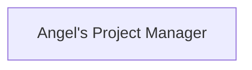

# ARCHITECTURE: Angel's Project Manager

> Managed document. Must comply with template ARCHITECTURE.template.md.

<!-- APM:DATA
{
  "docType": "architecture",
  "version": 1,
  "markdown": "# Architecture: Angel's Project Manager\n\n## 1. Architecture Overview\n\n### 1.1 System Purpose\n\n<\u0021--\nAPM-ID: architecture-overview-system-purpose-system-purpose\nAPM-LAST-UPDATED: 2026-04-05\n--\u003e\n\nPending system purpose.\n\n### 1.2 Architectural Vision\n\n<\u0021--\nAPM-ID: architecture-overview-architectural-vision-architectural-vision\nAPM-LAST-UPDATED: 2026-04-05\n--\u003e\n\nPending architectural vision.\n\n_Last updated: 2026-04-05_\n\n### 1.3 Architectural Style\n\n<\u0021--\nAPM-ID: architecture-overview-architectural-style-architectural-style\nAPM-LAST-UPDATED: 2026-04-05\n--\u003e\n\nPending architectural style.\n\n### 1.4 Architecture Type and Scope\n\n<\u0021--\nAPM-ID: architecture-structure-primary-architecture-primary-architecture\nAPM-LAST-UPDATED: 2026-04-05\n--\u003e\n\n- Primary Architecture: Angel's Project Manager\n<\u0021--\nAPM-ID: architecture-structure-architecture-type-architecture-type\nAPM-LAST-UPDATED: 2026-04-05\n--\u003e\n\n- Architecture Type: application\n<\u0021--\nAPM-ID: architecture-structure-architecture-scope-architecture-scope\nAPM-LAST-UPDATED: 2026-04-05\n--\u003e\n\n- Scope: single_application\n\n<\u0021--\nAPM-ID: architecture-structure-system-context-system-context\nAPM-LAST-UPDATED: 2026-04-05\n--\u003e\n\nNo system context captured yet.\n\n## 2. Architecture Registry\n\n### 2.1 Sub-Architectures\n\nNo sub-architectures defined yet.\n### 2.2 External Dependencies and Integrations\n\nNo external dependencies defined yet.\n## 3. Technology Stack\n\nNo technology stack entries defined yet.\n## 4. Components and Boundaries\n\n### 4.1 Core Components\n\nNo components defined yet.\n### 4.2 Component Connections\n\nNo component connections defined yet.\n### 4.3 Boundaries and Responsibilities\n\nNo boundaries defined yet.\n## 5. Workflows\n\n### 5.1 Application Workflows\n\nNo application workflows defined yet.\n### 5.2 Architecture Workflows\n\n<\u0021--\nAPM-ID: architecture-architecture-workflows-feature-implementation-to-canonical-document-workflow\nAPM-REFS: ARCHFRAG-MIG-003, FEAT-002, FEAT-003\nAPM-LAST-UPDATED: 2026-04-05\n--\u003e\n\n### 5.2.1 Feature implementation to canonical document workflow\n\nImplemented feature work flows from code changes into destination fragments, then into DB-backed module state, then into regenerated canonical documents and changelog history.\n\n- Version Date: 2026-04-05\n\n<\u0021--\nAPM-ID: architecture-architecture-workflows-future-enhancement-migration-workflow\nAPM-REFS: ARCHFRAG-MIG-003, FEAT-003\nAPM-LAST-UPDATED: 2026-04-05\n--\u003e\n\n### 5.2.2 Future-enhancement migration workflow\n\nImplemented ideas should move out of PRD Future Enhancements into their destination modules once the destination fragments are created, consumed, and verified.\n\n- Version Date: 2026-04-05\n\n## 6. Module Interdependence\n\n<\u0021--\nAPM-ID: architecture-module-interactions-features-prd-and-change-log-stay-linked-by\nAPM-REFS: ARCHFRAG-MIG-003, FEAT-003\nAPM-LAST-UPDATED: 2026-04-05\n--\u003e\n\n### 6.1 Features, PRD, and Change Log stay linked by stable ids\n\nFeatures and bugs remain the tracked work records, canonical documents describe current truth, and Change Log entries keep the human-readable trail tied to stable document item ids.\n\n- Version Date: 2026-04-05\n\n<\u0021--\nAPM-ID: architecture-module-interactions-roadmap-uses-active-work-item-codes-as-planning-references\nAPM-REFS: ARCHFRAG-MIG-003, FEAT-003\nAPM-LAST-UPDATED: 2026-04-05\n--\u003e\n\n### 6.2 Roadmap uses active work-item codes as planning references\n\nRoadmap planning should reference active feature and bug codes, while archived items remain historical inputs rather than default planning scope.\n\n- Version Date: 2026-04-05\n\n## 7. Persistence and State\n\n### 7.1 Persistence Strategy\n\n<\u0021--\nAPM-ID: architecture-persistence-strategy-summary-persistence-strategy\nAPM-LAST-UPDATED: 2026-04-05\n--\u003e\n\nNo persistence strategy captured yet.\n\n### 7.2 Source of Truth\n\n<\u0021--\nAPM-ID: architecture-persistence-strategy-source-of-truth-persistence-source-of-truth\nAPM-LAST-UPDATED: 2026-04-05\n--\u003e\n\nNo source of truth guidance captured yet.\n\n### 7.3 Synchronization Expectations\n\n<\u0021--\nAPM-ID: architecture-persistence-strategy-sync-expectations-persistence-sync-expectations\nAPM-LAST-UPDATED: 2026-04-05\n--\u003e\n\nNo synchronization expectations captured yet.\n\n## 8. Cross-Cutting Concerns\n\nNo cross-cutting concerns defined yet.\n## 9. Architectural Decisions and ADR Expectations\n\n<\u0021--\nAPM-ID: architecture-decisions-canonical-docs-are-updated-through-fragment-backed-module-state\nAPM-REFS: ARCHFRAG-MIG-003, FEAT-002\nAPM-LAST-UPDATED: 2026-04-05\n--\u003e\n\n### 9.1 Canonical docs are updated through fragment-backed module state\n\nManaged documents should be updated through fragment-backed, database-persisted module state instead of direct canonical markdown editing.\n\n- Version Date: 2026-04-05\n\n## 10. Constraints and Tradeoffs\n\nNo constraints captured yet.\n## 11. Runtime and Deployment\n\n### 11.1 Runtime Topology\n\n<\u0021--\nAPM-ID: architecture-deployment-runtime-topology-runtime-topology\nAPM-LAST-UPDATED: 2026-04-05\n--\u003e\n\nPending runtime topology.\n\n### 11.2 Environment Notes\n\n<\u0021--\nAPM-ID: architecture-deployment-environment-notes-environment-notes\nAPM-LAST-UPDATED: 2026-04-05\n--\u003e\n\nImported fragment ARCHITECTURE_FRAGMENT_20260402_legacy_structure_migration_001\n\n# Architecture Fragment: ARCHFRAG-LEGACY-001 - Document Hierarchy And Stack Governance\n\n> Managed document. Must comply with template ARCHITECTURE_FRAGMENT.template.md.\n\n## Executive Summary\n\nPromote the legacy document hierarchy rules and architecture discussion notes into the canonical Architecture module so the application has one authoritative description of its document system, stack boundaries, and dependency expectations.\n\n## System Shape Updates\n\n- Treat the document and module hierarchy as part of the application architecture, not as a side-spec.\n- Keep `Project Brief` as the root document for every project type.\n- Treat `Roadmap` and `Work Items` as the planning layer that feeds software-specific branches.\n- Treat the software branch as a dependency-aware system:\n  - `PRD`\n  - `Features`\n  - `Bugs`\n  - `Functional Spec`\n  - `Architecture`\n  - `Database Schema`\n  - `Technical Design`\n  - `ADR`\n  - `Test Strategy`\n- Require navigation, template generation, fragment validation, and downstream update rules to use the same hierarchy model.\n\n## Boundaries and Dependencies\n\n- Record the architectural boundary between:\n  - Electron desktop shell\n  - local Node/Express runtime\n  - Next.js frontend\n  - SQLite persistence\n  - generated documents and DBML artifacts\n  - integrations such as SFTP, Git, GitHub, and external launch actions\n- Capture that document dependencies are part of system design, not just writing guidance.\n- Note that `Database Schema` is both a design surface and a generated artifact family, and its intended design state should remain distinct from observed runtime schema captures.\n\n## Stack and Library Notes\n\n- The Architecture module should explicitly list the active libraries and frameworks that shape the stack.\n- Architecture should explain why major libraries are present and which subsystem owns them.\n- Dependency reference maintenance should be part of the architecture workflow so AI agents can reason safely about stack changes over time.\n\n## Runtime or Deployment Impact\n\n- Low direct runtime impact.\n- High workflow impact: the application should stop depending on legacy side documents in `docs/` for structural rules once this content is merged into the canonical Architecture document.\n\n## Open Questions\n\n- How should Architecture link to ADR entries once ADR workflow becomes richer?\n- Which library/dependency details belong in Architecture versus Technical Design?\n- How much of the document dependency model should also be visible in generated AI instructions?\n\n## Merge Guidance\n\n- Merge this fragment to absorb `Document-Hierarchy-Spec.md` and `ARCHITECTURE_DISCUSSION_TODO.md` into the canonical Architecture workflow.\n- Follow up by deleting the legacy side documents from `docs/` once the canonical modules carry the needed guidance.\n\nImported fragment ARCHFRAG-002\n\n# Architecture Fragment: ARCHFRAG-002 - Structured Architecture Baseline\n\n## Executive Summary\n\nReplace the placeholder Architecture baseline with a real first-pass description of what Angel's Project Manager is, how it is shaped, and which major subsystems and boundaries define it.\n\n## System Shape Updates\n\n- Define the system purpose as a local-first desktop workspace for managing projects, planning work, generating canonical documents, and collaborating safely with AI agents.\n- Define the architectural vision as a database-first desktop application that generates human-readable artifacts from structured state instead of treating generated markdown as the canonical runtime source.\n- Define the architectural style as a layered desktop application:\n  - Electron desktop shell\n  - local Node/Express runtime\n  - Next.js frontend workspace\n  - SQLite persistence\n  - generated document and fragment pipeline\n- Replace placeholder component sections with a concrete system map covering:\n  - Electron shell\n  - backend route/runtime layer\n  - frontend workspace/UI layer\n  - persistence and migrations\n  - managed document generation and reconciliation\n  - integrations and external launch actions\n\n## Boundaries and Dependencies\n\n- Move the document hierarchy model into architecture as a system rule instead of leaving it only as imported fragment prose.\n- Record that Project Brief is the root project document, Roadmap and Work Items form the planning layer, and software-specific modules are downstream and dependency-aware.\n- Record the architectural boundary between intended design state, observed runtime state, and generated artifacts, especially for Database Schema and DBML generation.\n- Capture that navigation, template generation, fragment validation, and downstream update rules all depend on the same hierarchy model.\n\n## Stack and Library Notes\n\n- Add structured stack notes for:\n  - Electron\n  - Node / Express\n  - Next.js / React / Tailwind\n  - SQLite\n  - Mermaid / DBML generation\n- Record subsystem ownership for major libraries so future Technical Design and ADR work can reference the same baseline.\n\n## Runtime or Deployment Impact\n\n- No direct runtime behavior change.\n- High documentation impact: this fragment should turn Architecture from a placeholder into a real canonical system-design document.\n- Follow-up modules likely affected:\n  - Database Schema\n  - Technical Design\n  - ADR\n  - AI Environment\n\n## Open Questions\n\n- How much stack detail should remain in Architecture versus being pushed into Technical Design?\n- Should Architecture explicitly link to dependency inventories once library tracking is added as a first-class workflow?\n- What level of runtime topology detail should be kept in Architecture for single-user desktop deployments?\n\n## Merge Guidance\n\n- Merge this fragment into the canonical Architecture document.\n- Apply its content into the actual structured Architecture sections instead of leaving it as imported fragment body under environment notes.\n\n_Last updated: 2026-04-05_\n\n## 12. Open Questions\n\nNo open questions captured yet.",
  "mermaid": "flowchart TD\n  system_angel_s_project_manager[\"Angel's Project Manager\"]",
  "editorState": {
    "overview": {
      "systemPurpose": "",
      "architecturalVision": "",
      "architecturalStyle": "",
      "versionDate": "2026-04-05T02:23:53.307Z",
      "itemIds": {
        "systemPurpose": "architecture-overview-system-purpose-system-purpose",
        "architecturalVision": "architecture-overview-architectural-vision-architectural-vision",
        "architecturalStyle": "architecture-overview-architectural-style-architectural-style"
      },
      "itemSourceRefs": {
        "systemPurpose": [],
        "architecturalVision": [],
        "architecturalStyle": []
      },
      "summary": "Capture the implemented fragment lifecycle and planning/document workflow rules that should no longer live in PRD Future Enhancements."
    },
    "structure": {
      "primaryArchitecture": "Angel's Project Manager",
      "architectureType": "application",
      "architectureScope": "single_application",
      "systemContext": "",
      "versionDate": "2026-04-05T02:23:53.307Z",
      "itemIds": {
        "primaryArchitecture": "architecture-structure-primary-architecture-primary-architecture",
        "architectureType": "architecture-structure-architecture-type-architecture-type",
        "architectureScope": "architecture-structure-architecture-scope-architecture-scope",
        "systemContext": "architecture-structure-system-context-system-context"
      },
      "itemSourceRefs": {
        "primaryArchitecture": [],
        "architectureType": [],
        "architectureScope": [],
        "systemContext": []
      }
    },
    "techStack": [],
    "components": [],
    "componentConnections": [],
    "boundaries": [],
    "externalDependencies": [],
    "subArchitectures": [],
    "applicationWorkflows": [],
    "architectureWorkflows": [
      {
        "title": "Feature implementation to canonical document workflow",
        "description": "Implemented feature work flows from code changes into destination fragments, then into DB-backed module state, then into regenerated canonical documents and changelog history.",
        "stableId": "architecture-architecture-workflows-feature-implementation-to-canonical-document-workflow",
        "versionDate": "2026-04-05T02:19:06.827Z",
        "sourceRefs": [
          "ARCHFRAG-MIG-003",
          "FEAT-002",
          "FEAT-003"
        ],
        "id": ""
      },
      {
        "title": "Future-enhancement migration workflow",
        "description": "Implemented ideas should move out of PRD Future Enhancements into their destination modules once the destination fragments are created, consumed, and verified.",
        "stableId": "architecture-architecture-workflows-future-enhancement-migration-workflow",
        "versionDate": "2026-04-05T02:19:06.827Z",
        "sourceRefs": [
          "ARCHFRAG-MIG-003",
          "FEAT-003"
        ],
        "id": ""
      }
    ],
    "moduleInteractions": [
      {
        "title": "Features, PRD, and Change Log stay linked by stable ids",
        "description": "Features and bugs remain the tracked work records, canonical documents describe current truth, and Change Log entries keep the human-readable trail tied to stable document item ids.",
        "stableId": "architecture-module-interactions-features-prd-and-change-log-stay-linked-by",
        "versionDate": "2026-04-05T02:19:06.827Z",
        "sourceRefs": [
          "ARCHFRAG-MIG-003",
          "FEAT-003"
        ],
        "id": ""
      },
      {
        "title": "Roadmap uses active work-item codes as planning references",
        "description": "Roadmap planning should reference active feature and bug codes, while archived items remain historical inputs rather than default planning scope.",
        "stableId": "architecture-module-interactions-roadmap-uses-active-work-item-codes-as-planning-references",
        "versionDate": "2026-04-05T02:19:06.827Z",
        "sourceRefs": [
          "ARCHFRAG-MIG-003",
          "FEAT-003"
        ],
        "id": ""
      }
    ],
    "persistenceStrategy": {
      "summary": "",
      "sourceOfTruth": "",
      "syncExpectations": "",
      "versionDate": "2026-04-05T02:23:53.307Z",
      "itemIds": {
        "summary": "architecture-persistence-strategy-summary-persistence-strategy",
        "sourceOfTruth": "architecture-persistence-strategy-source-of-truth-persistence-source-of-truth",
        "syncExpectations": "architecture-persistence-strategy-sync-expectations-persistence-sync-expectations"
      },
      "itemSourceRefs": {
        "summary": [],
        "sourceOfTruth": [],
        "syncExpectations": []
      }
    },
    "crossCuttingConcerns": [],
    "decisions": [
      {
        "title": "Canonical docs are updated through fragment-backed module state",
        "description": "Managed documents should be updated through fragment-backed, database-persisted module state instead of direct canonical markdown editing.",
        "stableId": "architecture-decisions-canonical-docs-are-updated-through-fragment-backed-module-state",
        "versionDate": "2026-04-05T02:19:06.827Z",
        "sourceRefs": [
          "ARCHFRAG-MIG-003",
          "FEAT-002"
        ],
        "id": ""
      }
    ],
    "constraints": [],
    "deployment": {
      "runtimeTopology": "",
      "environmentNotes": "Imported fragment ARCHITECTURE_FRAGMENT_20260402_legacy_structure_migration_001\n\n# Architecture Fragment: ARCHFRAG-LEGACY-001 - Document Hierarchy And Stack Governance\n\n> Managed document. Must comply with template ARCHITECTURE_FRAGMENT.template.md.\n\n## Executive Summary\n\nPromote the legacy document hierarchy rules and architecture discussion notes into the canonical Architecture module so the application has one authoritative description of its document system, stack boundaries, and dependency expectations.\n\n## System Shape Updates\n\n- Treat the document and module hierarchy as part of the application architecture, not as a side-spec.\n- Keep `Project Brief` as the root document for every project type.\n- Treat `Roadmap` and `Work Items` as the planning layer that feeds software-specific branches.\n- Treat the software branch as a dependency-aware system:\n  - `PRD`\n  - `Features`\n  - `Bugs`\n  - `Functional Spec`\n  - `Architecture`\n  - `Database Schema`\n  - `Technical Design`\n  - `ADR`\n  - `Test Strategy`\n- Require navigation, template generation, fragment validation, and downstream update rules to use the same hierarchy model.\n\n## Boundaries and Dependencies\n\n- Record the architectural boundary between:\n  - Electron desktop shell\n  - local Node/Express runtime\n  - Next.js frontend\n  - SQLite persistence\n  - generated documents and DBML artifacts\n  - integrations such as SFTP, Git, GitHub, and external launch actions\n- Capture that document dependencies are part of system design, not just writing guidance.\n- Note that `Database Schema` is both a design surface and a generated artifact family, and its intended design state should remain distinct from observed runtime schema captures.\n\n## Stack and Library Notes\n\n- The Architecture module should explicitly list the active libraries and frameworks that shape the stack.\n- Architecture should explain why major libraries are present and which subsystem owns them.\n- Dependency reference maintenance should be part of the architecture workflow so AI agents can reason safely about stack changes over time.\n\n## Runtime or Deployment Impact\n\n- Low direct runtime impact.\n- High workflow impact: the application should stop depending on legacy side documents in `docs/` for structural rules once this content is merged into the canonical Architecture document.\n\n## Open Questions\n\n- How should Architecture link to ADR entries once ADR workflow becomes richer?\n- Which library/dependency details belong in Architecture versus Technical Design?\n- How much of the document dependency model should also be visible in generated AI instructions?\n\n## Merge Guidance\n\n- Merge this fragment to absorb `Document-Hierarchy-Spec.md` and `ARCHITECTURE_DISCUSSION_TODO.md` into the canonical Architecture workflow.\n- Follow up by deleting the legacy side documents from `docs/` once the canonical modules carry the needed guidance.\n\nImported fragment ARCHFRAG-002\n\n# Architecture Fragment: ARCHFRAG-002 - Structured Architecture Baseline\n\n## Executive Summary\n\nReplace the placeholder Architecture baseline with a real first-pass description of what Angel's Project Manager is, how it is shaped, and which major subsystems and boundaries define it.\n\n## System Shape Updates\n\n- Define the system purpose as a local-first desktop workspace for managing projects, planning work, generating canonical documents, and collaborating safely with AI agents.\n- Define the architectural vision as a database-first desktop application that generates human-readable artifacts from structured state instead of treating generated markdown as the canonical runtime source.\n- Define the architectural style as a layered desktop application:\n  - Electron desktop shell\n  - local Node/Express runtime\n  - Next.js frontend workspace\n  - SQLite persistence\n  - generated document and fragment pipeline\n- Replace placeholder component sections with a concrete system map covering:\n  - Electron shell\n  - backend route/runtime layer\n  - frontend workspace/UI layer\n  - persistence and migrations\n  - managed document generation and reconciliation\n  - integrations and external launch actions\n\n## Boundaries and Dependencies\n\n- Move the document hierarchy model into architecture as a system rule instead of leaving it only as imported fragment prose.\n- Record that Project Brief is the root project document, Roadmap and Work Items form the planning layer, and software-specific modules are downstream and dependency-aware.\n- Record the architectural boundary between intended design state, observed runtime state, and generated artifacts, especially for Database Schema and DBML generation.\n- Capture that navigation, template generation, fragment validation, and downstream update rules all depend on the same hierarchy model.\n\n## Stack and Library Notes\n\n- Add structured stack notes for:\n  - Electron\n  - Node / Express\n  - Next.js / React / Tailwind\n  - SQLite\n  - Mermaid / DBML generation\n- Record subsystem ownership for major libraries so future Technical Design and ADR work can reference the same baseline.\n\n## Runtime or Deployment Impact\n\n- No direct runtime behavior change.\n- High documentation impact: this fragment should turn Architecture from a placeholder into a real canonical system-design document.\n- Follow-up modules likely affected:\n  - Database Schema\n  - Technical Design\n  - ADR\n  - AI Environment\n\n## Open Questions\n\n- How much stack detail should remain in Architecture versus being pushed into Technical Design?\n- Should Architecture explicitly link to dependency inventories once library tracking is added as a first-class workflow?\n- What level of runtime topology detail should be kept in Architecture for single-user desktop deployments?\n\n## Merge Guidance\n\n- Merge this fragment into the canonical Architecture document.\n- Apply its content into the actual structured Architecture sections instead of leaving it as imported fragment body under environment notes.",
      "versionDate": "2026-04-05T02:23:53.307Z",
      "itemIds": {
        "runtimeTopology": "architecture-deployment-runtime-topology-runtime-topology",
        "environmentNotes": "architecture-deployment-environment-notes-environment-notes"
      },
      "itemSourceRefs": {
        "runtimeTopology": [],
        "environmentNotes": []
      }
    },
    "openQuestions": [],
    "fragmentHistory": [
      {
        "id": "project:ARCHITECTURE_FRAGMENT_20260405_future_enhancement_migration_001.md",
        "code": "ARCHFRAG-MIG-003",
        "title": "Documentation Workflow And Planning Interdependence",
        "status": "integrated",
        "sourceScope": "project",
        "integratedAt": "2026-04-05T02:23:45.451Z",
        "summary": "Capture the implemented fragment lifecycle and planning/document workflow rules that should no longer live in PRD Future Enhancements.",
        "revision": 1,
        "lineageKey": "ARCHFRAG-MIG-003",
        "supersedesCode": "",
        "supersedesRevision": null
      },
      {
        "id": "project:ARCHITECTURE_FRAGMENT_20260403_structured_architecture_baseline_001.md",
        "code": "ARCHFRAG-002",
        "title": "Structured Architecture Baseline",
        "markdown": "# Architecture Fragment: ARCHFRAG-002 - Structured Architecture Baseline\n\n<\u0021-- APM:DATA\n{\n  \"docType\": \"architecture_fragment\",\n  \"version\": 1,\n  \"fragment\": {\n    \"id\": \"ARCHFRAG-002-v1\",\n    \"code\": \"ARCHFRAG-002\",\n    \"title\": \"Structured Architecture Baseline\",\n    \"summary\": \"Replace placeholder architecture sections with a real baseline for APM's system purpose, architecture shape, stack boundaries, and runtime topology.\",\n    \"revision\": 1,\n    \"lineageKey\": \"ARCHFRAG-002\",\n    \"status\": \"draft\"\n  }\n}\n--\u003e\n\n## Executive Summary\n\nReplace the placeholder Architecture baseline with a real first-pass description of what Angel's Project Manager is, how it is shaped, and which major subsystems and boundaries define it.\n\n## System Shape Updates\n\n- Define the system purpose as a local-first desktop workspace for managing projects, planning work, generating canonical documents, and collaborating safely with AI agents.\n- Define the architectural vision as a database-first desktop application that generates human-readable artifacts from structured state instead of treating generated markdown as the canonical runtime source.\n- Define the architectural style as a layered desktop application:\n  - Electron desktop shell\n  - local Node/Express runtime\n  - Next.js frontend workspace\n  - SQLite persistence\n  - generated document and fragment pipeline\n- Replace placeholder component sections with a concrete system map covering:\n  - Electron shell\n  - backend route/runtime layer\n  - frontend workspace/UI layer\n  - persistence and migrations\n  - managed document generation and reconciliation\n  - integrations and external launch actions\n\n## Boundaries and Dependencies\n\n- Move the document hierarchy model into architecture as a system rule instead of leaving it only as imported fragment prose.\n- Record that Project Brief is the root project document, Roadmap and Work Items form the planning layer, and software-specific modules are downstream and dependency-aware.\n- Record the architectural boundary between intended design state, observed runtime state, and generated artifacts, especially for Database Schema and DBML generation.\n- Capture that navigation, template generation, fragment validation, and downstream update rules all depend on the same hierarchy model.\n\n## Stack and Library Notes\n\n- Add structured stack notes for:\n  - Electron\n  - Node / Express\n  - Next.js / React / Tailwind\n  - SQLite\n  - Mermaid / DBML generation\n- Record subsystem ownership for major libraries so future Technical Design and ADR work can reference the same baseline.\n\n## Runtime or Deployment Impact\n\n- No direct runtime behavior change.\n- High documentation impact: this fragment should turn Architecture from a placeholder into a real canonical system-design document.\n- Follow-up modules likely affected:\n  - Database Schema\n  - Technical Design\n  - ADR\n  - AI Environment\n\n## Open Questions\n\n- How much stack detail should remain in Architecture versus being pushed into Technical Design?\n- Should Architecture explicitly link to dependency inventories once library tracking is added as a first-class workflow?\n- What level of runtime topology detail should be kept in Architecture for single-user desktop deployments?\n\n## Merge Guidance\n\n- Merge this fragment into the canonical Architecture document.\n- Apply its content into the actual structured Architecture sections instead of leaving it as imported fragment body under environment notes.\n",
        "status": "integrated",
        "fileName": "ARCHITECTURE_FRAGMENT_20260403_structured_architecture_baseline_001.md",
        "sourceScope": "project",
        "merged": true,
        "mergedAt": "2026-04-03T23:31:03.983Z",
        "integratedAt": "2026-04-03T23:31:03.983Z",
        "updatedAt": "2026-04-03T23:08:59.329Z",
        "revision": 1,
        "lineageKey": "ARCHFRAG-002",
        "supersedesCode": "",
        "supersedesRevision": null
      }
    ],
    "integrations": [],
    "runtimeScenarios": [],
    "operationalConcerns": [],
    "workingContent": ""
  }
}
-->

# Architecture: Angel's Project Manager

## 1. Architecture Overview

### 1.1 System Purpose

<!--
APM-ID: architecture-overview-system-purpose-system-purpose
APM-LAST-UPDATED: 2026-04-05
-->

Pending system purpose.

### 1.2 Architectural Vision

<!--
APM-ID: architecture-overview-architectural-vision-architectural-vision
APM-LAST-UPDATED: 2026-04-05
-->

Pending architectural vision.

_Last updated: 2026-04-05_

### 1.3 Architectural Style

<!--
APM-ID: architecture-overview-architectural-style-architectural-style
APM-LAST-UPDATED: 2026-04-05
-->

Pending architectural style.

### 1.4 Architecture Type and Scope

<!--
APM-ID: architecture-structure-primary-architecture-primary-architecture
APM-LAST-UPDATED: 2026-04-05
-->

- Primary Architecture: Angel's Project Manager
<!--
APM-ID: architecture-structure-architecture-type-architecture-type
APM-LAST-UPDATED: 2026-04-05
-->

- Architecture Type: application
<!--
APM-ID: architecture-structure-architecture-scope-architecture-scope
APM-LAST-UPDATED: 2026-04-05
-->

- Scope: single_application

<!--
APM-ID: architecture-structure-system-context-system-context
APM-LAST-UPDATED: 2026-04-05
-->

No system context captured yet.

## 2. Architecture Registry

### 2.1 Sub-Architectures

No sub-architectures defined yet.
### 2.2 External Dependencies and Integrations

No external dependencies defined yet.
## 3. Technology Stack

No technology stack entries defined yet.
## 4. Components and Boundaries

### 4.1 Core Components

No components defined yet.
### 4.2 Component Connections

No component connections defined yet.
### 4.3 Boundaries and Responsibilities

No boundaries defined yet.
## 5. Workflows

### 5.1 Application Workflows

No application workflows defined yet.
### 5.2 Architecture Workflows

<!--
APM-ID: architecture-architecture-workflows-feature-implementation-to-canonical-document-workflow
APM-REFS: ARCHFRAG-MIG-003, FEAT-002, FEAT-003
APM-LAST-UPDATED: 2026-04-05
-->

### 5.2.1 Feature implementation to canonical document workflow

Implemented feature work flows from code changes into destination fragments, then into DB-backed module state, then into regenerated canonical documents and changelog history.

- Version Date: 2026-04-05

<!--
APM-ID: architecture-architecture-workflows-future-enhancement-migration-workflow
APM-REFS: ARCHFRAG-MIG-003, FEAT-003
APM-LAST-UPDATED: 2026-04-05
-->

### 5.2.2 Future-enhancement migration workflow

Implemented ideas should move out of PRD Future Enhancements into their destination modules once the destination fragments are created, consumed, and verified.

- Version Date: 2026-04-05

## 6. Module Interdependence

<!--
APM-ID: architecture-module-interactions-features-prd-and-change-log-stay-linked-by
APM-REFS: ARCHFRAG-MIG-003, FEAT-003
APM-LAST-UPDATED: 2026-04-05
-->

### 6.1 Features, PRD, and Change Log stay linked by stable ids

Features and bugs remain the tracked work records, canonical documents describe current truth, and Change Log entries keep the human-readable trail tied to stable document item ids.

- Version Date: 2026-04-05

<!--
APM-ID: architecture-module-interactions-roadmap-uses-active-work-item-codes-as-planning-references
APM-REFS: ARCHFRAG-MIG-003, FEAT-003
APM-LAST-UPDATED: 2026-04-05
-->

### 6.2 Roadmap uses active work-item codes as planning references

Roadmap planning should reference active feature and bug codes, while archived items remain historical inputs rather than default planning scope.

- Version Date: 2026-04-05

## 7. Persistence and State

### 7.1 Persistence Strategy

<!--
APM-ID: architecture-persistence-strategy-summary-persistence-strategy
APM-LAST-UPDATED: 2026-04-05
-->

No persistence strategy captured yet.

### 7.2 Source of Truth

<!--
APM-ID: architecture-persistence-strategy-source-of-truth-persistence-source-of-truth
APM-LAST-UPDATED: 2026-04-05
-->

No source of truth guidance captured yet.

### 7.3 Synchronization Expectations

<!--
APM-ID: architecture-persistence-strategy-sync-expectations-persistence-sync-expectations
APM-LAST-UPDATED: 2026-04-05
-->

No synchronization expectations captured yet.

## 8. Cross-Cutting Concerns

No cross-cutting concerns defined yet.
## 9. Architectural Decisions and ADR Expectations

<!--
APM-ID: architecture-decisions-canonical-docs-are-updated-through-fragment-backed-module-state
APM-REFS: ARCHFRAG-MIG-003, FEAT-002
APM-LAST-UPDATED: 2026-04-05
-->

### 9.1 Canonical docs are updated through fragment-backed module state

Managed documents should be updated through fragment-backed, database-persisted module state instead of direct canonical markdown editing.

- Version Date: 2026-04-05

## 10. Constraints and Tradeoffs

No constraints captured yet.
## 11. Runtime and Deployment

### 11.1 Runtime Topology

<!--
APM-ID: architecture-deployment-runtime-topology-runtime-topology
APM-LAST-UPDATED: 2026-04-05
-->

Pending runtime topology.

### 11.2 Environment Notes

<!--
APM-ID: architecture-deployment-environment-notes-environment-notes
APM-LAST-UPDATED: 2026-04-05
-->

Imported fragment ARCHITECTURE_FRAGMENT_20260402_legacy_structure_migration_001

# Architecture Fragment: ARCHFRAG-LEGACY-001 - Document Hierarchy And Stack Governance

> Managed document. Must comply with template ARCHITECTURE_FRAGMENT.template.md.

## Executive Summary

Promote the legacy document hierarchy rules and architecture discussion notes into the canonical Architecture module so the application has one authoritative description of its document system, stack boundaries, and dependency expectations.

## System Shape Updates

- Treat the document and module hierarchy as part of the application architecture, not as a side-spec.
- Keep `Project Brief` as the root document for every project type.
- Treat `Roadmap` and `Work Items` as the planning layer that feeds software-specific branches.
- Treat the software branch as a dependency-aware system:
  - `PRD`
  - `Features`
  - `Bugs`
  - `Functional Spec`
  - `Architecture`
  - `Database Schema`
  - `Technical Design`
  - `ADR`
  - `Test Strategy`
- Require navigation, template generation, fragment validation, and downstream update rules to use the same hierarchy model.

## Boundaries and Dependencies

- Record the architectural boundary between:
  - Electron desktop shell
  - local Node/Express runtime
  - Next.js frontend
  - SQLite persistence
  - generated documents and DBML artifacts
  - integrations such as SFTP, Git, GitHub, and external launch actions
- Capture that document dependencies are part of system design, not just writing guidance.
- Note that `Database Schema` is both a design surface and a generated artifact family, and its intended design state should remain distinct from observed runtime schema captures.

## Stack and Library Notes

- The Architecture module should explicitly list the active libraries and frameworks that shape the stack.
- Architecture should explain why major libraries are present and which subsystem owns them.
- Dependency reference maintenance should be part of the architecture workflow so AI agents can reason safely about stack changes over time.

## Runtime or Deployment Impact

- Low direct runtime impact.
- High workflow impact: the application should stop depending on legacy side documents in `docs/` for structural rules once this content is merged into the canonical Architecture document.

## Open Questions

- How should Architecture link to ADR entries once ADR workflow becomes richer?
- Which library/dependency details belong in Architecture versus Technical Design?
- How much of the document dependency model should also be visible in generated AI instructions?

## Merge Guidance

- Merge this fragment to absorb `Document-Hierarchy-Spec.md` and `ARCHITECTURE_DISCUSSION_TODO.md` into the canonical Architecture workflow.
- Follow up by deleting the legacy side documents from `docs/` once the canonical modules carry the needed guidance.

Imported fragment ARCHFRAG-002

# Architecture Fragment: ARCHFRAG-002 - Structured Architecture Baseline

## Executive Summary

Replace the placeholder Architecture baseline with a real first-pass description of what Angel's Project Manager is, how it is shaped, and which major subsystems and boundaries define it.

## System Shape Updates

- Define the system purpose as a local-first desktop workspace for managing projects, planning work, generating canonical documents, and collaborating safely with AI agents.
- Define the architectural vision as a database-first desktop application that generates human-readable artifacts from structured state instead of treating generated markdown as the canonical runtime source.
- Define the architectural style as a layered desktop application:
  - Electron desktop shell
  - local Node/Express runtime
  - Next.js frontend workspace
  - SQLite persistence
  - generated document and fragment pipeline
- Replace placeholder component sections with a concrete system map covering:
  - Electron shell
  - backend route/runtime layer
  - frontend workspace/UI layer
  - persistence and migrations
  - managed document generation and reconciliation
  - integrations and external launch actions

## Boundaries and Dependencies

- Move the document hierarchy model into architecture as a system rule instead of leaving it only as imported fragment prose.
- Record that Project Brief is the root project document, Roadmap and Work Items form the planning layer, and software-specific modules are downstream and dependency-aware.
- Record the architectural boundary between intended design state, observed runtime state, and generated artifacts, especially for Database Schema and DBML generation.
- Capture that navigation, template generation, fragment validation, and downstream update rules all depend on the same hierarchy model.

## Stack and Library Notes

- Add structured stack notes for:
  - Electron
  - Node / Express
  - Next.js / React / Tailwind
  - SQLite
  - Mermaid / DBML generation
- Record subsystem ownership for major libraries so future Technical Design and ADR work can reference the same baseline.

## Runtime or Deployment Impact

- No direct runtime behavior change.
- High documentation impact: this fragment should turn Architecture from a placeholder into a real canonical system-design document.
- Follow-up modules likely affected:
  - Database Schema
  - Technical Design
  - ADR
  - AI Environment

## Open Questions

- How much stack detail should remain in Architecture versus being pushed into Technical Design?
- Should Architecture explicitly link to dependency inventories once library tracking is added as a first-class workflow?
- What level of runtime topology detail should be kept in Architecture for single-user desktop deployments?

## Merge Guidance

- Merge this fragment into the canonical Architecture document.
- Apply its content into the actual structured Architecture sections instead of leaving it as imported fragment body under environment notes.

_Last updated: 2026-04-05_

## 12. Open Questions

No open questions captured yet.

## Mermaid

