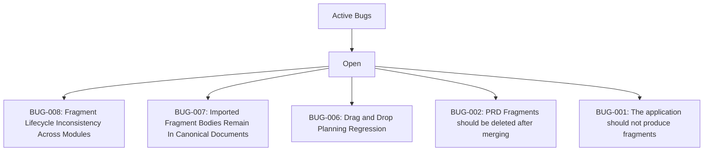

# BUGS: Angel's Project Manager

> Managed document. Must comply with template BUGS.template.md.

<!-- APM:DATA
{
  "docType": "bugs",
  "version": 1,
  "bugs": [
    {
      "id": "bug-1775260498325-6ol1enm",
      "projectId": "1772489365575-mj2xfcm",
      "code": "BUG-008",
      "title": "Fragment Lifecycle Inconsistency Across Modules",
      "summary": "Fragment discovery, dedupe, archive visibility, cleanup, and status signaling are closer than before but still inconsistent enough to confuse users during review and integration.",
      "currentBehavior": "Fragment discovery, dedupe, archive visibility, cleanup, and status signaling are closer than before but still inconsistent enough to confuse users during review and integration.",
      "expectedBehavior": "All fragment-enabled modules should expose the same predictable lifecycle for loading, importing, archiving, deduping, versioning, and cleanup.",
      "category": null,
      "severity": "medium",
      "dueDate": null,
      "assignedTo": null,
      "startDate": null,
      "endDate": null,
      "status": "open",
      "taskStatus": "todo",
      "taskId": "task-1775260498314-vb5jtcj",
      "roadmapPhaseId": null,
      "planningBucket": "planned",
      "workItemType": "software_bug",
      "itemType": "bug",
      "dependencyIds": [],
      "affectedModuleKeys": [],
      "associationHints": "",
      "progress": 0,
      "milestone": false,
      "sortOrder": 0,
      "completed": false,
      "regressed": false,
      "archived": false,
      "createdAt": "2026-04-11T17:50:45.388Z",
      "updatedAt": "2026-04-11T17:50:45.388Z"
    },
    {
      "id": "bug-1775260497797-580tuqz",
      "projectId": "1772489365575-mj2xfcm",
      "code": "BUG-007",
      "title": "Imported Fragment Bodies Remain In Canonical Documents",
      "summary": "Some managed documents, especially Architecture, still contain imported fragment text bodies in placeholder sections instead of a clean structured result.",
      "currentBehavior": "Some managed documents, especially Architecture, still contain imported fragment text bodies in placeholder sections instead of a clean structured result.",
      "expectedBehavior": "Consuming a fragment should update the correct structured document sections so the canonical document reads cleanly without leftover imported-body debris.",
      "category": null,
      "severity": "medium",
      "dueDate": null,
      "assignedTo": null,
      "startDate": null,
      "endDate": null,
      "status": "open",
      "taskStatus": "todo",
      "taskId": "task-1775260497787-whnkb4r",
      "roadmapPhaseId": null,
      "planningBucket": "planned",
      "workItemType": "software_bug",
      "itemType": "bug",
      "dependencyIds": [],
      "affectedModuleKeys": [],
      "associationHints": "",
      "progress": 0,
      "milestone": false,
      "sortOrder": 0,
      "completed": false,
      "regressed": false,
      "archived": false,
      "createdAt": "2026-04-11T17:50:45.338Z",
      "updatedAt": "2026-04-11T17:50:45.338Z"
    },
    {
      "id": "bug-1775260497330-1iuegfh",
      "projectId": "1772489365575-mj2xfcm",
      "code": "BUG-006",
      "title": "Drag and Drop Planning Regression",
      "summary": "Users cannot reliably drag and drop tasks, features, or bugs into phases the way the planning flow previously supported.",
      "currentBehavior": "Users cannot reliably drag and drop tasks, features, or bugs into phases the way the planning flow previously supported.",
      "expectedBehavior": "Users should be able to move planned work into roadmap phases through the intended drag-and-drop planner workflow.",
      "category": null,
      "severity": "medium",
      "dueDate": null,
      "assignedTo": null,
      "startDate": null,
      "endDate": null,
      "status": "open",
      "taskStatus": "todo",
      "taskId": "task-1775260497292-mmdkli2",
      "roadmapPhaseId": null,
      "planningBucket": "planned",
      "workItemType": "software_bug",
      "itemType": "bug",
      "dependencyIds": [],
      "affectedModuleKeys": [],
      "associationHints": "",
      "progress": 0,
      "milestone": false,
      "sortOrder": 0,
      "completed": false,
      "regressed": false,
      "archived": false,
      "createdAt": "2026-04-11T17:50:45.281Z",
      "updatedAt": "2026-04-11T17:50:45.281Z"
    },
    {
      "id": "bug-1774625378814-fscisc2",
      "projectId": "1772489365575-mj2xfcm",
      "code": "BUG-002",
      "title": "PRD Fragments should be deleted after merging",
      "summary": "PRD_FRAGMENT Files are still present after merge.",
      "currentBehavior": "PRD_FRAGMENT Files are still present after merge.",
      "expectedBehavior": "After a PRD_FRAGMENT is merged, the PRD module should scan for any other files and check against the database to make sure they are merged.  A merged file name should be a new field that helps mark if a file has already been merged.  If so, the fragment should be deleted.",
      "category": null,
      "severity": "medium",
      "dueDate": null,
      "assignedTo": null,
      "startDate": null,
      "endDate": null,
      "status": "open",
      "taskStatus": "todo",
      "taskId": "task-1774723828060-7ke94cf",
      "roadmapPhaseId": null,
      "planningBucket": "considered",
      "workItemType": "software_bug",
      "itemType": "bug",
      "dependencyIds": [],
      "affectedModuleKeys": [],
      "associationHints": "",
      "progress": 0,
      "milestone": false,
      "sortOrder": 0,
      "completed": false,
      "regressed": false,
      "archived": false,
      "createdAt": "2026-04-11T17:50:44.811Z",
      "updatedAt": "2026-04-11T17:50:44.811Z"
    },
    {
      "id": "bug-1775007912160-wi58d94",
      "projectId": "1772489365575-mj2xfcm",
      "code": "BUG-001",
      "title": "The application should not produce fragments",
      "summary": "Application, such as when I create a feature, is creating a PRD_Fragment",
      "currentBehavior": "Application, such as when I create a feature, is creating a PRD_Fragment",
      "expectedBehavior": "Only AI Agents should be able to generate fragments based off of templates for modules.",
      "category": null,
      "severity": "medium",
      "dueDate": null,
      "assignedTo": null,
      "startDate": null,
      "endDate": null,
      "status": "open",
      "taskStatus": "todo",
      "taskId": "task-1775007912143-4vovg99",
      "roadmapPhaseId": null,
      "planningBucket": "planned",
      "workItemType": "software_bug",
      "itemType": "bug",
      "dependencyIds": [],
      "affectedModuleKeys": [],
      "associationHints": "",
      "progress": 0,
      "milestone": false,
      "sortOrder": 0,
      "completed": false,
      "regressed": false,
      "archived": false,
      "createdAt": "2026-04-11T17:50:44.632Z",
      "updatedAt": "2026-04-11T17:50:44.632Z"
    }
  ],
  "mermaid": "flowchart TD\n  bugs[\"Active Bugs\"]\n  bugs --\u003e status_open[\"Open\"]\n  status_open --\u003e bug_bug_1775260498325_6ol1enm[\"BUG-008: Fragment Lifecycle Inconsistency Across Modules\"]\n  status_open --\u003e bug_bug_1775260497797_580tuqz[\"BUG-007: Imported Fragment Bodies Remain In Canonical Documents\"]\n  status_open --\u003e bug_bug_1775260497330_1iuegfh[\"BUG-006: Drag and Drop Planning Regression\"]\n  status_open --\u003e bug_bug_1774625378814_fscisc2[\"BUG-002: PRD Fragments should be deleted after merging\"]\n  status_open --\u003e bug_bug_1775007912160_wi58d94[\"BUG-001: The application should not produce fragments\"]"
}
-->

## 1. Bug Workflow

### 1.1 Lifecycle States

Use these lifecycle states when tracking software bugs across the project and in generated fragments.

1.1.1 `open` - Open: Newly reported and awaiting triage.
1.1.2 `triaged` - Triaged: Validated, categorized, and ready for prioritization.
1.1.3 `in_progress` - In Progress: Active investigation or remediation is underway.
1.1.4 `blocked` - Blocked: Work cannot continue until a dependency or decision is resolved.
1.1.5 `fixed` - Fixed: A code or configuration change is ready for validation.
1.1.6 `verifying` - Verifying: The proposed fix is being tested in the target environment.
1.1.7 `resolved` - Resolved: The issue has been verified as fixed.
1.1.8 `closed` - Closed: The record is complete and retained for history.
1.1.9 `regressed` - Regressed: The issue returned after a prior fix and needs renewed attention.

### 1.2 Active And Archived Rules

Active bugs remain in Considered, Planned, or a roadmap Phase and use one of these lifecycle states: `open`, `triaged`, `in_progress`, `blocked`, `fixed`, `verifying`, or `regressed`.

Resolved and closed bugs are automatically archived. Archived bugs should not remain in the active bug list of this document.

### 1.3 Archived Bug Handling

Resolved and closed bugs are automatically archived and removed from the active bug list.

Archived bugs remain visible in the archived bug history so the team can review what was fixed without cluttering active bug workflow.

If an archived bug moves back into an active lifecycle state, return it to the live bug list.

## 2. Active Bugs

### 2.1 BUG-008: Fragment Lifecycle Inconsistency Across Modules

- Lifecycle Status: Open (`open`)
- Planning Bucket: Planned (`planned`)
- Roadmap Phase: None
- Severity: medium
- Completed: No
- Regressed: No
- Linked Task: task-1775260498314-vb5jtcj
- Last Updated: 2026-04-11 17:50:45Z
- Affected Modules: None
- Association Hints: None

#### Current Behavior
```text
Fragment discovery, dedupe, archive visibility, cleanup, and status signaling are closer than before but still inconsistent enough to confuse users during review and integration.
```

#### Expected Behavior
```text
All fragment-enabled modules should expose the same predictable lifecycle for loading, importing, archiving, deduping, versioning, and cleanup.
```

### 2.2 BUG-007: Imported Fragment Bodies Remain In Canonical Documents

- Lifecycle Status: Open (`open`)
- Planning Bucket: Planned (`planned`)
- Roadmap Phase: None
- Severity: medium
- Completed: No
- Regressed: No
- Linked Task: task-1775260497787-whnkb4r
- Last Updated: 2026-04-11 17:50:45Z
- Affected Modules: None
- Association Hints: None

#### Current Behavior
```text
Some managed documents, especially Architecture, still contain imported fragment text bodies in placeholder sections instead of a clean structured result.
```

#### Expected Behavior
```text
Consuming a fragment should update the correct structured document sections so the canonical document reads cleanly without leftover imported-body debris.
```

### 2.3 BUG-006: Drag and Drop Planning Regression

- Lifecycle Status: Open (`open`)
- Planning Bucket: Planned (`planned`)
- Roadmap Phase: None
- Severity: medium
- Completed: No
- Regressed: No
- Linked Task: task-1775260497292-mmdkli2
- Last Updated: 2026-04-11 17:50:45Z
- Affected Modules: None
- Association Hints: None

#### Current Behavior
```text
Users cannot reliably drag and drop tasks, features, or bugs into phases the way the planning flow previously supported.
```

#### Expected Behavior
```text
Users should be able to move planned work into roadmap phases through the intended drag-and-drop planner workflow.
```

### 2.4 BUG-002: PRD Fragments should be deleted after merging

- Lifecycle Status: Open (`open`)
- Planning Bucket: Considered (`considered`)
- Roadmap Phase: None
- Severity: medium
- Completed: No
- Regressed: No
- Linked Task: task-1774723828060-7ke94cf
- Last Updated: 2026-04-11 17:50:44Z
- Affected Modules: None
- Association Hints: None

#### Current Behavior
```text
PRD_FRAGMENT Files are still present after merge.
```

#### Expected Behavior
```text
After a PRD_FRAGMENT is merged, the PRD module should scan for any other files and check against the database to make sure they are merged.  A merged file name should be a new field that helps mark if a file has already been merged.  If so, the fragment should be deleted.
```

### 2.5 BUG-001: The application should not produce fragments

- Lifecycle Status: Open (`open`)
- Planning Bucket: Planned (`planned`)
- Roadmap Phase: None
- Severity: medium
- Completed: No
- Regressed: No
- Linked Task: task-1775007912143-4vovg99
- Last Updated: 2026-04-11 17:50:44Z
- Affected Modules: None
- Association Hints: None

#### Current Behavior
```text
Application, such as when I create a feature, is creating a PRD_Fragment
```

#### Expected Behavior
```text
Only AI Agents should be able to generate fragments based off of templates for modules.
```

## 3. Mermaid


