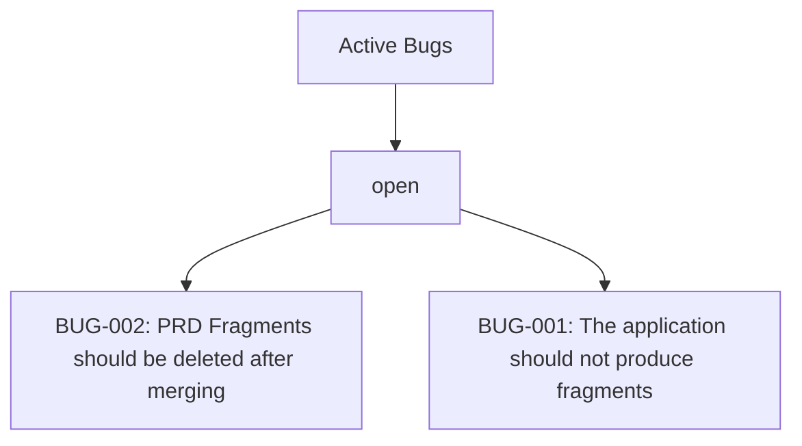

# BUGS: Angel's Project Manager

> Managed document. Must comply with template BUGS.template.md.

<!-- APM:DATA
{
  "docType": "bugs",
  "version": 1,
  "bugs": [
    {
      "id": "bug-1775784434597-av98knn",
      "projectId": "1772489365575-mj2xfcm",
      "code": "BUG-010",
      "title": "SFTP Feedback doesn't exist",
      "summary": "Adding mapping doesn't have good feedback.  The button \"Add From Selection\" for the Upload Mapping has no feedback.\nUpload from mapping has regressed to missing",
      "currentBehavior": "Adding mapping doesn't have good feedback.  The button \"Add From Selection\" for the Upload Mapping has no feedback.\nUpload from mapping has regressed to missing",
      "expectedBehavior": "\"Add From Selection\" for the Upload Mapping should have feedback when it's clicked.\nUpload from mapping should have a modal opening and showing progress for all files being uploaded (and skipping files that haven't changed)",
      "category": "SFTP",
      "severity": "medium",
      "dueDate": null,
      "assignedTo": null,
      "startDate": null,
      "endDate": null,
      "status": "open",
      "taskStatus": "todo",
      "taskId": "task-1775784434574-wxbsu2g",
      "roadmapPhaseId": null,
      "planningBucket": "planned",
      "workItemType": "software_bug",
      "itemType": "bug",
      "dependencyIds": [],
      "affectedModuleKeys": [],
      "progress": 0,
      "milestone": false,
      "sortOrder": 0,
      "completed": false,
      "regressed": false,
      "archived": false,
      "createdAt": "2026-04-10T01:27:14.574Z",
      "updatedAt": "2026-04-10T01:30:59.314Z"
    },
    {
      "id": "bug-1775260498325-6ol1enm",
      "projectId": "1772489365575-mj2xfcm",
      "code": "BUG-009",
      "title": "Fragment Lifecycle Inconsistency Across Modules",
      "summary": "# Bug Fragment: BUG-103 - Fragment Lifecycle Inconsistency Across Modules\n\n## Executive Summary\n\nRecord the remaining workflow inconsistency where fragment handling is improved but still not uniformly intuitive across every module.\n\n## Bug Updates\n\n- Add a planned bug entry for fragment lifecycle consistency and workflow polish across modules.\n\n## Expected vs Current Behavior\n\n### Current Behavior\n\nFragment discovery, dedupe, archive visibility, cleanup, and status signaling are closer than before but still inconsistent enough to confuse users during review and integration.\n\n### Expected Behavior\n\nAll fragment-enabled modules should expose the same predictable lifecycle for loading, importing, archiving, deduping, versioning, and cleanup.\n\n## Fix and Validation Notes\n\n- Validate active and archived fragment visibility across all modules.\n- Validate duplicate and superseded fragment handling with version metadata.\n- Validate cleanup behavior for canonical versus non-canonical source files.\n\n## Open Questions\n\n- Which remaining inconsistencies are true behavior bugs versus UI wording problems?\n- Should section-level fragment operations be part of the same lifecycle pass or follow separately?\n\n## Merge Guidance\n\n- Merge into Bugs as planned workflow-polish work.\n- Keep this linked to future fragment section add/remove/update work.",
      "currentBehavior": "# Bug Fragment: BUG-103 - Fragment Lifecycle Inconsistency Across Modules\n\n## Executive Summary\n\nRecord the remaining workflow inconsistency where fragment handling is improved but still not uniformly intuitive across every module.\n\n## Bug Updates\n\n- Add a planned bug entry for fragment lifecycle consistency and workflow polish across modules.\n\n## Expected vs Current Behavior\n\n### Current Behavior\n\nFragment discovery, dedupe, archive visibility, cleanup, and status signaling are closer than before but still inconsistent enough to confuse users during review and integration.\n\n### Expected Behavior\n\nAll fragment-enabled modules should expose the same predictable lifecycle for loading, importing, archiving, deduping, versioning, and cleanup.\n\n## Fix and Validation Notes\n\n- Validate active and archived fragment visibility across all modules.\n- Validate duplicate and superseded fragment handling with version metadata.\n- Validate cleanup behavior for canonical versus non-canonical source files.\n\n## Open Questions\n\n- Which remaining inconsistencies are true behavior bugs versus UI wording problems?\n- Should section-level fragment operations be part of the same lifecycle pass or follow separately?\n\n## Merge Guidance\n\n- Merge into Bugs as planned workflow-polish work.\n- Keep this linked to future fragment section add/remove/update work.",
      "expectedBehavior": "Review expected behavior and complete this bug record.",
      "category": null,
      "severity": "medium",
      "dueDate": null,
      "assignedTo": null,
      "startDate": null,
      "endDate": null,
      "status": "open",
      "taskStatus": "todo",
      "taskId": "task-1775260498314-vb5jtcj",
      "roadmapPhaseId": null,
      "planningBucket": "planned",
      "workItemType": "software_bug",
      "itemType": "bug",
      "dependencyIds": [],
      "affectedModuleKeys": [],
      "progress": 0,
      "milestone": false,
      "sortOrder": 0,
      "completed": false,
      "regressed": false,
      "archived": false,
      "createdAt": "2026-04-03T23:54:58.314Z",
      "updatedAt": "2026-04-03T23:54:58.314Z"
    },
    {
      "id": "bug-1775260497797-580tuqz",
      "projectId": "1772489365575-mj2xfcm",
      "code": "BUG-008",
      "title": "Imported Fragment Bodies Remain In Canonical Documents",
      "summary": "# Bug Fragment: BUG-102 - Imported Fragment Bodies Remain In Canonical Documents\n\n## Executive Summary\n\nRecord the document hygiene bug where imported fragment bodies remain pasted into canonical documents instead of being integrated into the intended structured sections.\n\n## Bug Updates\n\n- Add a planned bug entry for canonical document cleanup and better section-aware integration behavior.\n\n## Expected vs Current Behavior\n\n### Current Behavior\n\nSome managed documents, especially Architecture, still contain imported fragment text bodies in placeholder sections instead of a clean structured result.\n\n### Expected Behavior\n\nConsuming a fragment should update the correct structured document sections so the canonical document reads cleanly without leftover imported-body debris.\n\n## Fix and Validation Notes\n\n- Validate Architecture first, since it is the clearest current example.\n- Confirm fragment history remains preserved even when the final document body is clean.\n\n## Open Questions\n\n- Which modules still rely on imported fragment body dumps rather than true section-aware merge logic?\n- Should this be solved by richer fragment contracts, richer module UIs, or both?\n\n## Merge Guidance\n\n- Merge into Bugs as planned cleanup work.\n- This should stay open until canonical document rendering is clean for the affected modules.",
      "currentBehavior": "# Bug Fragment: BUG-102 - Imported Fragment Bodies Remain In Canonical Documents\n\n## Executive Summary\n\nRecord the document hygiene bug where imported fragment bodies remain pasted into canonical documents instead of being integrated into the intended structured sections.\n\n## Bug Updates\n\n- Add a planned bug entry for canonical document cleanup and better section-aware integration behavior.\n\n## Expected vs Current Behavior\n\n### Current Behavior\n\nSome managed documents, especially Architecture, still contain imported fragment text bodies in placeholder sections instead of a clean structured result.\n\n### Expected Behavior\n\nConsuming a fragment should update the correct structured document sections so the canonical document reads cleanly without leftover imported-body debris.\n\n## Fix and Validation Notes\n\n- Validate Architecture first, since it is the clearest current example.\n- Confirm fragment history remains preserved even when the final document body is clean.\n\n## Open Questions\n\n- Which modules still rely on imported fragment body dumps rather than true section-aware merge logic?\n- Should this be solved by richer fragment contracts, richer module UIs, or both?\n\n## Merge Guidance\n\n- Merge into Bugs as planned cleanup work.\n- This should stay open until canonical document rendering is clean for the affected modules.",
      "expectedBehavior": "Review expected behavior and complete this bug record.",
      "category": null,
      "severity": "medium",
      "dueDate": null,
      "assignedTo": null,
      "startDate": null,
      "endDate": null,
      "status": "open",
      "taskStatus": "todo",
      "taskId": "task-1775260497787-whnkb4r",
      "roadmapPhaseId": null,
      "planningBucket": "planned",
      "workItemType": "software_bug",
      "itemType": "bug",
      "dependencyIds": [],
      "affectedModuleKeys": [],
      "progress": 0,
      "milestone": false,
      "sortOrder": 0,
      "completed": false,
      "regressed": false,
      "archived": false,
      "createdAt": "2026-04-03T23:54:57.787Z",
      "updatedAt": "2026-04-03T23:54:57.787Z"
    },
    {
      "id": "bug-1775260497330-1iuegfh",
      "projectId": "1772489365575-mj2xfcm",
      "code": "BUG-007",
      "title": "Drag and Drop Planning Regression",
      "summary": "# Bug Fragment: BUG-101 - Drag and Drop Planning Regression\n\n## Executive Summary\n\nRecord the regression where drag-and-drop planning behavior is no longer available or reliable in the roadmap and related work-item flows.\n\n## Bug Updates\n\n- Add a planned bug entry for the broken drag-and-drop planning workflow across tasks, features, and bugs.\n\n## Expected vs Current Behavior\n\n### Current Behavior\n\nUsers cannot reliably drag and drop tasks, features, or bugs into phases the way the planning flow previously supported.\n\n### Expected Behavior\n\nUsers should be able to move planned work into roadmap phases through the intended drag-and-drop planner workflow.\n\n## Fix and Validation Notes\n\n- Validate roadmap, task, feature, and bug flows together instead of fixing only one surface.\n- Confirm both UI interaction and downstream state updates behave consistently.\n\n## Open Questions\n\n- Which exact planner views lost the behavior first?\n- Is the regression in UI interaction, state updates, or both?\n\n## Merge Guidance\n\n- Merge into Bugs as planned work.\n- This bug should remain visible until the planner workflow is restored and verified.",
      "currentBehavior": "# Bug Fragment: BUG-101 - Drag and Drop Planning Regression\n\n## Executive Summary\n\nRecord the regression where drag-and-drop planning behavior is no longer available or reliable in the roadmap and related work-item flows.\n\n## Bug Updates\n\n- Add a planned bug entry for the broken drag-and-drop planning workflow across tasks, features, and bugs.\n\n## Expected vs Current Behavior\n\n### Current Behavior\n\nUsers cannot reliably drag and drop tasks, features, or bugs into phases the way the planning flow previously supported.\n\n### Expected Behavior\n\nUsers should be able to move planned work into roadmap phases through the intended drag-and-drop planner workflow.\n\n## Fix and Validation Notes\n\n- Validate roadmap, task, feature, and bug flows together instead of fixing only one surface.\n- Confirm both UI interaction and downstream state updates behave consistently.\n\n## Open Questions\n\n- Which exact planner views lost the behavior first?\n- Is the regression in UI interaction, state updates, or both?\n\n## Merge Guidance\n\n- Merge into Bugs as planned work.\n- This bug should remain visible until the planner workflow is restored and verified.",
      "expectedBehavior": "Review expected behavior and complete this bug record.",
      "category": null,
      "severity": "medium",
      "dueDate": null,
      "assignedTo": null,
      "startDate": null,
      "endDate": null,
      "status": "open",
      "taskStatus": "todo",
      "taskId": "task-1775260497292-mmdkli2",
      "roadmapPhaseId": null,
      "planningBucket": "planned",
      "workItemType": "software_bug",
      "itemType": "bug",
      "dependencyIds": [],
      "affectedModuleKeys": [],
      "progress": 0,
      "milestone": false,
      "sortOrder": 0,
      "completed": false,
      "regressed": false,
      "archived": false,
      "createdAt": "2026-04-03T23:54:57.292Z",
      "updatedAt": "2026-04-03T23:54:57.292Z"
    },
    {
      "id": "bug-1775259007958-9e1v5uq",
      "projectId": "1772489365575-mj2xfcm",
      "code": "BUG-006",
      "title": "Fragment Lifecycle Inconsistency Across Modules",
      "summary": "# Bug Fragment: BUG-103 - Fragment Lifecycle Inconsistency Across Modules\n\n## Executive Summary\n\nRecord the remaining workflow inconsistency where fragment handling is improved but still not uniformly intuitive across every module.\n\n## Bug Updates\n\n- Add a planned bug entry for fragment lifecycle consistency and workflow polish across modules.\n\n## Expected vs Current Behavior\n\n### Current Behavior\n\nFragment discovery, dedupe, archive visibility, cleanup, and status signaling are closer than before but still inconsistent enough to confuse users during review and integration.\n\n### Expected Behavior\n\nAll fragment-enabled modules should expose the same predictable lifecycle for loading, importing, archiving, deduping, versioning, and cleanup.\n\n## Fix and Validation Notes\n\n- Validate active and archived fragment visibility across all modules.\n- Validate duplicate and superseded fragment handling with version metadata.\n- Validate cleanup behavior for canonical versus non-canonical source files.\n\n## Open Questions\n\n- Which remaining inconsistencies are true behavior bugs versus UI wording problems?\n- Should section-level fragment operations be part of the same lifecycle pass or follow separately?\n\n## Merge Guidance\n\n- Merge into Bugs as planned workflow-polish work.\n- Keep this linked to future fragment section add/remove/update work.",
      "currentBehavior": "# Bug Fragment: BUG-103 - Fragment Lifecycle Inconsistency Across Modules\n\n## Executive Summary\n\nRecord the remaining workflow inconsistency where fragment handling is improved but still not uniformly intuitive across every module.\n\n## Bug Updates\n\n- Add a planned bug entry for fragment lifecycle consistency and workflow polish across modules.\n\n## Expected vs Current Behavior\n\n### Current Behavior\n\nFragment discovery, dedupe, archive visibility, cleanup, and status signaling are closer than before but still inconsistent enough to confuse users during review and integration.\n\n### Expected Behavior\n\nAll fragment-enabled modules should expose the same predictable lifecycle for loading, importing, archiving, deduping, versioning, and cleanup.\n\n## Fix and Validation Notes\n\n- Validate active and archived fragment visibility across all modules.\n- Validate duplicate and superseded fragment handling with version metadata.\n- Validate cleanup behavior for canonical versus non-canonical source files.\n\n## Open Questions\n\n- Which remaining inconsistencies are true behavior bugs versus UI wording problems?\n- Should section-level fragment operations be part of the same lifecycle pass or follow separately?\n\n## Merge Guidance\n\n- Merge into Bugs as planned workflow-polish work.\n- Keep this linked to future fragment section add/remove/update work.",
      "expectedBehavior": "Review expected behavior and complete this bug record.",
      "category": null,
      "severity": "medium",
      "dueDate": null,
      "assignedTo": null,
      "startDate": null,
      "endDate": null,
      "status": "open",
      "taskStatus": "todo",
      "taskId": "task-1775259007948-wvhr0so",
      "roadmapPhaseId": null,
      "planningBucket": "planned",
      "workItemType": "software_bug",
      "itemType": "bug",
      "dependencyIds": [],
      "affectedModuleKeys": [],
      "progress": 0,
      "milestone": false,
      "sortOrder": 0,
      "completed": false,
      "regressed": false,
      "archived": false,
      "createdAt": "2026-04-03T23:30:07.948Z",
      "updatedAt": "2026-04-03T23:30:07.948Z"
    },
    {
      "id": "bug-1775259007507-oohx0ts",
      "projectId": "1772489365575-mj2xfcm",
      "code": "BUG-005",
      "title": "Imported Fragment Bodies Remain In Canonical Documents",
      "summary": "# Bug Fragment: BUG-102 - Imported Fragment Bodies Remain In Canonical Documents\n\n## Executive Summary\n\nRecord the document hygiene bug where imported fragment bodies remain pasted into canonical documents instead of being integrated into the intended structured sections.\n\n## Bug Updates\n\n- Add a planned bug entry for canonical document cleanup and better section-aware integration behavior.\n\n## Expected vs Current Behavior\n\n### Current Behavior\n\nSome managed documents, especially Architecture, still contain imported fragment text bodies in placeholder sections instead of a clean structured result.\n\n### Expected Behavior\n\nConsuming a fragment should update the correct structured document sections so the canonical document reads cleanly without leftover imported-body debris.\n\n## Fix and Validation Notes\n\n- Validate Architecture first, since it is the clearest current example.\n- Confirm fragment history remains preserved even when the final document body is clean.\n\n## Open Questions\n\n- Which modules still rely on imported fragment body dumps rather than true section-aware merge logic?\n- Should this be solved by richer fragment contracts, richer module UIs, or both?\n\n## Merge Guidance\n\n- Merge into Bugs as planned cleanup work.\n- This should stay open until canonical document rendering is clean for the affected modules.",
      "currentBehavior": "# Bug Fragment: BUG-102 - Imported Fragment Bodies Remain In Canonical Documents\n\n## Executive Summary\n\nRecord the document hygiene bug where imported fragment bodies remain pasted into canonical documents instead of being integrated into the intended structured sections.\n\n## Bug Updates\n\n- Add a planned bug entry for canonical document cleanup and better section-aware integration behavior.\n\n## Expected vs Current Behavior\n\n### Current Behavior\n\nSome managed documents, especially Architecture, still contain imported fragment text bodies in placeholder sections instead of a clean structured result.\n\n### Expected Behavior\n\nConsuming a fragment should update the correct structured document sections so the canonical document reads cleanly without leftover imported-body debris.\n\n## Fix and Validation Notes\n\n- Validate Architecture first, since it is the clearest current example.\n- Confirm fragment history remains preserved even when the final document body is clean.\n\n## Open Questions\n\n- Which modules still rely on imported fragment body dumps rather than true section-aware merge logic?\n- Should this be solved by richer fragment contracts, richer module UIs, or both?\n\n## Merge Guidance\n\n- Merge into Bugs as planned cleanup work.\n- This should stay open until canonical document rendering is clean for the affected modules.",
      "expectedBehavior": "Review expected behavior and complete this bug record.",
      "category": null,
      "severity": "medium",
      "dueDate": null,
      "assignedTo": null,
      "startDate": null,
      "endDate": null,
      "status": "open",
      "taskStatus": "todo",
      "taskId": "task-1775259007490-31md8wa",
      "roadmapPhaseId": null,
      "planningBucket": "planned",
      "workItemType": "software_bug",
      "itemType": "bug",
      "dependencyIds": [],
      "affectedModuleKeys": [],
      "progress": 0,
      "milestone": false,
      "sortOrder": 0,
      "completed": false,
      "regressed": false,
      "archived": false,
      "createdAt": "2026-04-03T23:30:07.490Z",
      "updatedAt": "2026-04-03T23:30:07.490Z"
    },
    {
      "id": "bug-1775259006850-31h8czq",
      "projectId": "1772489365575-mj2xfcm",
      "code": "BUG-004",
      "title": "Drag and Drop Planning Regression",
      "summary": "# Bug Fragment: BUG-101 - Drag and Drop Planning Regression\n\n## Executive Summary\n\nRecord the regression where drag-and-drop planning behavior is no longer available or reliable in the roadmap and related work-item flows.\n\n## Bug Updates\n\n- Add a planned bug entry for the broken drag-and-drop planning workflow across tasks, features, and bugs.\n\n## Expected vs Current Behavior\n\n### Current Behavior\n\nUsers cannot reliably drag and drop tasks, features, or bugs into phases the way the planning flow previously supported.\n\n### Expected Behavior\n\nUsers should be able to move planned work into roadmap phases through the intended drag-and-drop planner workflow.\n\n## Fix and Validation Notes\n\n- Validate roadmap, task, feature, and bug flows together instead of fixing only one surface.\n- Confirm both UI interaction and downstream state updates behave consistently.\n\n## Open Questions\n\n- Which exact planner views lost the behavior first?\n- Is the regression in UI interaction, state updates, or both?\n\n## Merge Guidance\n\n- Merge into Bugs as planned work.\n- This bug should remain visible until the planner workflow is restored and verified.",
      "currentBehavior": "# Bug Fragment: BUG-101 - Drag and Drop Planning Regression\n\n## Executive Summary\n\nRecord the regression where drag-and-drop planning behavior is no longer available or reliable in the roadmap and related work-item flows.\n\n## Bug Updates\n\n- Add a planned bug entry for the broken drag-and-drop planning workflow across tasks, features, and bugs.\n\n## Expected vs Current Behavior\n\n### Current Behavior\n\nUsers cannot reliably drag and drop tasks, features, or bugs into phases the way the planning flow previously supported.\n\n### Expected Behavior\n\nUsers should be able to move planned work into roadmap phases through the intended drag-and-drop planner workflow.\n\n## Fix and Validation Notes\n\n- Validate roadmap, task, feature, and bug flows together instead of fixing only one surface.\n- Confirm both UI interaction and downstream state updates behave consistently.\n\n## Open Questions\n\n- Which exact planner views lost the behavior first?\n- Is the regression in UI interaction, state updates, or both?\n\n## Merge Guidance\n\n- Merge into Bugs as planned work.\n- This bug should remain visible until the planner workflow is restored and verified.",
      "expectedBehavior": "Review expected behavior and complete this bug record.",
      "category": null,
      "severity": "medium",
      "dueDate": null,
      "assignedTo": null,
      "startDate": null,
      "endDate": null,
      "status": "open",
      "taskStatus": "todo",
      "taskId": "task-1775259006834-fww19ha",
      "roadmapPhaseId": null,
      "planningBucket": "planned",
      "workItemType": "software_bug",
      "itemType": "bug",
      "dependencyIds": [],
      "affectedModuleKeys": [],
      "progress": 0,
      "milestone": false,
      "sortOrder": 0,
      "completed": false,
      "regressed": false,
      "archived": false,
      "createdAt": "2026-04-03T23:30:06.834Z",
      "updatedAt": "2026-04-03T23:30:06.834Z"
    },
    {
      "id": "bug-1774625378814-fscisc2",
      "projectId": "1772489365575-mj2xfcm",
      "code": "BUG-002",
      "title": "PRD Fragments should be deleted after merging",
      "summary": "PRD_FRAGMENT Files are still present after merge.",
      "currentBehavior": "PRD_FRAGMENT Files are still present after merge.",
      "expectedBehavior": "After a PRD_FRAGMENT is merged, the PRD module should scan for any other files and check against the database to make sure they are merged.  A merged file name should be a new field that helps mark if a file has already been merged.  If so, the fragment should be deleted.",
      "category": null,
      "severity": "medium",
      "dueDate": null,
      "assignedTo": null,
      "startDate": null,
      "endDate": null,
      "status": "open",
      "taskStatus": "todo",
      "taskId": "task-1774723828060-7ke94cf",
      "roadmapPhaseId": null,
      "planningBucket": "considered",
      "workItemType": "software_bug",
      "itemType": "bug",
      "dependencyIds": [],
      "affectedModuleKeys": [],
      "progress": 0,
      "milestone": false,
      "sortOrder": 0,
      "completed": false,
      "regressed": false,
      "archived": false,
      "createdAt": "2026-04-02T22:29:43.682Z",
      "updatedAt": "2026-04-02T22:29:43.682Z"
    },
    {
      "id": "bug-1775007912160-wi58d94",
      "projectId": "1772489365575-mj2xfcm",
      "code": "BUG-001",
      "title": "The application should not produce fragments",
      "summary": "Application, such as when I create a feature, is creating a PRD_Fragment",
      "currentBehavior": "Application, such as when I create a feature, is creating a PRD_Fragment",
      "expectedBehavior": "Only AI Agents should be able to generate fragments based off of templates for modules.",
      "category": null,
      "severity": "medium",
      "dueDate": null,
      "assignedTo": null,
      "startDate": null,
      "endDate": null,
      "status": "open",
      "taskStatus": "todo",
      "taskId": "task-1775007912143-4vovg99",
      "roadmapPhaseId": null,
      "planningBucket": "planned",
      "workItemType": "software_bug",
      "itemType": "bug",
      "dependencyIds": [],
      "affectedModuleKeys": [],
      "progress": 0,
      "milestone": false,
      "sortOrder": 0,
      "completed": false,
      "regressed": false,
      "archived": false,
      "createdAt": "2026-04-02T22:29:43.656Z",
      "updatedAt": "2026-04-02T22:29:43.656Z"
    },
    {
      "id": "bug-1774587154303-cb3ch8s",
      "projectId": "1772489365575-mj2xfcm",
      "code": "BUG-003",
      "title": "Add/Edit link is a text field.",
      "summary": "When file is selected for a link, a user needs to enter it into a text box",
      "currentBehavior": "When file is selected for a link, a user needs to enter it into a text box",
      "expectedBehavior": "When a folder or file is selected for a link, a file/folder selector should be used.  This should be a reusable module, the application is already using one.",
      "category": null,
      "severity": "medium",
      "dueDate": null,
      "assignedTo": null,
      "startDate": null,
      "endDate": null,
      "status": "open",
      "taskStatus": "todo",
      "taskId": "task-1774723828059-rifwvy0",
      "roadmapPhaseId": null,
      "planningBucket": "archived",
      "workItemType": "software_bug",
      "itemType": "bug",
      "dependencyIds": [],
      "affectedModuleKeys": [],
      "progress": 100,
      "milestone": false,
      "sortOrder": 0,
      "completed": true,
      "regressed": false,
      "archived": true,
      "createdAt": "2026-04-02T22:29:43.699Z",
      "updatedAt": "2026-04-02T22:29:43.699Z"
    }
  ],
  "mermaid": "flowchart TD\n  bugs[\"Active Bugs\"]\n  bugs --\u003e status_open[\"open\"]\n  status_open --\u003e bug_bug_1774625378814_fscisc2[\"BUG-002: PRD Fragments should be deleted after merging\"]\n  status_open --\u003e bug_bug_1775007912160_wi58d94[\"BUG-001: The application should not produce fragments\"]"
}
-->

## Active Bugs

### BUG-010: SFTP Feedback doesn't exist

- Status: open
- Severity: medium
- Completed: No
- Regressed: No
- Linked Task: task-1775784434574-wxbsu2g

#### Current Behavior
Adding mapping doesn't have good feedback.  The button "Add From Selection" for the Upload Mapping has no feedback.
Upload from mapping has regressed to missing

#### Expected Behavior
"Add From Selection" for the Upload Mapping should have feedback when it's clicked.
Upload from mapping should have a modal opening and showing progress for all files being uploaded (and skipping files that haven't changed)

### BUG-009: Fragment Lifecycle Inconsistency Across Modules

- Status: open
- Severity: medium
- Completed: No
- Regressed: No
- Linked Task: task-1775260498314-vb5jtcj

#### Current Behavior
# Bug Fragment: BUG-103 - Fragment Lifecycle Inconsistency Across Modules

## Executive Summary

Record the remaining workflow inconsistency where fragment handling is improved but still not uniformly intuitive across every module.

## Bug Updates

- Add a planned bug entry for fragment lifecycle consistency and workflow polish across modules.

## Expected vs Current Behavior

### Current Behavior

Fragment discovery, dedupe, archive visibility, cleanup, and status signaling are closer than before but still inconsistent enough to confuse users during review and integration.

### Expected Behavior

All fragment-enabled modules should expose the same predictable lifecycle for loading, importing, archiving, deduping, versioning, and cleanup.

## Fix and Validation Notes

- Validate active and archived fragment visibility across all modules.
- Validate duplicate and superseded fragment handling with version metadata.
- Validate cleanup behavior for canonical versus non-canonical source files.

## Open Questions

- Which remaining inconsistencies are true behavior bugs versus UI wording problems?
- Should section-level fragment operations be part of the same lifecycle pass or follow separately?

## Merge Guidance

- Merge into Bugs as planned workflow-polish work.
- Keep this linked to future fragment section add/remove/update work.

#### Expected Behavior
Review expected behavior and complete this bug record.

### BUG-008: Imported Fragment Bodies Remain In Canonical Documents

- Status: open
- Severity: medium
- Completed: No
- Regressed: No
- Linked Task: task-1775260497787-whnkb4r

#### Current Behavior
# Bug Fragment: BUG-102 - Imported Fragment Bodies Remain In Canonical Documents

## Executive Summary

Record the document hygiene bug where imported fragment bodies remain pasted into canonical documents instead of being integrated into the intended structured sections.

## Bug Updates

- Add a planned bug entry for canonical document cleanup and better section-aware integration behavior.

## Expected vs Current Behavior

### Current Behavior

Some managed documents, especially Architecture, still contain imported fragment text bodies in placeholder sections instead of a clean structured result.

### Expected Behavior

Consuming a fragment should update the correct structured document sections so the canonical document reads cleanly without leftover imported-body debris.

## Fix and Validation Notes

- Validate Architecture first, since it is the clearest current example.
- Confirm fragment history remains preserved even when the final document body is clean.

## Open Questions

- Which modules still rely on imported fragment body dumps rather than true section-aware merge logic?
- Should this be solved by richer fragment contracts, richer module UIs, or both?

## Merge Guidance

- Merge into Bugs as planned cleanup work.
- This should stay open until canonical document rendering is clean for the affected modules.

#### Expected Behavior
Review expected behavior and complete this bug record.

### BUG-007: Drag and Drop Planning Regression

- Status: open
- Severity: medium
- Completed: No
- Regressed: No
- Linked Task: task-1775260497292-mmdkli2

#### Current Behavior
# Bug Fragment: BUG-101 - Drag and Drop Planning Regression

## Executive Summary

Record the regression where drag-and-drop planning behavior is no longer available or reliable in the roadmap and related work-item flows.

## Bug Updates

- Add a planned bug entry for the broken drag-and-drop planning workflow across tasks, features, and bugs.

## Expected vs Current Behavior

### Current Behavior

Users cannot reliably drag and drop tasks, features, or bugs into phases the way the planning flow previously supported.

### Expected Behavior

Users should be able to move planned work into roadmap phases through the intended drag-and-drop planner workflow.

## Fix and Validation Notes

- Validate roadmap, task, feature, and bug flows together instead of fixing only one surface.
- Confirm both UI interaction and downstream state updates behave consistently.

## Open Questions

- Which exact planner views lost the behavior first?
- Is the regression in UI interaction, state updates, or both?

## Merge Guidance

- Merge into Bugs as planned work.
- This bug should remain visible until the planner workflow is restored and verified.

#### Expected Behavior
Review expected behavior and complete this bug record.

### BUG-006: Fragment Lifecycle Inconsistency Across Modules

- Status: open
- Severity: medium
- Completed: No
- Regressed: No
- Linked Task: task-1775259007948-wvhr0so

#### Current Behavior
# Bug Fragment: BUG-103 - Fragment Lifecycle Inconsistency Across Modules

## Executive Summary

Record the remaining workflow inconsistency where fragment handling is improved but still not uniformly intuitive across every module.

## Bug Updates

- Add a planned bug entry for fragment lifecycle consistency and workflow polish across modules.

## Expected vs Current Behavior

### Current Behavior

Fragment discovery, dedupe, archive visibility, cleanup, and status signaling are closer than before but still inconsistent enough to confuse users during review and integration.

### Expected Behavior

All fragment-enabled modules should expose the same predictable lifecycle for loading, importing, archiving, deduping, versioning, and cleanup.

## Fix and Validation Notes

- Validate active and archived fragment visibility across all modules.
- Validate duplicate and superseded fragment handling with version metadata.
- Validate cleanup behavior for canonical versus non-canonical source files.

## Open Questions

- Which remaining inconsistencies are true behavior bugs versus UI wording problems?
- Should section-level fragment operations be part of the same lifecycle pass or follow separately?

## Merge Guidance

- Merge into Bugs as planned workflow-polish work.
- Keep this linked to future fragment section add/remove/update work.

#### Expected Behavior
Review expected behavior and complete this bug record.

### BUG-005: Imported Fragment Bodies Remain In Canonical Documents

- Status: open
- Severity: medium
- Completed: No
- Regressed: No
- Linked Task: task-1775259007490-31md8wa

#### Current Behavior
# Bug Fragment: BUG-102 - Imported Fragment Bodies Remain In Canonical Documents

## Executive Summary

Record the document hygiene bug where imported fragment bodies remain pasted into canonical documents instead of being integrated into the intended structured sections.

## Bug Updates

- Add a planned bug entry for canonical document cleanup and better section-aware integration behavior.

## Expected vs Current Behavior

### Current Behavior

Some managed documents, especially Architecture, still contain imported fragment text bodies in placeholder sections instead of a clean structured result.

### Expected Behavior

Consuming a fragment should update the correct structured document sections so the canonical document reads cleanly without leftover imported-body debris.

## Fix and Validation Notes

- Validate Architecture first, since it is the clearest current example.
- Confirm fragment history remains preserved even when the final document body is clean.

## Open Questions

- Which modules still rely on imported fragment body dumps rather than true section-aware merge logic?
- Should this be solved by richer fragment contracts, richer module UIs, or both?

## Merge Guidance

- Merge into Bugs as planned cleanup work.
- This should stay open until canonical document rendering is clean for the affected modules.

#### Expected Behavior
Review expected behavior and complete this bug record.

### BUG-004: Drag and Drop Planning Regression

- Status: open
- Severity: medium
- Completed: No
- Regressed: No
- Linked Task: task-1775259006834-fww19ha

#### Current Behavior
# Bug Fragment: BUG-101 - Drag and Drop Planning Regression

## Executive Summary

Record the regression where drag-and-drop planning behavior is no longer available or reliable in the roadmap and related work-item flows.

## Bug Updates

- Add a planned bug entry for the broken drag-and-drop planning workflow across tasks, features, and bugs.

## Expected vs Current Behavior

### Current Behavior

Users cannot reliably drag and drop tasks, features, or bugs into phases the way the planning flow previously supported.

### Expected Behavior

Users should be able to move planned work into roadmap phases through the intended drag-and-drop planner workflow.

## Fix and Validation Notes

- Validate roadmap, task, feature, and bug flows together instead of fixing only one surface.
- Confirm both UI interaction and downstream state updates behave consistently.

## Open Questions

- Which exact planner views lost the behavior first?
- Is the regression in UI interaction, state updates, or both?

## Merge Guidance

- Merge into Bugs as planned work.
- This bug should remain visible until the planner workflow is restored and verified.

#### Expected Behavior
Review expected behavior and complete this bug record.

### BUG-002: PRD Fragments should be deleted after merging

- Status: open
- Severity: medium
- Completed: No
- Regressed: No
- Linked Task: task-1774723828060-7ke94cf

#### Current Behavior
PRD_FRAGMENT Files are still present after merge.

#### Expected Behavior
After a PRD_FRAGMENT is merged, the PRD module should scan for any other files and check against the database to make sure they are merged.  A merged file name should be a new field that helps mark if a file has already been merged.  If so, the fragment should be deleted.

### BUG-001: The application should not produce fragments

- Status: open
- Severity: medium
- Completed: No
- Regressed: No
- Linked Task: task-1775007912143-4vovg99

#### Current Behavior
Application, such as when I create a feature, is creating a PRD_Fragment

#### Expected Behavior
Only AI Agents should be able to generate fragments based off of templates for modules.

## Archived Bugs

### BUG-003: Add/Edit link is a text field.

- Status: open
- Severity: medium
- Completed: Yes
- Regressed: No
- Linked Task: task-1774723828059-rifwvy0

#### Current Behavior
When file is selected for a link, a user needs to enter it into a text box

#### Expected Behavior
When a folder or file is selected for a link, a file/folder selector should be used.  This should be a reusable module, the application is already using one.

## Mermaid

