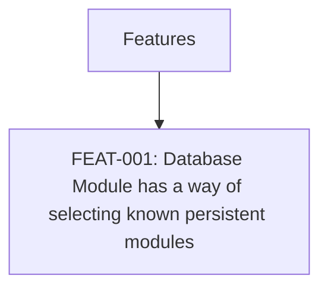

# FEATURES: Angel's Project Manager

> Managed document. Must comply with template FEATURES.template.md.

<!-- APM:DATA
{
  "docType": "features",
  "version": 1,
  "features": [
    {
      "id": "feature-1775260381701-v5d4wjy",
      "projectId": "1772489365575-mj2xfcm",
      "code": "FEAT-012",
      "title": "Enterprise and Governance Features",
      "summary": "Promote the remaining enterprise-oriented roadmap ideas into a real planned feature area so they can be tracked deliberately later.",
      "description": "Promote the remaining enterprise-oriented roadmap ideas into a real planned feature area so they can be tracked deliberately later.",
      "category": null,
      "priority": "medium",
      "dueDate": null,
      "assignedTo": null,
      "startDate": null,
      "endDate": null,
      "status": "done",
      "taskStatus": "done",
      "roadmapPhaseId": null,
      "taskId": "task-1775260381690-swxrv67",
      "planningBucket": "archived",
      "workItemType": "software_feature",
      "itemType": "feature",
      "dependencyIds": [],
      "affectedModuleKeys": [],
      "progress": 0,
      "milestone": false,
      "sortOrder": 0,
      "archived": true,
      "createdAt": "2026-04-03T23:53:01.690Z",
      "updatedAt": "2026-04-03T23:55:20.697Z"
    },
    {
      "id": "feature-1775260380700-sdd7v5k",
      "projectId": "1772489365575-mj2xfcm",
      "code": "FEAT-011",
      "title": "Collaboration Features",
      "summary": "Capture collaboration-oriented future work as a real planned feature area instead of leaving it buried in legacy roadmap notes.",
      "description": "Capture collaboration-oriented future work as a real planned feature area instead of leaving it buried in legacy roadmap notes.",
      "category": null,
      "priority": "medium",
      "dueDate": null,
      "assignedTo": null,
      "startDate": null,
      "endDate": null,
      "status": "done",
      "taskStatus": "done",
      "roadmapPhaseId": null,
      "taskId": "task-1775260380689-nxgbdhz",
      "planningBucket": "archived",
      "workItemType": "software_feature",
      "itemType": "feature",
      "dependencyIds": [],
      "affectedModuleKeys": [],
      "progress": 0,
      "milestone": false,
      "sortOrder": 0,
      "archived": true,
      "createdAt": "2026-04-03T23:53:00.689Z",
      "updatedAt": "2026-04-03T23:55:18.313Z"
    },
    {
      "id": "feature-1775260379767-zfgviv6",
      "projectId": "1772489365575-mj2xfcm",
      "code": "FEAT-010",
      "title": "Advanced UI and UX Improvements",
      "summary": "Capture the next layer of user-experience polish as planned work instead of leaving it in legacy notes.",
      "description": "Capture the next layer of user-experience polish as planned work instead of leaving it in legacy notes.",
      "category": null,
      "priority": "medium",
      "dueDate": null,
      "assignedTo": null,
      "startDate": null,
      "endDate": null,
      "status": "done",
      "taskStatus": "done",
      "roadmapPhaseId": null,
      "taskId": "task-1775260379756-71xu72d",
      "planningBucket": "archived",
      "workItemType": "software_feature",
      "itemType": "feature",
      "dependencyIds": [],
      "affectedModuleKeys": [],
      "progress": 0,
      "milestone": false,
      "sortOrder": 0,
      "archived": true,
      "createdAt": "2026-04-03T23:52:59.756Z",
      "updatedAt": "2026-04-03T23:55:16.072Z"
    },
    {
      "id": "feature-1775260378833-9d8qnae",
      "projectId": "1772489365575-mj2xfcm",
      "code": "FEAT-009",
      "title": "Advanced Analytics and Reporting",
      "summary": "Add a planned feature area for analytics and reporting so APM can surface progress, time, and output visibility beyond basic planning views.",
      "description": "Add a planned feature area for analytics and reporting so APM can surface progress, time, and output visibility beyond basic planning views.",
      "category": null,
      "priority": "medium",
      "dueDate": null,
      "assignedTo": null,
      "startDate": null,
      "endDate": null,
      "status": "done",
      "taskStatus": "done",
      "roadmapPhaseId": null,
      "taskId": "task-1775260378819-kl25ho8",
      "planningBucket": "archived",
      "workItemType": "software_feature",
      "itemType": "feature",
      "dependencyIds": [],
      "affectedModuleKeys": [],
      "progress": 0,
      "milestone": false,
      "sortOrder": 0,
      "archived": true,
      "createdAt": "2026-04-03T23:52:58.819Z",
      "updatedAt": "2026-04-03T23:55:13.056Z"
    },
    {
      "id": "feature-1775258976737-55uz6y2",
      "projectId": "1772489365575-mj2xfcm",
      "code": "FEAT-008",
      "title": "Enterprise and Governance Features",
      "summary": "Promote the remaining enterprise-oriented roadmap ideas into a real planned feature area so they can be tracked deliberately later.",
      "description": "Promote the remaining enterprise-oriented roadmap ideas into a real planned feature area so they can be tracked deliberately later.",
      "category": null,
      "priority": "medium",
      "dueDate": null,
      "assignedTo": null,
      "startDate": null,
      "endDate": null,
      "status": "done",
      "taskStatus": "done",
      "roadmapPhaseId": null,
      "taskId": "task-1775258976726-cyr14pz",
      "planningBucket": "archived",
      "workItemType": "software_feature",
      "itemType": "feature",
      "dependencyIds": [],
      "affectedModuleKeys": [],
      "progress": 0,
      "milestone": false,
      "sortOrder": 0,
      "archived": true,
      "createdAt": "2026-04-03T23:29:36.726Z",
      "updatedAt": "2026-04-03T23:30:34.200Z"
    },
    {
      "id": "feature-1775258975946-jxox920",
      "projectId": "1772489365575-mj2xfcm",
      "code": "FEAT-007",
      "title": "Collaboration Features",
      "summary": "Capture collaboration-oriented future work as a real planned feature area instead of leaving it buried in legacy roadmap notes.",
      "description": "Capture collaboration-oriented future work as a real planned feature area instead of leaving it buried in legacy roadmap notes.",
      "category": null,
      "priority": "medium",
      "dueDate": null,
      "assignedTo": null,
      "startDate": null,
      "endDate": null,
      "status": "done",
      "taskStatus": "done",
      "roadmapPhaseId": null,
      "taskId": "task-1775258975933-0md8a1u",
      "planningBucket": "archived",
      "workItemType": "software_feature",
      "itemType": "feature",
      "dependencyIds": [],
      "affectedModuleKeys": [],
      "progress": 0,
      "milestone": false,
      "sortOrder": 0,
      "archived": true,
      "createdAt": "2026-04-03T23:29:35.933Z",
      "updatedAt": "2026-04-03T23:30:32.552Z"
    },
    {
      "id": "feature-1775258975140-a32rxbi",
      "projectId": "1772489365575-mj2xfcm",
      "code": "FEAT-006",
      "title": "Advanced UI and UX Improvements",
      "summary": "Capture the next layer of user-experience polish as planned work instead of leaving it in legacy notes.",
      "description": "Capture the next layer of user-experience polish as planned work instead of leaving it in legacy notes.",
      "category": null,
      "priority": "medium",
      "dueDate": null,
      "assignedTo": null,
      "startDate": null,
      "endDate": null,
      "status": "done",
      "taskStatus": "done",
      "roadmapPhaseId": null,
      "taskId": "task-1775258975126-ng1w00i",
      "planningBucket": "archived",
      "workItemType": "software_feature",
      "itemType": "feature",
      "dependencyIds": [],
      "affectedModuleKeys": [],
      "progress": 0,
      "milestone": false,
      "sortOrder": 0,
      "archived": true,
      "createdAt": "2026-04-03T23:29:35.126Z",
      "updatedAt": "2026-04-03T23:30:30.765Z"
    },
    {
      "id": "feature-1775258974158-m2j0789",
      "projectId": "1772489365575-mj2xfcm",
      "code": "FEAT-005",
      "title": "Advanced Analytics and Reporting",
      "summary": "Add a planned feature area for analytics and reporting so APM can surface progress, time, and output visibility beyond basic planning views.",
      "description": "Add a planned feature area for analytics and reporting so APM can surface progress, time, and output visibility beyond basic planning views.",
      "category": null,
      "priority": "medium",
      "dueDate": null,
      "assignedTo": null,
      "startDate": null,
      "endDate": null,
      "status": "done",
      "taskStatus": "done",
      "roadmapPhaseId": null,
      "taskId": "task-1775258974138-shurtzu",
      "planningBucket": "archived",
      "workItemType": "software_feature",
      "itemType": "feature",
      "dependencyIds": [],
      "affectedModuleKeys": [],
      "progress": 0,
      "milestone": false,
      "sortOrder": 0,
      "archived": true,
      "createdAt": "2026-04-03T23:29:34.138Z",
      "updatedAt": "2026-04-03T23:30:27.232Z"
    },
    {
      "id": "feature-1774623875235-0g23i3n",
      "projectId": "1772489365575-mj2xfcm",
      "code": "FEAT-002",
      "title": "Features added by AI should create fragment files",
      "summary": "Change the directive in the FEATURES produced md file that when an AI agent creates a feature, it creates a fragment that the PRD module can consume and add to new features.  This will produce a PRD_FRAGMENT_[date].md file that still follows the structure of the PRD.template, but the PRD module can now consume and merge into the greater PRD.md.  But it saves it to the database first, that way it can appropriate reproduce the PRD. file\n\nCurrently there is an AI Agent Instruction that is: \"AI Agent instruction: When this feature is implemented, update PRD.md appropriately and keep the document compliant with its template.\"  The AI agent will no longer update the PRD.md directly.  This feature has a higher instruction than what is currently in FEATURES.md.\n\nOnce code modifications is finished, the AI agent needs to turn this very feature (FEAT-001) into a fragment for PRD to consume.",
      "description": "Change the directive in the FEATURES produced md file that when an AI agent creates a feature, it creates a fragment that the PRD module can consume and add to new features.  This will produce a PRD_FRAGMENT_[date].md file that still follows the structure of the PRD.template, but the PRD module can now consume and merge into the greater PRD.md.  But it saves it to the database first, that way it can appropriate reproduce the PRD. file\n\nCurrently there is an AI Agent Instruction that is: \"AI Agent instruction: When this feature is implemented, update PRD.md appropriately and keep the document compliant with its template.\"  The AI agent will no longer update the PRD.md directly.  This feature has a higher instruction than what is currently in FEATURES.md.\n\nOnce code modifications is finished, the AI agent needs to turn this very feature (FEAT-001) into a fragment for PRD to consume.",
      "category": null,
      "priority": "medium",
      "dueDate": null,
      "assignedTo": null,
      "startDate": null,
      "endDate": null,
      "status": "done",
      "taskStatus": "done",
      "roadmapPhaseId": null,
      "taskId": "task-1774723828051-aifoxlg",
      "planningBucket": "archived",
      "workItemType": "software_feature",
      "itemType": "feature",
      "dependencyIds": [],
      "affectedModuleKeys": [],
      "progress": 100,
      "milestone": false,
      "sortOrder": 0,
      "archived": true,
      "createdAt": "2026-04-02T21:27:57.818Z",
      "updatedAt": "2026-04-02T23:44:36.164Z"
    },
    {
      "id": "feature-1774627471182-flirfys",
      "projectId": "1772489365575-mj2xfcm",
      "code": "FEAT-003",
      "title": "UI Design for PRD tab",
      "summary": "Implement UI interaction for the PRD tab so that a user can actually edit the items.\n\nTextbox to add/update Executive Summar\n\nPanel for writing up the Product overview - put an info icon for each subsection here on how to write out what is needed.\n\nFunctional requirements.  The UI ability to create workflows, define user actions, and system behaviors easily (something beyond just a text box).  And make sure there is a way to organize it so that when the md file is generated it will automatically be organized correctly.  Remember this needs to be robust enough that an AI agent can generate a product from this document. Info graph icon that when hovered over explains how to use it.  Represent them with icons.\n\nNon-funcitonal requirements: a UI that helps describe usability, reliability, accessibility, and security, and performance. Represent them with icons, and a smart UI to design the features.\n\nA UI friendly way that moves being text boxes to describe the expected technical shape at a high level.\n\nImplementation plan - UX/UI friendly way of writing up Sequencing, organizing dependencies, and milestones.  This should hook into Roadmap Module.\n\nSuccess Metrics.  UI/UX items that help define how metrics will be measured.\n\nRisks and Mitigations - being able to add to a list\n\nFuture enhancments.  This will be reflect in the Roadmap.\n\nApplied Fragments section: The goal of this section is to purely be able to properly integrate them into the rest of the document, and once finished can be removed.  The AI agent should mark areas in the fragment files that identify where in the PRD file they should be moved to, and in the UI buttons to auto integrate them into the system and document appropriately.  But they should still have not lose their link to a consumed/merged feature fragment file so that we keep a record of what was changed/added.  They move from MERGED state to INTEGRATED.  Merged means they have been saved to the system. Integrated means the information of the feature has been applied to the PRD.  Once this happens it is auto archived and only shows in the subtab \"Archived features\".\n\nOverall, this also needs version dates for every item added.\n\nFeatures should be automatically be added to the Roadmap, in a section under Phases \"Considered Features\" that appear at the very end.\n\nSo basically the workflow is as follows.\n\nIf a feature is created, it is automatically added to the \"Planned Features\" which is another phase that appears above \"Considered Features in the roadmap.  These function as buckets to pull from when we are deciding phases/milestones.  Planned Features are features that are merged into the Features document.\n\nROADMAP.md instructions: AI Agents should refer to the ROADMAP, as Feature ids will be present.  Feature ids refer to the FEATURES.md file's active features.  Instruct the AI to ignore archived features.  This will help with workflow when generating code",
      "description": "Implement UI interaction for the PRD tab so that a user can actually edit the items.\n\nTextbox to add/update Executive Summar\n\nPanel for writing up the Product overview - put an info icon for each subsection here on how to write out what is needed.\n\nFunctional requirements.  The UI ability to create workflows, define user actions, and system behaviors easily (something beyond just a text box).  And make sure there is a way to organize it so that when the md file is generated it will automatically be organized correctly.  Remember this needs to be robust enough that an AI agent can generate a product from this document. Info graph icon that when hovered over explains how to use it.  Represent them with icons.\n\nNon-funcitonal requirements: a UI that helps describe usability, reliability, accessibility, and security, and performance. Represent them with icons, and a smart UI to design the features.\n\nA UI friendly way that moves being text boxes to describe the expected technical shape at a high level.\n\nImplementation plan - UX/UI friendly way of writing up Sequencing, organizing dependencies, and milestones.  This should hook into Roadmap Module.\n\nSuccess Metrics.  UI/UX items that help define how metrics will be measured.\n\nRisks and Mitigations - being able to add to a list\n\nFuture enhancments.  This will be reflect in the Roadmap.\n\nApplied Fragments section: The goal of this section is to purely be able to properly integrate them into the rest of the document, and once finished can be removed.  The AI agent should mark areas in the fragment files that identify where in the PRD file they should be moved to, and in the UI buttons to auto integrate them into the system and document appropriately.  But they should still have not lose their link to a consumed/merged feature fragment file so that we keep a record of what was changed/added.  They move from MERGED state to INTEGRATED.  Merged means they have been saved to the system. Integrated means the information of the feature has been applied to the PRD.  Once this happens it is auto archived and only shows in the subtab \"Archived features\".\n\nOverall, this also needs version dates for every item added.\n\nFeatures should be automatically be added to the Roadmap, in a section under Phases \"Considered Features\" that appear at the very end.\n\nSo basically the workflow is as follows.\n\nIf a feature is created, it is automatically added to the \"Planned Features\" which is another phase that appears above \"Considered Features in the roadmap.  These function as buckets to pull from when we are deciding phases/milestones.  Planned Features are features that are merged into the Features document.\n\nROADMAP.md instructions: AI Agents should refer to the ROADMAP, as Feature ids will be present.  Feature ids refer to the FEATURES.md file's active features.  Instruct the AI to ignore archived features.  This will help with workflow when generating code",
      "category": null,
      "priority": "medium",
      "dueDate": null,
      "assignedTo": null,
      "startDate": null,
      "endDate": null,
      "status": "done",
      "taskStatus": "done",
      "roadmapPhaseId": null,
      "taskId": "task-1774723828054-bej2gzd",
      "planningBucket": "archived",
      "workItemType": "software_feature",
      "itemType": "feature",
      "dependencyIds": [],
      "affectedModuleKeys": [],
      "progress": 100,
      "milestone": false,
      "sortOrder": 0,
      "archived": true,
      "createdAt": "2026-04-02T21:27:57.836Z",
      "updatedAt": "2026-04-02T23:44:32.564Z"
    },
    {
      "id": "feature-1774712511916-fjl2wr7",
      "projectId": "1772489365575-mj2xfcm",
      "code": "FEAT-004",
      "title": "New Module for UX/UI Design",
      "summary": "I need a generic UI/UX generator that generates an MDX file for Markdown, JSON/Tokens/JSX Components.\n\nThe module should let me create the standard UI components, and enable me to define common UX behavior.  Generates an MDX file.",
      "description": "I need a generic UI/UX generator that generates an MDX file for Markdown, JSON/Tokens/JSX Components.\n\nThe module should let me create the standard UI components, and enable me to define common UX behavior.  Generates an MDX file.",
      "category": null,
      "priority": "medium",
      "dueDate": null,
      "assignedTo": null,
      "startDate": null,
      "endDate": null,
      "status": "done",
      "taskStatus": "done",
      "roadmapPhaseId": null,
      "taskId": "task-1774723828056-7cankdy",
      "planningBucket": "archived",
      "workItemType": "software_feature",
      "itemType": "feature",
      "dependencyIds": [],
      "affectedModuleKeys": [],
      "progress": 100,
      "milestone": false,
      "sortOrder": 0,
      "archived": true,
      "createdAt": "2026-04-02T21:27:57.853Z",
      "updatedAt": "2026-04-02T23:44:28.925Z"
    },
    {
      "id": "feature-1775007815284-mxx2cxf",
      "projectId": "1772489365575-mj2xfcm",
      "code": "FEAT-001",
      "title": "Database Module has a way of selecting known persistent modules",
      "summary": "Database Module needs a way to specify persistence models.  Now that it supports dbml, we should be able to generate a selected type of db with it, if it doesn't exist.  It should also be able to support a path to either reference or generate to (sometimes I already have a database - I just need to make sure documentation is set with it).",
      "description": "Database Module needs a way to specify persistence models.  Now that it supports dbml, we should be able to generate a selected type of db with it, if it doesn't exist.  It should also be able to support a path to either reference or generate to (sometimes I already have a database - I just need to make sure documentation is set with it).",
      "category": null,
      "priority": "medium",
      "dueDate": null,
      "assignedTo": null,
      "startDate": null,
      "endDate": null,
      "status": "done",
      "taskStatus": "done",
      "roadmapPhaseId": null,
      "taskId": "task-1775007815265-kkzipo1",
      "planningBucket": "archived",
      "workItemType": "software_feature",
      "itemType": "feature",
      "dependencyIds": [],
      "affectedModuleKeys": [
        "database_schema"
      ],
      "progress": 0,
      "milestone": false,
      "sortOrder": 0,
      "archived": true,
      "createdAt": "2026-04-02T21:27:57.796Z",
      "updatedAt": "2026-04-02T23:44:21.002Z"
    }
  ],
  "mermaid": "flowchart TD\n  features[\"Features\"]\n  features --\u003e feature_feature_1775007815284_mxx2cxf[\"FEAT-001: Database Module has a way of selecting known persistent modules\"]"
}
-->

## Planned Features

No entries.

## Implemented Features

### FEAT-012: Enterprise and Governance Features

- Status: done
- Roadmap Phase: Unassigned
- Linked Task: task-1775260381690-swxrv67
- Summary: Promote the remaining enterprise-oriented roadmap ideas into a real planned feature area so they can be tracked deliberately later.

> AI Agent instruction: When this feature is implemented, create or update the matching PRD fragment in the database first, keep the fragment compliant with PRD_FRAGMENT.template.md, and let the PRD module merge it into PRD.md.

### FEAT-011: Collaboration Features

- Status: done
- Roadmap Phase: Unassigned
- Linked Task: task-1775260380689-nxgbdhz
- Summary: Capture collaboration-oriented future work as a real planned feature area instead of leaving it buried in legacy roadmap notes.

> AI Agent instruction: When this feature is implemented, create or update the matching PRD fragment in the database first, keep the fragment compliant with PRD_FRAGMENT.template.md, and let the PRD module merge it into PRD.md.

### FEAT-010: Advanced UI and UX Improvements

- Status: done
- Roadmap Phase: Unassigned
- Linked Task: task-1775260379756-71xu72d
- Summary: Capture the next layer of user-experience polish as planned work instead of leaving it in legacy notes.

> AI Agent instruction: When this feature is implemented, create or update the matching PRD fragment in the database first, keep the fragment compliant with PRD_FRAGMENT.template.md, and let the PRD module merge it into PRD.md.

### FEAT-009: Advanced Analytics and Reporting

- Status: done
- Roadmap Phase: Unassigned
- Linked Task: task-1775260378819-kl25ho8
- Summary: Add a planned feature area for analytics and reporting so APM can surface progress, time, and output visibility beyond basic planning views.

> AI Agent instruction: When this feature is implemented, create or update the matching PRD fragment in the database first, keep the fragment compliant with PRD_FRAGMENT.template.md, and let the PRD module merge it into PRD.md.

### FEAT-008: Enterprise and Governance Features

- Status: done
- Roadmap Phase: Unassigned
- Linked Task: task-1775258976726-cyr14pz
- Summary: Promote the remaining enterprise-oriented roadmap ideas into a real planned feature area so they can be tracked deliberately later.

> AI Agent instruction: When this feature is implemented, create or update the matching PRD fragment in the database first, keep the fragment compliant with PRD_FRAGMENT.template.md, and let the PRD module merge it into PRD.md.

### FEAT-007: Collaboration Features

- Status: done
- Roadmap Phase: Unassigned
- Linked Task: task-1775258975933-0md8a1u
- Summary: Capture collaboration-oriented future work as a real planned feature area instead of leaving it buried in legacy roadmap notes.

> AI Agent instruction: When this feature is implemented, create or update the matching PRD fragment in the database first, keep the fragment compliant with PRD_FRAGMENT.template.md, and let the PRD module merge it into PRD.md.

### FEAT-006: Advanced UI and UX Improvements

- Status: done
- Roadmap Phase: Unassigned
- Linked Task: task-1775258975126-ng1w00i
- Summary: Capture the next layer of user-experience polish as planned work instead of leaving it in legacy notes.

> AI Agent instruction: When this feature is implemented, create or update the matching PRD fragment in the database first, keep the fragment compliant with PRD_FRAGMENT.template.md, and let the PRD module merge it into PRD.md.

### FEAT-005: Advanced Analytics and Reporting

- Status: done
- Roadmap Phase: Unassigned
- Linked Task: task-1775258974138-shurtzu
- Summary: Add a planned feature area for analytics and reporting so APM can surface progress, time, and output visibility beyond basic planning views.

> AI Agent instruction: When this feature is implemented, create or update the matching PRD fragment in the database first, keep the fragment compliant with PRD_FRAGMENT.template.md, and let the PRD module merge it into PRD.md.

### FEAT-002: Features added by AI should create fragment files

- Status: done
- Roadmap Phase: Unassigned
- Linked Task: task-1774723828051-aifoxlg
- Summary: Change the directive in the FEATURES produced md file that when an AI agent creates a feature, it creates a fragment that the PRD module can consume and add to new features.  This will produce a PRD_FRAGMENT_[date].md file that still follows the structure of the PRD.template, but the PRD module can now consume and merge into the greater PRD.md.  But it saves it to the database first, that way it can appropriate reproduce the PRD. file

Currently there is an AI Agent Instruction that is: "AI Agent instruction: When this feature is implemented, update PRD.md appropriately and keep the document compliant with its template."  The AI agent will no longer update the PRD.md directly.  This feature has a higher instruction than what is currently in FEATURES.md.

Once code modifications is finished, the AI agent needs to turn this very feature (FEAT-001) into a fragment for PRD to consume.

> AI Agent instruction: When this feature is implemented, create or update the matching PRD fragment in the database first, keep the fragment compliant with PRD_FRAGMENT.template.md, and let the PRD module merge it into PRD.md.

### FEAT-003: UI Design for PRD tab

- Status: done
- Roadmap Phase: Unassigned
- Linked Task: task-1774723828054-bej2gzd
- Summary: Implement UI interaction for the PRD tab so that a user can actually edit the items.

Textbox to add/update Executive Summar

Panel for writing up the Product overview - put an info icon for each subsection here on how to write out what is needed.

Functional requirements.  The UI ability to create workflows, define user actions, and system behaviors easily (something beyond just a text box).  And make sure there is a way to organize it so that when the md file is generated it will automatically be organized correctly.  Remember this needs to be robust enough that an AI agent can generate a product from this document. Info graph icon that when hovered over explains how to use it.  Represent them with icons.

Non-funcitonal requirements: a UI that helps describe usability, reliability, accessibility, and security, and performance. Represent them with icons, and a smart UI to design the features.

A UI friendly way that moves being text boxes to describe the expected technical shape at a high level.

Implementation plan - UX/UI friendly way of writing up Sequencing, organizing dependencies, and milestones.  This should hook into Roadmap Module.

Success Metrics.  UI/UX items that help define how metrics will be measured.

Risks and Mitigations - being able to add to a list

Future enhancments.  This will be reflect in the Roadmap.

Applied Fragments section: The goal of this section is to purely be able to properly integrate them into the rest of the document, and once finished can be removed.  The AI agent should mark areas in the fragment files that identify where in the PRD file they should be moved to, and in the UI buttons to auto integrate them into the system and document appropriately.  But they should still have not lose their link to a consumed/merged feature fragment file so that we keep a record of what was changed/added.  They move from MERGED state to INTEGRATED.  Merged means they have been saved to the system. Integrated means the information of the feature has been applied to the PRD.  Once this happens it is auto archived and only shows in the subtab "Archived features".

Overall, this also needs version dates for every item added.

Features should be automatically be added to the Roadmap, in a section under Phases "Considered Features" that appear at the very end.

So basically the workflow is as follows.

If a feature is created, it is automatically added to the "Planned Features" which is another phase that appears above "Considered Features in the roadmap.  These function as buckets to pull from when we are deciding phases/milestones.  Planned Features are features that are merged into the Features document.

ROADMAP.md instructions: AI Agents should refer to the ROADMAP, as Feature ids will be present.  Feature ids refer to the FEATURES.md file's active features.  Instruct the AI to ignore archived features.  This will help with workflow when generating code

> AI Agent instruction: When this feature is implemented, create or update the matching PRD fragment in the database first, keep the fragment compliant with PRD_FRAGMENT.template.md, and let the PRD module merge it into PRD.md.

### FEAT-004: New Module for UX/UI Design

- Status: done
- Roadmap Phase: Unassigned
- Linked Task: task-1774723828056-7cankdy
- Summary: I need a generic UI/UX generator that generates an MDX file for Markdown, JSON/Tokens/JSX Components.

The module should let me create the standard UI components, and enable me to define common UX behavior.  Generates an MDX file.

> AI Agent instruction: When this feature is implemented, create or update the matching PRD fragment in the database first, keep the fragment compliant with PRD_FRAGMENT.template.md, and let the PRD module merge it into PRD.md.

### FEAT-001: Database Module has a way of selecting known persistent modules

- Status: done
- Roadmap Phase: Unassigned
- Linked Task: task-1775007815265-kkzipo1
- Summary: Database Module needs a way to specify persistence models.  Now that it supports dbml, we should be able to generate a selected type of db with it, if it doesn't exist.  It should also be able to support a path to either reference or generate to (sometimes I already have a database - I just need to make sure documentation is set with it).

> AI Agent instruction: When this feature is implemented, create or update the matching PRD fragment in the database first, keep the fragment compliant with PRD_FRAGMENT.template.md, and let the PRD module merge it into PRD.md.

## Mermaid

