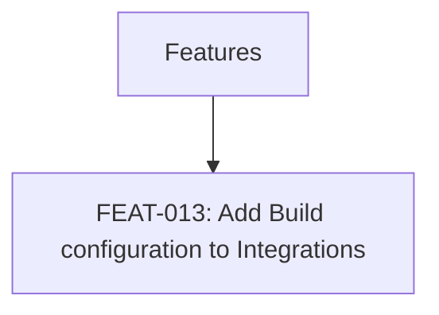

# FEATURES: Angel's Project Manager

> Managed document. Must comply with template FEATURES.template.md.

<!-- APM:DATA
{
  "docType": "features",
  "version": 1,
  "features": [
    {
      "id": "feature-1776794268106-3qu3rl4",
      "projectId": "1772489365575-mj2xfcm",
      "code": "FEAT-013",
      "title": "Add Build configuration to Integrations",
      "summary": "Add build script support for configurations for projects, such as Vercel and Docker.",
      "description": "Add build script support for configurations for projects, such as Vercel and Docker.",
      "category": null,
      "priority": "medium",
      "dueDate": null,
      "assignedTo": null,
      "startDate": null,
      "endDate": null,
      "status": "planned",
      "taskStatus": "todo",
      "roadmapPhaseId": null,
      "taskId": "task-1776794268085-1r0wzt2",
      "planningBucket": "considered",
      "workItemType": "software_feature",
      "itemType": "feature",
      "dependencyIds": [],
      "affectedModuleKeys": [],
      "progress": 0,
      "milestone": false,
      "sortOrder": 0,
      "archived": false,
      "createdAt": "2026-04-21T17:57:48.085Z",
      "updatedAt": "2026-04-21T17:57:48.086Z"
    }
  ],
  "mermaid": "flowchart TD\n  features[\"Features\"]\n  features --\u003e feature_feature_1776794268106_3qu3rl4[\"FEAT-013: Add Build configuration to Integrations\"]"
}
-->

## Planned Features

### FEAT-013: Add Build configuration to Integrations

- Status: planned
- Roadmap Phase: Unassigned
- Linked Task: task-1776794268085-1r0wzt2
- Summary: Add build script support for configurations for projects, such as Vercel and Docker.

> AI Agent instruction: When this feature is implemented, create or update the matching PRD fragment in the database first, keep the fragment compliant with PRD_FRAGMENT.template.md, and let the PRD module merge it into PRD.md.

## Mermaid

