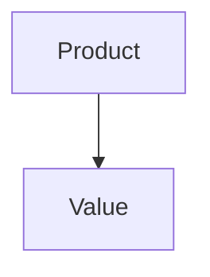

# PRD: Angel's Project Manager

> Managed document. Must comply with template PRD.template.md.

<!-- APM:DATA
{
  "docType": "prd",
  "version": 1,
  "markdown": "# Product Requirements Document: Angel's Project Manager\n\n## 1. Executive Summary\n\n<\u0021--\nAPM-ID: prd-executive-summary-executive-summary\nAPM-LAST-UPDATED: 2026-04-04\n--\u003e\n\nAngel's Project Manager should explicitly preserve the developer-operational requirements that remain part of the product baseline, especially around project launch, SFTP workflows, and file/path selection ergonomics.\n\n_Last updated: 2026-04-04_\n\n## 2. Product Overview\n\n### 2.1 Product Name\n\n<\u0021--\nAPM-ID: prd-product-overview-product-name-product-name\nAPM-LAST-UPDATED: 2026-04-04\n--\u003e\n\nAngel's Project Manager\n\n### 2.2 Product Vision\n\n<\u0021--\nAPM-ID: prd-product-overview-product-vision-product-vision\nAPM-LAST-UPDATED: 2026-04-04\n--\u003e\n\nAngel's Project Manager should be the operational home for a builder's work. The product is meant to reduce context switching by combining project access, roadmap planning, execution tracking, generated documentation, and AI collaboration into a single desktop workspace that stays grounded in local project files and durable structured data.\n\n_Last updated: 2026-04-04_\n\n### 2.3 Target Audience\n\n<\u0021--\nAPM-ID: prd-product-overview-target-audience-solo-developers-and-technical-builders-who-manage-multiple\nAPM-LAST-UPDATED: 2026-04-04\n--\u003e\n- Solo developers and technical builders who manage multiple local projects and need fast access to both project files and project planning. (Updated 2026-04-04)\n<\u0021--\nAPM-ID: prd-product-overview-target-audience-ai-assisted-builders-who-want-application-managed-markdown-fragments-and\n--\u003e\n- AI-assisted builders who want application-managed markdown, fragments, and templates so agents can contribute safely without breaking core project documents.\n<\u0021--\nAPM-ID: prd-product-overview-target-audience-project-owners-and-technical-leads-who-need-roadmap\n--\u003e\n- Project owners and technical leads who need roadmap, tasks, bugs, features, PRD content, and integrations to stay aligned in one tool instead of across disconnected systems.\n\n### 2.4 Key Value Propositions\n\n<\u0021--\nAPM-ID: prd-product-overview-key-value-propositions-one-operational-workspace-project-launching-planning-execution-tracking\n--\u003e\n- One operational workspace: project launching, planning, execution tracking, and documentation all live in the same application.\n<\u0021--\nAPM-ID: prd-product-overview-key-value-propositions-local-first-control-the-product-works-against-local-folders\n--\u003e\n- Local-first control: the product works against local folders, local docs, and a local SQLite database rather than requiring a hosted planning service.\n<\u0021--\nAPM-ID: prd-product-overview-key-value-propositions-reliable-documentation-generation-roadmap-md-features-md-bugs-md-prd-md-and\n--\u003e\n- Reliable documentation generation: ROADMAP.md, FEATURES.md, BUGS.md, PRD.md, and fragment files are reproducible outputs of managed application state.\n<\u0021--\nAPM-ID: prd-product-overview-key-value-propositions-safe-ai-collaboration-agents-can-propose-changes-through\n--\u003e\n- Safe AI collaboration: agents can propose changes through fragments and template-compliant markdown instead of editing canonical planning documents directly.\n\n## 3. Functional Requirements\n\n### 3.1 Workflows\n\n<\u0021--\nAPM-ID: prd-functional-requirements-workflows-users-create-and-organize-projects-choose-how-a\nAPM-LAST-UPDATED: 2026-04-05\n--\u003e\n\n#### 3.1.1 Create, organize, and launch projects\n\nUsers create and organize projects, choose how a project should open, and launch project resources in tools such as Cursor, VS Code, Chrome, or the file system.\n\n- Version Date: 2026-04-05\n\n<\u0021--\nAPM-ID: prd-functional-requirements-workflows-on-startup-the-application-prepares-the-sqlite-database\nAPM-LAST-UPDATED: 2026-04-05\n--\u003e\n\n#### 3.1.2 Initialize SQLite and import legacy projects\n\nOn startup, the application prepares the SQLite database automatically, runs migrations, and imports legacy JSON content when a project is still using the earlier storage model.\n\n- Version Date: 2026-04-05\n\n<\u0021--\nAPM-ID: prd-functional-requirements-workflows-folder-based-projects-open-into-a-workspace-centered-on\nAPM-LAST-UPDATED: 2026-04-05\n--\u003e\n\n#### 3.1.3 Open folder projects into the roadmap workspace\n\nFolder-based projects open into a workspace centered on Roadmap, with additional Board, Gantt, Features, Bugs, PRD, and Integrations views available as part of project work.\n\n- Version Date: 2026-04-05\n\n<\u0021--\nAPM-ID: prd-functional-requirements-workflows-features-and-bugs-are-managed-as-task-backed-work\nAPM-LAST-UPDATED: 2026-04-05\n--\u003e\n\n#### 3.1.4 Manage features and bugs as task-backed work\n\nFeatures and bugs are managed as task-backed work items, allowing the same underlying work to participate in roadmap planning, bucket assignment, board workflows, and timeline scheduling.\n\n- Version Date: 2026-04-05\n\n<\u0021--\nAPM-ID: prd-functional-requirements-workflows-the-application-generates-and-reconciles-managed-markdown-documents\nAPM-LAST-UPDATED: 2026-04-05\n--\u003e\n\n#### 3.1.5 Regenerate managed docs from database state\n\nThe application generates and reconciles managed markdown documents for roadmap, feature, bug, and PRD workflows so project documentation can be rebuilt from the database if files are missing or stale.\n\n- Version Date: 2026-04-05\n\n<\u0021--\nAPM-ID: prd-functional-requirements-workflows-prd-and-roadmap-changes-can-be-proposed-through\nAPM-LAST-UPDATED: 2026-04-05\n--\u003e\n\n#### 3.1.6 Review and integrate planning fragments\n\nPRD and roadmap changes can be proposed through fragments, reviewed in the application, and then merged or integrated in a controlled way.\n\n- Version Date: 2026-04-05\n\n### 3.2 User Actions\n\n<\u0021--\nAPM-ID: prd-functional-requirements-user-actions-create-and-organize-local-folder-and-url-projects\nAPM-LAST-UPDATED: 2026-04-05\n--\u003e\n\n#### 3.2.1 Create and manage folder and URL projects\n\nCreate and organize local folder and URL projects with categories, tags, descriptions, links, images, and configurable launch actions.\n\n- Version Date: 2026-04-05\n\n<\u0021--\nAPM-ID: prd-functional-requirements-user-actions-search-sort-group-pin-and-switch-between-list\nAPM-LAST-UPDATED: 2026-04-05\n--\u003e\n\n#### 3.2.2 Search, sort, and switch workspace views\n\nSearch, sort, group, pin, and switch between list and grid presentations in the project workspace.\n\n- Version Date: 2026-04-05\n\n<\u0021--\nAPM-ID: prd-functional-requirements-user-actions-configure-multiple-sftp-servers-per-project-test-connections\nAPM-LAST-UPDATED: 2026-04-05\n--\u003e\n\n#### 3.2.3 Configure and test project SFTP servers\n\nConfigure multiple SFTP servers per project, test connections before use, and manage named upload and download mapping groups. Mapping semantics should stay explicit: file-to-file replaces the file, folder-to-folder replaces the folder contents at the target path, and file-to-folder copies the file into the selected folder.\n\n- Version Date: 2026-04-05\n\n<\u0021--\nAPM-ID: prd-functional-requirements-user-actions-choose-project-paths-link-paths-data-directories-log\nAPM-LAST-UPDATED: 2026-04-05\n--\u003e\n\n#### 3.2.4 Choose project and application paths\n\nChoose project paths, link paths, data directories, log directories, fragments directories, and related file system locations through a reusable path picker instead of manual typing alone.\n\n- Version Date: 2026-04-05\n\n<\u0021--\nAPM-ID: prd-functional-requirements-user-actions-open-project-resources-in-cursor-vs-code-chrome\nAPM-LAST-UPDATED: 2026-04-05\n--\u003e\n\n#### 3.2.5 Open project resources in external tools\n\nOpen project resources in Cursor, VS Code, Chrome, the default browser, the default file handler, or the system explorer from the application shell.\n\n- Version Date: 2026-04-05\n\n<\u0021--\nAPM-ID: prd-functional-requirements-user-actions-enter-a-project-workspace-review-roadmap-state-and\nAPM-LAST-UPDATED: 2026-04-05\n--\u003e\n\n#### 3.2.6 Enter the workspace and manage roadmap state\n\nEnter a project workspace, review roadmap state, and move planned work between Considered, Planned, and explicit roadmap phases.\n\n- Version Date: 2026-04-05\n\n<\u0021--\nAPM-ID: prd-functional-requirements-user-actions-edit-prd-content-inspect-fragments-and-preview-markdown\nAPM-LAST-UPDATED: 2026-04-05\n--\u003e\n\n#### 3.2.7 Edit PRD content and review generated output\n\nEdit PRD content, inspect fragments, and preview markdown and Mermaid output before integrating canonical document updates.\n\n- Version Date: 2026-04-05\n\n### 3.3 System Behaviors\n\n<\u0021--\nAPM-ID: prd-functional-requirements-system-behaviors-the-system-must-treat-sqlite-as-the-source\n--\u003e\n\n#### 3.3.1 Must treat SQLite as the source of truth\n\nThe system must treat SQLite as the source of truth for projects, credentials, tasks, roadmap phases, features, bugs, fragments, generated document metadata, and integration state.\n\n<\u0021--\nAPM-ID: prd-functional-requirements-system-behaviors-the-system-must-run-startup-migrations-automatically-and\n--\u003e\n\n#### 3.3.2 Must run startup migrations automatically and bootstrap\n\nThe system must run startup migrations automatically and bootstrap from legacy JSON only when the database has not already taken over persistence.\n\n<\u0021--\nAPM-ID: prd-functional-requirements-system-behaviors-the-system-must-reconcile-generated-markdown-through-managed\n--\u003e\n\n#### 3.3.3 Must reconcile generated markdown through managed payloads\n\nThe system must reconcile generated markdown through managed payloads, timestamps, and md5 hashes so file changes can be imported intentionally and missing files can be regenerated safely.\n\n<\u0021--\nAPM-ID: prd-functional-requirements-system-behaviors-the-system-must-preserve-stable-ids-and-tracking\nAPM-LAST-UPDATED: 2026-04-04\n--\u003e\n\n#### 3.3.4 Preserve stable IDs across tracked work\n\nThe system must preserve stable IDs and tracking codes across roadmap items, work items, and fragments so documents and UI views stay cross-referenceable.\n\n- Version Date: 2026-04-04\n\n<\u0021--\nAPM-ID: prd-functional-requirements-system-behaviors-the-system-must-preserve-history-for-archived-work\n--\u003e\n\n#### 3.3.5 Must preserve history for archived work items\n\nThe system must preserve history for archived work items and merged or integrated fragments so prior planning and documentation decisions remain reviewable.\n\n## 4. Non-Functional Requirements\n\n### 4.1 Usability\n\n<\u0021--\nAPM-ID: prd-non-functional-requirements-usability-usability\nAPM-LAST-UPDATED: 2026-04-04\n--\u003e\n\nAngel's Project Manager should keep explicit labels, discoverable path-selection controls, and consistent modal-based editing so users do not have to guess what a field or setting is for.\n\n### 4.2 Reliability\n\n<\u0021--\nAPM-ID: prd-non-functional-requirements-reliability-reliability\nAPM-LAST-UPDATED: 2026-04-04\n--\u003e\n\nThe application should remain dependable when project roots move, when managed markdown files are missing, and when older JSON-based projects are opened for the first time. Database-backed reconciliation should make it possible to reconstruct current documentation and planning state from SQLite.\n\n### 4.3 Accessibility\n\n<\u0021--\nAPM-ID: prd-non-functional-requirements-accessibility-accessibility\nAPM-LAST-UPDATED: 2026-04-04\n--\u003e\n\nThe interface should remain readable and understandable across desktop-sized and smaller layouts, with clear labels, explicit controls, and modal-based detail views. Accessibility support exists at a practical baseline today, but deeper keyboard support for planner interactions and more systematic semantic coverage remain follow-up improvements rather than completed guarantees.\n\n### 4.4 Security\n\n<\u0021--\nAPM-ID: prd-non-functional-requirements-security-security\nAPM-LAST-UPDATED: 2026-04-04\n--\u003e\n\nSensitive credentials and integration secrets should be encrypted before being stored in SQLite. Canonical secrets should never depend on generated markdown, and integration settings should avoid sending stored secret values back to the UI in plaintext.\n\n### 4.5 Performance\n\n<\u0021--\nAPM-ID: prd-non-functional-requirements-performance-performance\nAPM-LAST-UPDATED: 2026-04-04\n--\u003e\n\nAngel's Project Manager should continue to meet a practical desktop performance bar: startup should feel near-immediate in normal local use, the local server should initialize quickly enough that the workspace is usable within a few seconds, directory browsing should remain responsive for typical developer project trees, and long-running SFTP transfers should surface progress without blocking the interface.\n\n_Last updated: 2026-04-04_\n\n## 5. Technical Architecture\n\n<\u0021--\nAPM-ID: prd-technical-architecture-generated-markdown-remains-derived-output-while-sqlite-remains\nAPM-LAST-UPDATED: 2026-04-05\n--\u003e\n\n#### 5.1 Use SQLite as source of truth for generated docs\n\nGenerated markdown remains derived output, while SQLite remains the structured source of truth for application state.\n\n- Version Date: 2026-04-05\n\n<\u0021--\nAPM-ID: prd-technical-architecture-operational-project-artifacts-such-as-templates-and-ai\nAPM-LAST-UPDATED: 2026-04-05\n--\u003e\n\n#### 5.2 Store operational artifacts under .apm\n\nOperational project artifacts such as templates and AI scratch files should live under `.apm`, not inside the human-facing docs output.\n\n- Version Date: 2026-04-05\n\n<\u0021--\nAPM-ID: prd-technical-architecture-sftp-file-launch-actions-and-path-picking-behavior-are-part\nAPM-LAST-UPDATED: 2026-04-05\n--\u003e\n\n#### 5.3 Keep SFTP and path management first-class\n\nSFTP, file-launch actions, and path-picking behavior are part of the core desktop workflow and should remain first-class capabilities in the product architecture.\n\n- Version Date: 2026-04-05\n\n## 6. Implementation Plan\n\n### 6.1 Sequencing\n\n<\u0021--\nAPM-ID: prd-implementation-plan-sequencing-the-current-baseline-already-includes-the-storage-migration\nAPM-LAST-UPDATED: 2026-04-05\n--\u003e\n\n#### 6.1.1 Build on the database-first foundation\n\nThe current baseline already includes the storage migration to SQLite, the roadmap-centered workspace, task-backed bug and feature tracking, and fragment-driven roadmap and PRD workflows.\n\n- Version Date: 2026-04-05\n\n<\u0021--\nAPM-ID: prd-implementation-plan-sequencing-the-next-sequence-should-focus-on-improving-document\nAPM-LAST-UPDATED: 2026-04-05\n--\u003e\n\n#### 6.1.2 Polish documentation on the stable foundation\n\nThe next sequence should focus on improving document completeness and workflow polish on top of that stable database-first foundation rather than introducing new parallel sources of truth.\n\n- Version Date: 2026-04-05\n\n<\u0021--\nAPM-ID: prd-implementation-plan-sequencing-future-product-work-should-continue-to-follow-the\nAPM-LAST-UPDATED: 2026-04-05\n--\u003e\n\n#### 6.1.3 Persist structured state before document regeneration\n\npersist structured state first, then regenerate or reconcile markdown artifacts from that state.\n\n- Version Date: 2026-04-05\n\n### 6.2 Dependencies\n\n<\u0021--\nAPM-ID: prd-implementation-plan-dependencies-roadmap-feature-bug-and-prd-workflows-depend-on\nAPM-LAST-UPDATED: 2026-04-05\n--\u003e\n\n#### 6.2.1 Protect migrations and reconciliation metadata\n\nRoadmap, feature, bug, and PRD workflows depend on the migration system, SQLite schema, and document reconciliation metadata staying correct.\n\n- Version Date: 2026-04-05\n\n<\u0021--\nAPM-ID: prd-implementation-plan-dependencies-prd-quality-depends-on-roadmap-and-work-item-accuracy\nAPM-LAST-UPDATED: 2026-04-05\n--\u003e\n\n#### 6.2.2 Keep PRD quality tied to roadmap and work-item accuracy\n\nPRD quality depends on roadmap and work-item accuracy because roadmap planning and feature or bug state already influence generated PRD guidance.\n\n- Version Date: 2026-04-05\n\n<\u0021--\nAPM-ID: prd-implementation-plan-dependencies-portable-build-reliability-depends-on-electron-packaging-and\nAPM-LAST-UPDATED: 2026-04-05\n--\u003e\n\n#### 6.2.3 Maintain packaging compatibility with native SQLite\n\nPortable build reliability depends on Electron packaging and native SQLite runtime compatibility continuing to align.\n\n- Version Date: 2026-04-05\n\n### 6.3 Milestones\n\n<\u0021--\nAPM-ID: prd-implementation-plan-milestones-the-current-product-milestone-is-a-usable-first-iteration\nAPM-LAST-UPDATED: 2026-04-04\n--\u003e\n\n#### 6.3.1 Reach the usable first-iteration workspace milestone\n\nThe current product milestone is a usable first-iteration workspace that already supports roadmap planning, bug and feature management, PRD workflows, and document generation.\n\n- Version Date: 2026-04-04\n\n<\u0021--\nAPM-ID: prd-implementation-plan-milestones-the-active-roadmap-milestone-remains-phase-1-completion\nAPM-LAST-UPDATED: 2026-04-04\n--\u003e\n\n#### 6.3.2 Close the Phase 1 completion milestone\n\nThe active roadmap milestone remains Phase 1 completion, targeted for 2026-05-01.\n\n- Version Date: 2026-04-04\n\n<\u0021--\nAPM-ID: prd-implementation-plan-milestones-near-term-product-milestones-should-focus-on-closing-active\nAPM-LAST-UPDATED: 2026-04-04\n--\u003e\n\n#### 6.3.3 Close polish bugs and mature roadmap-first planning\n\nNear-term product milestones should focus on closing active polish bugs, improving PRD completeness, and continuing to mature roadmap-first planning behavior.\n\n- Version Date: 2026-04-04\n\n## 7. Success Metrics\n\n<\u0021--\nAPM-ID: prd-success-metrics-users-can-configure-and-test-an-sftp-connection\nAPM-LAST-UPDATED: 2026-04-04\n--\u003e\n\n#### 7.1 Test SFTP without leaving the app\n\nUsers can configure and test an SFTP connection without leaving the application.\n\n- Version Date: 2026-04-04\n\n<\u0021--\nAPM-ID: prd-success-metrics-users-can-select-required-project-and-settings-paths\nAPM-LAST-UPDATED: 2026-04-04\n--\u003e\n\n#### 7.2 Use the path picker for required project paths\n\nUsers can select required project and settings paths through the path picker instead of manual path entry.\n\n- Version Date: 2026-04-04\n\n<\u0021--\nAPM-ID: prd-success-metrics-project-launch-directory-browsing-and-workspace-transitions-remain\nAPM-LAST-UPDATED: 2026-04-04\n--\u003e\n\n#### 7.3 Keep launch and navigation responsive\n\nProject launch, directory browsing, and workspace transitions remain responsive during normal desktop use.\n\n- Version Date: 2026-04-04\n\n## 8. Risks and Mitigations\n\n<\u0021--\nAPM-ID: prd-risks-and-mitigations-prd-specificity-drift\n--\u003e\n\n### 8.1 PRD Specificity Drift\n\n- Mitigation: keep explicit operational requirements such as path picking, SFTP testing, launch actions, and desktop responsiveness inside the canonical PRD instead of leaving them only in legacy planning documents.\n\n## 9. Future Enhancements\n\nPlanned and implemented feature work is tracked in FEATURES.md. Keep only product-facing future references here when they materially affect the product definition.\n\n<\u0021--\nAPM-ID: prd-future-enhancements-feat-002-ui-design-for-prd-tab\n--\u003e\n\n#### 9.1 FEAT-002: UI Design for PRD tab\n\nImplement UI interaction for the PRD tab so that a user can actually edit the items.\n\n<\u0021--\nAPM-ID: prd-future-enhancements-textbox-to-add-update-executive-summar\n--\u003e\n\n#### 9.2 Textbox to add/update Executive Summar\n\n<\u0021--\nAPM-ID: prd-future-enhancements-panel-for-writing-up-the-product-overview\n--\u003e\n\n#### 9.3 Panel for writing up the Product overview\n\nPanel for writing up the Product overview - put an info icon for each subsection here on how to write out what is needed.\n\n<\u0021--\nAPM-ID: prd-future-enhancements-functional-requirements-the-ui-ability-to-create-workflows\n--\u003e\n\n#### 9.4 Functional requirements.\n\nFunctional requirements.  The UI ability to create workflows, define user actions, and system behaviors easily (something beyond just a text box).  And make sure there is a way to organize it so that when the md file is generated it will automatically be organized correctly.  Remember this needs to be robust enough that an AI agent can generate a product from this document. Info graph icon that when hovered over explains how to use it.  Represent them with icons.\n\n<\u0021--\nAPM-ID: prd-future-enhancements-non-funcitonal-requirements-a-ui-that-helps-describe-usability\n--\u003e\n\n#### 9.5 Non-funcitonal requirements\n\nNon-funcitonal requirements: a UI that helps describe usability, reliability, accessibility, and security, and performance. Represent them with icons, and a smart UI to design the features.\n\n<\u0021--\nAPM-ID: prd-future-enhancements-a-ui-friendly-way-that-moves-being-text\n--\u003e\n\n#### 9.6 UI friendly way\n\nA UI friendly way that moves being text boxes to describe the expected technical shape at a high level.\n\n<\u0021--\nAPM-ID: prd-future-enhancements-implementation-plan-ux-ui-friendly-way-of-writing\n--\u003e\n\n#### 9.7 Implementation plan - UX/UI friendly way of writing\n\nImplementation plan - UX/UI friendly way of writing up Sequencing, organizing dependencies, and milestones.  This should hook into Roadmap Module.\n\n<\u0021--\nAPM-ID: prd-future-enhancements-success-metrics-ui-ux-items-that-help-define-how\n--\u003e\n\n#### 9.8 Success Metrics.\n\nSuccess Metrics.  UI/UX items that help define how metrics will be measured.\n\n<\u0021--\nAPM-ID: prd-future-enhancements-risks-and-mitigations-being-able-to-add\n--\u003e\n\n#### 9.9 Risks and Mitigations - being able to add\n\nRisks and Mitigations - being able to add to a list\n\n<\u0021--\nAPM-ID: prd-future-enhancements-future-enhancments-this-will-be-reflect-in-the\n--\u003e\n\n#### 9.10 Future enhancments.\n\nFuture enhancments.  This will be reflect in the Roadmap.\n\n<\u0021--\nAPM-ID: prd-future-enhancements-applied-fragments-section-the-goal-of-this-section\n--\u003e\n\n#### 9.11 Applied Fragments section\n\nApplied Fragments section: The goal of this section is to purely be able to properly integrate them into the rest of the document, and once finished can be removed.  The AI agent should mark areas in the fragment files that identify where in the PRD file they should be moved to, and in the UI buttons to auto integrate them into the system and document appropriately.  But they should still have not lose their link to a consumed/merged feature fragment file so that we keep a record of what was changed/added.  They move from MERGED state to INTEGRATED.  Merged means they have been saved to the system. Integrated means the information of the feature has been applied to the PRD.  Once this happens it is auto archived and only shows in the subtab \"Archived features\".\n\n<\u0021--\nAPM-ID: prd-future-enhancements-overall-this-also-needs-version-dates-for-every\n--\u003e\n\n#### 9.12 Overall\n\nOverall, this also needs version dates for every item added.\n\n<\u0021--\nAPM-ID: prd-future-enhancements-features-should-be-automatically-be-added-to-the\n--\u003e\n\n#### 9.13 Features should be automatically be added\n\nFeatures should be automatically be added to the Roadmap, in a section under Phases \"Considered Features\" that appear at the very end.\n\n<\u0021--\nAPM-ID: prd-future-enhancements-if-a-feature-is-created-it-is-automatically\n--\u003e\n\n#### 9.14 If a feature is created\n\nIf a feature is created, it is automatically added to the \"Planned Features\" which is another phase that appears above \"Considered Features in the roadmap.  These function as buckets to pull from when we are deciding phases/milestones.  Planned Features are features that are merged into the Features document.\n\n<\u0021--\nAPM-ID: prd-future-enhancements-feat-003-new-module-for-ux-ui-design\n--\u003e\n\n#### 9.15 FEAT-003: New Module for UX/UI Design\n\nI need a generic UI/UX generator that generates an MDX file for Markdown, JSON/Tokens/JSX Components.\n\n<\u0021--\nAPM-ID: prd-future-enhancements-the-module-should-let-me-create-the-standard\n--\u003e\n\n#### 9.16 Module should let me create the standard UI\n\nThe module should let me create the standard UI components, and enable me to define common UX behavior.  Generates an MDX file.\n\n<\u0021--\nAPM-ID: prd-future-enhancements-feat-001-database-module-has-a-way-of-selecting\n--\u003e\n\n#### 9.17 FEAT-001: Database Module has a way of selecting known persistent modules\n\nDatabase Module needs a way to specify persistence models.  Now that it supports dbml, we should be able to generate a selected type of db with it, if it doesn't exist.  It should also be able to support a path to either reference or generate to (sometimes I already have a database - I just need to make sure documentation is set with it).\n\n<\u0021--\nAPM-ID: prd-future-enhancements-feat-001-database-module-has-a-way-of-selecting\n--\u003e\n\n#### 9.18 FEAT-001: Database Module has a way of selecting known persistent modules\n\nDatabase Module needs a way to specify persistence models.  Now that it supports dbml, we should be able to generate a selected type of db with it, if it doesn't exist.  It should also be able to support a path to either reference or generate to (sometimes I already have a database - I just need to make sure documentation is set with it).\n\n<\u0021--\nAPM-ID: prd-future-enhancements-feat-004-new-module-for-ux-ui-design\n--\u003e\n\n#### 9.19 FEAT-004: New Module for UX/UI Design\n\nI need a generic UI/UX generator that generates an MDX file for Markdown, JSON/Tokens/JSX Components.\n\n<\u0021--\nAPM-ID: prd-future-enhancements-the-module-should-let-me-create-the-standard\n--\u003e\n\n#### 9.20 Module should let me create the standard UI\n\nThe module should let me create the standard UI components, and enable me to define common UX behavior.  Generates an MDX file.\n\n<\u0021--\nAPM-ID: prd-future-enhancements-feat-003-ui-design-for-prd-tab\n--\u003e\n\n#### 9.21 FEAT-003: UI Design for PRD tab\n\nImplement UI interaction for the PRD tab so that a user can actually edit the items.\n\n<\u0021--\nAPM-ID: prd-future-enhancements-textbox-to-add-update-executive-summar\n--\u003e\n\n#### 9.22 Textbox to add/update Executive Summar\n\n<\u0021--\nAPM-ID: prd-future-enhancements-panel-for-writing-up-the-product-overview\n--\u003e\n\n#### 9.23 Panel for writing up the Product overview\n\nPanel for writing up the Product overview - put an info icon for each subsection here on how to write out what is needed.\n\n<\u0021--\nAPM-ID: prd-future-enhancements-functional-requirements-the-ui-ability-to-create-workflows\n--\u003e\n\n#### 9.24 Functional requirements.\n\nFunctional requirements.  The UI ability to create workflows, define user actions, and system behaviors easily (something beyond just a text box).  And make sure there is a way to organize it so that when the md file is generated it will automatically be organized correctly.  Remember this needs to be robust enough that an AI agent can generate a product from this document. Info graph icon that when hovered over explains how to use it.  Represent them with icons.\n\n<\u0021--\nAPM-ID: prd-future-enhancements-non-funcitonal-requirements-a-ui-that-helps-describe-usability\n--\u003e\n\n#### 9.25 Non-funcitonal requirements\n\nNon-funcitonal requirements: a UI that helps describe usability, reliability, accessibility, and security, and performance. Represent them with icons, and a smart UI to design the features.\n\n<\u0021--\nAPM-ID: prd-future-enhancements-a-ui-friendly-way-that-moves-being-text\n--\u003e\n\n#### 9.26 UI friendly way\n\nA UI friendly way that moves being text boxes to describe the expected technical shape at a high level.\n\n<\u0021--\nAPM-ID: prd-future-enhancements-implementation-plan-ux-ui-friendly-way-of-writing\n--\u003e\n\n#### 9.27 Implementation plan - UX/UI friendly way of writing\n\nImplementation plan - UX/UI friendly way of writing up Sequencing, organizing dependencies, and milestones.  This should hook into Roadmap Module.\n\n<\u0021--\nAPM-ID: prd-future-enhancements-success-metrics-ui-ux-items-that-help-define-how\n--\u003e\n\n#### 9.28 Success Metrics.\n\nSuccess Metrics.  UI/UX items that help define how metrics will be measured.\n\n<\u0021--\nAPM-ID: prd-future-enhancements-risks-and-mitigations-being-able-to-add\n--\u003e\n\n#### 9.29 Risks and Mitigations - being able to add\n\nRisks and Mitigations - being able to add to a list\n\n<\u0021--\nAPM-ID: prd-future-enhancements-future-enhancments-this-will-be-reflect-in-the\n--\u003e\n\n#### 9.30 Future enhancments.\n\nFuture enhancments.  This will be reflect in the Roadmap.\n\n<\u0021--\nAPM-ID: prd-future-enhancements-applied-fragments-section-the-goal-of-this-section\n--\u003e\n\n#### 9.31 Applied Fragments section\n\nApplied Fragments section: The goal of this section is to purely be able to properly integrate them into the rest of the document, and once finished can be removed.  The AI agent should mark areas in the fragment files that identify where in the PRD file they should be moved to, and in the UI buttons to auto integrate them into the system and document appropriately.  But they should still have not lose their link to a consumed/merged feature fragment file so that we keep a record of what was changed/added.  They move from MERGED state to INTEGRATED.  Merged means they have been saved to the system. Integrated means the information of the feature has been applied to the PRD.  Once this happens it is auto archived and only shows in the subtab \"Archived features\".\n\n<\u0021--\nAPM-ID: prd-future-enhancements-overall-this-also-needs-version-dates-for-every\n--\u003e\n\n#### 9.32 Overall\n\nOverall, this also needs version dates for every item added.\n\n<\u0021--\nAPM-ID: prd-future-enhancements-features-should-be-automatically-be-added-to-the\n--\u003e\n\n#### 9.33 Features should be automatically be added\n\nFeatures should be automatically be added to the Roadmap, in a section under Phases \"Considered Features\" that appear at the very end.\n\n<\u0021--\nAPM-ID: prd-future-enhancements-if-a-feature-is-created-it-is-automatically\n--\u003e\n\n#### 9.34 If a feature is created\n\nIf a feature is created, it is automatically added to the \"Planned Features\" which is another phase that appears above \"Considered Features in the roadmap.  These function as buckets to pull from when we are deciding phases/milestones.  Planned Features are features that are merged into the Features document.\n\n## 10. Applied Fragments\n\n### 10.1 PRD Title Cleanup\n\n- Status: integrated\n- Source File: PRD_FRAGMENT_20260404_title_cleanup_001.md\n- Version Date: 2026-04-04\n\n> Managed document. Must comply with template PRD_FRAGMENT.template.md.\n\n### 10.2 PRD Title Alignment Pass\n\n- Status: integrated\n- Source File: PRD_FRAGMENT_20260405_title_alignment_002.md\n- Version Date: 2026-04-05\n\n> Managed document. Must comply with template PRD_FRAGMENT.template.md.\n\n### 10.3 Future Enhancements Cleanup For Migrated AI And Architecture Rules\n\n- Status: integrated\n- Source File: PRD_FRAGMENT_20260404_223302279.md\n- Version Date: 2026-04-05\n\n<\u0021-- APM:DATA\n\n## 11. Conclusion\n\nPending conclusion.",
  "mermaid": "flowchart TD\n  product[\"Product\"] --\u003e value[\"Value\"]",
  "editorState": {
    "executiveSummary": {
      "text": "Angel's Project Manager should explicitly preserve the developer-operational requirements that remain part of the product baseline, especially around project launch, SFTP workflows, and file/path selection ergonomics.",
      "versionDate": "2026-04-04T16:52:21.978Z",
      "stableId": "prd-executive-summary-executive-summary",
      "sourceRefs": []
    },
    "productOverview": {
      "productName": "Angel's Project Manager",
      "vision": "Angel's Project Manager should be the operational home for a builder's work. The product is meant to reduce context switching by combining project access, roadmap planning, execution tracking, generated documentation, and AI collaboration into a single desktop workspace that stays grounded in local project files and durable structured data.",
      "targetAudiences": [
        {
          "text": "Solo developers and technical builders who manage multiple local projects and need fast access to both project files and project planning.",
          "versionDate": "2026-04-04T16:52:16.845Z",
          "stableId": "prd-product-overview-target-audience-solo-developers-and-technical-builders-who-manage-multiple",
          "sourceRefs": []
        },
        {
          "text": "AI-assisted builders who want application-managed markdown, fragments, and templates so agents can contribute safely without breaking core project documents.",
          "versionDate": "",
          "stableId": "prd-product-overview-target-audience-ai-assisted-builders-who-want-application-managed-markdown-fragments-and",
          "sourceRefs": []
        },
        {
          "text": "Project owners and technical leads who need roadmap, tasks, bugs, features, PRD content, and integrations to stay aligned in one tool instead of across disconnected systems.",
          "versionDate": "",
          "stableId": "prd-product-overview-target-audience-project-owners-and-technical-leads-who-need-roadmap",
          "sourceRefs": []
        }
      ],
      "keyValueProps": [
        {
          "text": "One operational workspace: project launching, planning, execution tracking, and documentation all live in the same application.",
          "versionDate": "",
          "stableId": "prd-product-overview-key-value-propositions-one-operational-workspace-project-launching-planning-execution-tracking",
          "sourceRefs": []
        },
        {
          "text": "Local-first control: the product works against local folders, local docs, and a local SQLite database rather than requiring a hosted planning service.",
          "versionDate": "",
          "stableId": "prd-product-overview-key-value-propositions-local-first-control-the-product-works-against-local-folders",
          "sourceRefs": []
        },
        {
          "text": "Reliable documentation generation: ROADMAP.md, FEATURES.md, BUGS.md, PRD.md, and fragment files are reproducible outputs of managed application state.",
          "versionDate": "",
          "stableId": "prd-product-overview-key-value-propositions-reliable-documentation-generation-roadmap-md-features-md-bugs-md-prd-md-and",
          "sourceRefs": []
        },
        {
          "text": "Safe AI collaboration: agents can propose changes through fragments and template-compliant markdown instead of editing canonical planning documents directly.",
          "versionDate": "",
          "stableId": "prd-product-overview-key-value-propositions-safe-ai-collaboration-agents-can-propose-changes-through",
          "sourceRefs": []
        }
      ],
      "versionDate": "2026-04-04T16:52:21.978Z",
      "itemIds": {
        "productName": "prd-product-overview-product-name-product-name",
        "vision": "prd-product-overview-product-vision-product-vision"
      },
      "itemSourceRefs": {
        "productName": [],
        "vision": []
      }
    },
    "functionalRequirements": {
      "workflows": [
        {
          "title": "Create, organize, and launch projects",
          "description": "Users create and organize projects, choose how a project should open, and launch project resources in tools such as Cursor, VS Code, Chrome, or the file system.",
          "versionDate": "2026-04-05",
          "stableId": "prd-functional-requirements-workflows-users-create-and-organize-projects-choose-how-a",
          "sourceRefs": []
        },
        {
          "title": "Initialize SQLite and import legacy projects",
          "description": "On startup, the application prepares the SQLite database automatically, runs migrations, and imports legacy JSON content when a project is still using the earlier storage model.",
          "versionDate": "2026-04-05",
          "stableId": "prd-functional-requirements-workflows-on-startup-the-application-prepares-the-sqlite-database",
          "sourceRefs": []
        },
        {
          "title": "Open folder projects into the roadmap workspace",
          "description": "Folder-based projects open into a workspace centered on Roadmap, with additional Board, Gantt, Features, Bugs, PRD, and Integrations views available as part of project work.",
          "versionDate": "2026-04-05",
          "stableId": "prd-functional-requirements-workflows-folder-based-projects-open-into-a-workspace-centered-on",
          "sourceRefs": []
        },
        {
          "title": "Manage features and bugs as task-backed work",
          "description": "Features and bugs are managed as task-backed work items, allowing the same underlying work to participate in roadmap planning, bucket assignment, board workflows, and timeline scheduling.",
          "versionDate": "2026-04-05",
          "stableId": "prd-functional-requirements-workflows-features-and-bugs-are-managed-as-task-backed-work",
          "sourceRefs": []
        },
        {
          "title": "Regenerate managed docs from database state",
          "description": "The application generates and reconciles managed markdown documents for roadmap, feature, bug, and PRD workflows so project documentation can be rebuilt from the database if files are missing or stale.",
          "versionDate": "2026-04-05",
          "stableId": "prd-functional-requirements-workflows-the-application-generates-and-reconciles-managed-markdown-documents",
          "sourceRefs": []
        },
        {
          "title": "Review and integrate planning fragments",
          "description": "PRD and roadmap changes can be proposed through fragments, reviewed in the application, and then merged or integrated in a controlled way.",
          "versionDate": "2026-04-05",
          "stableId": "prd-functional-requirements-workflows-prd-and-roadmap-changes-can-be-proposed-through",
          "sourceRefs": []
        }
      ],
      "userActions": [
        {
          "title": "Create and manage folder and URL projects",
          "description": "Create and organize local folder and URL projects with categories, tags, descriptions, links, images, and configurable launch actions.",
          "versionDate": "2026-04-05",
          "stableId": "prd-functional-requirements-user-actions-create-and-organize-local-folder-and-url-projects",
          "sourceRefs": []
        },
        {
          "title": "Search, sort, and switch workspace views",
          "description": "Search, sort, group, pin, and switch between list and grid presentations in the project workspace.",
          "versionDate": "2026-04-05",
          "stableId": "prd-functional-requirements-user-actions-search-sort-group-pin-and-switch-between-list",
          "sourceRefs": []
        },
        {
          "title": "Configure and test project SFTP servers",
          "description": "Configure multiple SFTP servers per project, test connections before use, and manage named upload and download mapping groups. Mapping semantics should stay explicit: file-to-file replaces the file, folder-to-folder replaces the folder contents at the target path, and file-to-folder copies the file into the selected folder.",
          "versionDate": "2026-04-05",
          "stableId": "prd-functional-requirements-user-actions-configure-multiple-sftp-servers-per-project-test-connections",
          "sourceRefs": []
        },
        {
          "title": "Choose project and application paths",
          "description": "Choose project paths, link paths, data directories, log directories, fragments directories, and related file system locations through a reusable path picker instead of manual typing alone.",
          "versionDate": "2026-04-05",
          "stableId": "prd-functional-requirements-user-actions-choose-project-paths-link-paths-data-directories-log",
          "sourceRefs": []
        },
        {
          "title": "Open project resources in external tools",
          "description": "Open project resources in Cursor, VS Code, Chrome, the default browser, the default file handler, or the system explorer from the application shell.",
          "versionDate": "2026-04-05",
          "stableId": "prd-functional-requirements-user-actions-open-project-resources-in-cursor-vs-code-chrome",
          "sourceRefs": []
        },
        {
          "title": "Enter the workspace and manage roadmap state",
          "description": "Enter a project workspace, review roadmap state, and move planned work between Considered, Planned, and explicit roadmap phases.",
          "versionDate": "2026-04-05",
          "stableId": "prd-functional-requirements-user-actions-enter-a-project-workspace-review-roadmap-state-and",
          "sourceRefs": []
        },
        {
          "title": "Edit PRD content and review generated output",
          "description": "Edit PRD content, inspect fragments, and preview markdown and Mermaid output before integrating canonical document updates.",
          "versionDate": "2026-04-05",
          "stableId": "prd-functional-requirements-user-actions-edit-prd-content-inspect-fragments-and-preview-markdown",
          "sourceRefs": []
        }
      ],
      "systemBehaviors": [
        {
          "title": "Must treat SQLite as the source of truth",
          "description": "The system must treat SQLite as the source of truth for projects, credentials, tasks, roadmap phases, features, bugs, fragments, generated document metadata, and integration state.",
          "versionDate": "",
          "stableId": "prd-functional-requirements-system-behaviors-the-system-must-treat-sqlite-as-the-source",
          "sourceRefs": []
        },
        {
          "title": "Must run startup migrations automatically and bootstrap",
          "description": "The system must run startup migrations automatically and bootstrap from legacy JSON only when the database has not already taken over persistence.",
          "versionDate": "",
          "stableId": "prd-functional-requirements-system-behaviors-the-system-must-run-startup-migrations-automatically-and",
          "sourceRefs": []
        },
        {
          "title": "Must reconcile generated markdown through managed payloads",
          "description": "The system must reconcile generated markdown through managed payloads, timestamps, and md5 hashes so file changes can be imported intentionally and missing files can be regenerated safely.",
          "versionDate": "",
          "stableId": "prd-functional-requirements-system-behaviors-the-system-must-reconcile-generated-markdown-through-managed",
          "sourceRefs": []
        },
        {
          "title": "Preserve stable IDs across tracked work",
          "description": "The system must preserve stable IDs and tracking codes across roadmap items, work items, and fragments so documents and UI views stay cross-referenceable.",
          "versionDate": "2026-04-04T19:28:16.740Z",
          "stableId": "prd-functional-requirements-system-behaviors-the-system-must-preserve-stable-ids-and-tracking",
          "sourceRefs": []
        },
        {
          "title": "Must preserve history for archived work items",
          "description": "The system must preserve history for archived work items and merged or integrated fragments so prior planning and documentation decisions remain reviewable.",
          "versionDate": "",
          "stableId": "prd-functional-requirements-system-behaviors-the-system-must-preserve-history-for-archived-work",
          "sourceRefs": []
        }
      ],
      "versionDate": "2026-04-04T16:52:21.978Z"
    },
    "nonFunctionalRequirements": {
      "usability": "Angel's Project Manager should keep explicit labels, discoverable path-selection controls, and consistent modal-based editing so users do not have to guess what a field or setting is for.",
      "reliability": "The application should remain dependable when project roots move, when managed markdown files are missing, and when older JSON-based projects are opened for the first time. Database-backed reconciliation should make it possible to reconstruct current documentation and planning state from SQLite.",
      "accessibility": "The interface should remain readable and understandable across desktop-sized and smaller layouts, with clear labels, explicit controls, and modal-based detail views. Accessibility support exists at a practical baseline today, but deeper keyboard support for planner interactions and more systematic semantic coverage remain follow-up improvements rather than completed guarantees.",
      "security": "Sensitive credentials and integration secrets should be encrypted before being stored in SQLite. Canonical secrets should never depend on generated markdown, and integration settings should avoid sending stored secret values back to the UI in plaintext.",
      "performance": "Angel's Project Manager should continue to meet a practical desktop performance bar: startup should feel near-immediate in normal local use, the local server should initialize quickly enough that the workspace is usable within a few seconds, directory browsing should remain responsive for typical developer project trees, and long-running SFTP transfers should surface progress without blocking the interface.",
      "versionDate": "2026-04-04T16:52:21.978Z",
      "itemIds": {
        "usability": "prd-non-functional-requirements-usability-usability",
        "reliability": "prd-non-functional-requirements-reliability-reliability",
        "accessibility": "prd-non-functional-requirements-accessibility-accessibility",
        "security": "prd-non-functional-requirements-security-security",
        "performance": "prd-non-functional-requirements-performance-performance"
      },
      "itemSourceRefs": {
        "usability": [],
        "reliability": [],
        "accessibility": [],
        "security": [],
        "performance": []
      }
    },
    "technicalArchitecture": [
      {
        "id": "prdi-0-90",
        "title": "Use SQLite as source of truth for generated docs",
        "description": "Generated markdown remains derived output, while SQLite remains the structured source of truth for application state.",
        "versionDate": "2026-04-05",
        "stableId": "prd-technical-architecture-generated-markdown-remains-derived-output-while-sqlite-remains",
        "sourceRefs": []
      },
      {
        "id": "prdi-1-89",
        "title": "Store operational artifacts under .apm",
        "description": "Operational project artifacts such as templates and AI scratch files should live under `.apm`, not inside the human-facing docs output.",
        "versionDate": "2026-04-05",
        "stableId": "prd-technical-architecture-operational-project-artifacts-such-as-templates-and-ai",
        "sourceRefs": []
      },
      {
        "id": "prdi-2-90",
        "title": "Keep SFTP and path management first-class",
        "description": "SFTP, file-launch actions, and path-picking behavior are part of the core desktop workflow and should remain first-class capabilities in the product architecture.",
        "versionDate": "2026-04-05",
        "stableId": "prd-technical-architecture-sftp-file-launch-actions-and-path-picking-behavior-are-part",
        "sourceRefs": []
      }
    ],
    "implementationPlan": {
      "sequencing": [
        {
          "id": "prdi-0-90",
          "title": "Build on the database-first foundation",
          "description": "The current baseline already includes the storage migration to SQLite, the roadmap-centered workspace, task-backed bug and feature tracking, and fragment-driven roadmap and PRD workflows.",
          "versionDate": "2026-04-05",
          "stableId": "prd-implementation-plan-sequencing-the-current-baseline-already-includes-the-storage-migration",
          "sourceRefs": []
        },
        {
          "id": "prdi-1-90",
          "title": "Polish documentation on the stable foundation",
          "description": "The next sequence should focus on improving document completeness and workflow polish on top of that stable database-first foundation rather than introducing new parallel sources of truth.",
          "versionDate": "2026-04-05",
          "stableId": "prd-implementation-plan-sequencing-the-next-sequence-should-focus-on-improving-document",
          "sourceRefs": []
        },
        {
          "id": "prdi-2-74",
          "title": "Persist structured state before document regeneration",
          "description": "persist structured state first, then regenerate or reconcile markdown artifacts from that state.",
          "versionDate": "2026-04-05",
          "stableId": "prd-implementation-plan-sequencing-future-product-work-should-continue-to-follow-the",
          "sourceRefs": []
        }
      ],
      "dependencies": [
        {
          "id": "prdi-0-90",
          "title": "Protect migrations and reconciliation metadata",
          "description": "Roadmap, feature, bug, and PRD workflows depend on the migration system, SQLite schema, and document reconciliation metadata staying correct.",
          "versionDate": "2026-04-05",
          "stableId": "prd-implementation-plan-dependencies-roadmap-feature-bug-and-prd-workflows-depend-on",
          "sourceRefs": []
        },
        {
          "id": "prdi-1-90",
          "title": "Keep PRD quality tied to roadmap and work-item accuracy",
          "description": "PRD quality depends on roadmap and work-item accuracy because roadmap planning and feature or bug state already influence generated PRD guidance.",
          "versionDate": "2026-04-05",
          "stableId": "prd-implementation-plan-dependencies-prd-quality-depends-on-roadmap-and-work-item-accuracy",
          "sourceRefs": []
        },
        {
          "id": "prdi-2-90",
          "title": "Maintain packaging compatibility with native SQLite",
          "description": "Portable build reliability depends on Electron packaging and native SQLite runtime compatibility continuing to align.",
          "versionDate": "2026-04-05",
          "stableId": "prd-implementation-plan-dependencies-portable-build-reliability-depends-on-electron-packaging-and",
          "sourceRefs": []
        }
      ],
      "milestones": [
        {
          "id": "prdi-0-90",
          "title": "Reach the usable first-iteration workspace milestone",
          "description": "The current product milestone is a usable first-iteration workspace that already supports roadmap planning, bug and feature management, PRD workflows, and document generation.",
          "versionDate": "2026-04-04T19:28:16.740Z",
          "stableId": "prd-implementation-plan-milestones-the-current-product-milestone-is-a-usable-first-iteration",
          "sourceRefs": []
        },
        {
          "id": "prdi-1-81",
          "title": "Close the Phase 1 completion milestone",
          "description": "The active roadmap milestone remains Phase 1 completion, targeted for 2026-05-01.",
          "versionDate": "2026-04-04T19:28:16.740Z",
          "stableId": "prd-implementation-plan-milestones-the-active-roadmap-milestone-remains-phase-1-completion",
          "sourceRefs": []
        },
        {
          "id": "prdi-2-89",
          "title": "Close polish bugs and mature roadmap-first planning",
          "description": "Near-term product milestones should focus on closing active polish bugs, improving PRD completeness, and continuing to mature roadmap-first planning behavior.",
          "versionDate": "2026-04-04T19:28:16.740Z",
          "stableId": "prd-implementation-plan-milestones-near-term-product-milestones-should-focus-on-closing-active",
          "sourceRefs": []
        }
      ],
      "versionDate": "2026-04-04T16:52:21.978Z"
    },
    "successMetrics": [
      {
        "id": "prdi-0-80",
        "title": "Test SFTP without leaving the app",
        "description": "Users can configure and test an SFTP connection without leaving the application.",
        "versionDate": "2026-04-04T19:28:16.740Z",
        "stableId": "prd-success-metrics-users-can-configure-and-test-an-sftp-connection",
        "sourceRefs": []
      },
      {
        "id": "prdi-1-90",
        "title": "Use the path picker for required project paths",
        "description": "Users can select required project and settings paths through the path picker instead of manual path entry.",
        "versionDate": "2026-04-04T19:28:16.740Z",
        "stableId": "prd-success-metrics-users-can-select-required-project-and-settings-paths",
        "sourceRefs": []
      },
      {
        "id": "prdi-2-89",
        "title": "Keep launch and navigation responsive",
        "description": "Project launch, directory browsing, and workspace transitions remain responsive during normal desktop use.",
        "versionDate": "2026-04-04T19:28:16.740Z",
        "stableId": "prd-success-metrics-project-launch-directory-browsing-and-workspace-transitions-remain",
        "sourceRefs": []
      }
    ],
    "risksMitigations": [
      {
        "risk": "PRD Specificity Drift",
        "mitigation": "keep explicit operational requirements such as path picking, SFTP testing, launch actions, and desktop responsiveness inside the canonical PRD instead of leaving them only in legacy planning documents.",
        "versionDate": "",
        "stableId": "prd-risks-and-mitigations-prd-specificity-drift",
        "sourceRefs": []
      }
    ],
    "futureEnhancements": [
      {
        "id": "prdi-3-31",
        "title": "FEAT-002: UI Design for PRD tab",
        "description": "Implement UI interaction for the PRD tab so that a user can actually edit the items.",
        "versionDate": "",
        "stableId": "prd-future-enhancements-feat-002-ui-design-for-prd-tab",
        "sourceRefs": []
      },
      {
        "id": "prdi-4-38",
        "title": "Textbox to add/update Executive Summar",
        "description": "",
        "versionDate": "",
        "stableId": "prd-future-enhancements-textbox-to-add-update-executive-summar",
        "sourceRefs": []
      },
      {
        "id": "prdi-5-121",
        "title": "Panel for writing up the Product overview",
        "description": "Panel for writing up the Product overview - put an info icon for each subsection here on how to write out what is needed.",
        "versionDate": "",
        "stableId": "prd-future-enhancements-panel-for-writing-up-the-product-overview",
        "sourceRefs": []
      },
      {
        "id": "prdi-6-467",
        "title": "",
        "description": "Functional requirements.  The UI ability to create workflows, define user actions, and system behaviors easily (something beyond just a text box).  And make sure there is a way to organize it so that when the md file is generated it will automatically be organized correctly.  Remember this needs to be robust enough that an AI agent can generate a product from this document. Info graph icon that when hovered over explains how to use it.  Represent them with icons.",
        "versionDate": "",
        "stableId": "prd-future-enhancements-functional-requirements-the-ui-ability-to-create-workflows",
        "sourceRefs": []
      },
      {
        "id": "prdi-7-189",
        "title": "Non-funcitonal requirements",
        "description": "Non-funcitonal requirements: a UI that helps describe usability, reliability, accessibility, and security, and performance. Represent them with icons, and a smart UI to design the features.",
        "versionDate": "",
        "stableId": "prd-future-enhancements-non-funcitonal-requirements-a-ui-that-helps-describe-usability",
        "sourceRefs": []
      },
      {
        "id": "prdi-8-103",
        "title": "UI friendly way",
        "description": "A UI friendly way that moves being text boxes to describe the expected technical shape at a high level.",
        "versionDate": "",
        "stableId": "prd-future-enhancements-a-ui-friendly-way-that-moves-being-text",
        "sourceRefs": []
      },
      {
        "id": "prdi-9-146",
        "title": "",
        "description": "Implementation plan - UX/UI friendly way of writing up Sequencing, organizing dependencies, and milestones.  This should hook into Roadmap Module.",
        "versionDate": "",
        "stableId": "prd-future-enhancements-implementation-plan-ux-ui-friendly-way-of-writing",
        "sourceRefs": []
      },
      {
        "id": "prdi-10-76",
        "title": "",
        "description": "Success Metrics.  UI/UX items that help define how metrics will be measured.",
        "versionDate": "",
        "stableId": "prd-future-enhancements-success-metrics-ui-ux-items-that-help-define-how",
        "sourceRefs": []
      },
      {
        "id": "prdi-11-51",
        "title": "Risks and Mitigations - being able to add",
        "description": "Risks and Mitigations - being able to add to a list",
        "versionDate": "",
        "stableId": "prd-future-enhancements-risks-and-mitigations-being-able-to-add",
        "sourceRefs": []
      },
      {
        "id": "prdi-12-57",
        "title": "",
        "description": "Future enhancments.  This will be reflect in the Roadmap.",
        "versionDate": "",
        "stableId": "prd-future-enhancements-future-enhancments-this-will-be-reflect-in-the",
        "sourceRefs": []
      },
      {
        "id": "prdi-13-771",
        "title": "Applied Fragments section",
        "description": "Applied Fragments section: The goal of this section is to purely be able to properly integrate them into the rest of the document, and once finished can be removed.  The AI agent should mark areas in the fragment files that identify where in the PRD file they should be moved to, and in the UI buttons to auto integrate them into the system and document appropriately.  But they should still have not lose their link to a consumed/merged feature fragment file so that we keep a record of what was changed/added.  They move from MERGED state to INTEGRATED.  Merged means they have been saved to the system. Integrated means the information of the feature has been applied to the PRD.  Once this happens it is auto archived and only shows in the subtab \"Archived features\".",
        "versionDate": "",
        "stableId": "prd-future-enhancements-applied-fragments-section-the-goal-of-this-section",
        "sourceRefs": []
      },
      {
        "id": "prdi-14-60",
        "title": "Overall",
        "description": "Overall, this also needs version dates for every item added.",
        "versionDate": "",
        "stableId": "prd-future-enhancements-overall-this-also-needs-version-dates-for-every",
        "sourceRefs": []
      },
      {
        "id": "prdi-15-134",
        "title": "Features should be automatically be added",
        "description": "Features should be automatically be added to the Roadmap, in a section under Phases \"Considered Features\" that appear at the very end.",
        "versionDate": "",
        "stableId": "prd-future-enhancements-features-should-be-automatically-be-added-to-the",
        "sourceRefs": []
      },
      {
        "id": "prdi-17-310",
        "title": "If a feature is created",
        "description": "If a feature is created, it is automatically added to the \"Planned Features\" which is another phase that appears above \"Considered Features in the roadmap.  These function as buckets to pull from when we are deciding phases/milestones.  Planned Features are features that are merged into the Features document.",
        "versionDate": "",
        "stableId": "prd-future-enhancements-if-a-feature-is-created-it-is-automatically",
        "sourceRefs": []
      },
      {
        "id": "prdi-19-37",
        "title": "FEAT-003: New Module for UX/UI Design",
        "description": "I need a generic UI/UX generator that generates an MDX file for Markdown, JSON/Tokens/JSX Components.",
        "versionDate": "",
        "stableId": "prd-future-enhancements-feat-003-new-module-for-ux-ui-design",
        "sourceRefs": []
      },
      {
        "id": "prdi-20-127",
        "title": "Module should let me create the standard UI",
        "description": "The module should let me create the standard UI components, and enable me to define common UX behavior.  Generates an MDX file.",
        "versionDate": "",
        "stableId": "prd-future-enhancements-the-module-should-let-me-create-the-standard",
        "sourceRefs": []
      },
      {
        "id": "prdi-21-73",
        "title": "FEAT-001: Database Module has a way of selecting known persistent modules",
        "description": "Database Module needs a way to specify persistence models.  Now that it supports dbml, we should be able to generate a selected type of db with it, if it doesn't exist.  It should also be able to support a path to either reference or generate to (sometimes I already have a database - I just need to make sure documentation is set with it).",
        "versionDate": "",
        "stableId": "prd-future-enhancements-feat-001-database-module-has-a-way-of-selecting",
        "sourceRefs": []
      },
      {
        "id": "prdi-22-73",
        "title": "FEAT-001: Database Module has a way of selecting known persistent modules",
        "description": "Database Module needs a way to specify persistence models.  Now that it supports dbml, we should be able to generate a selected type of db with it, if it doesn't exist.  It should also be able to support a path to either reference or generate to (sometimes I already have a database - I just need to make sure documentation is set with it).",
        "versionDate": "",
        "stableId": "prd-future-enhancements-feat-001-database-module-has-a-way-of-selecting",
        "sourceRefs": []
      },
      {
        "id": "prdi-23-37",
        "title": "FEAT-004: New Module for UX/UI Design",
        "description": "I need a generic UI/UX generator that generates an MDX file for Markdown, JSON/Tokens/JSX Components.",
        "versionDate": "",
        "stableId": "prd-future-enhancements-feat-004-new-module-for-ux-ui-design",
        "sourceRefs": []
      },
      {
        "id": "prdi-24-127",
        "title": "Module should let me create the standard UI",
        "description": "The module should let me create the standard UI components, and enable me to define common UX behavior.  Generates an MDX file.",
        "versionDate": "",
        "stableId": "prd-future-enhancements-the-module-should-let-me-create-the-standard",
        "sourceRefs": []
      },
      {
        "id": "prdi-25-31",
        "title": "FEAT-003: UI Design for PRD tab",
        "description": "Implement UI interaction for the PRD tab so that a user can actually edit the items.",
        "versionDate": "",
        "stableId": "prd-future-enhancements-feat-003-ui-design-for-prd-tab",
        "sourceRefs": []
      },
      {
        "id": "prdi-26-38",
        "title": "Textbox to add/update Executive Summar",
        "description": "",
        "versionDate": "",
        "stableId": "prd-future-enhancements-textbox-to-add-update-executive-summar",
        "sourceRefs": []
      },
      {
        "id": "prdi-27-121",
        "title": "Panel for writing up the Product overview",
        "description": "Panel for writing up the Product overview - put an info icon for each subsection here on how to write out what is needed.",
        "versionDate": "",
        "stableId": "prd-future-enhancements-panel-for-writing-up-the-product-overview",
        "sourceRefs": []
      },
      {
        "id": "prdi-28-467",
        "title": "",
        "description": "Functional requirements.  The UI ability to create workflows, define user actions, and system behaviors easily (something beyond just a text box).  And make sure there is a way to organize it so that when the md file is generated it will automatically be organized correctly.  Remember this needs to be robust enough that an AI agent can generate a product from this document. Info graph icon that when hovered over explains how to use it.  Represent them with icons.",
        "versionDate": "",
        "stableId": "prd-future-enhancements-functional-requirements-the-ui-ability-to-create-workflows",
        "sourceRefs": []
      },
      {
        "id": "prdi-29-189",
        "title": "Non-funcitonal requirements",
        "description": "Non-funcitonal requirements: a UI that helps describe usability, reliability, accessibility, and security, and performance. Represent them with icons, and a smart UI to design the features.",
        "versionDate": "",
        "stableId": "prd-future-enhancements-non-funcitonal-requirements-a-ui-that-helps-describe-usability",
        "sourceRefs": []
      },
      {
        "id": "prdi-30-103",
        "title": "UI friendly way",
        "description": "A UI friendly way that moves being text boxes to describe the expected technical shape at a high level.",
        "versionDate": "",
        "stableId": "prd-future-enhancements-a-ui-friendly-way-that-moves-being-text",
        "sourceRefs": []
      },
      {
        "id": "prdi-31-146",
        "title": "",
        "description": "Implementation plan - UX/UI friendly way of writing up Sequencing, organizing dependencies, and milestones.  This should hook into Roadmap Module.",
        "versionDate": "",
        "stableId": "prd-future-enhancements-implementation-plan-ux-ui-friendly-way-of-writing",
        "sourceRefs": []
      },
      {
        "id": "prdi-32-76",
        "title": "",
        "description": "Success Metrics.  UI/UX items that help define how metrics will be measured.",
        "versionDate": "",
        "stableId": "prd-future-enhancements-success-metrics-ui-ux-items-that-help-define-how",
        "sourceRefs": []
      },
      {
        "id": "prdi-33-51",
        "title": "Risks and Mitigations - being able to add",
        "description": "Risks and Mitigations - being able to add to a list",
        "versionDate": "",
        "stableId": "prd-future-enhancements-risks-and-mitigations-being-able-to-add",
        "sourceRefs": []
      },
      {
        "id": "prdi-34-57",
        "title": "",
        "description": "Future enhancments.  This will be reflect in the Roadmap.",
        "versionDate": "",
        "stableId": "prd-future-enhancements-future-enhancments-this-will-be-reflect-in-the",
        "sourceRefs": []
      },
      {
        "id": "prdi-35-771",
        "title": "Applied Fragments section",
        "description": "Applied Fragments section: The goal of this section is to purely be able to properly integrate them into the rest of the document, and once finished can be removed.  The AI agent should mark areas in the fragment files that identify where in the PRD file they should be moved to, and in the UI buttons to auto integrate them into the system and document appropriately.  But they should still have not lose their link to a consumed/merged feature fragment file so that we keep a record of what was changed/added.  They move from MERGED state to INTEGRATED.  Merged means they have been saved to the system. Integrated means the information of the feature has been applied to the PRD.  Once this happens it is auto archived and only shows in the subtab \"Archived features\".",
        "versionDate": "",
        "stableId": "prd-future-enhancements-applied-fragments-section-the-goal-of-this-section",
        "sourceRefs": []
      },
      {
        "id": "prdi-36-60",
        "title": "Overall",
        "description": "Overall, this also needs version dates for every item added.",
        "versionDate": "",
        "stableId": "prd-future-enhancements-overall-this-also-needs-version-dates-for-every",
        "sourceRefs": []
      },
      {
        "id": "prdi-37-134",
        "title": "Features should be automatically be added",
        "description": "Features should be automatically be added to the Roadmap, in a section under Phases \"Considered Features\" that appear at the very end.",
        "versionDate": "",
        "stableId": "prd-future-enhancements-features-should-be-automatically-be-added-to-the",
        "sourceRefs": []
      },
      {
        "id": "prdi-39-310",
        "title": "If a feature is created",
        "description": "If a feature is created, it is automatically added to the \"Planned Features\" which is another phase that appears above \"Considered Features in the roadmap.  These function as buckets to pull from when we are deciding phases/milestones.  Planned Features are features that are merged into the Features document.",
        "versionDate": "",
        "stableId": "prd-future-enhancements-if-a-feature-is-created-it-is-automatically",
        "sourceRefs": []
      }
    ],
    "appliedFragments": [
      {
        "fragmentId": "prd-fragment-1775330890016-zu4nzmp",
        "title": "PRD Title Cleanup",
        "sourceFeatureId": null,
        "sourceFeatureStatus": "",
        "status": "integrated",
        "integratedAt": "2026-04-04T19:28:16.743Z",
        "versionDate": "2026-04-04T19:28:16.743Z",
        "summary": "> Managed document. Must comply with template PRD_FRAGMENT.template.md.",
        "notes": "",
        "fileName": "PRD_FRAGMENT_20260404_title_cleanup_001.md"
      },
      {
        "fragmentId": "prd-fragment-1775349839188-68vwslm",
        "title": "PRD Title Alignment Pass",
        "sourceFeatureId": null,
        "sourceFeatureStatus": "",
        "status": "integrated",
        "integratedAt": "2026-04-05T00:44:08.594Z",
        "versionDate": "2026-04-05T00:44:08.594Z",
        "summary": "> Managed document. Must comply with template PRD_FRAGMENT.template.md.",
        "notes": "",
        "fileName": "PRD_FRAGMENT_20260405_title_alignment_002.md"
      },
      {
        "fragmentId": "PRDFRAG-MIG-003-v1",
        "title": "Future Enhancements Cleanup For Migrated AI And Architecture Rules",
        "sourceFeatureId": null,
        "sourceFeatureStatus": "",
        "status": "integrated",
        "integratedAt": "2026-04-05T02:33:08.295Z",
        "versionDate": "2026-04-05T02:33:08.295Z",
        "summary": "<\u0021-- APM:DATA",
        "notes": "",
        "fileName": "PRD_FRAGMENT_20260404_223302279.md"
      }
    ],
    "conclusion": ""
  }
}
-->

# Product Requirements Document: Angel's Project Manager

## 1. Executive Summary

<!--
APM-ID: prd-executive-summary-executive-summary
APM-LAST-UPDATED: 2026-04-04
-->

Angel's Project Manager should explicitly preserve the developer-operational requirements that remain part of the product baseline, especially around project launch, SFTP workflows, and file/path selection ergonomics.

_Last updated: 2026-04-04_

## 2. Product Overview

### 2.1 Product Name

<!--
APM-ID: prd-product-overview-product-name-product-name
APM-LAST-UPDATED: 2026-04-04
-->

Angel's Project Manager

### 2.2 Product Vision

<!--
APM-ID: prd-product-overview-product-vision-product-vision
APM-LAST-UPDATED: 2026-04-04
-->

Angel's Project Manager should be the operational home for a builder's work. The product is meant to reduce context switching by combining project access, roadmap planning, execution tracking, generated documentation, and AI collaboration into a single desktop workspace that stays grounded in local project files and durable structured data.

_Last updated: 2026-04-04_

### 2.3 Target Audience

<!--
APM-ID: prd-product-overview-target-audience-solo-developers-and-technical-builders-who-manage-multiple
APM-LAST-UPDATED: 2026-04-04
-->
- Solo developers and technical builders who manage multiple local projects and need fast access to both project files and project planning. (Updated 2026-04-04)
<!--
APM-ID: prd-product-overview-target-audience-ai-assisted-builders-who-want-application-managed-markdown-fragments-and
-->
- AI-assisted builders who want application-managed markdown, fragments, and templates so agents can contribute safely without breaking core project documents.
<!--
APM-ID: prd-product-overview-target-audience-project-owners-and-technical-leads-who-need-roadmap
-->
- Project owners and technical leads who need roadmap, tasks, bugs, features, PRD content, and integrations to stay aligned in one tool instead of across disconnected systems.

### 2.4 Key Value Propositions

<!--
APM-ID: prd-product-overview-key-value-propositions-one-operational-workspace-project-launching-planning-execution-tracking
-->
- One operational workspace: project launching, planning, execution tracking, and documentation all live in the same application.
<!--
APM-ID: prd-product-overview-key-value-propositions-local-first-control-the-product-works-against-local-folders
-->
- Local-first control: the product works against local folders, local docs, and a local SQLite database rather than requiring a hosted planning service.
<!--
APM-ID: prd-product-overview-key-value-propositions-reliable-documentation-generation-roadmap-md-features-md-bugs-md-prd-md-and
-->
- Reliable documentation generation: ROADMAP.md, FEATURES.md, BUGS.md, PRD.md, and fragment files are reproducible outputs of managed application state.
<!--
APM-ID: prd-product-overview-key-value-propositions-safe-ai-collaboration-agents-can-propose-changes-through
-->
- Safe AI collaboration: agents can propose changes through fragments and template-compliant markdown instead of editing canonical planning documents directly.

## 3. Functional Requirements

### 3.1 Workflows

<!--
APM-ID: prd-functional-requirements-workflows-users-create-and-organize-projects-choose-how-a
APM-LAST-UPDATED: 2026-04-05
-->

#### 3.1.1 Create, organize, and launch projects

Users create and organize projects, choose how a project should open, and launch project resources in tools such as Cursor, VS Code, Chrome, or the file system.

- Version Date: 2026-04-05

<!--
APM-ID: prd-functional-requirements-workflows-on-startup-the-application-prepares-the-sqlite-database
APM-LAST-UPDATED: 2026-04-05
-->

#### 3.1.2 Initialize SQLite and import legacy projects

On startup, the application prepares the SQLite database automatically, runs migrations, and imports legacy JSON content when a project is still using the earlier storage model.

- Version Date: 2026-04-05

<!--
APM-ID: prd-functional-requirements-workflows-folder-based-projects-open-into-a-workspace-centered-on
APM-LAST-UPDATED: 2026-04-05
-->

#### 3.1.3 Open folder projects into the roadmap workspace

Folder-based projects open into a workspace centered on Roadmap, with additional Board, Gantt, Features, Bugs, PRD, and Integrations views available as part of project work.

- Version Date: 2026-04-05

<!--
APM-ID: prd-functional-requirements-workflows-features-and-bugs-are-managed-as-task-backed-work
APM-LAST-UPDATED: 2026-04-05
-->

#### 3.1.4 Manage features and bugs as task-backed work

Features and bugs are managed as task-backed work items, allowing the same underlying work to participate in roadmap planning, bucket assignment, board workflows, and timeline scheduling.

- Version Date: 2026-04-05

<!--
APM-ID: prd-functional-requirements-workflows-the-application-generates-and-reconciles-managed-markdown-documents
APM-LAST-UPDATED: 2026-04-05
-->

#### 3.1.5 Regenerate managed docs from database state

The application generates and reconciles managed markdown documents for roadmap, feature, bug, and PRD workflows so project documentation can be rebuilt from the database if files are missing or stale.

- Version Date: 2026-04-05

<!--
APM-ID: prd-functional-requirements-workflows-prd-and-roadmap-changes-can-be-proposed-through
APM-LAST-UPDATED: 2026-04-05
-->

#### 3.1.6 Review and integrate planning fragments

PRD and roadmap changes can be proposed through fragments, reviewed in the application, and then merged or integrated in a controlled way.

- Version Date: 2026-04-05

### 3.2 User Actions

<!--
APM-ID: prd-functional-requirements-user-actions-create-and-organize-local-folder-and-url-projects
APM-LAST-UPDATED: 2026-04-05
-->

#### 3.2.1 Create and manage folder and URL projects

Create and organize local folder and URL projects with categories, tags, descriptions, links, images, and configurable launch actions.

- Version Date: 2026-04-05

<!--
APM-ID: prd-functional-requirements-user-actions-search-sort-group-pin-and-switch-between-list
APM-LAST-UPDATED: 2026-04-05
-->

#### 3.2.2 Search, sort, and switch workspace views

Search, sort, group, pin, and switch between list and grid presentations in the project workspace.

- Version Date: 2026-04-05

<!--
APM-ID: prd-functional-requirements-user-actions-configure-multiple-sftp-servers-per-project-test-connections
APM-LAST-UPDATED: 2026-04-05
-->

#### 3.2.3 Configure and test project SFTP servers

Configure multiple SFTP servers per project, test connections before use, and manage named upload and download mapping groups. Mapping semantics should stay explicit: file-to-file replaces the file, folder-to-folder replaces the folder contents at the target path, and file-to-folder copies the file into the selected folder.

- Version Date: 2026-04-05

<!--
APM-ID: prd-functional-requirements-user-actions-choose-project-paths-link-paths-data-directories-log
APM-LAST-UPDATED: 2026-04-05
-->

#### 3.2.4 Choose project and application paths

Choose project paths, link paths, data directories, log directories, fragments directories, and related file system locations through a reusable path picker instead of manual typing alone.

- Version Date: 2026-04-05

<!--
APM-ID: prd-functional-requirements-user-actions-open-project-resources-in-cursor-vs-code-chrome
APM-LAST-UPDATED: 2026-04-05
-->

#### 3.2.5 Open project resources in external tools

Open project resources in Cursor, VS Code, Chrome, the default browser, the default file handler, or the system explorer from the application shell.

- Version Date: 2026-04-05

<!--
APM-ID: prd-functional-requirements-user-actions-enter-a-project-workspace-review-roadmap-state-and
APM-LAST-UPDATED: 2026-04-05
-->

#### 3.2.6 Enter the workspace and manage roadmap state

Enter a project workspace, review roadmap state, and move planned work between Considered, Planned, and explicit roadmap phases.

- Version Date: 2026-04-05

<!--
APM-ID: prd-functional-requirements-user-actions-edit-prd-content-inspect-fragments-and-preview-markdown
APM-LAST-UPDATED: 2026-04-05
-->

#### 3.2.7 Edit PRD content and review generated output

Edit PRD content, inspect fragments, and preview markdown and Mermaid output before integrating canonical document updates.

- Version Date: 2026-04-05

### 3.3 System Behaviors

<!--
APM-ID: prd-functional-requirements-system-behaviors-the-system-must-treat-sqlite-as-the-source
-->

#### 3.3.1 Must treat SQLite as the source of truth

The system must treat SQLite as the source of truth for projects, credentials, tasks, roadmap phases, features, bugs, fragments, generated document metadata, and integration state.

<!--
APM-ID: prd-functional-requirements-system-behaviors-the-system-must-run-startup-migrations-automatically-and
-->

#### 3.3.2 Must run startup migrations automatically and bootstrap

The system must run startup migrations automatically and bootstrap from legacy JSON only when the database has not already taken over persistence.

<!--
APM-ID: prd-functional-requirements-system-behaviors-the-system-must-reconcile-generated-markdown-through-managed
-->

#### 3.3.3 Must reconcile generated markdown through managed payloads

The system must reconcile generated markdown through managed payloads, timestamps, and md5 hashes so file changes can be imported intentionally and missing files can be regenerated safely.

<!--
APM-ID: prd-functional-requirements-system-behaviors-the-system-must-preserve-stable-ids-and-tracking
APM-LAST-UPDATED: 2026-04-04
-->

#### 3.3.4 Preserve stable IDs across tracked work

The system must preserve stable IDs and tracking codes across roadmap items, work items, and fragments so documents and UI views stay cross-referenceable.

- Version Date: 2026-04-04

<!--
APM-ID: prd-functional-requirements-system-behaviors-the-system-must-preserve-history-for-archived-work
-->

#### 3.3.5 Must preserve history for archived work items

The system must preserve history for archived work items and merged or integrated fragments so prior planning and documentation decisions remain reviewable.

## 4. Non-Functional Requirements

### 4.1 Usability

<!--
APM-ID: prd-non-functional-requirements-usability-usability
APM-LAST-UPDATED: 2026-04-04
-->

Angel's Project Manager should keep explicit labels, discoverable path-selection controls, and consistent modal-based editing so users do not have to guess what a field or setting is for.

### 4.2 Reliability

<!--
APM-ID: prd-non-functional-requirements-reliability-reliability
APM-LAST-UPDATED: 2026-04-04
-->

The application should remain dependable when project roots move, when managed markdown files are missing, and when older JSON-based projects are opened for the first time. Database-backed reconciliation should make it possible to reconstruct current documentation and planning state from SQLite.

### 4.3 Accessibility

<!--
APM-ID: prd-non-functional-requirements-accessibility-accessibility
APM-LAST-UPDATED: 2026-04-04
-->

The interface should remain readable and understandable across desktop-sized and smaller layouts, with clear labels, explicit controls, and modal-based detail views. Accessibility support exists at a practical baseline today, but deeper keyboard support for planner interactions and more systematic semantic coverage remain follow-up improvements rather than completed guarantees.

### 4.4 Security

<!--
APM-ID: prd-non-functional-requirements-security-security
APM-LAST-UPDATED: 2026-04-04
-->

Sensitive credentials and integration secrets should be encrypted before being stored in SQLite. Canonical secrets should never depend on generated markdown, and integration settings should avoid sending stored secret values back to the UI in plaintext.

### 4.5 Performance

<!--
APM-ID: prd-non-functional-requirements-performance-performance
APM-LAST-UPDATED: 2026-04-04
-->

Angel's Project Manager should continue to meet a practical desktop performance bar: startup should feel near-immediate in normal local use, the local server should initialize quickly enough that the workspace is usable within a few seconds, directory browsing should remain responsive for typical developer project trees, and long-running SFTP transfers should surface progress without blocking the interface.

_Last updated: 2026-04-04_

## 5. Technical Architecture

<!--
APM-ID: prd-technical-architecture-generated-markdown-remains-derived-output-while-sqlite-remains
APM-LAST-UPDATED: 2026-04-05
-->

#### 5.1 Use SQLite as source of truth for generated docs

Generated markdown remains derived output, while SQLite remains the structured source of truth for application state.

- Version Date: 2026-04-05

<!--
APM-ID: prd-technical-architecture-operational-project-artifacts-such-as-templates-and-ai
APM-LAST-UPDATED: 2026-04-05
-->

#### 5.2 Store operational artifacts under .apm

Operational project artifacts such as templates and AI scratch files should live under `.apm`, not inside the human-facing docs output.

- Version Date: 2026-04-05

<!--
APM-ID: prd-technical-architecture-sftp-file-launch-actions-and-path-picking-behavior-are-part
APM-LAST-UPDATED: 2026-04-05
-->

#### 5.3 Keep SFTP and path management first-class

SFTP, file-launch actions, and path-picking behavior are part of the core desktop workflow and should remain first-class capabilities in the product architecture.

- Version Date: 2026-04-05

## 6. Implementation Plan

### 6.1 Sequencing

<!--
APM-ID: prd-implementation-plan-sequencing-the-current-baseline-already-includes-the-storage-migration
APM-LAST-UPDATED: 2026-04-05
-->

#### 6.1.1 Build on the database-first foundation

The current baseline already includes the storage migration to SQLite, the roadmap-centered workspace, task-backed bug and feature tracking, and fragment-driven roadmap and PRD workflows.

- Version Date: 2026-04-05

<!--
APM-ID: prd-implementation-plan-sequencing-the-next-sequence-should-focus-on-improving-document
APM-LAST-UPDATED: 2026-04-05
-->

#### 6.1.2 Polish documentation on the stable foundation

The next sequence should focus on improving document completeness and workflow polish on top of that stable database-first foundation rather than introducing new parallel sources of truth.

- Version Date: 2026-04-05

<!--
APM-ID: prd-implementation-plan-sequencing-future-product-work-should-continue-to-follow-the
APM-LAST-UPDATED: 2026-04-05
-->

#### 6.1.3 Persist structured state before document regeneration

persist structured state first, then regenerate or reconcile markdown artifacts from that state.

- Version Date: 2026-04-05

### 6.2 Dependencies

<!--
APM-ID: prd-implementation-plan-dependencies-roadmap-feature-bug-and-prd-workflows-depend-on
APM-LAST-UPDATED: 2026-04-05
-->

#### 6.2.1 Protect migrations and reconciliation metadata

Roadmap, feature, bug, and PRD workflows depend on the migration system, SQLite schema, and document reconciliation metadata staying correct.

- Version Date: 2026-04-05

<!--
APM-ID: prd-implementation-plan-dependencies-prd-quality-depends-on-roadmap-and-work-item-accuracy
APM-LAST-UPDATED: 2026-04-05
-->

#### 6.2.2 Keep PRD quality tied to roadmap and work-item accuracy

PRD quality depends on roadmap and work-item accuracy because roadmap planning and feature or bug state already influence generated PRD guidance.

- Version Date: 2026-04-05

<!--
APM-ID: prd-implementation-plan-dependencies-portable-build-reliability-depends-on-electron-packaging-and
APM-LAST-UPDATED: 2026-04-05
-->

#### 6.2.3 Maintain packaging compatibility with native SQLite

Portable build reliability depends on Electron packaging and native SQLite runtime compatibility continuing to align.

- Version Date: 2026-04-05

### 6.3 Milestones

<!--
APM-ID: prd-implementation-plan-milestones-the-current-product-milestone-is-a-usable-first-iteration
APM-LAST-UPDATED: 2026-04-04
-->

#### 6.3.1 Reach the usable first-iteration workspace milestone

The current product milestone is a usable first-iteration workspace that already supports roadmap planning, bug and feature management, PRD workflows, and document generation.

- Version Date: 2026-04-04

<!--
APM-ID: prd-implementation-plan-milestones-the-active-roadmap-milestone-remains-phase-1-completion
APM-LAST-UPDATED: 2026-04-04
-->

#### 6.3.2 Close the Phase 1 completion milestone

The active roadmap milestone remains Phase 1 completion, targeted for 2026-05-01.

- Version Date: 2026-04-04

<!--
APM-ID: prd-implementation-plan-milestones-near-term-product-milestones-should-focus-on-closing-active
APM-LAST-UPDATED: 2026-04-04
-->

#### 6.3.3 Close polish bugs and mature roadmap-first planning

Near-term product milestones should focus on closing active polish bugs, improving PRD completeness, and continuing to mature roadmap-first planning behavior.

- Version Date: 2026-04-04

## 7. Success Metrics

<!--
APM-ID: prd-success-metrics-users-can-configure-and-test-an-sftp-connection
APM-LAST-UPDATED: 2026-04-04
-->

#### 7.1 Test SFTP without leaving the app

Users can configure and test an SFTP connection without leaving the application.

- Version Date: 2026-04-04

<!--
APM-ID: prd-success-metrics-users-can-select-required-project-and-settings-paths
APM-LAST-UPDATED: 2026-04-04
-->

#### 7.2 Use the path picker for required project paths

Users can select required project and settings paths through the path picker instead of manual path entry.

- Version Date: 2026-04-04

<!--
APM-ID: prd-success-metrics-project-launch-directory-browsing-and-workspace-transitions-remain
APM-LAST-UPDATED: 2026-04-04
-->

#### 7.3 Keep launch and navigation responsive

Project launch, directory browsing, and workspace transitions remain responsive during normal desktop use.

- Version Date: 2026-04-04

## 8. Risks and Mitigations

<!--
APM-ID: prd-risks-and-mitigations-prd-specificity-drift
-->

### 8.1 PRD Specificity Drift

- Mitigation: keep explicit operational requirements such as path picking, SFTP testing, launch actions, and desktop responsiveness inside the canonical PRD instead of leaving them only in legacy planning documents.

## 9. Future Enhancements

Planned and implemented feature work is tracked in FEATURES.md. Keep only product-facing future references here when they materially affect the product definition.

<!--
APM-ID: prd-future-enhancements-feat-002-ui-design-for-prd-tab
-->

#### 9.1 FEAT-002: UI Design for PRD tab

Implement UI interaction for the PRD tab so that a user can actually edit the items.

<!--
APM-ID: prd-future-enhancements-textbox-to-add-update-executive-summar
-->

#### 9.2 Textbox to add/update Executive Summar

<!--
APM-ID: prd-future-enhancements-panel-for-writing-up-the-product-overview
-->

#### 9.3 Panel for writing up the Product overview

Panel for writing up the Product overview - put an info icon for each subsection here on how to write out what is needed.

<!--
APM-ID: prd-future-enhancements-functional-requirements-the-ui-ability-to-create-workflows
-->

#### 9.4 Functional requirements.

Functional requirements.  The UI ability to create workflows, define user actions, and system behaviors easily (something beyond just a text box).  And make sure there is a way to organize it so that when the md file is generated it will automatically be organized correctly.  Remember this needs to be robust enough that an AI agent can generate a product from this document. Info graph icon that when hovered over explains how to use it.  Represent them with icons.

<!--
APM-ID: prd-future-enhancements-non-funcitonal-requirements-a-ui-that-helps-describe-usability
-->

#### 9.5 Non-funcitonal requirements

Non-funcitonal requirements: a UI that helps describe usability, reliability, accessibility, and security, and performance. Represent them with icons, and a smart UI to design the features.

<!--
APM-ID: prd-future-enhancements-a-ui-friendly-way-that-moves-being-text
-->

#### 9.6 UI friendly way

A UI friendly way that moves being text boxes to describe the expected technical shape at a high level.

<!--
APM-ID: prd-future-enhancements-implementation-plan-ux-ui-friendly-way-of-writing
-->

#### 9.7 Implementation plan - UX/UI friendly way of writing

Implementation plan - UX/UI friendly way of writing up Sequencing, organizing dependencies, and milestones.  This should hook into Roadmap Module.

<!--
APM-ID: prd-future-enhancements-success-metrics-ui-ux-items-that-help-define-how
-->

#### 9.8 Success Metrics.

Success Metrics.  UI/UX items that help define how metrics will be measured.

<!--
APM-ID: prd-future-enhancements-risks-and-mitigations-being-able-to-add
-->

#### 9.9 Risks and Mitigations - being able to add

Risks and Mitigations - being able to add to a list

<!--
APM-ID: prd-future-enhancements-future-enhancments-this-will-be-reflect-in-the
-->

#### 9.10 Future enhancments.

Future enhancments.  This will be reflect in the Roadmap.

<!--
APM-ID: prd-future-enhancements-applied-fragments-section-the-goal-of-this-section
-->

#### 9.11 Applied Fragments section

Applied Fragments section: The goal of this section is to purely be able to properly integrate them into the rest of the document, and once finished can be removed.  The AI agent should mark areas in the fragment files that identify where in the PRD file they should be moved to, and in the UI buttons to auto integrate them into the system and document appropriately.  But they should still have not lose their link to a consumed/merged feature fragment file so that we keep a record of what was changed/added.  They move from MERGED state to INTEGRATED.  Merged means they have been saved to the system. Integrated means the information of the feature has been applied to the PRD.  Once this happens it is auto archived and only shows in the subtab "Archived features".

<!--
APM-ID: prd-future-enhancements-overall-this-also-needs-version-dates-for-every
-->

#### 9.12 Overall

Overall, this also needs version dates for every item added.

<!--
APM-ID: prd-future-enhancements-features-should-be-automatically-be-added-to-the
-->

#### 9.13 Features should be automatically be added

Features should be automatically be added to the Roadmap, in a section under Phases "Considered Features" that appear at the very end.

<!--
APM-ID: prd-future-enhancements-if-a-feature-is-created-it-is-automatically
-->

#### 9.14 If a feature is created

If a feature is created, it is automatically added to the "Planned Features" which is another phase that appears above "Considered Features in the roadmap.  These function as buckets to pull from when we are deciding phases/milestones.  Planned Features are features that are merged into the Features document.

<!--
APM-ID: prd-future-enhancements-feat-003-new-module-for-ux-ui-design
-->

#### 9.15 FEAT-003: New Module for UX/UI Design

I need a generic UI/UX generator that generates an MDX file for Markdown, JSON/Tokens/JSX Components.

<!--
APM-ID: prd-future-enhancements-the-module-should-let-me-create-the-standard
-->

#### 9.16 Module should let me create the standard UI

The module should let me create the standard UI components, and enable me to define common UX behavior.  Generates an MDX file.

<!--
APM-ID: prd-future-enhancements-feat-001-database-module-has-a-way-of-selecting
-->

#### 9.17 FEAT-001: Database Module has a way of selecting known persistent modules

Database Module needs a way to specify persistence models.  Now that it supports dbml, we should be able to generate a selected type of db with it, if it doesn't exist.  It should also be able to support a path to either reference or generate to (sometimes I already have a database - I just need to make sure documentation is set with it).

<!--
APM-ID: prd-future-enhancements-feat-001-database-module-has-a-way-of-selecting
-->

#### 9.18 FEAT-001: Database Module has a way of selecting known persistent modules

Database Module needs a way to specify persistence models.  Now that it supports dbml, we should be able to generate a selected type of db with it, if it doesn't exist.  It should also be able to support a path to either reference or generate to (sometimes I already have a database - I just need to make sure documentation is set with it).

<!--
APM-ID: prd-future-enhancements-feat-004-new-module-for-ux-ui-design
-->

#### 9.19 FEAT-004: New Module for UX/UI Design

I need a generic UI/UX generator that generates an MDX file for Markdown, JSON/Tokens/JSX Components.

<!--
APM-ID: prd-future-enhancements-the-module-should-let-me-create-the-standard
-->

#### 9.20 Module should let me create the standard UI

The module should let me create the standard UI components, and enable me to define common UX behavior.  Generates an MDX file.

<!--
APM-ID: prd-future-enhancements-feat-003-ui-design-for-prd-tab
-->

#### 9.21 FEAT-003: UI Design for PRD tab

Implement UI interaction for the PRD tab so that a user can actually edit the items.

<!--
APM-ID: prd-future-enhancements-textbox-to-add-update-executive-summar
-->

#### 9.22 Textbox to add/update Executive Summar

<!--
APM-ID: prd-future-enhancements-panel-for-writing-up-the-product-overview
-->

#### 9.23 Panel for writing up the Product overview

Panel for writing up the Product overview - put an info icon for each subsection here on how to write out what is needed.

<!--
APM-ID: prd-future-enhancements-functional-requirements-the-ui-ability-to-create-workflows
-->

#### 9.24 Functional requirements.

Functional requirements.  The UI ability to create workflows, define user actions, and system behaviors easily (something beyond just a text box).  And make sure there is a way to organize it so that when the md file is generated it will automatically be organized correctly.  Remember this needs to be robust enough that an AI agent can generate a product from this document. Info graph icon that when hovered over explains how to use it.  Represent them with icons.

<!--
APM-ID: prd-future-enhancements-non-funcitonal-requirements-a-ui-that-helps-describe-usability
-->

#### 9.25 Non-funcitonal requirements

Non-funcitonal requirements: a UI that helps describe usability, reliability, accessibility, and security, and performance. Represent them with icons, and a smart UI to design the features.

<!--
APM-ID: prd-future-enhancements-a-ui-friendly-way-that-moves-being-text
-->

#### 9.26 UI friendly way

A UI friendly way that moves being text boxes to describe the expected technical shape at a high level.

<!--
APM-ID: prd-future-enhancements-implementation-plan-ux-ui-friendly-way-of-writing
-->

#### 9.27 Implementation plan - UX/UI friendly way of writing

Implementation plan - UX/UI friendly way of writing up Sequencing, organizing dependencies, and milestones.  This should hook into Roadmap Module.

<!--
APM-ID: prd-future-enhancements-success-metrics-ui-ux-items-that-help-define-how
-->

#### 9.28 Success Metrics.

Success Metrics.  UI/UX items that help define how metrics will be measured.

<!--
APM-ID: prd-future-enhancements-risks-and-mitigations-being-able-to-add
-->

#### 9.29 Risks and Mitigations - being able to add

Risks and Mitigations - being able to add to a list

<!--
APM-ID: prd-future-enhancements-future-enhancments-this-will-be-reflect-in-the
-->

#### 9.30 Future enhancments.

Future enhancments.  This will be reflect in the Roadmap.

<!--
APM-ID: prd-future-enhancements-applied-fragments-section-the-goal-of-this-section
-->

#### 9.31 Applied Fragments section

Applied Fragments section: The goal of this section is to purely be able to properly integrate them into the rest of the document, and once finished can be removed.  The AI agent should mark areas in the fragment files that identify where in the PRD file they should be moved to, and in the UI buttons to auto integrate them into the system and document appropriately.  But they should still have not lose their link to a consumed/merged feature fragment file so that we keep a record of what was changed/added.  They move from MERGED state to INTEGRATED.  Merged means they have been saved to the system. Integrated means the information of the feature has been applied to the PRD.  Once this happens it is auto archived and only shows in the subtab "Archived features".

<!--
APM-ID: prd-future-enhancements-overall-this-also-needs-version-dates-for-every
-->

#### 9.32 Overall

Overall, this also needs version dates for every item added.

<!--
APM-ID: prd-future-enhancements-features-should-be-automatically-be-added-to-the
-->

#### 9.33 Features should be automatically be added

Features should be automatically be added to the Roadmap, in a section under Phases "Considered Features" that appear at the very end.

<!--
APM-ID: prd-future-enhancements-if-a-feature-is-created-it-is-automatically
-->

#### 9.34 If a feature is created

If a feature is created, it is automatically added to the "Planned Features" which is another phase that appears above "Considered Features in the roadmap.  These function as buckets to pull from when we are deciding phases/milestones.  Planned Features are features that are merged into the Features document.

## 10. Applied Fragments

### 10.1 PRD Title Cleanup

- Status: integrated
- Source File: PRD_FRAGMENT_20260404_title_cleanup_001.md
- Version Date: 2026-04-04

> Managed document. Must comply with template PRD_FRAGMENT.template.md.

### 10.2 PRD Title Alignment Pass

- Status: integrated
- Source File: PRD_FRAGMENT_20260405_title_alignment_002.md
- Version Date: 2026-04-05

> Managed document. Must comply with template PRD_FRAGMENT.template.md.

### 10.3 Future Enhancements Cleanup For Migrated AI And Architecture Rules

- Status: integrated
- Source File: PRD_FRAGMENT_20260404_223302279.md
- Version Date: 2026-04-05

<!-- APM:DATA

## 11. Conclusion

Pending conclusion.

## Mermaid

