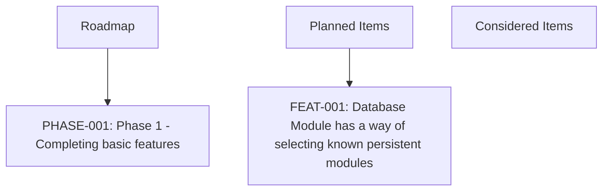

# ROADMAP: Angel's Project Manager

> Managed document. Must comply with template ROADMAP.template.md.

<!-- APM:DATA
{
  "docType": "roadmap",
  "version": 1,
  "phases": [
    {
      "id": "phase-1774724454622-z52ftc1",
      "projectId": "1772489365575-mj2xfcm",
      "code": "PHASE-001",
      "name": "Phase 1 - Completing basic features",
      "summary": "Ability to create roadmaps, todos to move between work items, Gantt chart for organizing finished work, Features for a project, bugs for a project, and a PRD file as a secondary source of truth that an AI Agent can compare an applicatin against.",
      "goal": "Getting all basic features and bugs into a point that my first full iteration can be considered complete.",
      "status": "planned",
      "targetDate": "2026-05-01",
      "afterPhaseId": null,
      "archived": false,
      "sortOrder": 0,
      "createdAt": "2026-04-02T21:28:03.536Z",
      "updatedAt": "2026-04-02T21:28:03.536Z"
    }
  ],
  "tasks": [
    {
      "id": "task-1775007815265-kkzipo1",
      "projectId": "1772489365575-mj2xfcm",
      "title": "Database Module has a way of selecting known persistent modules",
      "description": "Database Module needs a way to specify persistence models.  Now that it supports dbml, we should be able to generate a selected type of db with it, if it doesn't exist.  It should also be able to support a path to either reference or generate to (sometimes I already have a database - I just need to make sure documentation is set with it).",
      "category": null,
      "status": "done",
      "priority": "medium",
      "createdAt": "2026-04-02T21:27:57.796Z",
      "updatedAt": "2026-04-02T23:44:21.002Z",
      "dueDate": null,
      "assignedTo": null,
      "startDate": null,
      "endDate": null,
      "roadmapPhaseId": null,
      "planningBucket": "archived",
      "workItemType": "software_feature",
      "itemType": "feature",
      "dependencyIds": [],
      "progress": 0,
      "milestone": false,
      "sortOrder": 0
    },
    {
      "id": "task-1774723828051-aifoxlg",
      "projectId": "1772489365575-mj2xfcm",
      "title": "Features added by AI should create fragment files",
      "description": "Change the directive in the FEATURES produced md file that when an AI agent creates a feature, it creates a fragment that the PRD module can consume and add to new features.  This will produce a PRD_FRAGMENT_[date].md file that still follows the structure of the PRD.template, but the PRD module can now consume and merge into the greater PRD.md.  But it saves it to the database first, that way it can appropriate reproduce the PRD. file\n\nCurrently there is an AI Agent Instruction that is: \"AI Agent instruction: When this feature is implemented, update PRD.md appropriately and keep the document compliant with its template.\"  The AI agent will no longer update the PRD.md directly.  This feature has a higher instruction than what is currently in FEATURES.md.\n\nOnce code modifications is finished, the AI agent needs to turn this very feature (FEAT-001) into a fragment for PRD to consume.",
      "category": null,
      "status": "done",
      "priority": "medium",
      "createdAt": "2026-04-02T21:27:57.818Z",
      "updatedAt": "2026-04-02T23:44:36.164Z",
      "dueDate": null,
      "assignedTo": null,
      "startDate": null,
      "endDate": null,
      "roadmapPhaseId": null,
      "planningBucket": "archived",
      "workItemType": "software_feature",
      "itemType": "feature",
      "dependencyIds": [],
      "progress": 100,
      "milestone": false,
      "sortOrder": 0
    },
    {
      "id": "task-1774723828054-bej2gzd",
      "projectId": "1772489365575-mj2xfcm",
      "title": "UI Design for PRD tab",
      "description": "Implement UI interaction for the PRD tab so that a user can actually edit the items.\n\nTextbox to add/update Executive Summar\n\nPanel for writing up the Product overview - put an info icon for each subsection here on how to write out what is needed.\n\nFunctional requirements.  The UI ability to create workflows, define user actions, and system behaviors easily (something beyond just a text box).  And make sure there is a way to organize it so that when the md file is generated it will automatically be organized correctly.  Remember this needs to be robust enough that an AI agent can generate a product from this document. Info graph icon that when hovered over explains how to use it.  Represent them with icons.\n\nNon-funcitonal requirements: a UI that helps describe usability, reliability, accessibility, and security, and performance. Represent them with icons, and a smart UI to design the features.\n\nA UI friendly way that moves being text boxes to describe the expected technical shape at a high level.\n\nImplementation plan - UX/UI friendly way of writing up Sequencing, organizing dependencies, and milestones.  This should hook into Roadmap Module.\n\nSuccess Metrics.  UI/UX items that help define how metrics will be measured.\n\nRisks and Mitigations - being able to add to a list\n\nFuture enhancments.  This will be reflect in the Roadmap.\n\nApplied Fragments section: The goal of this section is to purely be able to properly integrate them into the rest of the document, and once finished can be removed.  The AI agent should mark areas in the fragment files that identify where in the PRD file they should be moved to, and in the UI buttons to auto integrate them into the system and document appropriately.  But they should still have not lose their link to a consumed/merged feature fragment file so that we keep a record of what was changed/added.  They move from MERGED state to INTEGRATED.  Merged means they have been saved to the system. Integrated means the information of the feature has been applied to the PRD.  Once this happens it is auto archived and only shows in the subtab \"Archived features\".\n\nOverall, this also needs version dates for every item added.\n\nFeatures should be automatically be added to the Roadmap, in a section under Phases \"Considered Features\" that appear at the very end.\n\nSo basically the workflow is as follows.\n\nIf a feature is created, it is automatically added to the \"Planned Features\" which is another phase that appears above \"Considered Features in the roadmap.  These function as buckets to pull from when we are deciding phases/milestones.  Planned Features are features that are merged into the Features document.\n\nROADMAP.md instructions: AI Agents should refer to the ROADMAP, as Feature ids will be present.  Feature ids refer to the FEATURES.md file's active features.  Instruct the AI to ignore archived features.  This will help with workflow when generating code",
      "category": null,
      "status": "done",
      "priority": "medium",
      "createdAt": "2026-04-02T21:27:57.836Z",
      "updatedAt": "2026-04-02T23:44:32.564Z",
      "dueDate": null,
      "assignedTo": null,
      "startDate": null,
      "endDate": null,
      "roadmapPhaseId": null,
      "planningBucket": "archived",
      "workItemType": "software_feature",
      "itemType": "feature",
      "dependencyIds": [],
      "progress": 100,
      "milestone": false,
      "sortOrder": 0
    },
    {
      "id": "task-1774723828056-7cankdy",
      "projectId": "1772489365575-mj2xfcm",
      "title": "New Module for UX/UI Design",
      "description": "I need a generic UI/UX generator that generates an MDX file for Markdown, JSON/Tokens/JSX Components.\n\nThe module should let me create the standard UI components, and enable me to define common UX behavior.  Generates an MDX file.",
      "category": null,
      "status": "done",
      "priority": "medium",
      "createdAt": "2026-04-02T21:27:57.853Z",
      "updatedAt": "2026-04-02T23:44:28.925Z",
      "dueDate": null,
      "assignedTo": null,
      "startDate": null,
      "endDate": null,
      "roadmapPhaseId": null,
      "planningBucket": "archived",
      "workItemType": "software_feature",
      "itemType": "feature",
      "dependencyIds": [],
      "progress": 100,
      "milestone": false,
      "sortOrder": 0
    },
    {
      "id": "task-1775007912143-4vovg99",
      "projectId": "1772489365575-mj2xfcm",
      "title": "The application should not produce fragments",
      "description": "Application, such as when I create a feature, is creating a PRD_Fragment",
      "category": null,
      "status": "todo",
      "priority": "medium",
      "createdAt": "2026-04-02T22:29:43.656Z",
      "updatedAt": "2026-04-10T18:35:20.488Z",
      "dueDate": null,
      "assignedTo": null,
      "startDate": null,
      "endDate": null,
      "roadmapPhaseId": null,
      "planningBucket": "planned",
      "workItemType": "software_bug",
      "itemType": "bug",
      "dependencyIds": [],
      "progress": 0,
      "milestone": false,
      "sortOrder": 0
    },
    {
      "id": "task-1774723828060-7ke94cf",
      "projectId": "1772489365575-mj2xfcm",
      "title": "PRD Fragments should be deleted after merging",
      "description": "PRD_FRAGMENT Files are still present after merge.",
      "category": null,
      "status": "todo",
      "priority": "medium",
      "createdAt": "2026-04-02T22:29:43.682Z",
      "updatedAt": "2026-04-10T18:35:20.442Z",
      "dueDate": null,
      "assignedTo": null,
      "startDate": null,
      "endDate": null,
      "roadmapPhaseId": null,
      "planningBucket": "considered",
      "workItemType": "software_bug",
      "itemType": "bug",
      "dependencyIds": [],
      "progress": 0,
      "milestone": false,
      "sortOrder": 0
    },
    {
      "id": "task-1774723828059-rifwvy0",
      "projectId": "1772489365575-mj2xfcm",
      "title": "Add/Edit link is a text field.",
      "description": "When file is selected for a link, a user needs to enter it into a text box",
      "category": null,
      "status": "todo",
      "priority": "medium",
      "createdAt": "2026-04-02T22:29:43.699Z",
      "updatedAt": "2026-04-10T18:35:20.559Z",
      "dueDate": null,
      "assignedTo": null,
      "startDate": null,
      "endDate": null,
      "roadmapPhaseId": null,
      "planningBucket": "archived",
      "workItemType": "software_bug",
      "itemType": "bug",
      "dependencyIds": [],
      "progress": 100,
      "milestone": false,
      "sortOrder": 0
    },
    {
      "id": "task-1775258974138-shurtzu",
      "projectId": "1772489365575-mj2xfcm",
      "title": "Advanced Analytics and Reporting",
      "description": "Add a planned feature area for analytics and reporting so APM can surface progress, time, and output visibility beyond basic planning views.",
      "category": null,
      "status": "done",
      "priority": "medium",
      "createdAt": "2026-04-03T23:29:34.138Z",
      "updatedAt": "2026-04-03T23:30:27.232Z",
      "dueDate": null,
      "assignedTo": null,
      "startDate": null,
      "endDate": null,
      "roadmapPhaseId": null,
      "planningBucket": "archived",
      "workItemType": "software_feature",
      "itemType": "feature",
      "dependencyIds": [],
      "progress": 0,
      "milestone": false,
      "sortOrder": 0
    },
    {
      "id": "task-1775258975126-ng1w00i",
      "projectId": "1772489365575-mj2xfcm",
      "title": "Advanced UI and UX Improvements",
      "description": "Capture the next layer of user-experience polish as planned work instead of leaving it in legacy notes.",
      "category": null,
      "status": "done",
      "priority": "medium",
      "createdAt": "2026-04-03T23:29:35.126Z",
      "updatedAt": "2026-04-03T23:30:30.765Z",
      "dueDate": null,
      "assignedTo": null,
      "startDate": null,
      "endDate": null,
      "roadmapPhaseId": null,
      "planningBucket": "archived",
      "workItemType": "software_feature",
      "itemType": "feature",
      "dependencyIds": [],
      "progress": 0,
      "milestone": false,
      "sortOrder": 0
    },
    {
      "id": "task-1775258975933-0md8a1u",
      "projectId": "1772489365575-mj2xfcm",
      "title": "Collaboration Features",
      "description": "Capture collaboration-oriented future work as a real planned feature area instead of leaving it buried in legacy roadmap notes.",
      "category": null,
      "status": "done",
      "priority": "medium",
      "createdAt": "2026-04-03T23:29:35.933Z",
      "updatedAt": "2026-04-03T23:30:32.552Z",
      "dueDate": null,
      "assignedTo": null,
      "startDate": null,
      "endDate": null,
      "roadmapPhaseId": null,
      "planningBucket": "archived",
      "workItemType": "software_feature",
      "itemType": "feature",
      "dependencyIds": [],
      "progress": 0,
      "milestone": false,
      "sortOrder": 0
    },
    {
      "id": "task-1775258976726-cyr14pz",
      "projectId": "1772489365575-mj2xfcm",
      "title": "Enterprise and Governance Features",
      "description": "Promote the remaining enterprise-oriented roadmap ideas into a real planned feature area so they can be tracked deliberately later.",
      "category": null,
      "status": "done",
      "priority": "medium",
      "createdAt": "2026-04-03T23:29:36.726Z",
      "updatedAt": "2026-04-03T23:30:34.200Z",
      "dueDate": null,
      "assignedTo": null,
      "startDate": null,
      "endDate": null,
      "roadmapPhaseId": null,
      "planningBucket": "archived",
      "workItemType": "software_feature",
      "itemType": "feature",
      "dependencyIds": [],
      "progress": 0,
      "milestone": false,
      "sortOrder": 0
    },
    {
      "id": "task-1775259006834-fww19ha",
      "projectId": "1772489365575-mj2xfcm",
      "title": "Drag and Drop Planning Regression",
      "description": "# Bug Fragment: BUG-101 - Drag and Drop Planning Regression\n\n## Executive Summary\n\nRecord the regression where drag-and-drop planning behavior is no longer available or reliable in the roadmap and related work-item flows.\n\n## Bug Updates\n\n- Add a planned bug entry for the broken drag-and-drop planning workflow across tasks, features, and bugs.\n\n## Expected vs Current Behavior\n\n### Current Behavior\n\nUsers cannot reliably drag and drop tasks, features, or bugs into phases the way the planning flow previously supported.\n\n### Expected Behavior\n\nUsers should be able to move planned work into roadmap phases through the intended drag-and-drop planner workflow.\n\n## Fix and Validation Notes\n\n- Validate roadmap, task, feature, and bug flows together instead of fixing only one surface.\n- Confirm both UI interaction and downstream state updates behave consistently.\n\n## Open Questions\n\n- Which exact planner views lost the behavior first?\n- Is the regression in UI interaction, state updates, or both?\n\n## Merge Guidance\n\n- Merge into Bugs as planned work.\n- This bug should remain visible until the planner workflow is restored and verified.",
      "category": null,
      "status": "todo",
      "priority": "medium",
      "createdAt": "2026-04-03T23:30:06.834Z",
      "updatedAt": "2026-04-10T18:35:20.396Z",
      "dueDate": null,
      "assignedTo": null,
      "startDate": null,
      "endDate": null,
      "roadmapPhaseId": null,
      "planningBucket": "planned",
      "workItemType": "software_bug",
      "itemType": "bug",
      "dependencyIds": [],
      "progress": 0,
      "milestone": false,
      "sortOrder": 0
    },
    {
      "id": "task-1775259007490-31md8wa",
      "projectId": "1772489365575-mj2xfcm",
      "title": "Imported Fragment Bodies Remain In Canonical Documents",
      "description": "# Bug Fragment: BUG-102 - Imported Fragment Bodies Remain In Canonical Documents\n\n## Executive Summary\n\nRecord the document hygiene bug where imported fragment bodies remain pasted into canonical documents instead of being integrated into the intended structured sections.\n\n## Bug Updates\n\n- Add a planned bug entry for canonical document cleanup and better section-aware integration behavior.\n\n## Expected vs Current Behavior\n\n### Current Behavior\n\nSome managed documents, especially Architecture, still contain imported fragment text bodies in placeholder sections instead of a clean structured result.\n\n### Expected Behavior\n\nConsuming a fragment should update the correct structured document sections so the canonical document reads cleanly without leftover imported-body debris.\n\n## Fix and Validation Notes\n\n- Validate Architecture first, since it is the clearest current example.\n- Confirm fragment history remains preserved even when the final document body is clean.\n\n## Open Questions\n\n- Which modules still rely on imported fragment body dumps rather than true section-aware merge logic?\n- Should this be solved by richer fragment contracts, richer module UIs, or both?\n\n## Merge Guidance\n\n- Merge into Bugs as planned cleanup work.\n- This should stay open until canonical document rendering is clean for the affected modules.",
      "category": null,
      "status": "todo",
      "priority": "medium",
      "createdAt": "2026-04-03T23:30:07.490Z",
      "updatedAt": "2026-04-10T18:35:20.349Z",
      "dueDate": null,
      "assignedTo": null,
      "startDate": null,
      "endDate": null,
      "roadmapPhaseId": null,
      "planningBucket": "planned",
      "workItemType": "software_bug",
      "itemType": "bug",
      "dependencyIds": [],
      "progress": 0,
      "milestone": false,
      "sortOrder": 0
    },
    {
      "id": "task-1775259007948-wvhr0so",
      "projectId": "1772489365575-mj2xfcm",
      "title": "Fragment Lifecycle Inconsistency Across Modules",
      "description": "# Bug Fragment: BUG-103 - Fragment Lifecycle Inconsistency Across Modules\n\n## Executive Summary\n\nRecord the remaining workflow inconsistency where fragment handling is improved but still not uniformly intuitive across every module.\n\n## Bug Updates\n\n- Add a planned bug entry for fragment lifecycle consistency and workflow polish across modules.\n\n## Expected vs Current Behavior\n\n### Current Behavior\n\nFragment discovery, dedupe, archive visibility, cleanup, and status signaling are closer than before but still inconsistent enough to confuse users during review and integration.\n\n### Expected Behavior\n\nAll fragment-enabled modules should expose the same predictable lifecycle for loading, importing, archiving, deduping, versioning, and cleanup.\n\n## Fix and Validation Notes\n\n- Validate active and archived fragment visibility across all modules.\n- Validate duplicate and superseded fragment handling with version metadata.\n- Validate cleanup behavior for canonical versus non-canonical source files.\n\n## Open Questions\n\n- Which remaining inconsistencies are true behavior bugs versus UI wording problems?\n- Should section-level fragment operations be part of the same lifecycle pass or follow separately?\n\n## Merge Guidance\n\n- Merge into Bugs as planned workflow-polish work.\n- Keep this linked to future fragment section add/remove/update work.",
      "category": null,
      "status": "todo",
      "priority": "medium",
      "createdAt": "2026-04-03T23:30:07.948Z",
      "updatedAt": "2026-04-10T18:35:20.303Z",
      "dueDate": null,
      "assignedTo": null,
      "startDate": null,
      "endDate": null,
      "roadmapPhaseId": null,
      "planningBucket": "planned",
      "workItemType": "software_bug",
      "itemType": "bug",
      "dependencyIds": [],
      "progress": 0,
      "milestone": false,
      "sortOrder": 0
    },
    {
      "id": "task-1775260378819-kl25ho8",
      "projectId": "1772489365575-mj2xfcm",
      "title": "Advanced Analytics and Reporting",
      "description": "Add a planned feature area for analytics and reporting so APM can surface progress, time, and output visibility beyond basic planning views.",
      "category": null,
      "status": "done",
      "priority": "medium",
      "createdAt": "2026-04-03T23:52:58.819Z",
      "updatedAt": "2026-04-03T23:55:13.056Z",
      "dueDate": null,
      "assignedTo": null,
      "startDate": null,
      "endDate": null,
      "roadmapPhaseId": null,
      "planningBucket": "archived",
      "workItemType": "software_feature",
      "itemType": "feature",
      "dependencyIds": [],
      "progress": 0,
      "milestone": false,
      "sortOrder": 0
    },
    {
      "id": "task-1775260379756-71xu72d",
      "projectId": "1772489365575-mj2xfcm",
      "title": "Advanced UI and UX Improvements",
      "description": "Capture the next layer of user-experience polish as planned work instead of leaving it in legacy notes.",
      "category": null,
      "status": "done",
      "priority": "medium",
      "createdAt": "2026-04-03T23:52:59.756Z",
      "updatedAt": "2026-04-03T23:55:16.072Z",
      "dueDate": null,
      "assignedTo": null,
      "startDate": null,
      "endDate": null,
      "roadmapPhaseId": null,
      "planningBucket": "archived",
      "workItemType": "software_feature",
      "itemType": "feature",
      "dependencyIds": [],
      "progress": 0,
      "milestone": false,
      "sortOrder": 0
    },
    {
      "id": "task-1775260380689-nxgbdhz",
      "projectId": "1772489365575-mj2xfcm",
      "title": "Collaboration Features",
      "description": "Capture collaboration-oriented future work as a real planned feature area instead of leaving it buried in legacy roadmap notes.",
      "category": null,
      "status": "done",
      "priority": "medium",
      "createdAt": "2026-04-03T23:53:00.689Z",
      "updatedAt": "2026-04-03T23:55:18.313Z",
      "dueDate": null,
      "assignedTo": null,
      "startDate": null,
      "endDate": null,
      "roadmapPhaseId": null,
      "planningBucket": "archived",
      "workItemType": "software_feature",
      "itemType": "feature",
      "dependencyIds": [],
      "progress": 0,
      "milestone": false,
      "sortOrder": 0
    },
    {
      "id": "task-1775260381690-swxrv67",
      "projectId": "1772489365575-mj2xfcm",
      "title": "Enterprise and Governance Features",
      "description": "Promote the remaining enterprise-oriented roadmap ideas into a real planned feature area so they can be tracked deliberately later.",
      "category": null,
      "status": "done",
      "priority": "medium",
      "createdAt": "2026-04-03T23:53:01.690Z",
      "updatedAt": "2026-04-03T23:55:20.697Z",
      "dueDate": null,
      "assignedTo": null,
      "startDate": null,
      "endDate": null,
      "roadmapPhaseId": null,
      "planningBucket": "archived",
      "workItemType": "software_feature",
      "itemType": "feature",
      "dependencyIds": [],
      "progress": 0,
      "milestone": false,
      "sortOrder": 0
    },
    {
      "id": "task-1775260497292-mmdkli2",
      "projectId": "1772489365575-mj2xfcm",
      "title": "Drag and Drop Planning Regression",
      "description": "# Bug Fragment: BUG-101 - Drag and Drop Planning Regression\n\n## Executive Summary\n\nRecord the regression where drag-and-drop planning behavior is no longer available or reliable in the roadmap and related work-item flows.\n\n## Bug Updates\n\n- Add a planned bug entry for the broken drag-and-drop planning workflow across tasks, features, and bugs.\n\n## Expected vs Current Behavior\n\n### Current Behavior\n\nUsers cannot reliably drag and drop tasks, features, or bugs into phases the way the planning flow previously supported.\n\n### Expected Behavior\n\nUsers should be able to move planned work into roadmap phases through the intended drag-and-drop planner workflow.\n\n## Fix and Validation Notes\n\n- Validate roadmap, task, feature, and bug flows together instead of fixing only one surface.\n- Confirm both UI interaction and downstream state updates behave consistently.\n\n## Open Questions\n\n- Which exact planner views lost the behavior first?\n- Is the regression in UI interaction, state updates, or both?\n\n## Merge Guidance\n\n- Merge into Bugs as planned work.\n- This bug should remain visible until the planner workflow is restored and verified.",
      "category": null,
      "status": "todo",
      "priority": "medium",
      "createdAt": "2026-04-03T23:54:57.292Z",
      "updatedAt": "2026-04-10T18:35:20.256Z",
      "dueDate": null,
      "assignedTo": null,
      "startDate": null,
      "endDate": null,
      "roadmapPhaseId": null,
      "planningBucket": "planned",
      "workItemType": "software_bug",
      "itemType": "bug",
      "dependencyIds": [],
      "progress": 0,
      "milestone": false,
      "sortOrder": 0
    },
    {
      "id": "task-1775260497787-whnkb4r",
      "projectId": "1772489365575-mj2xfcm",
      "title": "Imported Fragment Bodies Remain In Canonical Documents",
      "description": "# Bug Fragment: BUG-102 - Imported Fragment Bodies Remain In Canonical Documents\n\n## Executive Summary\n\nRecord the document hygiene bug where imported fragment bodies remain pasted into canonical documents instead of being integrated into the intended structured sections.\n\n## Bug Updates\n\n- Add a planned bug entry for canonical document cleanup and better section-aware integration behavior.\n\n## Expected vs Current Behavior\n\n### Current Behavior\n\nSome managed documents, especially Architecture, still contain imported fragment text bodies in placeholder sections instead of a clean structured result.\n\n### Expected Behavior\n\nConsuming a fragment should update the correct structured document sections so the canonical document reads cleanly without leftover imported-body debris.\n\n## Fix and Validation Notes\n\n- Validate Architecture first, since it is the clearest current example.\n- Confirm fragment history remains preserved even when the final document body is clean.\n\n## Open Questions\n\n- Which modules still rely on imported fragment body dumps rather than true section-aware merge logic?\n- Should this be solved by richer fragment contracts, richer module UIs, or both?\n\n## Merge Guidance\n\n- Merge into Bugs as planned cleanup work.\n- This should stay open until canonical document rendering is clean for the affected modules.",
      "category": null,
      "status": "todo",
      "priority": "medium",
      "createdAt": "2026-04-03T23:54:57.787Z",
      "updatedAt": "2026-04-10T18:35:20.212Z",
      "dueDate": null,
      "assignedTo": null,
      "startDate": null,
      "endDate": null,
      "roadmapPhaseId": null,
      "planningBucket": "planned",
      "workItemType": "software_bug",
      "itemType": "bug",
      "dependencyIds": [],
      "progress": 0,
      "milestone": false,
      "sortOrder": 0
    },
    {
      "id": "task-1775260498314-vb5jtcj",
      "projectId": "1772489365575-mj2xfcm",
      "title": "Fragment Lifecycle Inconsistency Across Modules",
      "description": "# Bug Fragment: BUG-103 - Fragment Lifecycle Inconsistency Across Modules\n\n## Executive Summary\n\nRecord the remaining workflow inconsistency where fragment handling is improved but still not uniformly intuitive across every module.\n\n## Bug Updates\n\n- Add a planned bug entry for fragment lifecycle consistency and workflow polish across modules.\n\n## Expected vs Current Behavior\n\n### Current Behavior\n\nFragment discovery, dedupe, archive visibility, cleanup, and status signaling are closer than before but still inconsistent enough to confuse users during review and integration.\n\n### Expected Behavior\n\nAll fragment-enabled modules should expose the same predictable lifecycle for loading, importing, archiving, deduping, versioning, and cleanup.\n\n## Fix and Validation Notes\n\n- Validate active and archived fragment visibility across all modules.\n- Validate duplicate and superseded fragment handling with version metadata.\n- Validate cleanup behavior for canonical versus non-canonical source files.\n\n## Open Questions\n\n- Which remaining inconsistencies are true behavior bugs versus UI wording problems?\n- Should section-level fragment operations be part of the same lifecycle pass or follow separately?\n\n## Merge Guidance\n\n- Merge into Bugs as planned workflow-polish work.\n- Keep this linked to future fragment section add/remove/update work.",
      "category": null,
      "status": "todo",
      "priority": "medium",
      "createdAt": "2026-04-03T23:54:58.314Z",
      "updatedAt": "2026-04-10T18:35:20.160Z",
      "dueDate": null,
      "assignedTo": null,
      "startDate": null,
      "endDate": null,
      "roadmapPhaseId": null,
      "planningBucket": "planned",
      "workItemType": "software_bug",
      "itemType": "bug",
      "dependencyIds": [],
      "progress": 0,
      "milestone": false,
      "sortOrder": 0
    },
    {
      "id": "task-1775784434574-wxbsu2g",
      "projectId": "1772489365575-mj2xfcm",
      "title": "SFTP Feedback doesn't exist",
      "description": "Adding mapping doesn't have good feedback.  The button \"Add From Selection\" for the Upload Mapping has no feedback.\nUpload from mapping has regressed to missing",
      "category": "SFTP",
      "status": "done",
      "priority": "medium",
      "createdAt": "2026-04-10T01:27:14.574Z",
      "updatedAt": "2026-04-10T18:36:37.305Z",
      "dueDate": null,
      "assignedTo": null,
      "startDate": null,
      "endDate": null,
      "roadmapPhaseId": null,
      "planningBucket": "archived",
      "workItemType": "software_bug",
      "itemType": "bug",
      "dependencyIds": [],
      "progress": 0,
      "milestone": false,
      "sortOrder": 0
    }
  ],
  "features": [
    {
      "id": "feature-1775260381701-v5d4wjy",
      "projectId": "1772489365575-mj2xfcm",
      "code": "FEAT-012",
      "title": "Enterprise and Governance Features",
      "summary": "Promote the remaining enterprise-oriented roadmap ideas into a real planned feature area so they can be tracked deliberately later.",
      "description": "Promote the remaining enterprise-oriented roadmap ideas into a real planned feature area so they can be tracked deliberately later.",
      "category": null,
      "priority": "medium",
      "dueDate": null,
      "assignedTo": null,
      "startDate": null,
      "endDate": null,
      "status": "done",
      "taskStatus": "done",
      "roadmapPhaseId": null,
      "taskId": "task-1775260381690-swxrv67",
      "planningBucket": "archived",
      "workItemType": "software_feature",
      "itemType": "feature",
      "dependencyIds": [],
      "affectedModuleKeys": [],
      "progress": 0,
      "milestone": false,
      "sortOrder": 0,
      "archived": true,
      "createdAt": "2026-04-03T23:53:01.690Z",
      "updatedAt": "2026-04-03T23:55:20.697Z"
    },
    {
      "id": "feature-1775260380700-sdd7v5k",
      "projectId": "1772489365575-mj2xfcm",
      "code": "FEAT-011",
      "title": "Collaboration Features",
      "summary": "Capture collaboration-oriented future work as a real planned feature area instead of leaving it buried in legacy roadmap notes.",
      "description": "Capture collaboration-oriented future work as a real planned feature area instead of leaving it buried in legacy roadmap notes.",
      "category": null,
      "priority": "medium",
      "dueDate": null,
      "assignedTo": null,
      "startDate": null,
      "endDate": null,
      "status": "done",
      "taskStatus": "done",
      "roadmapPhaseId": null,
      "taskId": "task-1775260380689-nxgbdhz",
      "planningBucket": "archived",
      "workItemType": "software_feature",
      "itemType": "feature",
      "dependencyIds": [],
      "affectedModuleKeys": [],
      "progress": 0,
      "milestone": false,
      "sortOrder": 0,
      "archived": true,
      "createdAt": "2026-04-03T23:53:00.689Z",
      "updatedAt": "2026-04-03T23:55:18.313Z"
    },
    {
      "id": "feature-1775260379767-zfgviv6",
      "projectId": "1772489365575-mj2xfcm",
      "code": "FEAT-010",
      "title": "Advanced UI and UX Improvements",
      "summary": "Capture the next layer of user-experience polish as planned work instead of leaving it in legacy notes.",
      "description": "Capture the next layer of user-experience polish as planned work instead of leaving it in legacy notes.",
      "category": null,
      "priority": "medium",
      "dueDate": null,
      "assignedTo": null,
      "startDate": null,
      "endDate": null,
      "status": "done",
      "taskStatus": "done",
      "roadmapPhaseId": null,
      "taskId": "task-1775260379756-71xu72d",
      "planningBucket": "archived",
      "workItemType": "software_feature",
      "itemType": "feature",
      "dependencyIds": [],
      "affectedModuleKeys": [],
      "progress": 0,
      "milestone": false,
      "sortOrder": 0,
      "archived": true,
      "createdAt": "2026-04-03T23:52:59.756Z",
      "updatedAt": "2026-04-03T23:55:16.072Z"
    },
    {
      "id": "feature-1775260378833-9d8qnae",
      "projectId": "1772489365575-mj2xfcm",
      "code": "FEAT-009",
      "title": "Advanced Analytics and Reporting",
      "summary": "Add a planned feature area for analytics and reporting so APM can surface progress, time, and output visibility beyond basic planning views.",
      "description": "Add a planned feature area for analytics and reporting so APM can surface progress, time, and output visibility beyond basic planning views.",
      "category": null,
      "priority": "medium",
      "dueDate": null,
      "assignedTo": null,
      "startDate": null,
      "endDate": null,
      "status": "done",
      "taskStatus": "done",
      "roadmapPhaseId": null,
      "taskId": "task-1775260378819-kl25ho8",
      "planningBucket": "archived",
      "workItemType": "software_feature",
      "itemType": "feature",
      "dependencyIds": [],
      "affectedModuleKeys": [],
      "progress": 0,
      "milestone": false,
      "sortOrder": 0,
      "archived": true,
      "createdAt": "2026-04-03T23:52:58.819Z",
      "updatedAt": "2026-04-03T23:55:13.056Z"
    },
    {
      "id": "feature-1775258976737-55uz6y2",
      "projectId": "1772489365575-mj2xfcm",
      "code": "FEAT-008",
      "title": "Enterprise and Governance Features",
      "summary": "Promote the remaining enterprise-oriented roadmap ideas into a real planned feature area so they can be tracked deliberately later.",
      "description": "Promote the remaining enterprise-oriented roadmap ideas into a real planned feature area so they can be tracked deliberately later.",
      "category": null,
      "priority": "medium",
      "dueDate": null,
      "assignedTo": null,
      "startDate": null,
      "endDate": null,
      "status": "done",
      "taskStatus": "done",
      "roadmapPhaseId": null,
      "taskId": "task-1775258976726-cyr14pz",
      "planningBucket": "archived",
      "workItemType": "software_feature",
      "itemType": "feature",
      "dependencyIds": [],
      "affectedModuleKeys": [],
      "progress": 0,
      "milestone": false,
      "sortOrder": 0,
      "archived": true,
      "createdAt": "2026-04-03T23:29:36.726Z",
      "updatedAt": "2026-04-03T23:30:34.200Z"
    },
    {
      "id": "feature-1775258975946-jxox920",
      "projectId": "1772489365575-mj2xfcm",
      "code": "FEAT-007",
      "title": "Collaboration Features",
      "summary": "Capture collaboration-oriented future work as a real planned feature area instead of leaving it buried in legacy roadmap notes.",
      "description": "Capture collaboration-oriented future work as a real planned feature area instead of leaving it buried in legacy roadmap notes.",
      "category": null,
      "priority": "medium",
      "dueDate": null,
      "assignedTo": null,
      "startDate": null,
      "endDate": null,
      "status": "done",
      "taskStatus": "done",
      "roadmapPhaseId": null,
      "taskId": "task-1775258975933-0md8a1u",
      "planningBucket": "archived",
      "workItemType": "software_feature",
      "itemType": "feature",
      "dependencyIds": [],
      "affectedModuleKeys": [],
      "progress": 0,
      "milestone": false,
      "sortOrder": 0,
      "archived": true,
      "createdAt": "2026-04-03T23:29:35.933Z",
      "updatedAt": "2026-04-03T23:30:32.552Z"
    },
    {
      "id": "feature-1775258975140-a32rxbi",
      "projectId": "1772489365575-mj2xfcm",
      "code": "FEAT-006",
      "title": "Advanced UI and UX Improvements",
      "summary": "Capture the next layer of user-experience polish as planned work instead of leaving it in legacy notes.",
      "description": "Capture the next layer of user-experience polish as planned work instead of leaving it in legacy notes.",
      "category": null,
      "priority": "medium",
      "dueDate": null,
      "assignedTo": null,
      "startDate": null,
      "endDate": null,
      "status": "done",
      "taskStatus": "done",
      "roadmapPhaseId": null,
      "taskId": "task-1775258975126-ng1w00i",
      "planningBucket": "archived",
      "workItemType": "software_feature",
      "itemType": "feature",
      "dependencyIds": [],
      "affectedModuleKeys": [],
      "progress": 0,
      "milestone": false,
      "sortOrder": 0,
      "archived": true,
      "createdAt": "2026-04-03T23:29:35.126Z",
      "updatedAt": "2026-04-03T23:30:30.765Z"
    },
    {
      "id": "feature-1775258974158-m2j0789",
      "projectId": "1772489365575-mj2xfcm",
      "code": "FEAT-005",
      "title": "Advanced Analytics and Reporting",
      "summary": "Add a planned feature area for analytics and reporting so APM can surface progress, time, and output visibility beyond basic planning views.",
      "description": "Add a planned feature area for analytics and reporting so APM can surface progress, time, and output visibility beyond basic planning views.",
      "category": null,
      "priority": "medium",
      "dueDate": null,
      "assignedTo": null,
      "startDate": null,
      "endDate": null,
      "status": "done",
      "taskStatus": "done",
      "roadmapPhaseId": null,
      "taskId": "task-1775258974138-shurtzu",
      "planningBucket": "archived",
      "workItemType": "software_feature",
      "itemType": "feature",
      "dependencyIds": [],
      "affectedModuleKeys": [],
      "progress": 0,
      "milestone": false,
      "sortOrder": 0,
      "archived": true,
      "createdAt": "2026-04-03T23:29:34.138Z",
      "updatedAt": "2026-04-03T23:30:27.232Z"
    },
    {
      "id": "feature-1774623875235-0g23i3n",
      "projectId": "1772489365575-mj2xfcm",
      "code": "FEAT-002",
      "title": "Features added by AI should create fragment files",
      "summary": "Change the directive in the FEATURES produced md file that when an AI agent creates a feature, it creates a fragment that the PRD module can consume and add to new features.  This will produce a PRD_FRAGMENT_[date].md file that still follows the structure of the PRD.template, but the PRD module can now consume and merge into the greater PRD.md.  But it saves it to the database first, that way it can appropriate reproduce the PRD. file\n\nCurrently there is an AI Agent Instruction that is: \"AI Agent instruction: When this feature is implemented, update PRD.md appropriately and keep the document compliant with its template.\"  The AI agent will no longer update the PRD.md directly.  This feature has a higher instruction than what is currently in FEATURES.md.\n\nOnce code modifications is finished, the AI agent needs to turn this very feature (FEAT-001) into a fragment for PRD to consume.",
      "description": "Change the directive in the FEATURES produced md file that when an AI agent creates a feature, it creates a fragment that the PRD module can consume and add to new features.  This will produce a PRD_FRAGMENT_[date].md file that still follows the structure of the PRD.template, but the PRD module can now consume and merge into the greater PRD.md.  But it saves it to the database first, that way it can appropriate reproduce the PRD. file\n\nCurrently there is an AI Agent Instruction that is: \"AI Agent instruction: When this feature is implemented, update PRD.md appropriately and keep the document compliant with its template.\"  The AI agent will no longer update the PRD.md directly.  This feature has a higher instruction than what is currently in FEATURES.md.\n\nOnce code modifications is finished, the AI agent needs to turn this very feature (FEAT-001) into a fragment for PRD to consume.",
      "category": null,
      "priority": "medium",
      "dueDate": null,
      "assignedTo": null,
      "startDate": null,
      "endDate": null,
      "status": "done",
      "taskStatus": "done",
      "roadmapPhaseId": null,
      "taskId": "task-1774723828051-aifoxlg",
      "planningBucket": "archived",
      "workItemType": "software_feature",
      "itemType": "feature",
      "dependencyIds": [],
      "affectedModuleKeys": [],
      "progress": 100,
      "milestone": false,
      "sortOrder": 0,
      "archived": true,
      "createdAt": "2026-04-02T21:27:57.818Z",
      "updatedAt": "2026-04-02T23:44:36.164Z"
    },
    {
      "id": "feature-1774627471182-flirfys",
      "projectId": "1772489365575-mj2xfcm",
      "code": "FEAT-003",
      "title": "UI Design for PRD tab",
      "summary": "Implement UI interaction for the PRD tab so that a user can actually edit the items.\n\nTextbox to add/update Executive Summar\n\nPanel for writing up the Product overview - put an info icon for each subsection here on how to write out what is needed.\n\nFunctional requirements.  The UI ability to create workflows, define user actions, and system behaviors easily (something beyond just a text box).  And make sure there is a way to organize it so that when the md file is generated it will automatically be organized correctly.  Remember this needs to be robust enough that an AI agent can generate a product from this document. Info graph icon that when hovered over explains how to use it.  Represent them with icons.\n\nNon-funcitonal requirements: a UI that helps describe usability, reliability, accessibility, and security, and performance. Represent them with icons, and a smart UI to design the features.\n\nA UI friendly way that moves being text boxes to describe the expected technical shape at a high level.\n\nImplementation plan - UX/UI friendly way of writing up Sequencing, organizing dependencies, and milestones.  This should hook into Roadmap Module.\n\nSuccess Metrics.  UI/UX items that help define how metrics will be measured.\n\nRisks and Mitigations - being able to add to a list\n\nFuture enhancments.  This will be reflect in the Roadmap.\n\nApplied Fragments section: The goal of this section is to purely be able to properly integrate them into the rest of the document, and once finished can be removed.  The AI agent should mark areas in the fragment files that identify where in the PRD file they should be moved to, and in the UI buttons to auto integrate them into the system and document appropriately.  But they should still have not lose their link to a consumed/merged feature fragment file so that we keep a record of what was changed/added.  They move from MERGED state to INTEGRATED.  Merged means they have been saved to the system. Integrated means the information of the feature has been applied to the PRD.  Once this happens it is auto archived and only shows in the subtab \"Archived features\".\n\nOverall, this also needs version dates for every item added.\n\nFeatures should be automatically be added to the Roadmap, in a section under Phases \"Considered Features\" that appear at the very end.\n\nSo basically the workflow is as follows.\n\nIf a feature is created, it is automatically added to the \"Planned Features\" which is another phase that appears above \"Considered Features in the roadmap.  These function as buckets to pull from when we are deciding phases/milestones.  Planned Features are features that are merged into the Features document.\n\nROADMAP.md instructions: AI Agents should refer to the ROADMAP, as Feature ids will be present.  Feature ids refer to the FEATURES.md file's active features.  Instruct the AI to ignore archived features.  This will help with workflow when generating code",
      "description": "Implement UI interaction for the PRD tab so that a user can actually edit the items.\n\nTextbox to add/update Executive Summar\n\nPanel for writing up the Product overview - put an info icon for each subsection here on how to write out what is needed.\n\nFunctional requirements.  The UI ability to create workflows, define user actions, and system behaviors easily (something beyond just a text box).  And make sure there is a way to organize it so that when the md file is generated it will automatically be organized correctly.  Remember this needs to be robust enough that an AI agent can generate a product from this document. Info graph icon that when hovered over explains how to use it.  Represent them with icons.\n\nNon-funcitonal requirements: a UI that helps describe usability, reliability, accessibility, and security, and performance. Represent them with icons, and a smart UI to design the features.\n\nA UI friendly way that moves being text boxes to describe the expected technical shape at a high level.\n\nImplementation plan - UX/UI friendly way of writing up Sequencing, organizing dependencies, and milestones.  This should hook into Roadmap Module.\n\nSuccess Metrics.  UI/UX items that help define how metrics will be measured.\n\nRisks and Mitigations - being able to add to a list\n\nFuture enhancments.  This will be reflect in the Roadmap.\n\nApplied Fragments section: The goal of this section is to purely be able to properly integrate them into the rest of the document, and once finished can be removed.  The AI agent should mark areas in the fragment files that identify where in the PRD file they should be moved to, and in the UI buttons to auto integrate them into the system and document appropriately.  But they should still have not lose their link to a consumed/merged feature fragment file so that we keep a record of what was changed/added.  They move from MERGED state to INTEGRATED.  Merged means they have been saved to the system. Integrated means the information of the feature has been applied to the PRD.  Once this happens it is auto archived and only shows in the subtab \"Archived features\".\n\nOverall, this also needs version dates for every item added.\n\nFeatures should be automatically be added to the Roadmap, in a section under Phases \"Considered Features\" that appear at the very end.\n\nSo basically the workflow is as follows.\n\nIf a feature is created, it is automatically added to the \"Planned Features\" which is another phase that appears above \"Considered Features in the roadmap.  These function as buckets to pull from when we are deciding phases/milestones.  Planned Features are features that are merged into the Features document.\n\nROADMAP.md instructions: AI Agents should refer to the ROADMAP, as Feature ids will be present.  Feature ids refer to the FEATURES.md file's active features.  Instruct the AI to ignore archived features.  This will help with workflow when generating code",
      "category": null,
      "priority": "medium",
      "dueDate": null,
      "assignedTo": null,
      "startDate": null,
      "endDate": null,
      "status": "done",
      "taskStatus": "done",
      "roadmapPhaseId": null,
      "taskId": "task-1774723828054-bej2gzd",
      "planningBucket": "archived",
      "workItemType": "software_feature",
      "itemType": "feature",
      "dependencyIds": [],
      "affectedModuleKeys": [],
      "progress": 100,
      "milestone": false,
      "sortOrder": 0,
      "archived": true,
      "createdAt": "2026-04-02T21:27:57.836Z",
      "updatedAt": "2026-04-02T23:44:32.564Z"
    },
    {
      "id": "feature-1774712511916-fjl2wr7",
      "projectId": "1772489365575-mj2xfcm",
      "code": "FEAT-004",
      "title": "New Module for UX/UI Design",
      "summary": "I need a generic UI/UX generator that generates an MDX file for Markdown, JSON/Tokens/JSX Components.\n\nThe module should let me create the standard UI components, and enable me to define common UX behavior.  Generates an MDX file.",
      "description": "I need a generic UI/UX generator that generates an MDX file for Markdown, JSON/Tokens/JSX Components.\n\nThe module should let me create the standard UI components, and enable me to define common UX behavior.  Generates an MDX file.",
      "category": null,
      "priority": "medium",
      "dueDate": null,
      "assignedTo": null,
      "startDate": null,
      "endDate": null,
      "status": "done",
      "taskStatus": "done",
      "roadmapPhaseId": null,
      "taskId": "task-1774723828056-7cankdy",
      "planningBucket": "archived",
      "workItemType": "software_feature",
      "itemType": "feature",
      "dependencyIds": [],
      "affectedModuleKeys": [],
      "progress": 100,
      "milestone": false,
      "sortOrder": 0,
      "archived": true,
      "createdAt": "2026-04-02T21:27:57.853Z",
      "updatedAt": "2026-04-02T23:44:28.925Z"
    },
    {
      "id": "feature-1775007815284-mxx2cxf",
      "projectId": "1772489365575-mj2xfcm",
      "code": "FEAT-001",
      "title": "Database Module has a way of selecting known persistent modules",
      "summary": "Database Module needs a way to specify persistence models.  Now that it supports dbml, we should be able to generate a selected type of db with it, if it doesn't exist.  It should also be able to support a path to either reference or generate to (sometimes I already have a database - I just need to make sure documentation is set with it).",
      "description": "Database Module needs a way to specify persistence models.  Now that it supports dbml, we should be able to generate a selected type of db with it, if it doesn't exist.  It should also be able to support a path to either reference or generate to (sometimes I already have a database - I just need to make sure documentation is set with it).",
      "category": null,
      "priority": "medium",
      "dueDate": null,
      "assignedTo": null,
      "startDate": null,
      "endDate": null,
      "status": "done",
      "taskStatus": "done",
      "roadmapPhaseId": null,
      "taskId": "task-1775007815265-kkzipo1",
      "planningBucket": "archived",
      "workItemType": "software_feature",
      "itemType": "feature",
      "dependencyIds": [],
      "affectedModuleKeys": [
        "database_schema"
      ],
      "progress": 0,
      "milestone": false,
      "sortOrder": 0,
      "archived": true,
      "createdAt": "2026-04-02T21:27:57.796Z",
      "updatedAt": "2026-04-02T23:44:21.002Z"
    }
  ],
  "bugs": [
    {
      "id": "bug-1775784434597-av98knn",
      "projectId": "1772489365575-mj2xfcm",
      "code": "BUG-010",
      "title": "SFTP Feedback doesn't exist",
      "summary": "Adding mapping doesn't have good feedback.  The button \"Add From Selection\" for the Upload Mapping has no feedback.\nUpload from mapping has regressed to missing",
      "currentBehavior": "Adding mapping doesn't have good feedback.  The button \"Add From Selection\" for the Upload Mapping has no feedback.\nUpload from mapping has regressed to missing",
      "expectedBehavior": "\"Add From Selection\" for the Upload Mapping should have feedback when it's clicked.\nUpload from mapping should have a modal opening and showing progress for all files being uploaded (and skipping files that haven't changed)",
      "category": "SFTP",
      "severity": "medium",
      "dueDate": null,
      "assignedTo": null,
      "startDate": null,
      "endDate": null,
      "status": "resolved",
      "taskStatus": "done",
      "taskId": "task-1775784434574-wxbsu2g",
      "roadmapPhaseId": null,
      "planningBucket": "archived",
      "workItemType": "software_bug",
      "itemType": "bug",
      "dependencyIds": [],
      "affectedModuleKeys": [],
      "progress": 0,
      "milestone": false,
      "sortOrder": 0,
      "completed": true,
      "regressed": false,
      "archived": false,
      "createdAt": "2026-04-10T01:27:14.574Z",
      "updatedAt": "2026-04-10T18:36:37.305Z"
    },
    {
      "id": "bug-1775260498325-6ol1enm",
      "projectId": "1772489365575-mj2xfcm",
      "code": "BUG-009",
      "title": "Fragment Lifecycle Inconsistency Across Modules",
      "summary": "# Bug Fragment: BUG-103 - Fragment Lifecycle Inconsistency Across Modules\n\n## Executive Summary\n\nRecord the remaining workflow inconsistency where fragment handling is improved but still not uniformly intuitive across every module.\n\n## Bug Updates\n\n- Add a planned bug entry for fragment lifecycle consistency and workflow polish across modules.\n\n## Expected vs Current Behavior\n\n### Current Behavior\n\nFragment discovery, dedupe, archive visibility, cleanup, and status signaling are closer than before but still inconsistent enough to confuse users during review and integration.\n\n### Expected Behavior\n\nAll fragment-enabled modules should expose the same predictable lifecycle for loading, importing, archiving, deduping, versioning, and cleanup.\n\n## Fix and Validation Notes\n\n- Validate active and archived fragment visibility across all modules.\n- Validate duplicate and superseded fragment handling with version metadata.\n- Validate cleanup behavior for canonical versus non-canonical source files.\n\n## Open Questions\n\n- Which remaining inconsistencies are true behavior bugs versus UI wording problems?\n- Should section-level fragment operations be part of the same lifecycle pass or follow separately?\n\n## Merge Guidance\n\n- Merge into Bugs as planned workflow-polish work.\n- Keep this linked to future fragment section add/remove/update work.",
      "currentBehavior": "# Bug Fragment: BUG-103 - Fragment Lifecycle Inconsistency Across Modules\n\n## Executive Summary\n\nRecord the remaining workflow inconsistency where fragment handling is improved but still not uniformly intuitive across every module.\n\n## Bug Updates\n\n- Add a planned bug entry for fragment lifecycle consistency and workflow polish across modules.\n\n## Expected vs Current Behavior\n\n### Current Behavior\n\nFragment discovery, dedupe, archive visibility, cleanup, and status signaling are closer than before but still inconsistent enough to confuse users during review and integration.\n\n### Expected Behavior\n\nAll fragment-enabled modules should expose the same predictable lifecycle for loading, importing, archiving, deduping, versioning, and cleanup.\n\n## Fix and Validation Notes\n\n- Validate active and archived fragment visibility across all modules.\n- Validate duplicate and superseded fragment handling with version metadata.\n- Validate cleanup behavior for canonical versus non-canonical source files.\n\n## Open Questions\n\n- Which remaining inconsistencies are true behavior bugs versus UI wording problems?\n- Should section-level fragment operations be part of the same lifecycle pass or follow separately?\n\n## Merge Guidance\n\n- Merge into Bugs as planned workflow-polish work.\n- Keep this linked to future fragment section add/remove/update work.",
      "expectedBehavior": "Review expected behavior and complete this bug record.",
      "category": null,
      "severity": "medium",
      "dueDate": null,
      "assignedTo": null,
      "startDate": null,
      "endDate": null,
      "status": "open",
      "taskStatus": "todo",
      "taskId": "task-1775260498314-vb5jtcj",
      "roadmapPhaseId": null,
      "planningBucket": "planned",
      "workItemType": "software_bug",
      "itemType": "bug",
      "dependencyIds": [],
      "affectedModuleKeys": [],
      "progress": 0,
      "milestone": false,
      "sortOrder": 0,
      "completed": false,
      "regressed": false,
      "archived": false,
      "createdAt": "2026-04-03T23:54:58.314Z",
      "updatedAt": "2026-04-10T18:35:20.160Z"
    },
    {
      "id": "bug-1775260497797-580tuqz",
      "projectId": "1772489365575-mj2xfcm",
      "code": "BUG-008",
      "title": "Imported Fragment Bodies Remain In Canonical Documents",
      "summary": "# Bug Fragment: BUG-102 - Imported Fragment Bodies Remain In Canonical Documents\n\n## Executive Summary\n\nRecord the document hygiene bug where imported fragment bodies remain pasted into canonical documents instead of being integrated into the intended structured sections.\n\n## Bug Updates\n\n- Add a planned bug entry for canonical document cleanup and better section-aware integration behavior.\n\n## Expected vs Current Behavior\n\n### Current Behavior\n\nSome managed documents, especially Architecture, still contain imported fragment text bodies in placeholder sections instead of a clean structured result.\n\n### Expected Behavior\n\nConsuming a fragment should update the correct structured document sections so the canonical document reads cleanly without leftover imported-body debris.\n\n## Fix and Validation Notes\n\n- Validate Architecture first, since it is the clearest current example.\n- Confirm fragment history remains preserved even when the final document body is clean.\n\n## Open Questions\n\n- Which modules still rely on imported fragment body dumps rather than true section-aware merge logic?\n- Should this be solved by richer fragment contracts, richer module UIs, or both?\n\n## Merge Guidance\n\n- Merge into Bugs as planned cleanup work.\n- This should stay open until canonical document rendering is clean for the affected modules.",
      "currentBehavior": "# Bug Fragment: BUG-102 - Imported Fragment Bodies Remain In Canonical Documents\n\n## Executive Summary\n\nRecord the document hygiene bug where imported fragment bodies remain pasted into canonical documents instead of being integrated into the intended structured sections.\n\n## Bug Updates\n\n- Add a planned bug entry for canonical document cleanup and better section-aware integration behavior.\n\n## Expected vs Current Behavior\n\n### Current Behavior\n\nSome managed documents, especially Architecture, still contain imported fragment text bodies in placeholder sections instead of a clean structured result.\n\n### Expected Behavior\n\nConsuming a fragment should update the correct structured document sections so the canonical document reads cleanly without leftover imported-body debris.\n\n## Fix and Validation Notes\n\n- Validate Architecture first, since it is the clearest current example.\n- Confirm fragment history remains preserved even when the final document body is clean.\n\n## Open Questions\n\n- Which modules still rely on imported fragment body dumps rather than true section-aware merge logic?\n- Should this be solved by richer fragment contracts, richer module UIs, or both?\n\n## Merge Guidance\n\n- Merge into Bugs as planned cleanup work.\n- This should stay open until canonical document rendering is clean for the affected modules.",
      "expectedBehavior": "Review expected behavior and complete this bug record.",
      "category": null,
      "severity": "medium",
      "dueDate": null,
      "assignedTo": null,
      "startDate": null,
      "endDate": null,
      "status": "open",
      "taskStatus": "todo",
      "taskId": "task-1775260497787-whnkb4r",
      "roadmapPhaseId": null,
      "planningBucket": "planned",
      "workItemType": "software_bug",
      "itemType": "bug",
      "dependencyIds": [],
      "affectedModuleKeys": [],
      "progress": 0,
      "milestone": false,
      "sortOrder": 0,
      "completed": false,
      "regressed": false,
      "archived": false,
      "createdAt": "2026-04-03T23:54:57.787Z",
      "updatedAt": "2026-04-10T18:35:20.212Z"
    },
    {
      "id": "bug-1775260497330-1iuegfh",
      "projectId": "1772489365575-mj2xfcm",
      "code": "BUG-007",
      "title": "Drag and Drop Planning Regression",
      "summary": "# Bug Fragment: BUG-101 - Drag and Drop Planning Regression\n\n## Executive Summary\n\nRecord the regression where drag-and-drop planning behavior is no longer available or reliable in the roadmap and related work-item flows.\n\n## Bug Updates\n\n- Add a planned bug entry for the broken drag-and-drop planning workflow across tasks, features, and bugs.\n\n## Expected vs Current Behavior\n\n### Current Behavior\n\nUsers cannot reliably drag and drop tasks, features, or bugs into phases the way the planning flow previously supported.\n\n### Expected Behavior\n\nUsers should be able to move planned work into roadmap phases through the intended drag-and-drop planner workflow.\n\n## Fix and Validation Notes\n\n- Validate roadmap, task, feature, and bug flows together instead of fixing only one surface.\n- Confirm both UI interaction and downstream state updates behave consistently.\n\n## Open Questions\n\n- Which exact planner views lost the behavior first?\n- Is the regression in UI interaction, state updates, or both?\n\n## Merge Guidance\n\n- Merge into Bugs as planned work.\n- This bug should remain visible until the planner workflow is restored and verified.",
      "currentBehavior": "# Bug Fragment: BUG-101 - Drag and Drop Planning Regression\n\n## Executive Summary\n\nRecord the regression where drag-and-drop planning behavior is no longer available or reliable in the roadmap and related work-item flows.\n\n## Bug Updates\n\n- Add a planned bug entry for the broken drag-and-drop planning workflow across tasks, features, and bugs.\n\n## Expected vs Current Behavior\n\n### Current Behavior\n\nUsers cannot reliably drag and drop tasks, features, or bugs into phases the way the planning flow previously supported.\n\n### Expected Behavior\n\nUsers should be able to move planned work into roadmap phases through the intended drag-and-drop planner workflow.\n\n## Fix and Validation Notes\n\n- Validate roadmap, task, feature, and bug flows together instead of fixing only one surface.\n- Confirm both UI interaction and downstream state updates behave consistently.\n\n## Open Questions\n\n- Which exact planner views lost the behavior first?\n- Is the regression in UI interaction, state updates, or both?\n\n## Merge Guidance\n\n- Merge into Bugs as planned work.\n- This bug should remain visible until the planner workflow is restored and verified.",
      "expectedBehavior": "Review expected behavior and complete this bug record.",
      "category": null,
      "severity": "medium",
      "dueDate": null,
      "assignedTo": null,
      "startDate": null,
      "endDate": null,
      "status": "open",
      "taskStatus": "todo",
      "taskId": "task-1775260497292-mmdkli2",
      "roadmapPhaseId": null,
      "planningBucket": "planned",
      "workItemType": "software_bug",
      "itemType": "bug",
      "dependencyIds": [],
      "affectedModuleKeys": [],
      "progress": 0,
      "milestone": false,
      "sortOrder": 0,
      "completed": false,
      "regressed": false,
      "archived": false,
      "createdAt": "2026-04-03T23:54:57.292Z",
      "updatedAt": "2026-04-10T18:35:20.256Z"
    },
    {
      "id": "bug-1775259007958-9e1v5uq",
      "projectId": "1772489365575-mj2xfcm",
      "code": "BUG-006",
      "title": "Fragment Lifecycle Inconsistency Across Modules",
      "summary": "# Bug Fragment: BUG-103 - Fragment Lifecycle Inconsistency Across Modules\n\n## Executive Summary\n\nRecord the remaining workflow inconsistency where fragment handling is improved but still not uniformly intuitive across every module.\n\n## Bug Updates\n\n- Add a planned bug entry for fragment lifecycle consistency and workflow polish across modules.\n\n## Expected vs Current Behavior\n\n### Current Behavior\n\nFragment discovery, dedupe, archive visibility, cleanup, and status signaling are closer than before but still inconsistent enough to confuse users during review and integration.\n\n### Expected Behavior\n\nAll fragment-enabled modules should expose the same predictable lifecycle for loading, importing, archiving, deduping, versioning, and cleanup.\n\n## Fix and Validation Notes\n\n- Validate active and archived fragment visibility across all modules.\n- Validate duplicate and superseded fragment handling with version metadata.\n- Validate cleanup behavior for canonical versus non-canonical source files.\n\n## Open Questions\n\n- Which remaining inconsistencies are true behavior bugs versus UI wording problems?\n- Should section-level fragment operations be part of the same lifecycle pass or follow separately?\n\n## Merge Guidance\n\n- Merge into Bugs as planned workflow-polish work.\n- Keep this linked to future fragment section add/remove/update work.",
      "currentBehavior": "# Bug Fragment: BUG-103 - Fragment Lifecycle Inconsistency Across Modules\n\n## Executive Summary\n\nRecord the remaining workflow inconsistency where fragment handling is improved but still not uniformly intuitive across every module.\n\n## Bug Updates\n\n- Add a planned bug entry for fragment lifecycle consistency and workflow polish across modules.\n\n## Expected vs Current Behavior\n\n### Current Behavior\n\nFragment discovery, dedupe, archive visibility, cleanup, and status signaling are closer than before but still inconsistent enough to confuse users during review and integration.\n\n### Expected Behavior\n\nAll fragment-enabled modules should expose the same predictable lifecycle for loading, importing, archiving, deduping, versioning, and cleanup.\n\n## Fix and Validation Notes\n\n- Validate active and archived fragment visibility across all modules.\n- Validate duplicate and superseded fragment handling with version metadata.\n- Validate cleanup behavior for canonical versus non-canonical source files.\n\n## Open Questions\n\n- Which remaining inconsistencies are true behavior bugs versus UI wording problems?\n- Should section-level fragment operations be part of the same lifecycle pass or follow separately?\n\n## Merge Guidance\n\n- Merge into Bugs as planned workflow-polish work.\n- Keep this linked to future fragment section add/remove/update work.",
      "expectedBehavior": "Review expected behavior and complete this bug record.",
      "category": null,
      "severity": "medium",
      "dueDate": null,
      "assignedTo": null,
      "startDate": null,
      "endDate": null,
      "status": "open",
      "taskStatus": "todo",
      "taskId": "task-1775259007948-wvhr0so",
      "roadmapPhaseId": null,
      "planningBucket": "planned",
      "workItemType": "software_bug",
      "itemType": "bug",
      "dependencyIds": [],
      "affectedModuleKeys": [],
      "progress": 0,
      "milestone": false,
      "sortOrder": 0,
      "completed": false,
      "regressed": false,
      "archived": false,
      "createdAt": "2026-04-03T23:30:07.948Z",
      "updatedAt": "2026-04-10T18:35:20.303Z"
    },
    {
      "id": "bug-1775259007507-oohx0ts",
      "projectId": "1772489365575-mj2xfcm",
      "code": "BUG-005",
      "title": "Imported Fragment Bodies Remain In Canonical Documents",
      "summary": "# Bug Fragment: BUG-102 - Imported Fragment Bodies Remain In Canonical Documents\n\n## Executive Summary\n\nRecord the document hygiene bug where imported fragment bodies remain pasted into canonical documents instead of being integrated into the intended structured sections.\n\n## Bug Updates\n\n- Add a planned bug entry for canonical document cleanup and better section-aware integration behavior.\n\n## Expected vs Current Behavior\n\n### Current Behavior\n\nSome managed documents, especially Architecture, still contain imported fragment text bodies in placeholder sections instead of a clean structured result.\n\n### Expected Behavior\n\nConsuming a fragment should update the correct structured document sections so the canonical document reads cleanly without leftover imported-body debris.\n\n## Fix and Validation Notes\n\n- Validate Architecture first, since it is the clearest current example.\n- Confirm fragment history remains preserved even when the final document body is clean.\n\n## Open Questions\n\n- Which modules still rely on imported fragment body dumps rather than true section-aware merge logic?\n- Should this be solved by richer fragment contracts, richer module UIs, or both?\n\n## Merge Guidance\n\n- Merge into Bugs as planned cleanup work.\n- This should stay open until canonical document rendering is clean for the affected modules.",
      "currentBehavior": "# Bug Fragment: BUG-102 - Imported Fragment Bodies Remain In Canonical Documents\n\n## Executive Summary\n\nRecord the document hygiene bug where imported fragment bodies remain pasted into canonical documents instead of being integrated into the intended structured sections.\n\n## Bug Updates\n\n- Add a planned bug entry for canonical document cleanup and better section-aware integration behavior.\n\n## Expected vs Current Behavior\n\n### Current Behavior\n\nSome managed documents, especially Architecture, still contain imported fragment text bodies in placeholder sections instead of a clean structured result.\n\n### Expected Behavior\n\nConsuming a fragment should update the correct structured document sections so the canonical document reads cleanly without leftover imported-body debris.\n\n## Fix and Validation Notes\n\n- Validate Architecture first, since it is the clearest current example.\n- Confirm fragment history remains preserved even when the final document body is clean.\n\n## Open Questions\n\n- Which modules still rely on imported fragment body dumps rather than true section-aware merge logic?\n- Should this be solved by richer fragment contracts, richer module UIs, or both?\n\n## Merge Guidance\n\n- Merge into Bugs as planned cleanup work.\n- This should stay open until canonical document rendering is clean for the affected modules.",
      "expectedBehavior": "Review expected behavior and complete this bug record.",
      "category": null,
      "severity": "medium",
      "dueDate": null,
      "assignedTo": null,
      "startDate": null,
      "endDate": null,
      "status": "open",
      "taskStatus": "todo",
      "taskId": "task-1775259007490-31md8wa",
      "roadmapPhaseId": null,
      "planningBucket": "planned",
      "workItemType": "software_bug",
      "itemType": "bug",
      "dependencyIds": [],
      "affectedModuleKeys": [],
      "progress": 0,
      "milestone": false,
      "sortOrder": 0,
      "completed": false,
      "regressed": false,
      "archived": false,
      "createdAt": "2026-04-03T23:30:07.490Z",
      "updatedAt": "2026-04-10T18:35:20.349Z"
    },
    {
      "id": "bug-1775259006850-31h8czq",
      "projectId": "1772489365575-mj2xfcm",
      "code": "BUG-004",
      "title": "Drag and Drop Planning Regression",
      "summary": "# Bug Fragment: BUG-101 - Drag and Drop Planning Regression\n\n## Executive Summary\n\nRecord the regression where drag-and-drop planning behavior is no longer available or reliable in the roadmap and related work-item flows.\n\n## Bug Updates\n\n- Add a planned bug entry for the broken drag-and-drop planning workflow across tasks, features, and bugs.\n\n## Expected vs Current Behavior\n\n### Current Behavior\n\nUsers cannot reliably drag and drop tasks, features, or bugs into phases the way the planning flow previously supported.\n\n### Expected Behavior\n\nUsers should be able to move planned work into roadmap phases through the intended drag-and-drop planner workflow.\n\n## Fix and Validation Notes\n\n- Validate roadmap, task, feature, and bug flows together instead of fixing only one surface.\n- Confirm both UI interaction and downstream state updates behave consistently.\n\n## Open Questions\n\n- Which exact planner views lost the behavior first?\n- Is the regression in UI interaction, state updates, or both?\n\n## Merge Guidance\n\n- Merge into Bugs as planned work.\n- This bug should remain visible until the planner workflow is restored and verified.",
      "currentBehavior": "# Bug Fragment: BUG-101 - Drag and Drop Planning Regression\n\n## Executive Summary\n\nRecord the regression where drag-and-drop planning behavior is no longer available or reliable in the roadmap and related work-item flows.\n\n## Bug Updates\n\n- Add a planned bug entry for the broken drag-and-drop planning workflow across tasks, features, and bugs.\n\n## Expected vs Current Behavior\n\n### Current Behavior\n\nUsers cannot reliably drag and drop tasks, features, or bugs into phases the way the planning flow previously supported.\n\n### Expected Behavior\n\nUsers should be able to move planned work into roadmap phases through the intended drag-and-drop planner workflow.\n\n## Fix and Validation Notes\n\n- Validate roadmap, task, feature, and bug flows together instead of fixing only one surface.\n- Confirm both UI interaction and downstream state updates behave consistently.\n\n## Open Questions\n\n- Which exact planner views lost the behavior first?\n- Is the regression in UI interaction, state updates, or both?\n\n## Merge Guidance\n\n- Merge into Bugs as planned work.\n- This bug should remain visible until the planner workflow is restored and verified.",
      "expectedBehavior": "Review expected behavior and complete this bug record.",
      "category": null,
      "severity": "medium",
      "dueDate": null,
      "assignedTo": null,
      "startDate": null,
      "endDate": null,
      "status": "open",
      "taskStatus": "todo",
      "taskId": "task-1775259006834-fww19ha",
      "roadmapPhaseId": null,
      "planningBucket": "planned",
      "workItemType": "software_bug",
      "itemType": "bug",
      "dependencyIds": [],
      "affectedModuleKeys": [],
      "progress": 0,
      "milestone": false,
      "sortOrder": 0,
      "completed": false,
      "regressed": false,
      "archived": false,
      "createdAt": "2026-04-03T23:30:06.834Z",
      "updatedAt": "2026-04-10T18:35:20.396Z"
    },
    {
      "id": "bug-1774625378814-fscisc2",
      "projectId": "1772489365575-mj2xfcm",
      "code": "BUG-002",
      "title": "PRD Fragments should be deleted after merging",
      "summary": "PRD_FRAGMENT Files are still present after merge.",
      "currentBehavior": "PRD_FRAGMENT Files are still present after merge.",
      "expectedBehavior": "After a PRD_FRAGMENT is merged, the PRD module should scan for any other files and check against the database to make sure they are merged.  A merged file name should be a new field that helps mark if a file has already been merged.  If so, the fragment should be deleted.",
      "category": null,
      "severity": "medium",
      "dueDate": null,
      "assignedTo": null,
      "startDate": null,
      "endDate": null,
      "status": "open",
      "taskStatus": "todo",
      "taskId": "task-1774723828060-7ke94cf",
      "roadmapPhaseId": null,
      "planningBucket": "considered",
      "workItemType": "software_bug",
      "itemType": "bug",
      "dependencyIds": [],
      "affectedModuleKeys": [],
      "progress": 0,
      "milestone": false,
      "sortOrder": 0,
      "completed": false,
      "regressed": false,
      "archived": false,
      "createdAt": "2026-04-02T22:29:43.682Z",
      "updatedAt": "2026-04-10T18:35:20.442Z"
    },
    {
      "id": "bug-1775007912160-wi58d94",
      "projectId": "1772489365575-mj2xfcm",
      "code": "BUG-001",
      "title": "The application should not produce fragments",
      "summary": "Application, such as when I create a feature, is creating a PRD_Fragment",
      "currentBehavior": "Application, such as when I create a feature, is creating a PRD_Fragment",
      "expectedBehavior": "Only AI Agents should be able to generate fragments based off of templates for modules.",
      "category": null,
      "severity": "medium",
      "dueDate": null,
      "assignedTo": null,
      "startDate": null,
      "endDate": null,
      "status": "open",
      "taskStatus": "todo",
      "taskId": "task-1775007912143-4vovg99",
      "roadmapPhaseId": null,
      "planningBucket": "planned",
      "workItemType": "software_bug",
      "itemType": "bug",
      "dependencyIds": [],
      "affectedModuleKeys": [],
      "progress": 0,
      "milestone": false,
      "sortOrder": 0,
      "completed": false,
      "regressed": false,
      "archived": false,
      "createdAt": "2026-04-02T22:29:43.656Z",
      "updatedAt": "2026-04-10T18:35:20.488Z"
    },
    {
      "id": "bug-1774587154303-cb3ch8s",
      "projectId": "1772489365575-mj2xfcm",
      "code": "BUG-003",
      "title": "Add/Edit link is a text field.",
      "summary": "When file is selected for a link, a user needs to enter it into a text box",
      "currentBehavior": "When file is selected for a link, a user needs to enter it into a text box",
      "expectedBehavior": "When a folder or file is selected for a link, a file/folder selector should be used.  This should be a reusable module, the application is already using one.",
      "category": null,
      "severity": "medium",
      "dueDate": null,
      "assignedTo": null,
      "startDate": null,
      "endDate": null,
      "status": "open",
      "taskStatus": "todo",
      "taskId": "task-1774723828059-rifwvy0",
      "roadmapPhaseId": null,
      "planningBucket": "archived",
      "workItemType": "software_bug",
      "itemType": "bug",
      "dependencyIds": [],
      "affectedModuleKeys": [],
      "progress": 100,
      "milestone": false,
      "sortOrder": 0,
      "completed": true,
      "regressed": false,
      "archived": true,
      "createdAt": "2026-04-02T22:29:43.699Z",
      "updatedAt": "2026-04-10T18:35:20.559Z"
    }
  ],
  "templateVersion": "2.0",
  "mermaid": "flowchart TD\n  roadmap[\"Roadmap\"]\n  planned[\"Planned Items\"]\n  considered[\"Considered Items\"]\n  roadmap --\u003e phase_phase_001[\"PHASE-001: Phase 1 - Completing basic features\"]\n  planned --\u003e feature_feature_1775007815284_mxx2cxf[\"FEAT-001: Database Module has a way of selecting known persistent modules\"]"
}
-->

## Executive Summary

Angel's Project Manager roadmap generated from roadmap phases, linked tasks, and enabled workspace plugins.

- Template Version: 2.0
- Template Last Updated: 2026-03-28

> AI Agent instruction: Use feature IDs in this roadmap to cross-reference planned entries in FEATURES.md. Ignore implemented features unless explicitly asked to review history.
> AI Agent instruction: If you need to propose roadmap changes, create or update a ROADMAP_FRAGMENT document that complies with ROADMAP_FRAGMENT.template.md instead of editing ROADMAP.md directly.
> AI Agent instruction: If roadmap work changes implementation scope, create or update a PRD fragment instead of editing PRD.md directly.

## Phased Implementation Plan

## Phases

### PHASE-001: Phase 1 - Completing basic features

**Goal:** Getting all basic features and bugs into a point that my first full iteration can be considered complete.

**Status:** planned

**Target Date:** 2026-05-01

**Summary:** Ability to create roadmaps, todos to move between work items, Gantt chart for organizing finished work, Features for a project, bugs for a project, and a PRD file as a secondary source of truth that an AI Agent can compare an applicatin against.

**Features:**
- None linked yet

**Tasks:**
- None linked yet

**Bugs:**
- None linked yet

## Planned Features

No planned features.

## Considered Features

No considered features.

## Mermaid

