# ROADMAP: Angel's Project Manager

> Managed document. Must comply with template ROADMAP.template.md.

<!-- APM:DATA
{
  "docType": "roadmap",
  "version": 1,
  "phases": [
    {
      "id": "phase-1774724454622-z52ftc1",
      "projectId": "1772489365575-mj2xfcm",
      "code": "PHASE-001",
      "name": "Phase 1 - Completing basic features",
      "summary": "Ability to create roadmaps, todos to move between work items, Gantt chart for organizing finished work, Features for a project, bugs for a project, and a PRD file as a secondary source of truth that an AI Agent can compare an applicatin against.",
      "goal": "Getting all basic features and bugs into a point that my first full iteration can be considered complete.",
      "status": "planned",
      "targetDate": "2026-05-01",
      "afterPhaseId": null,
      "archived": false,
      "sortOrder": 0,
      "createdAt": "2026-04-18T14:49:53.714Z",
      "updatedAt": "2026-04-18T14:49:53.714Z"
    }
  ],
  "tasks": [
    {
      "id": "task-1775007912143-4vovg99",
      "projectId": "1772489365575-mj2xfcm",
      "title": "The application should not produce fragments",
      "description": "Application, such as when I create a feature, is creating a PRD_Fragment",
      "category": null,
      "status": "todo",
      "priority": "medium",
      "createdAt": "2026-04-11T17:50:44.632Z",
      "updatedAt": "2026-04-11T17:50:44.632Z",
      "dueDate": null,
      "assignedTo": null,
      "startDate": null,
      "endDate": null,
      "roadmapPhaseId": null,
      "planningBucket": "planned",
      "workItemType": "software_bug",
      "itemType": "bug",
      "dependencyIds": [],
      "progress": 0,
      "milestone": false,
      "sortOrder": 0
    },
    {
      "id": "task-1774723828060-7ke94cf",
      "projectId": "1772489365575-mj2xfcm",
      "title": "PRD Fragments should be deleted after merging",
      "description": "PRD_FRAGMENT Files are still present after merge.",
      "category": null,
      "status": "todo",
      "priority": "medium",
      "createdAt": "2026-04-11T17:50:44.811Z",
      "updatedAt": "2026-04-11T17:50:44.811Z",
      "dueDate": null,
      "assignedTo": null,
      "startDate": null,
      "endDate": null,
      "roadmapPhaseId": null,
      "planningBucket": "considered",
      "workItemType": "software_bug",
      "itemType": "bug",
      "dependencyIds": [],
      "progress": 0,
      "milestone": false,
      "sortOrder": 0
    },
    {
      "id": "task-1775259006834-fww19ha",
      "projectId": "1772489365575-mj2xfcm",
      "title": "Drag and Drop Planning Regression",
      "description": "Users cannot reliably drag and drop tasks, features, or bugs into phases the way the planning flow previously supported.",
      "category": null,
      "status": "todo",
      "priority": "medium",
      "createdAt": "2026-04-11T17:50:45.021Z",
      "updatedAt": "2026-04-11T17:50:45.021Z",
      "dueDate": null,
      "assignedTo": null,
      "startDate": null,
      "endDate": null,
      "roadmapPhaseId": null,
      "planningBucket": "planned",
      "workItemType": "software_bug",
      "itemType": "bug",
      "dependencyIds": [],
      "progress": 0,
      "milestone": false,
      "sortOrder": 0
    },
    {
      "id": "task-1775259007490-31md8wa",
      "projectId": "1772489365575-mj2xfcm",
      "title": "Imported Fragment Bodies Remain In Canonical Documents",
      "description": "Some managed documents, especially Architecture, still contain imported fragment text bodies in placeholder sections instead of a clean structured result.",
      "category": null,
      "status": "todo",
      "priority": "medium",
      "createdAt": "2026-04-11T17:50:45.171Z",
      "updatedAt": "2026-04-11T17:50:45.171Z",
      "dueDate": null,
      "assignedTo": null,
      "startDate": null,
      "endDate": null,
      "roadmapPhaseId": null,
      "planningBucket": "planned",
      "workItemType": "software_bug",
      "itemType": "bug",
      "dependencyIds": [],
      "progress": 0,
      "milestone": false,
      "sortOrder": 0
    },
    {
      "id": "task-1775259007948-wvhr0so",
      "projectId": "1772489365575-mj2xfcm",
      "title": "Fragment Lifecycle Inconsistency Across Modules",
      "description": "Fragment discovery, dedupe, archive visibility, cleanup, and status signaling are closer than before but still inconsistent enough to confuse users during review and integration.",
      "category": null,
      "status": "todo",
      "priority": "medium",
      "createdAt": "2026-04-11T17:50:45.227Z",
      "updatedAt": "2026-04-11T17:50:45.227Z",
      "dueDate": null,
      "assignedTo": null,
      "startDate": null,
      "endDate": null,
      "roadmapPhaseId": null,
      "planningBucket": "planned",
      "workItemType": "software_bug",
      "itemType": "bug",
      "dependencyIds": [],
      "progress": 0,
      "milestone": false,
      "sortOrder": 0
    },
    {
      "id": "task-1775260497292-mmdkli2",
      "projectId": "1772489365575-mj2xfcm",
      "title": "Drag and Drop Planning Regression",
      "description": "Users cannot reliably drag and drop tasks, features, or bugs into phases the way the planning flow previously supported.",
      "category": null,
      "status": "todo",
      "priority": "medium",
      "createdAt": "2026-04-11T17:50:45.281Z",
      "updatedAt": "2026-04-11T17:50:45.281Z",
      "dueDate": null,
      "assignedTo": null,
      "startDate": null,
      "endDate": null,
      "roadmapPhaseId": null,
      "planningBucket": "planned",
      "workItemType": "software_bug",
      "itemType": "bug",
      "dependencyIds": [],
      "progress": 0,
      "milestone": false,
      "sortOrder": 0
    },
    {
      "id": "task-1775260497787-whnkb4r",
      "projectId": "1772489365575-mj2xfcm",
      "title": "Imported Fragment Bodies Remain In Canonical Documents",
      "description": "Some managed documents, especially Architecture, still contain imported fragment text bodies in placeholder sections instead of a clean structured result.",
      "category": null,
      "status": "todo",
      "priority": "medium",
      "createdAt": "2026-04-11T17:50:45.338Z",
      "updatedAt": "2026-04-11T17:50:45.338Z",
      "dueDate": null,
      "assignedTo": null,
      "startDate": null,
      "endDate": null,
      "roadmapPhaseId": null,
      "planningBucket": "planned",
      "workItemType": "software_bug",
      "itemType": "bug",
      "dependencyIds": [],
      "progress": 0,
      "milestone": false,
      "sortOrder": 0
    },
    {
      "id": "task-1775260498314-vb5jtcj",
      "projectId": "1772489365575-mj2xfcm",
      "title": "Fragment Lifecycle Inconsistency Across Modules",
      "description": "Fragment discovery, dedupe, archive visibility, cleanup, and status signaling are closer than before but still inconsistent enough to confuse users during review and integration.",
      "category": null,
      "status": "todo",
      "priority": "medium",
      "createdAt": "2026-04-11T17:50:45.388Z",
      "updatedAt": "2026-04-11T17:50:45.388Z",
      "dueDate": null,
      "assignedTo": null,
      "startDate": null,
      "endDate": null,
      "roadmapPhaseId": null,
      "planningBucket": "planned",
      "workItemType": "software_bug",
      "itemType": "bug",
      "dependencyIds": [],
      "progress": 0,
      "milestone": false,
      "sortOrder": 0
    },
    {
      "id": "task-1776794268085-1r0wzt2",
      "projectId": "1772489365575-mj2xfcm",
      "title": "Add Build configuration to Integrations",
      "description": "Add build script support for configurations for projects, such as Vercel and Docker.",
      "category": null,
      "status": "todo",
      "priority": "medium",
      "createdAt": "2026-04-21T17:57:48.085Z",
      "updatedAt": "2026-04-21T17:57:48.086Z",
      "dueDate": null,
      "assignedTo": null,
      "startDate": null,
      "endDate": null,
      "roadmapPhaseId": null,
      "planningBucket": "considered",
      "workItemType": "software_feature",
      "itemType": "feature",
      "dependencyIds": [],
      "progress": 0,
      "milestone": false,
      "sortOrder": 0
    }
  ],
  "features": [
    {
      "id": "feature-1776794268106-3qu3rl4",
      "projectId": "1772489365575-mj2xfcm",
      "code": "FEAT-013",
      "title": "Add Build configuration to Integrations",
      "summary": "Add build script support for configurations for projects, such as Vercel and Docker.",
      "description": "Add build script support for configurations for projects, such as Vercel and Docker.",
      "category": null,
      "priority": "medium",
      "dueDate": null,
      "assignedTo": null,
      "startDate": null,
      "endDate": null,
      "status": "planned",
      "taskStatus": "todo",
      "roadmapPhaseId": null,
      "taskId": "task-1776794268085-1r0wzt2",
      "planningBucket": "considered",
      "workItemType": "software_feature",
      "itemType": "feature",
      "dependencyIds": [],
      "affectedModuleKeys": [],
      "progress": 0,
      "milestone": false,
      "sortOrder": 0,
      "archived": false,
      "createdAt": "2026-04-21T17:57:48.085Z",
      "updatedAt": "2026-04-21T17:57:48.086Z"
    }
  ],
  "bugs": [
    {
      "id": "bug-1775260498325-6ol1enm",
      "projectId": "1772489365575-mj2xfcm",
      "code": "BUG-008",
      "title": "Fragment Lifecycle Inconsistency Across Modules",
      "summary": "Fragment discovery, dedupe, archive visibility, cleanup, and status signaling are closer than before but still inconsistent enough to confuse users during review and integration.",
      "currentBehavior": "Fragment discovery, dedupe, archive visibility, cleanup, and status signaling are closer than before but still inconsistent enough to confuse users during review and integration.",
      "expectedBehavior": "All fragment-enabled modules should expose the same predictable lifecycle for loading, importing, archiving, deduping, versioning, and cleanup.",
      "category": null,
      "severity": "medium",
      "dueDate": null,
      "assignedTo": null,
      "startDate": null,
      "endDate": null,
      "status": "open",
      "taskStatus": "todo",
      "taskId": "task-1775260498314-vb5jtcj",
      "roadmapPhaseId": null,
      "planningBucket": "planned",
      "workItemType": "software_bug",
      "itemType": "bug",
      "dependencyIds": [],
      "affectedModuleKeys": [],
      "associationHints": "",
      "progress": 0,
      "milestone": false,
      "sortOrder": 0,
      "completed": false,
      "regressed": false,
      "archived": false,
      "createdAt": "2026-04-11T17:50:45.388Z",
      "updatedAt": "2026-04-11T17:50:45.388Z"
    },
    {
      "id": "bug-1775260497797-580tuqz",
      "projectId": "1772489365575-mj2xfcm",
      "code": "BUG-007",
      "title": "Imported Fragment Bodies Remain In Canonical Documents",
      "summary": "Some managed documents, especially Architecture, still contain imported fragment text bodies in placeholder sections instead of a clean structured result.",
      "currentBehavior": "Some managed documents, especially Architecture, still contain imported fragment text bodies in placeholder sections instead of a clean structured result.",
      "expectedBehavior": "Consuming a fragment should update the correct structured document sections so the canonical document reads cleanly without leftover imported-body debris.",
      "category": null,
      "severity": "medium",
      "dueDate": null,
      "assignedTo": null,
      "startDate": null,
      "endDate": null,
      "status": "open",
      "taskStatus": "todo",
      "taskId": "task-1775260497787-whnkb4r",
      "roadmapPhaseId": null,
      "planningBucket": "planned",
      "workItemType": "software_bug",
      "itemType": "bug",
      "dependencyIds": [],
      "affectedModuleKeys": [],
      "associationHints": "",
      "progress": 0,
      "milestone": false,
      "sortOrder": 0,
      "completed": false,
      "regressed": false,
      "archived": false,
      "createdAt": "2026-04-11T17:50:45.338Z",
      "updatedAt": "2026-04-11T17:50:45.338Z"
    },
    {
      "id": "bug-1775260497330-1iuegfh",
      "projectId": "1772489365575-mj2xfcm",
      "code": "BUG-006",
      "title": "Drag and Drop Planning Regression",
      "summary": "Users cannot reliably drag and drop tasks, features, or bugs into phases the way the planning flow previously supported.",
      "currentBehavior": "Users cannot reliably drag and drop tasks, features, or bugs into phases the way the planning flow previously supported.",
      "expectedBehavior": "Users should be able to move planned work into roadmap phases through the intended drag-and-drop planner workflow.",
      "category": null,
      "severity": "medium",
      "dueDate": null,
      "assignedTo": null,
      "startDate": null,
      "endDate": null,
      "status": "open",
      "taskStatus": "todo",
      "taskId": "task-1775260497292-mmdkli2",
      "roadmapPhaseId": null,
      "planningBucket": "planned",
      "workItemType": "software_bug",
      "itemType": "bug",
      "dependencyIds": [],
      "affectedModuleKeys": [],
      "associationHints": "",
      "progress": 0,
      "milestone": false,
      "sortOrder": 0,
      "completed": false,
      "regressed": false,
      "archived": false,
      "createdAt": "2026-04-11T17:50:45.281Z",
      "updatedAt": "2026-04-11T17:50:45.281Z"
    },
    {
      "id": "bug-1775259007958-9e1v5uq",
      "projectId": "1772489365575-mj2xfcm",
      "code": "BUG-005",
      "title": "Fragment Lifecycle Inconsistency Across Modules",
      "summary": "Fragment discovery, dedupe, archive visibility, cleanup, and status signaling are closer than before but still inconsistent enough to confuse users during review and integration.",
      "currentBehavior": "Fragment discovery, dedupe, archive visibility, cleanup, and status signaling are closer than before but still inconsistent enough to confuse users during review and integration.",
      "expectedBehavior": "All fragment-enabled modules should expose the same predictable lifecycle for loading, importing, archiving, deduping, versioning, and cleanup.",
      "category": null,
      "severity": "medium",
      "dueDate": null,
      "assignedTo": null,
      "startDate": null,
      "endDate": null,
      "status": "open",
      "taskStatus": "todo",
      "taskId": "task-1775259007948-wvhr0so",
      "roadmapPhaseId": null,
      "planningBucket": "planned",
      "workItemType": "software_bug",
      "itemType": "bug",
      "dependencyIds": [],
      "affectedModuleKeys": [],
      "associationHints": "",
      "progress": 0,
      "milestone": false,
      "sortOrder": 0,
      "completed": false,
      "regressed": false,
      "archived": false,
      "createdAt": "2026-04-11T17:50:45.227Z",
      "updatedAt": "2026-04-11T17:50:45.227Z"
    },
    {
      "id": "bug-1775259007507-oohx0ts",
      "projectId": "1772489365575-mj2xfcm",
      "code": "BUG-004",
      "title": "Imported Fragment Bodies Remain In Canonical Documents",
      "summary": "Some managed documents, especially Architecture, still contain imported fragment text bodies in placeholder sections instead of a clean structured result.",
      "currentBehavior": "Some managed documents, especially Architecture, still contain imported fragment text bodies in placeholder sections instead of a clean structured result.",
      "expectedBehavior": "Consuming a fragment should update the correct structured document sections so the canonical document reads cleanly without leftover imported-body debris.",
      "category": null,
      "severity": "medium",
      "dueDate": null,
      "assignedTo": null,
      "startDate": null,
      "endDate": null,
      "status": "open",
      "taskStatus": "todo",
      "taskId": "task-1775259007490-31md8wa",
      "roadmapPhaseId": null,
      "planningBucket": "planned",
      "workItemType": "software_bug",
      "itemType": "bug",
      "dependencyIds": [],
      "affectedModuleKeys": [],
      "associationHints": "",
      "progress": 0,
      "milestone": false,
      "sortOrder": 0,
      "completed": false,
      "regressed": false,
      "archived": false,
      "createdAt": "2026-04-11T17:50:45.171Z",
      "updatedAt": "2026-04-11T17:50:45.171Z"
    },
    {
      "id": "bug-1775259006850-31h8czq",
      "projectId": "1772489365575-mj2xfcm",
      "code": "BUG-003",
      "title": "Drag and Drop Planning Regression",
      "summary": "Users cannot reliably drag and drop tasks, features, or bugs into phases the way the planning flow previously supported.",
      "currentBehavior": "Users cannot reliably drag and drop tasks, features, or bugs into phases the way the planning flow previously supported.",
      "expectedBehavior": "Users should be able to move planned work into roadmap phases through the intended drag-and-drop planner workflow.",
      "category": null,
      "severity": "medium",
      "dueDate": null,
      "assignedTo": null,
      "startDate": null,
      "endDate": null,
      "status": "open",
      "taskStatus": "todo",
      "taskId": "task-1775259006834-fww19ha",
      "roadmapPhaseId": null,
      "planningBucket": "planned",
      "workItemType": "software_bug",
      "itemType": "bug",
      "dependencyIds": [],
      "affectedModuleKeys": [],
      "associationHints": "",
      "progress": 0,
      "milestone": false,
      "sortOrder": 0,
      "completed": false,
      "regressed": false,
      "archived": false,
      "createdAt": "2026-04-11T17:50:45.021Z",
      "updatedAt": "2026-04-11T17:50:45.021Z"
    },
    {
      "id": "bug-1774625378814-fscisc2",
      "projectId": "1772489365575-mj2xfcm",
      "code": "BUG-002",
      "title": "PRD Fragments should be deleted after merging",
      "summary": "PRD_FRAGMENT Files are still present after merge.",
      "currentBehavior": "PRD_FRAGMENT Files are still present after merge.",
      "expectedBehavior": "After a PRD_FRAGMENT is merged, the PRD module should scan for any other files and check against the database to make sure they are merged.  A merged file name should be a new field that helps mark if a file has already been merged.  If so, the fragment should be deleted.",
      "category": null,
      "severity": "medium",
      "dueDate": null,
      "assignedTo": null,
      "startDate": null,
      "endDate": null,
      "status": "open",
      "taskStatus": "todo",
      "taskId": "task-1774723828060-7ke94cf",
      "roadmapPhaseId": null,
      "planningBucket": "considered",
      "workItemType": "software_bug",
      "itemType": "bug",
      "dependencyIds": [],
      "affectedModuleKeys": [],
      "associationHints": "",
      "progress": 0,
      "milestone": false,
      "sortOrder": 0,
      "completed": false,
      "regressed": false,
      "archived": false,
      "createdAt": "2026-04-11T17:50:44.811Z",
      "updatedAt": "2026-04-11T17:50:44.811Z"
    },
    {
      "id": "bug-1775007912160-wi58d94",
      "projectId": "1772489365575-mj2xfcm",
      "code": "BUG-001",
      "title": "The application should not produce fragments",
      "summary": "Application, such as when I create a feature, is creating a PRD_Fragment",
      "currentBehavior": "Application, such as when I create a feature, is creating a PRD_Fragment",
      "expectedBehavior": "Only AI Agents should be able to generate fragments based off of templates for modules.",
      "category": null,
      "severity": "medium",
      "dueDate": null,
      "assignedTo": null,
      "startDate": null,
      "endDate": null,
      "status": "open",
      "taskStatus": "todo",
      "taskId": "task-1775007912143-4vovg99",
      "roadmapPhaseId": null,
      "planningBucket": "planned",
      "workItemType": "software_bug",
      "itemType": "bug",
      "dependencyIds": [],
      "affectedModuleKeys": [],
      "associationHints": "",
      "progress": 0,
      "milestone": false,
      "sortOrder": 0,
      "completed": false,
      "regressed": false,
      "archived": false,
      "createdAt": "2026-04-11T17:50:44.632Z",
      "updatedAt": "2026-04-11T17:50:44.632Z"
    }
  ],
  "templateVersion": "2.1",
  "mermaid": "flowchart TD\n  roadmap[\"Roadmap\"]\n  planned[\"Planned Items\"]\n  considered[\"Considered Items\"]\n  roadmap --\u003e phase_phase_001[\"PHASE-001: Phase 1 - Completing basic features\"]\n  planned --\u003e bug_bug_1775260498325_6ol1enm[\"BUG-008: Fragment Lifecycle Inconsistency Across Modules\"]\n  planned --\u003e bug_bug_1775260497797_580tuqz[\"BUG-007: Imported Fragment Bodies Remain In Canonical Documents\"]\n  planned --\u003e bug_bug_1775260497330_1iuegfh[\"BUG-006: Drag and Drop Planning Regression\"]\n  planned --\u003e bug_bug_1775259007958_9e1v5uq[\"BUG-005: Fragment Lifecycle Inconsistency Across Modules\"]\n  planned --\u003e bug_bug_1775259007507_oohx0ts[\"BUG-004: Imported Fragment Bodies Remain In Canonical Documents\"]\n  planned --\u003e bug_bug_1775259006850_31h8czq[\"BUG-003: Drag and Drop Planning Regression\"]\n  planned --\u003e bug_bug_1775007912160_wi58d94[\"BUG-001: The application should not produce fragments\"]\n  considered --\u003e feature_feature_1776794268106_3qu3rl4[\"FEAT-013: Add Build configuration to Integrations\"]\n  considered --\u003e bug_bug_1774625378814_fscisc2[\"BUG-002: PRD Fragments should be deleted after merging\"]"
}
-->

## Executive Summary

Angel's Project Manager roadmap generated from roadmap phases, linked tasks, and enabled workspace plugins.

- Template Version: 2.1
- Template Last Updated: 2026-04-18

> AI Agent instruction: Use feature IDs in this roadmap to cross-reference active planned entries in FEATURES.md. Implemented, completed, resolved, closed, and archived work is omitted from this document unless explicitly requested as history.
> AI Agent instruction: If you need to propose roadmap changes, create or update a ROADMAP_FRAGMENT document that complies with ROADMAP_FRAGMENT.template.md instead of editing ROADMAP.md directly.
> AI Agent instruction: If roadmap work changes implementation scope, create or update a PRD fragment instead of editing PRD.md directly.

## Phased Implementation Plan

## Phases

### PHASE-001: Phase 1 - Completing basic features

**Goal:** Getting all basic features and bugs into a point that my first full iteration can be considered complete.

**Status:** planned

**Target Date:** 2026-05-01

**Summary:** Ability to create roadmaps, todos to move between work items, Gantt chart for organizing finished work, Features for a project, bugs for a project, and a PRD file as a secondary source of truth that an AI Agent can compare an applicatin against.

**Features:**
- None linked yet

**Tasks:**
- None linked yet

**Bugs:**
- None linked yet

## Planned Features

No planned features.

## Considered Features

- FEAT-013: Add Build configuration to Integrations (planned)

## Mermaid

```mermaid
flowchart TD
  roadmap["Roadmap"]
  planned["Planned Items"]
  considered["Considered Items"]
  roadmap --> phase_phase_001["PHASE-001: Phase 1 - Completing basic features"]
  planned --> bug_bug_1775260498325_6ol1enm["BUG-008: Fragment Lifecycle Inconsistency Across Modules"]
  planned --> bug_bug_1775260497797_580tuqz["BUG-007: Imported Fragment Bodies Remain In Canonical Documents"]
  planned --> bug_bug_1775260497330_1iuegfh["BUG-006: Drag and Drop Planning Regression"]
  planned --> bug_bug_1775259007958_9e1v5uq["BUG-005: Fragment Lifecycle Inconsistency Across Modules"]
  planned --> bug_bug_1775259007507_oohx0ts["BUG-004: Imported Fragment Bodies Remain In Canonical Documents"]
  planned --> bug_bug_1775259006850_31h8czq["BUG-003: Drag and Drop Planning Regression"]
  planned --> bug_bug_1775007912160_wi58d94["BUG-001: The application should not produce fragments"]
  considered --> feature_feature_1776794268106_3qu3rl4["FEAT-013: Add Build configuration to Integrations"]
  considered --> bug_bug_1774625378814_fscisc2["BUG-002: PRD Fragments should be deleted after merging"]
```

