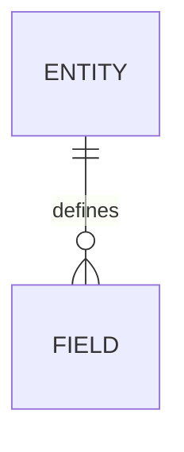

# DATABASE_SCHEMA Template

> Template Contract. Keep filename `DATABASE_SCHEMA.template.md`; APM discovers and syncs templates by this name.
> Managed document. Must comply with template DATABASE_SCHEMA.template.md.

## 1. Template Contract Metadata

- Template Name: `DATABASE_SCHEMA.template.md`
- Template Version: `1.3`
- Last Updated: `2026-04-23`
- Template Kind: `document`
- Owning Module: `Database Schema`
- Generated Artifact: `DATABASE_SCHEMA.md`

## 2. Contract / Allowed Schema

### Required Contract Rules

- Keep `Template Name`, `Template Version`, and `Last Updated` present and current.
- Keep the managed-document compliance note in generated artifacts.
- Preserve `APM:DATA` managed blocks when present, and keep JSON valid.

### Allowed Target Sections

- This is a generated document contract; update module state or consume fragments instead of editing generated output directly.

## 3. Actual Template

This document defines the required structure for `DATABASE_SCHEMA.md`.

## Structure Definition

The generated `DATABASE_SCHEMA.md` must contain the following sections in this order.

1. `# Database Schema: {{PROJECT_NAME}}`
2. Compliance note
3. Managed data block
4. `## 1. Schema Overview`
   - `### 1.1 Purpose`
   - `### 1.2 Storage Strategy`
5. `## 2. Entities`
6. `## 3. Relationships`
7. `## 4. Constraints`
8. `## 5. Indexes`
9. `## 6. Migration Notes`
10. `## 7. Source-of-Truth and Sync Rules`
11. `## Mermaid`

Repeating sections such as entities, relationships, constraints, indexes, and migration notes should use numbered subsection entries with a title and description.

## Example Skeleton

```md
# Database Schema: {{PROJECT_NAME}}

<!-- APM:DATA
{ ... }
-->

## 1. Schema Overview

### 1.1 Purpose

{{SCHEMA_PURPOSE}}

### 1.2 Storage Strategy

{{STORAGE_STRATEGY}}

## 2. Entities

### 1. Entity Name

{{ENTITY_DESCRIPTION}}

## Mermaid


```

## 4. Examples

```md
# DATABASE_SCHEMA.md: {{PROJECT_NAME}}

> Managed document. Must comply with template DATABASE_SCHEMA.template.md.
```

## 5. Merge / Consumption Rules

- APM copies this template into the active project workspace and records its version/hash in the template registry.
- If this is a fragment template, APM discovers matching fragment files from the configured project fragments folder and shared fragments folder.
- The consuming module validates managed metadata and applies supported operations to structured module state.
- After consumption, generated markdown is regenerated from module state; stale fragment files may be archived or deleted according to the module workflow.

## 6. Version / Migration Notes

- Version `1.3` moves AI-facing instructions and restrictions into the paired module AI file so this template stays artifact-focused.
- Version `1.2` moves AI behavior guidance into the paired module AI file and keeps this template artifact-focused.
- Version `1.1` adds the standardized Template Contract structure.
- Fragment consumers must migrate older payload versions through explicit migrators before listing or consumption.
- When this template changes again, update `Template Version`, `Last Updated`, and any migrator guidance needed for older unconsumed fragments.
