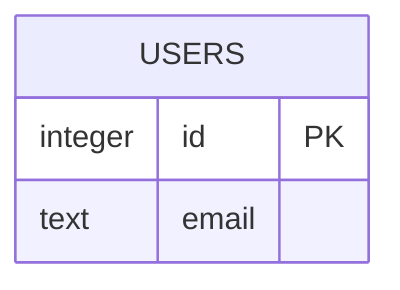

# DATABASE_SCHEMA Fragment Template

This document defines the required structure for `DATABASE_SCHEMA_FRAGMENT_*.md`.

## Compliance Rules

- Keep the `APM:DATA` managed block intact and valid JSON.
- Keep the top compliance note intact.
- Do not edit `DATABASE_SCHEMA.md`, `DATABASE_SCHEMA.dbml`, or the canonical schema model directly when proposing imported or AI-assisted schema updates.
- Use stable IDs for entities, fields, indexes, constraints, and relationships whenever they are known.
- Distinguish clearly between `observed`, `inferred`, and `unknown` information.
- Do not invent tables, fields, keys, defaults, indexes, or constraints when they are not supported by the source material.
- Put unresolved uncertainty in `Open Questions` instead of filling gaps with guessed schema structure.
- Keep the DBML section valid and keep Mermaid text valid.

## Version

- Template Name: `DATABASE_SCHEMA_FRAGMENT.template.md`
- Template Version: `1.0`
- Last Updated: `2026-03-29`
- AI Agent instruction: Whenever this template is updated, update the template version and last updated date before changing anything else.

## Model Context Protocol

- `DATABASE_SCHEMA_FRAGMENT_*.md` is a proposal/import document, not the canonical schema.
- The application database is the source of truth after a fragment is reviewed and merged.
- The purpose of this fragment is to safely move schema knowledge from an existing application, database, migration set, or AI-assisted analysis into the manager.
- Prefer facts from a live database first, then migrations, then schema SQL, then ORM/model code, and only then AI inference.
- If a value is not directly supported by the source, mark it as `inferred` or add an open question.
- The application should be able to reconstruct `DATABASE_SCHEMA.dbml`, `DATABASE_SCHEMA.md`, and Mermaid ER output from the merged schema model.

## Required Managed Payload Shape

The managed block should include a `fragment.payload` object with these fields:

- `source`: object
- `summary`: string
- `entities`: array
- `relationships`: array
- `indexes`: array
- `constraints`: array
- `migrationNotes`: array
- `openQuestions`: array
- `dbml`: string
- `mermaid`: string

Expected object shapes:

- `source`
  - `sourceType`: `sqlite_database` | `schema_sql` | `dbml` | `migration_files` | `orm_code` | `mixed`
  - `sourceLabel`
  - `dialect`: string
  - `observedAt`: ISO timestamp or empty string
  - `schemaFingerprint`: string
  - `confidence`: `observed` | `mixed` | `inferred`

- `entities[]`
  - `id`
  - `name`
  - `kind`: usually `table` or `view`
  - `status`: `observed` | `inferred`
  - `notes`
  - `fields`: array

- `entities[].fields[]`
  - `id`
  - `name`
  - `type`
  - `nullable`: boolean or empty
  - `primaryKey`: boolean or empty
  - `unique`: boolean or empty
  - `defaultValue`
  - `referencesEntityId`
  - `referencesFieldId`
  - `status`: `observed` | `inferred`
  - `notes`

- `relationships[]`
  - `id`
  - `fromEntityId`
  - `fromFieldId`
  - `toEntityId`
  - `toFieldId`
  - `cardinality`
  - `status`: `observed` | `inferred`
  - `notes`

- `indexes[]`
  - `id`
  - `entityId`
  - `name`
  - `fields`: array of field ids or field names
  - `unique`: boolean or empty
  - `status`: `observed` | `inferred`
  - `notes`

- `constraints[]`
  - `id`
  - `entityId`
  - `name`
  - `type`
  - `definition`
  - `status`: `observed` | `inferred`
  - `notes`

- `migrationNotes[]`
  - `title`
  - `description`
  - `status`: `observed` | `inferred`

- `openQuestions[]`
  - `id`
  - `question`
  - `impact`
  - `proposedFollowUp`

## Required Markdown Sections

The fragment markdown body should contain these sections in order:

1. `## Import Summary`
2. `## Source Metadata`
3. `## Observed Schema Summary`
4. `## Entities`
5. `## Relationships`
6. `## Indexes and Constraints`
7. `## Migration Notes`
8. `## Open Questions`
9. `## DBML`
10. `## Mermaid`
11. `## Merge Guidance`

## AI Agent Instruction

- If you are reading an existing application schema, prefer extraction and normalization over reinterpretation.
- Preserve exact names for entities, fields, indexes, and constraints when they are observed directly.
- Mark inferred items clearly and keep them minimal.
- If you cannot prove a relationship, type, or default, put that uncertainty in `Open Questions`.
- Generate valid DBML that the manager can later consume as a portable schema artifact.
- The markdown explanation should help a human understand what was imported and where uncertainty remains.

## Example Skeleton

```md
# Database Schema Fragment: {{SOURCE_LABEL}}

> Managed document. Must comply with template DATABASE_SCHEMA_FRAGMENT.template.md.

<!-- APM:DATA
{ ... }
-->

## Import Summary

Summarize what schema source was analyzed and what this fragment is proposing to import.

## Source Metadata

- Source Type: sqlite_database
- Dialect: sqlite
- Confidence: observed

## Observed Schema Summary

- 4 tables observed
- 2 foreign-key relationships observed
- 3 indexes observed

## Entities

### 1. users

- Status: observed
- Notes: Core account table.

## DBML

```dbml
Table users {
  id integer [pk]
  email text [not null, unique]
}
```

## Mermaid


```
