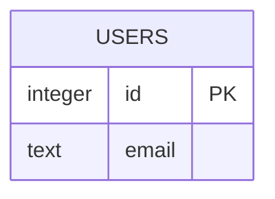

# DATABASE_SCHEMA Fragment Template

> Template Contract. Keep filename `DATABASE_SCHEMA_FRAGMENT.template.md`; APM discovers and syncs templates by this name.
> Managed document. Must comply with template DATABASE_SCHEMA_FRAGMENT.template.md.

## 1. Template Contract Metadata

- Template Name: `DATABASE_SCHEMA_FRAGMENT.template.md`
- Template Version: `1.4`
- Last Updated: `2026-04-23`
- Template Kind: `fragment`
- Owning Module: `Database Schema`
- Generated Artifact: `DATABASE_SCHEMA_FRAGMENT_*.md`

## 2. Contract / Allowed Schema

### Required Contract Rules

- Keep `Template Name`, `Template Version`, and `Last Updated` present and current.
- Keep the managed-document compliance note in generated artifacts.
- Preserve `APM:DATA` managed blocks when present, and keep JSON valid.

### Allowed Target Sections

- `entities`
- `relationships`
- `constraints`
- `indexes`
- `migrations`
- `open-questions`
- `synchronization-rules`

### Supported Operations

For `APM:OPERATIONS`, supported first-pass operations are:

- `add`
- `update`
- `remove`
- `reorder`
- `move`
- `link`
- `unlink`

Use explicit `targetSection`, `targetItemId`, `sourceRefs`, and `item` payloads. Token references supplement these fields; they do not replace them.

## 3. Actual Template

This document defines the required structure for `DATABASE_SCHEMA_FRAGMENT_*.md`.

## Required Managed Payload Shape

The managed block should include a `fragment.payload` object with these fields:

- `source`: object
- `summary`: string
- `entities`: array
- `relationships`: array
- `indexes`: array
- `constraints`: array
- `migrationNotes`: array
- `openQuestions`: array
- `dbml`: string
- `mermaid`: string

Expected object shapes:

- `source`
  - `sourceType`: `sqlite_database` | `schema_sql` | `dbml` | `migration_files` | `orm_code` | `mixed`
  - `sourceLabel`
  - `dialect`: string
  - `observedAt`: ISO timestamp or empty string
  - `schemaFingerprint`: string
  - `confidence`: `observed` | `mixed` | `inferred`

- `entities[]`
  - `id`
  - `name`
  - `kind`: usually `table` or `view`
  - `status`: `observed` | `inferred`
  - `notes`
  - `fields`: array

- `entities[].fields[]`
  - `id`
  - `name`
  - `type`
  - `nullable`: boolean or empty
  - `primaryKey`: boolean or empty
  - `unique`: boolean or empty
  - `defaultValue`
  - `referencesEntityId`
  - `referencesFieldId`
  - `status`: `observed` | `inferred`
  - `notes`

- `relationships[]`
  - `id`
  - `fromEntityId`
  - `fromFieldId`
  - `toEntityId`
  - `toFieldId`
  - `cardinality`
  - `status`: `observed` | `inferred`
  - `notes`

- `indexes[]`
  - `id`
  - `entityId`
  - `name`
  - `fields`: array of field ids or field names
  - `unique`: boolean or empty
  - `status`: `observed` | `inferred`
  - `notes`

- `constraints[]`
  - `id`
  - `entityId`
  - `name`
  - `type`
  - `definition`
  - `status`: `observed` | `inferred`
  - `notes`

- `migrationNotes[]`
  - `title`
  - `description`
  - `status`: `observed` | `inferred`

- `openQuestions[]`
  - `id`
  - `question`
  - `impact`
  - `proposedFollowUp`

## Required Markdown Sections

The fragment markdown body should contain these sections in order:

1. `## Import Summary`
2. `## Source Metadata`
3. `## Observed Schema Summary`
4. `## Entities`
5. `## Relationships`
6. `## Indexes and Constraints`
7. `## Migration Notes`
8. `## Open Questions`
9. `## DBML`
10. `## Mermaid`
11. `## Merge Guidance`

## Example Skeleton

```md
# Database Schema Fragment: {{SOURCE_LABEL}}

<!-- APM:DATA
{ ... }
-->

## Import Summary

Summarize what schema source was analyzed and what this fragment is proposing to import.

## Source Metadata

- Source Type: sqlite_database
- Dialect: sqlite
- Confidence: observed

## Observed Schema Summary

- 4 tables observed
- 2 foreign-key relationships observed
- 3 indexes observed

## Entities

### 1. users

- Status: observed
- Notes: Core account table.

## DBML

```dbml
Table users {
  id integer [pk]
  email text [not null, unique]
}
```

## Mermaid


```

## 4. Examples

```json
[
  {
    "operation": "add",
    "targetSection": "open-questions",
    "item": {
      "title": "Example question",
      "description": "Replace this with a module-specific unresolved question."
    },
    "sourceRefs": ["FEAT-000"]
  }
]
```

## 5. Merge / Consumption Rules

- APM copies this template into the active project workspace and records its version/hash in the template registry.
- If this is a fragment template, APM discovers matching fragment files from the configured project fragments folder and shared fragments folder.
- The consuming module validates managed metadata and applies supported operations to structured module state.
- After consumption, generated markdown is regenerated from module state; stale fragment files may be archived or deleted according to the module workflow.

## 6. Version / Migration Notes

- Version `1.4` moves AI-facing instructions and restrictions into the paired module AI file so this template stays artifact-focused.
- Version `1.3` moves AI behavior guidance into the paired module AI file and keeps this template artifact-focused.
- Version `1.2` adds the standardized Template Contract structure.
- Fragment consumers must migrate older payload versions through explicit migrators before listing or consumption.
- When this template changes again, update `Template Version`, `Last Updated`, and any migrator guidance needed for older unconsumed fragments.
