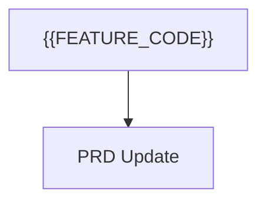

# PRD Fragment: {{FEATURE_CODE}} - {{FEATURE_TITLE}}

> Template Contract. Keep filename `PRD_FRAGMENT.template.md`; APM discovers and syncs templates by this name.
> Managed document. Must comply with template PRD_FRAGMENT.template.md.

## 1. Template Contract Metadata

- Template Name: `PRD_FRAGMENT.template.md`
- Template Version: `1.4`
- Last Updated: `2026-04-23`
- Template Kind: `fragment`
- Owning Module: `PRD`
- Generated Artifact: `PRD_FRAGMENT_*.md`

## 2. Contract / Allowed Schema

### Required Contract Rules

- Keep `Template Name`, `Template Version`, and `Last Updated` present and current.
- Keep the managed-document compliance note in generated artifacts.
- Preserve `APM:DATA` managed blocks when present, and keep JSON valid.

### Allowed Target Sections

- `product-overview-target-audience`
- `product-overview-key-value-propositions`
- `functional-requirements-workflows`
- `functional-requirements-user-actions`
- `functional-requirements-system-behaviors`
- `technical-architecture`
- `implementation-plan-sequencing`
- `implementation-plan-dependencies`
- `implementation-plan-milestones`
- `success-metrics`
- `risks-and-mitigations`
- `future-enhancements`

### Supported Operations

For `APM:OPERATIONS`, supported first-pass operations are:

- `add`
- `update`
- `remove`
- `reorder`
- `move`
- `link`
- `unlink`

Use explicit `targetSection`, `targetItemId`, `sourceRefs`, and `item` payloads. Token references supplement these fields; they do not replace them.

## 3. Actual Template

## Executive Summary

Summarize the product requirement change introduced by this feature.

## Functional Requirements

- Describe the new or changed requirements that should be merged into `PRD.md`.

## User Experience Requirements

- Describe workflow, states, and UX expectations for this feature.

## Data and Integration Notes

- Describe schema, document, plugin, API, or integration changes.

## Acceptance Criteria

- List the expected outcomes once the feature is complete.

## Merge Guidance

- This fragment is database-backed and may be regenerated from application state.
- The PRD module consumes this fragment and merges it into the main PRD when approved.
- For section-targeted changes, include an `APM:OPERATIONS` HTML comment block with JSON operations such as `add`, `update`, `remove`, `reorder`, `move`, `link`, and `unlink`.
- Prefer stable `targetItemId` values over section numbers alone when updating existing PRD items.

## Mermaid



## 4. Examples

```json
[
  {
    "operation": "add",
    "targetSection": "open-questions",
    "item": {
      "title": "Example question",
      "description": "Replace this with a module-specific unresolved question."
    },
    "sourceRefs": ["FEAT-000"]
  }
]
```

## 5. Merge / Consumption Rules

- APM copies this template into the active project workspace and records its version/hash in the template registry.
- If this is a fragment template, APM discovers matching fragment files from the configured project fragments folder and shared fragments folder.
- The consuming module validates managed metadata and applies supported operations to structured module state.
- After consumption, generated markdown is regenerated from module state; stale fragment files may be archived or deleted according to the module workflow.

## 6. Version / Migration Notes

- Version `1.4` moves AI-facing instructions and restrictions into the paired module AI file so this template stays artifact-focused.
- Version `1.3` moves AI behavior guidance into the paired module AI file and keeps this template artifact-focused.
- Version `1.2` adds the standardized Template Contract structure.
- Fragment consumers must migrate older payload versions through explicit migrators before listing or consumption.
- When this template changes again, update `Template Version`, `Last Updated`, and any migrator guidance needed for older unconsumed fragments.
