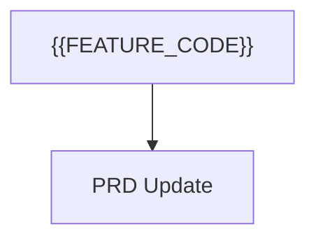

# PRD Fragment: {{FEATURE_CODE}} - {{FEATURE_TITLE}}

> Managed document. Must comply with template PRD_FRAGMENT.template.md.

## Executive Summary

Summarize the product requirement change introduced by this feature.

## Functional Requirements

- Describe the new or changed requirements that should be merged into `PRD.md`.

## User Experience Requirements

- Describe workflow, states, and UX expectations for this feature.

## Data and Integration Notes

- Describe schema, document, plugin, API, or integration changes.

## Acceptance Criteria

- List the expected outcomes once the feature is complete.

## Merge Guidance

- This fragment is database-backed and may be regenerated from application state.
- AI agents should update this fragment instead of editing `PRD.md` directly.
- The PRD module consumes this fragment and merges it into the main PRD when approved.
- For section-targeted changes, include an `APM:OPERATIONS` HTML comment block with JSON operations such as `add`, `update`, `remove`, `reorder`, `move`, `link`, and `unlink`.
- Prefer stable `targetItemId` values over section numbers alone when updating existing PRD items.

## Mermaid

