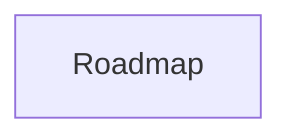

# ROADMAP Template

> Template Contract. Keep filename `ROADMAP.template.md`; APM discovers and syncs templates by this name.
> Managed document. Must comply with template ROADMAP.template.md.

## 1. Template Contract Metadata

- Template Name: `ROADMAP.template.md`
- Template Version: `2.4`
- Last Updated: `2026-04-23`
- Template Kind: `document`
- Owning Module: `Roadmap`
- Generated Artifact: `ROADMAP.md`

## 2. Contract / Allowed Schema

### Required Contract Rules

- Keep `Template Name`, `Template Version`, and `Last Updated` present and current.
- Keep the managed-document compliance note in generated artifacts.
- Preserve `APM:DATA` managed blocks when present, and keep JSON valid.

### Allowed Target Sections

- This is a generated document contract; update module state or consume fragments instead of editing generated output directly.

## 3. Actual Template

This document defines the required structure for `ROADMAP.md`.

## Structure Definition

The generated `ROADMAP.md` must contain the following sections in this order.

### Required Top Matter

Unique section.

1. Title
   Example: `# ROADMAP: {{PROJECT_NAME}}`
2. Compliance Note
   Example: `> Managed document. Must comply with template ROADMAP.template.md.`
3. Managed Data Block
   Example: `<!-- APM:DATA ... -->`

### Executive Summary

Unique section.

- Heading: `## Executive Summary`
- Purpose: Summarize the roadmap at a project level.
- Expected content:
  - Plain-language summary of what the roadmap represents
  - Interpretation note for active feature IDs and omitted historical work

### Phased Implementation Plan

Unique container section.

- Heading: `## Phased Implementation Plan`
- Must contain a `## Phases` subsection directly beneath it.

### Phases

Repeating section group.

- Container heading: `## Phases`
- Each phase is a repeating subsection in this format:
  - `### {{PHASE_CODE}}: {{PHASE_NAME}}`
- Each phase subsection must contain these repeating concrete fields in order:
  - `**Goal:** {{PHASE_GOAL}}`
  - `**Status:** {{PHASE_STATUS}}`
  - `**Target Date:** {{PHASE_TARGET_DATE}}`
  - `**Summary:** {{PHASE_SUMMARY}}`
  - `**Features:**`
  - `**Tasks:**`
- The `Features` list repeats zero or more roadmap-linked features.
- The `Tasks` list repeats zero or more database-backed tasks.
- If no phases exist, keep the `## Phases` heading and render a no-phases placeholder.

### Planned Features

Unique section with repeating entries.

- Heading: `## Planned Features`
- Purpose: Hold active, not-archived features that may be assigned into phases later.
- Entry format:
  - `- {{FEATURE_ID}}: {{FEATURE_TITLE}} ({{FEATURE_STATUS}})`

### Considered Features

Unique section with repeating entries.

- Heading: `## Considered Features`
- Purpose: Hold active, unfinished features that are under consideration but not yet planned.
- Entry format:
  - `- {{FEATURE_ID}}: {{FEATURE_TITLE}} ({{FEATURE_STATUS}})`

### Mermaid

Unique section.

- Heading: `## Mermaid`
- Must contain a fenced `mermaid` block.
- Purpose: Represent roadmap flow, phase sequencing, or planning context in Mermaid text.

## Example Skeleton

```md
# ROADMAP: {{PROJECT_NAME}}

<!-- APM:DATA
{ ... }
-->

## Executive Summary

{{EXECUTIVE_SUMMARY}}

## Phased Implementation Plan

## Phases

### {{PHASE_CODE}}: {{PHASE_NAME}}

**Goal:** {{PHASE_GOAL}}

**Status:** {{PHASE_STATUS}}

**Target Date:** {{PHASE_TARGET_DATE}}

**Summary:** {{PHASE_SUMMARY}}

**Features:**
- {{FEATURE_ID}}: {{FEATURE_TITLE}}

**Tasks:**
- {{TASK_TITLE}} ({{TASK_STATUS}})

## Planned Features

- {{FEATURE_ID}}: {{FEATURE_TITLE}} ({{FEATURE_STATUS}})

## Considered Features

- {{FEATURE_ID}}: {{FEATURE_TITLE}} ({{FEATURE_STATUS}})

## Mermaid


```

## 4. Examples

```md
# ROADMAP.md: {{PROJECT_NAME}}

> Managed document. Must comply with template ROADMAP.template.md.
```

## 5. Merge / Consumption Rules

- APM copies this template into the active project workspace and records its version/hash in the template registry.
- If this is a fragment template, APM discovers matching fragment files from the configured project fragments folder and shared fragments folder.
- The consuming module validates managed metadata and applies supported operations to structured module state.
- After consumption, generated markdown is regenerated from module state; stale fragment files may be archived or deleted according to the module workflow.

## 6. Version / Migration Notes

- Version `2.4` moves AI-facing instructions and restrictions into the paired module AI file so this template stays artifact-focused.
- Version `2.3` moves AI behavior guidance into the paired module AI file and keeps this template artifact-focused.
- Version `2.2` adds the standardized Template Contract structure.
- Fragment consumers must migrate older payload versions through explicit migrators before listing or consumption.
- When this template changes again, update `Template Version`, `Last Updated`, and any migrator guidance needed for older unconsumed fragments.
